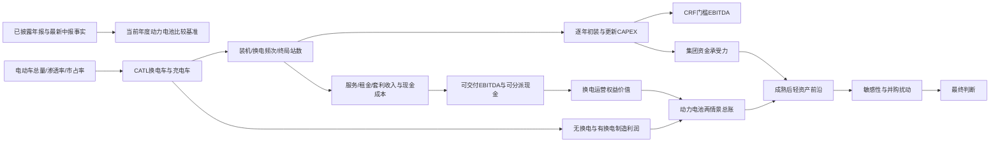

# 换电毛估估：宁德时代应不应该下重注，以及什么时候能见分晓（v4.2.1）

> 本报告由 `换电战略决策模型_v4.2` 自动生成。外部参数集中在 `configs/base.toml`，正文数字来自 `outputs/decision_snapshot_v4_2.json`；模板不保存业务结果数字。报告按“问题—方法—参数—推导—判断—质疑—结论”组织，可以脱离 Python 独立阅读。

## 版本历史

| 版本 | 定位 | 关键变化 |
|---|---|---|
| v3.2（旧报告沿称） | 完整方法链与初版战略总表 | 作为历史方法与参数审计基准，原文冻结 |
| v4.0 | 模块化程序与自动报告首版 | 将规模、CAPEX、经营、动力总账、轻资产、集团资金和并购拆成可传参模块 |
| v4.1 | 对v4.0的校准重写 | 修正城配过早取整、2025存量站、站数传导、期末残值、可分派现金、滚动AUM、集团CFO和并购负债口径；正文按投资决策逻辑重写 |
| v4.2 | 对v4.1的归因与口径修正 | 制造销量份额差拆分为“换电段锁定订单（计入归因）＋充电段份额净效应（仅敏感性）”；2026并购三项合并（中恒＋世纪互联＋启源）；净利率差改为15%/12%；新增单站经济模型、固态推导链、启源资产锚与REITs回笼分析 |
| v4.2.1（本版） | 对v4.2的结构与口径修正 | 修正单站经济模型单位（站体投资恢复为500/200万元级）；4.1新增车辆底座与制造出货口径勾稽；4.2只保留市值分摊法基准；4.4拆分为业绩锚/基准比较/市值换算三张表；Part6改为两层估值并删除资管平台层；Part8改为直陈式六段结论；模板与报告带版本号、冻结旧版 |

---

## 一、先说清楚：这篇报告最终要解决什么问题

从投资人的视角，真正需要回答的不是“换电市场有多大”，而是四个更接近拍板的问题：

1. **值不值得关注**：换电能否阻止宁德时代电动车动力电池业务滑向低利润率的纯制造竞争，并建立订单、运营数据和技术迭代闭环？
2. **要投多少资源**：2026—2030基础设施期需要多少项目CAPEX、CATL现金和单年峰值，会不会挤压固态、储能/AIDC、矿山、软件AI、CVC等其他选择？
3. **什么时候见分晓**：2028年前站网能否基本建成；2030年前后车辆、交易量和经营现金流能否证明商业模式；成熟后资产能否进入ABS/REITs循环？
4. **会改变多少业绩和市值**：2030无换电纯制造与有换电两种情景下，动力电池业务线的净利润和价值相差多少；成熟后出表又会怎样改变持续价值、现金和战略资源？

### 一页拍板

中性假设下结论为 **支持重注**：建设期维持40%经济权益，把需求反推的站网在2028年以前建完；CATL建设期累计资本调用约 **467.2亿元**，单年峰值约 **113.2亿元**。2030E动力电池业务线价值约 **16,714.4亿元**；其中可归因换电价值约 **8,198.4亿元**，相当于当前宁德时代A+H市值的 **41.0%**。换电的业务属性有二：既以**57%稳态初装现金收益率**（远高于400亿元回购约5%的隐含回报）稳住动力电池基本盘，又构成面向类固收市场的金融类权益投资生意——蔚能REITs已跑通退出路径，最保守出表30%可净回款 **1,135.2亿元**，为建设期资本调用的 **2.43×**。集团当前资金模型不要求提前出表；业务成熟后是否卖到30%、20%或10%，取决于届时明确资金需求与ABS/REITs市场承接能力，不预设固定最优档。

本报告的研究边界也要先限定：估值只做到**电动车动力电池业务线**，不虚构储能、AIDC等其他业务的2030利润与市值；并购只作为关键参数的扰动项，未论证技术兼容前不假设启源或蔚来异构站体可以直接抵扣自建站。

---

## 二、解决上述问题的方法论

### 2.1 先做必要性判断，再做投入产出测算

定性上，本报告把“无换电纯制造”作为需要防守的战略情景：电池厂只做一次性销售，订单随车型平台切换，行业价格竞争会持续侵蚀利润率；制造商也难以获得贯穿电池全寿命的高频真实运营数据。

有换电后，商业范式增加了第二条线：宁德时代不仅销售电池，还通过站网、电池银行和长期运营锁定一部分订单，在真实高频工况中持续观察衰减、快充、热管理和安全表现。这个数据场景能够反哺电芯、Pack、BMS和运营算法，并进一步帮助降本和稳固标准。它是下重注的战略必要性，但不能代替财务可行性。

定量上，必须同时回答“需要多少资本”和“能够创造多少现金”：

- **资本要求链**：CAPEX → 全周期更新与残值 → CRF要求FCFF → 门槛EBITDA。
- **经营能力链**：车辆与频次 → 换电量与可出租电池 → 收入与现金成本 → 可交付EBITDA与可分派现金。
- **制造情景链**：同一电动车底座 → 无换电纯制造 vs 有换电制造 → 净利润与PE价值。
- **动力电池总账**：有换电制造价值 + 换电运营权益价值，与无换电纯制造及2026基准比较。
- **资本循环链**：建设期CATL现金 → 成熟后出售权益回款、持续价值和滚动AUM → 对其他战略的反哺。

### 2.2 完整计算地图

### 2.3 需要哪些参数，以及从哪里来

参数分成四层，避免派生结果重新写回配置：

| 参数层 | 典型参数 | 获取原则 | 进入哪条链 |
|---|---|---|---|
| 已披露事实 | 年报/中报收入、净利润、CFO、现金，期初存量站，年度建站目标 | 年报、中报、公司公告；保留来源 | 当前基准、年度资金、建站排期 |
| 行业与交易锚 | 电池价格、蔚来ABS折现率、资产租金、可比估值倍数 | 公开市场或交易样本；不做伪精确推导 | CAPEX、租金、WACC、估值 |
| 业务物理参数 | 车辆、里程、背电量、电耗、站内库存、单站规划能力 | 车型/场景逐项推导；物理上限和规划能力分开 | 车辆、频次、站数、交易量 |
| 战略情景参数 | 换电渗透率、市占率、制造净利率差、CRF、终局权益 | 中性假设并做敏感性，不冒充公司指引 | 情景差、门槛、轻资产前沿 |

| 事实基准 | 本模型采用内容 | 来源 |
|---|---|---|
| 2025A | 集团与动力电池收入、归母净利润、经营现金流 | [宁德时代2025年报](https://www.catl.com/uploads/1/file/public/202603/20260310105829_c5p2l3q9ll.pdf) |
| 2026H1 | 集团与动力业务毛利、归母净利润、CFO、现金及交易性金融资产 | [港交所披露检索](https://www1.hkexnews.hk/search/titlesearch.xhtml?category=0&market=SEHK&stockId=1000259940) |
| 2026E | 集团归母净利润一致预期中性值 | [盈利预测汇总](https://basic.10jqka.com.cn/300750/worth.html) |
| 换电建站 | 官方2026目标为骐骥900座、巧克力超3,000座；模型按1,000/3,000，并在2028完成需求站数 | [宁德时代换电网络进展](https://www.catl.com/news/9516.html) |
| 分红习惯 | 连续三年按归母净利润约50%现金分红，作为资金压力情景 | [2025年报致股东信](https://www.catl.com/en/uploads/1/file/public/202603/20260310105310_46xjbwckvn.pdf) |
| 蔚来站网 | 站数、累计换电量和累计交付电量 | [蔚来1亿次换电公告](https://www.nio.com/news/20260206001) |
| 蔚能电池资产 | ABS底层样本资产评估、出租率与租金 | [世联资产评估报告](../media/武汉蔚能电池资产有限公司2026年第一期ABS-世联资产评估报告.pdf) |
| 蔚能整体参考 | 电池银行规模、用户、资产负债与融资估值整理 | [蔚能REITs案例分析](../定性分析/蔚能REITs案例分析.md) |
| 市值 | 用户给定的2026-08约2万亿元A+H市值快照；仅作比较基准 | 用户给定市场快照，不外推其他业务线 |

| 参数 | 中性值 | 来源/用途 |
|---|---|---|
| WACC | 7.5% | 照抄蔚来ABS横向基准；只用于现值折现 |
| 资本回收系数CRF | 15.0% | 期望回报10%—15%对应区间的中值；用于倒算年资本要求 |
| 建设期CATL经济权益 | 40.0% | 2030前用于资本调用与归母价值；轻资产只在业务成熟后讨论 |
| 项目债务比例 | 60.0% | 项目资本结构 |
| 制造估值 | 20.0× PE | 制造归母净利润×PE |
| 换电运营估值 | 18.0× | EBITDA×倍数－债务，再乘CATL权益 |
| 电池价格路径 | 2026:590.0 / 2027:590.0 / 2028:590.0 / 2029:566.4 / 2030:543.7 | 2026—2028平台期，之后先快降、再慢降；由曲线参数生成 |
| 退役回收率 | 44.0% | 储能/动力价格比×退役SOH×二手折价；不是期末残值率 |

WACC和CRF必须分开：WACC 7.5%照抄蔚来ABS横向交易锚，只负责把跨期现金折现；CRF 15%代表项目希望交付的资本回报，负责倒算门槛。若把CRF也写成WACC，会系统性压低项目经营要求。

### 2.4 先钉住2026E比较基准

| 2026E动力电池基准拆分 | 公式 | 结果 |
|---|---|---|
| H1动力毛利润 | 动力收入×动力毛利率 | 396.4亿元 |
| H1集团毛利润 | 集团收入×集团毛利率 | 662.7亿元 |
| 动力归因比例 | 动力毛利润÷集团毛利润 | 59.8% |
| 2026E动力归母净利润 | 集团一致预期净利润×动力归因比例 | 598.1亿元 |
| 2026E动力市值贡献 | A+H市值×动力归因比例 | 11,962.5亿元 |
| 2026E量价法制造模型净利润 | 644GWh×当年电池价格×15% | 569.9亿元 |
| 2026E量价法制造模型价值 | 量价法制造净利润×PE | 11,398.8亿元 |
| 校验 | 动力市值＋其余业务当前市值＝当前A+H市值 | 20,000.0亿元 |

| 2026E口径 | 归母净利润 | 价值 | 数据含义 |
|---|---|---|---|
| H1财务分摊法 | 598.1 | 11,962.5 | 动力分部毛利润占集团毛利润×集团净利润/市值；覆盖动力分部全部用途及共同费用分摊 |
| 644GWh量价法 | 569.9 | 11,398.8 | 券商出货预测×590元×15%×PE20；近似作为道路交通制造比较锚 |
| 方法差额 | 28.2 | 563.7 | 估算方法差，不是已识别的船舶/eVTOL/机器人利润；没有依据把差额归到具体终端 |

H1财务分摊法回答“当前20,000亿元 A+H市值中，动力电池分部约贡献多少”，是本报告的主基准；644GWh量价法回答“与2030电动车制造盘同口径比较，2026制造价值是多少”，降为道路口径锚。两种方法的差额只是估算口径差，没有公开证据支持把它直接归入船舶、eVTOL或机器人，故不编造归因。

---

## Part 1　共同实物底座：先把车、频次、装机和站数算对

### 1.1 车辆和装机只有一套底座

对每个车型、使用场景和年份：

`市场换电车 = 电动车数量 × 换电渗透率`

`市场充电车 = 电动车数量 ×（1－换电渗透率）`

`CATL换电车 = 市场换电车 × CATL换电市占率`

`CATL充电车 = 市场充电车 × CATL充电市占率`

`装机GWh = CATL车辆数 × 单车带电量`

换电与充电渗透率逐场景相加为1，但CATL在两条路线上的市占率可以不同。制造、运营和CAPEX全部调用这套底座，不在下游硬编码车辆或装机量。

| 年份 | CATL换电装机 | CATL充电装机 | 无换电纯制造装机 |
|---|---|---|---|
| 2026 | 57.5GWh | 359.5GWh | 315.0GWh |
| 2027 | 64.5GWh | 405.3GWh | 355.4GWh |
| 2028 | 75.5GWh | 484.7GWh | 425.1GWh |
| 2029 | 88.5GWh | 580.9GWh | 509.9GWh |
| 2030 | 102.5GWh | 652.6GWh | 574.5GWh |

### 1.2 频次从使用强度推导，不把展示值当输入

`日均换电频次 = 日均里程 ÷（背电量×可用电量比例÷单位里程电耗）`

| 车型 | 累计CATL换电车 | 加权日频次 | 推导 |
|---|---|---|---|
| 重卡 | 38.0 | 1.8 | 原始漏斗/频次先完整计算，在车型终局节点各保留1位小数 |
| 城配物流 | 85.5 | 1.3 | 原始漏斗/频次先完整计算，在车型终局节点各保留1位小数 |
| 出租车 | 20.9 | 1.5 | 原始漏斗/频次先完整计算，在车型终局节点各保留1位小数 |
| 网约车 | 17.1 | 1.1 | 原始漏斗/频次先完整计算，在车型终局节点各保留1位小数 |
| Robotaxi | 50.0 | 1.5 | 原始漏斗/频次先完整计算，在车型终局节点各保留1位小数 |
| 私家车 | 144.4 | 0.2 | 原始漏斗/频次先完整计算，在车型终局节点各保留1位小数 |

本报告采用**节点四舍五入**：年度队列、折现和价格曲线保留计算精度；进入终局站网、CAPEX和经营模型前，各车型累计车辆数保留小数点后1位、加权频次保留小数点后1位。正文金额显示到小数点后1位。若每乘一步都四舍五入，多年累计会系统性放大或缩小。

城配旧版106万辆的原因已经查清：`1500÷8×30%=56.25万辆/年`曾先取整为56，再乘5年、95%、50%、80%，得到106.40并显示106。1.266是日均换电频次，不是2025年存量。若保留56.25到车型终局节点，则得到85.5万辆；v4.1采用后者。这是修正过早取整，并没有改变汽车总量。

### 1.3 站数由需求反推，排期由公司规划约束

`工位上限 = 营业秒数 ÷ 单次换电秒数`

`能量上限 = 充电功率×营业小时×RTE ÷ 单次净补电量`

`规划能力 = 外生运营假设，并校验不得超过物理上限`

`终局站数 = 向上取整（终局车队日需求 ÷ 规划能力）`

| 站网 | 工位上限 | 能量上限 | 规划能力（外生） | 成熟日需求 | 终局站数 | 2025末存量 | 2026累计目标 | 建成 |
|---|---|---|---|---|---|---|---|---|
| 骐骥重卡 | 192 | 484 | 192 | 684,000次 | 3,563座 | 305座 | 1,000座 | 2028 |
| 巧克力 | 864 | 552 | 300 | 2,651,900次 | 8,840座 | 1,020座 | 3,000座 | 2028 |

巧克力300次/日是“毛估估”的外生规划能力，不是由倒算设计冗余得到的工程参数。程序只验证该规划值低于物理上限。

排期则完全按三段直算：

`2026新增 = 2026累计目标－期初年末存量`

`2027—2028新增合计 = 2028终局站数－2026累计目标`

`首个分配年新增 = 后两年增量÷2（取整）；完成年新增 = 余数；完成年以后新增 = 0`

| 车辆组 | v3.2车辆(万) | v4.1车辆(万) | v3.2频次 | v4.1频次 | v3.2日需求(万次) | v4.1日需求(万次) | 差异解释 |
|---|---|---|---|---|---|---|---|
| 重卡 | 38.0 | 38.0 | 1.80（展示值） | 1.8 | 68.4 | 68.4 | 车辆不变；v4.1在车型终局节点把加权频次保留1位 |
| 城配物流 | 87.0 | 85.5 | 1.30（展示值） | 1.3 | 113.1 | 111.2 | v3把年度56.25万先取整为57万，逐层放大到87万；1.266是频次，不是存量 |
| 乘用营运（出租+网约+Robotaxi） | 88.0 | 88.0 | 1.42（合并展示值） | 1.4 | 125.0 | 125.2 | v4.1逐车型在终局节点各保留1位，再汇总交易量 |
| 私家车 | 145.0 | 144.4 | 0.20（展示值） | 0.2 | 29.0 | 28.9 | 终局车辆和频次均保留1位 |
| 巧克力合计 | 320.0 | 317.9 | 按三段加总 | 0.8 | 267.1 | 265.2 | 规划能力仍为300次/日；差异来自车辆节点和频次节点口径 |

重卡车辆与频次对齐后，反推站数应与旧版3,563座对齐，不受启源收购影响。巧克力站差异主要来自城配过早取整及其他车型终局节点统一取整。启源、蔚来仅在Part 7并购扰动中进入，基准链不确认物理复用。

### 1.4 单站经济模型：一座站的投入、产出与回收

先算清一座站自身的经济账，再谈整个网络。单站的投入是站体加电池库存，产出是需求侧（服务费减人工）与资产侧（外部权益租金＋套利减场租）两块EBITDA：

`单站初装CAPEX = 站体投资 ＋ 库存块数×单块电量×电池价格`

`满负荷单站EBITDA =（规划日次×净电量×服务费－规划日次×单次人工）＋（外部权益租金＋套利－场租）`

`盈亏平衡利用率 = 单站全周期资本×CRF ÷ 满负荷单站EBITDA`

| 计算项目 | 公式 | 参数代入 | 骐骥重卡站 | 巧克力站 |
|---|---|---|---|---|
| ① 站体初装投资 | 外生输入（不含站内电池） | — | 500.0万元 | 200.0万元 |
| ② 电池库存初装投资 | 库存块数×单块电量×电池价格 | 24×171kWh / 14×56kWh；电池价590元/kWh | 242.1万元 | 46.3万元 |
| ③ 单站初装CAPEX | ①＋② | — | 742.1万元 | 246.3万元 |
| ④ 单站全周期资本 | 站体＋电池×全周期资本倍数（含历次更新） | 寿命3.12742年 / 6.53649年（按组GWh加权推算） | 1,008.7万元 | 266.6万元 |
| ⑤ 满负荷服务费收入/年 | 规划日次×运营天数×单次净电量×服务费 | 192次/日×350天×80%×0.4元 | 367.7万元 | 188.2万元 |
| ⑥ 满负荷人工运维/年 | 规划日次×运营天数×单次人工 | 单次30元 / 13元 | 201.6万元 | 136.5万元 |
| ⑦ 需求侧EBITDA/年 | ⑤－⑥ | — | 166.1万元 | 51.7万元 |
| ⑧ 资产侧EBITDA/年 | 外部权益租金＋套利－场租 | 外部权益60%；场租30万元/站 | 52.4万元 | -14.3万元 |
| ⑨ 满负荷单站EBITDA/年 | ⑦＋⑧ | — | 218.5万元 | 37.4万元 |
| ⑩ 年资本要求 | ④×CRF | CRF 15.0% | 151.3万元 | 40.0万元 |
| ⑪ 盈亏平衡利用率 | ⑩÷⑨ | 利用率低于此值则单站不覆盖资本要求 | 69.2% | 106.9% |
| ⑫ 满负荷CAPEX回收期 | ④÷⑨ | 不含建设期爬坡 | 4.6年 | 7.1年 |

满负荷口径指按外生规划能力（骐骥192次/日、巧克力300次/日）打满，这是单站经济上界；盈亏平衡利用率才是单站生死线：骐骥站利用率只要约69%即可覆盖CRF资本要求，巧克力站需要约107%——几乎要按设计能力满负荷运转。这解释了为什么模型坚持站数由需求反推：巧克力站在低利用率下是纯现金消耗，骐骥站则对利用率波动有较强缓冲。

在车辆和换电量固定时，增加站数不会增加服务费、车辆端电池租金或按次人工；它只沿两条边际链传导：

`站数 → 站体CAPEX + 站内周转电池CAPEX → 全周期资本、债务和折旧`

`站数 → 外部权益站内电池租金 + 峰谷套利 − 单站场租 → EBITDA`

| 每增加1,000站 | 站内电池(GWh) | 初装CAPEX | 全周期资本 | 外部权益电池租金/年 | 套利收入/年 | 场租/年 | 固定需求下EBITDA变化 | CATL运营价值变化 |
|---|---|---|---|---|---|---|---|---|
| 骐骥重卡 | 4.104 | 74.2 | 100.9 | 2.95 | 5.29 | 3.00 | 5.24 | 13.53 |
| 巧克力 | 0.784 | 24.6 | 26.7 | 0.56 | 1.01 | 3.00 | -1.43 | -16.66 |

| 站网 | v3.2站数 | v4.1站数 | 站数变化 | 初装CAPEX一阶变化 | 稳态EBITDA一阶变化 | CATL运营价值一阶变化 |
|---|---|---|---|---|---|---|
| 骐骥重卡 | 3,563 | 3,563 | +0 | 0.00 | 0.00 | 0.00 |
| 巧克力 | 8,902 | 8,840 | -62 | -1.53 | 0.09 | 1.03 |
| 合计 | 12,465 | 12,403 | -62 | -1.53 | 0.09 | 1.03 |

同样增加1,000站，骐骥EBITDA为正、巧克力为负，原因不是收入需求方向相反，而是单站电池库存差异：骐骥24×171kWh带来的外部权益电池租金和套利可覆盖场租；巧克力14×56kWh的两项收入低于固定场租。上表把每个节点都拆出，避免将车辆增长误归因到站数。

> **规模与网络｜支持**：共同车辆底座闭合；需求反推终局站数，建设节奏按2026里程碑、2028完成网络处理。  
> 证据：重卡站=3563；巧克力站=8840；2028后新增站=0  
> 风险：站网先行与车辆后放量造成早期利用率爬坡风险。

---

## Part 2　换电单体投入账：基础设施期要打多少“子弹”

### 2.1 年度CAPEX链

`项目年度CAPEX = 新增车辆电池 + 新增站内电池 + 新增站体 + 到期更新净支出`

`更新净支出 = 届时新电池成本－退役电池回收`

`CATL资本调用 = 项目年度CAPEX ×（1－项目债务比例）× CATL建设期经济权益`

| 年份 | 新增/累计重卡站 | 新增/累计巧克力站 | 车辆电池 | 站内电池 | 站体 | 首轮更新净支出 | 项目CAPEX | CATL资本调用 |
|---|---|---|---|---|---|---|---|---|
| 2026 | 695/1,000 | 1,980/3,000 | 339.4 | 26.0 | 74.3 | 0.0 | 439.8 | 70.4 |
| 2027 | 1,282/2,282 | 2,920/5,920 | 380.6 | 44.5 | 122.5 | 0.0 | 547.6 | 87.6 |
| 2028 | 1,281/3,563 | 2,920/8,840 | 445.4 | 44.5 | 122.4 | 33.4 | 645.8 | 103.3 |
| 2029 | 0/3,563 | 0/8,840 | 501.4 | 0.0 | 0.0 | 78.2 | 579.5 | 92.7 |
| 2030 | 0/3,563 | 0/8,840 | 557.2 | 0.0 | 0.0 | 150.2 | 707.4 | 113.2 |

2025年末已建成骐骥305座、巧克力1,020座，它们属于终局总资产和总CAPEX，但不属于2026年新增现金。因此它们只改变建设期现金时点，不改变完成同一终局网络所需的项目总资本。2029—2030只有车辆继续放量和早期4.51499年电池首轮更新（城配寿命按2000次循环临界点推算），没有新增站体。

### 2.2 全周期更新与观察期末残值

每个电池批次按自己的初装年份、寿命和届时价格计算更新；更新净支出按WACC折回初装时点，形成全周期资本倍数（EAC＝1＋净重置比例，方法沿用v3.2 §1.2.1折扣链）。第15年末仍在役电池的可回收价值拆成：

`期末残值/初装 = 观察期末动力电池价格/初装价格 × 储能/动力价格比 × 末批SOH × 二手折价`

| 电池寿命 | 全周期资本倍数 | 第15年共同价格折 | 末批在役年龄 | 末批SOH | 储能价格比×二手折价 | 期末在役批可回收价值/初装 |
|---|---|---|---|---|---|---|
| 10年 | 1.204× | 65.2% | 5.0 | 90.0% | 0.917×60% | 32.3% |
| 2.1223年 | 2.858× | 65.2% | 0.1 | 99.7% | 0.917×60% | 35.8% |
| 3.12742年 | 2.101× | 65.2% | 2.5 | 95.0% | 0.917×60% | 34.1% |
| 3.44874年 | 2.026× | 65.2% | 1.2 | 97.6% | 0.917×60% | 35.0% |
| 3.79259年 | 1.832× | 65.2% | 3.6 | 92.8% | 0.917×60% | 33.3% |
| 4.51499年 | 1.732× | 65.2% | 1.5 | 97.1% | 0.917×60% | 34.8% |
| 4.99025年 | 1.673× | 65.2% | 0.0 | 99.9% | 0.917×60% | 35.9% |
| 6.53649年 | 1.440× | 65.2% | 1.9 | 96.1% | 0.917×60% | 34.5% |
| 8.01758年 | 1.248× | 65.2% | 7.0 | 86.0% | 0.917×60% | 30.9% |

观察期末市场价格路径对所有车型相同，但末批在役电池年龄不同。短寿命电池会多次更新，期末在役批较年轻、SOH较高；长寿命电池末批年龄较大。因此，寿命不改变观察期末市场价格，却会改变末批SOH和期末在役批残值。强行把三类残值率设成相同，反而会漏掉更新批次。

| 计算项目 | 公式 | 参数代入 | 结果 |
|---|---|---|---|
| 2025年末存量站等效初装CAPEX | 存量站体＋站内电池 | 305座骐骥＋1,020座巧克力；已投入、不进入2026现金 | 47.8亿元 |
| 2026—2030新增初装CAPEX | 逐年新增车辆电池＋新增站内电池＋新增站体 | 5年合计新增装车355.9万辆、新站11,078座、新增车辆电池388.5GWh；终局初装－2025存量 | 2,658.3亿元 |
| 终局初装项目CAPEX | 2025存量＋2026—2030新增 | 2030年最终保有装车355.9万辆、站12,403座、车辆电池388.5GWh＋站内电池21.6GWh | 2,706.1亿元 |
| 建设期首轮更新 | 到期电池重购－残值回收 | — | 261.7亿元 |
| CATL终局初装权益投入 | 初装项目CAPEX×权益资本比例×CATL权益 | 2,706.1×(1－60%)×40% | 433.0亿元 |
| 其中2025年前已投入站网权益 | 2025存量站初装CAPEX×权益资本比例×CATL权益 | 47.8×(1－60%)×40% | 7.6亿元 |
| CATL建设期首轮更新投入 | 首轮更新净支出×权益资本比例×CATL权益 | 261.7×(1－60%)×40% | 41.9亿元 |
| 等效全周期资本底座 | Σ各批初装电池×派生资本倍数＋站体 | 初装2,706.1×EAC 1.70×；EAC＝1＋净重置比例（v3.2 §1.2.1折扣链：历次更新净支出按WACC折回初装时点）；三类车寿命倍数：重卡5.7年0.00×、乘用3.8年0.00×、私家车10年1.20× | 4,603.7亿元 |
| 稳态项目债务 | 等效全周期资本底座×项目债务比例 | 4,603.7×60% | 2,762.2亿元 |
| CATL全周期权益承诺 | 等效全周期资本底座×权益资本比例×CATL权益 | 4,603.7×(1－60%)×40% | 736.6亿元 |
| 年资本要求 | 等效全周期资本底座×CRF | 4,603.7×15.0% | 690.6亿元 |
| CATL 2026—2030累计资本调用 | 本期项目CAPEX×权益资本比例×CATL权益；不含2025存量 | — | 467.2亿元 |
| CATL单年峰值 | 年度资本调用最大值 | 2030年 | 113.2亿元 |

全周期资本底座用于算经营门槛和成熟期债务；2026—2030逐年资本调用用于算集团现金压力。两者分别回答“这门生意长期要背多少资本”和“建设期实际要付多少现金”，不能混用。

> **资本开支｜支持**：建设期累计与单年峰值均从年度站体、车辆电池、站内电池和首轮更新逐项推导。  
> 证据：CATL累计资本调用=467.2；CATL单年峰值=113.2；峰值换电资本/当年原始CFO=8.3%  
> 风险：项目融资比例和车辆放量速度会改变CATL实际现金调用时点。

---

## Part 3　换电单体回报账：门槛、可交付业绩和现金回收

### 3.1 CAPEX＋CRF倒算最低经营要求

`门槛FCFF = 全周期资本底座 × CRF`

`门槛EBITDA =（门槛FCFF－折旧税盾）÷（1－税率）`

| 计算项目 | 公式 | 参数代入 | 结果 |
|---|---|---|---|
| 等效全周期资本底座 | 初装＋历次净更新折现 | 不以结果锚校准 | 4,603.7亿元 |
| 资本要求FCFF | 资本底座×CRF | 4,603.7×15.0% | 690.6亿元 |
| 成熟期折旧 | 各批初装×(全周期倍数－期末残值率)÷寿命＋站体÷年限 | — | 1,034.1亿元 |
| 门槛EBITDA | (FCFF－折旧×税率)÷(1－税率) | 税率25% | 576.0亿元 |
| 正算覆盖 | 正算EBITDA÷门槛EBITDA | 797.0÷576.0 | 1.38× |

门槛EBITDA是“至少要赚多少”，可交付EBITDA是“按当前中性单价能赚多少”。二者不能相加；`可交付EBITDA÷门槛EBITDA`（表中“正算覆盖”行）才是安全边际：覆盖倍数明显大于1，项目在单价或成本恶化时仍有缓冲；接近或低于1，应停止扩张或重做单价和资本结构。CRF链不是预测收入，而是董事会给项目的最低答卷。

### 3.2 用交易量正算经营能力与现金回收

| 经营链节点 | 核心参数/公式 | 参数值 | 结果 |
|---|---|---|---|
| ① 年换电次数 | (重卡日需求＋巧克力日需求)×运营天数 | 333.6万次/日×350天 | 11.68亿次 |
| ② 年交易电量 | Σ车型换电次数×单车电量×可用比例 | 可用比例80% | 1,448.1亿kWh |
| ③ 换电服务收入 | 年交易电量×度电服务费 | 1,448.1亿kWh×0.4元/kWh | 579.2亿元 |
| ④ 车端可收租电池 | 终局各车型CATL换电车辆×单车带电量 | 只计实际进入换电运营池的车端电池 | 388.5GWh |
| ⑤ 站内周转电池 | Σ终局站数×单站库存块数×单块电量 | 重卡/巧克力站=3,563/8,840 | 21.6GWh |
| ⑥ 站内可收租部分 | 站内周转电池×外部经济权益 | 21.6GWh×60% | 12.9GWh |
| ⑦ 可收租电池合计 | 车端＋站内外部权益部分 | 388.5＋12.9 | 401.5GWh |
| ⑧ 电池租金 | 可收租电池×度电年租 | 401.5GWh×120元/kWh年；约10元/kWh月 | 481.8亿元 |
| ⑨ 峰谷套利 | 站内电池×运营天数×峰谷差×RTE | 21.6GWh×350×0.4元×92% | 27.8亿元 |
| ⑩ 辅助服务 | VPP/辅助服务外生小项 | 不作为估值溢价依据 | 5.2亿元 |
| ▶ 营业收入 | ③＋⑧＋⑨＋⑩ | — | 1,093.9亿元 |
| ⑪ 充入电量 | 交付电量÷RTE×(1＋厂用电率) | RTE=92%；厂用电=2% | 1,605.5亿kWh |
| ⑫ 损耗电费 | (充入－交付)×谷电价 | 谷电价0.3元/kWh | 47.2亿元 |
| ⑬ 场租 | 终局站数×单站年场租 | 12,403座×30万元 | 37.2亿元 |
| ⑭ 人工运维 | 重卡/巧克力换电次数×单次成本 | 重卡30元；巧克力13元 | 192.5亿元 |
| ⑮ 软件调度 | 年度固定投入 | 20亿元/年 | 20.0亿元 |
| ▶ 现金OPEX | ⑫＋⑬＋⑭＋⑮ | — | 296.9亿元 |
| ▶ EBITDA | 营业收入－现金OPEX | — | 797.0亿元 |
| ⑯ 折旧 | 全周期资本倍数、期末残值与寿命共同推导 | 非现金费用 | 1,034.1亿元 |
| ⑰ 债务利息 | 全周期项目债务×债息 | 2,762.2亿元×2.5% | 69.1亿元 |
| ▶ 项目净利润 | (EBITDA－折旧－利息)×(1－税率) | 税率25% | 0.0亿元 |
| ▶ CATL归母净利润 | 项目净利润×CATL经济权益 | 40% | 0.0亿元 |
| ▶ 项目EV | EBITDA×EV/EBITDA | 18× | 14,346.3亿元 |
| ▶ CATL运营价值 | (项目EV－项目债务)×CATL经济权益 | — | 4,633.6亿元 |
| ▶ 年可分派现金 | 正算经营FCFF－项目债务利息 | 正算口径；保守口径见3.3 | 787.2亿元 |
| ▶ CATL年可分派现金 | 年可分派现金×CATL经济权益 | 40% | 314.9亿元 |
| ▶ 初装回收期 | CATL终局初装权益投入÷CATL年可分派现金 | 433.0÷314.9 | 1.38年 |
| ▶ 全投资回收期 | CATL全周期权益承诺÷CATL年可分派现金 | 736.6÷314.9 | 2.34年 |

上表在每个收入结果之前列出对应的业务量和单价。换电服务收入由年度交易电量×服务费得到；租金资产分成车辆端在运电池和站内周转电池，站内只对外部股东对应的60%确认租金，不给CATL自身经济权益虚构内部租金。电费按净额法只计损耗，避免把购售电同时放大收入和成本。

### 3.3 投资类业务更应看可分派现金

| 现金回报节点 | 公式 | 结果 | 投资含义 |
|---|---|---|---|
| 资本要求FCFF | 全周期资本底座×CRF | 690.6亿元 | 含更新资本后的最低年资本回报要求 |
| 最低项目可分派现金 | 资本要求FCFF－项目债务利息 | 621.5亿元 | 与v3.2回收期同口径；项目债续作、未另扣本金摊还 |
| CATL最低年可分派现金 | 最低项目可分派现金×40%经济权益 | 248.6亿元 | 保守回收期采用这一口径 |
| 正算经营FCFF | 可交付EBITDA×(1－税率)＋折旧税盾 | 856.3亿元 | 按中性经营能力形成的上行现金口径 |
| 正算项目可分派现金 | 正算经营FCFF－项目债务利息 | 787.2亿元 | 不把会计净利润误当现金 |
| CATL正算年可分派现金 | 正算项目可分派现金×40%经济权益 | 314.9亿元 | 中性经营能力下可落到CATL的现金 |
| CATL终局初装权益投入 | 终局初装CAPEX×40%股权资本×40%CATL权益 | 433.0亿元 | 含2025已投入站网；不倒改历史 |
| 保守初装现金收益率 | CATL最低年可分派现金÷CATL终局初装权益投入 | 57.4% | 不使用正算经营上行来缩短回收期 |
| 保守初装回收期 | CATL终局初装权益投入÷最低年可分派现金 | 1.74年 | 未计爬坡，按稳态最低年现金 |
| 保守全周期权益回收期 | CATL全周期权益承诺÷最低年可分派现金 | 2.96年 | 把后续更新义务纳入分子 |

可分派现金口径比净利润收益率更适合基础设施运营。表中同时保留两层：CRF要求FCFF扣利息得到“最低可分派现金”，用于与v3.2一致的保守回收期；可交付EBITDA经税后和折旧税盾换算得到“正算可分派现金”，作为经营上行。初装和全周期回收期均采用前者，且不含2026—2030爬坡，不能误读成从建设起点开始的日历回收期。成熟后若能滚动ABS/REITs，则现金回收还会增加第二条路径。

> **换电经营｜支持**：正向经营链覆盖15% CRF资本门槛；7.5%只用于折扣链中历次净更新的现值折算。  
> 证据：正向EBITDA=797.0；门槛EBITDA=576.0；覆盖倍数=1.4  
> 风险：电池租金、服务费、换电频次和站均利用率是主要敏感项。

---

## Part 4　从换电单体回到动力电池业务线总账

### 4.1 制造线：无换电纯制造 vs 有换电

| 制造情景 | 装机 | 收入 | 净利率 | 归母净利润 | PE | 估值 |
|---|---|---|---|---|---|---|
| 2030E无换电纯制造 | 574.5GWh | 3,123.8 | 12.0% | 374.9 | 20× | 7,497.1 |
| 2030E重资产换电 | 740.6GWh | 4,026.9 | 15.0% | 604.0 | 20× | 12,080.8 |

下表勾稽两套装机口径：1.1表按**车辆底座**统计（CATL全部换电车辆电池，含40%内部权益）；本表按**制造确认出货**统计（换电段与更换循环只计60%外部权益，内部权益电池留作运营资产不出售）。两表差异不是计算错误，而是“底座规模”与“可确认制造收入”的口径差；5.3固态产能推导链采用制造出货口径。

| 口径 | 2030E装机 | 构成与差异原因 |
|---|---|---|
| 车辆底座装机（1.1表） | 755.0GWh | 换电段102.5＋充电段652.6；CATL全部换电车辆的电池装机，含40%内部权益部分 |
| 制造确认出货（4.1表） | 740.6GWh | (换电段102.5＋更换循环44.2)×外部权益60%＋充电段652.6；内部权益40%的电池留作运营资产不出售，不确认制造收入 |

无换电纯制造即使业绩缩水，仍暂用20× PE，并不是认为萎缩制造天然应享高估值，而是假设市场继续把宁德时代看成“动力制造＋储能＋AIDC等成长场景”的组合，制造分部分享集团成长溢价。这里没有对储能和AIDC单独预测利润；若这些业务不能支撑成长，该倍数应在敏感性中下修。

### 4.2 制造与运营合并

`有换电动力电池净利润 = 有换电制造净利润 + CATL换电运营归母净利润`

`有换电动力电池价值 = 有换电制造价值 + CATL换电运营权益价值`

| 观察口径 | 制造净利润 | 运营归母净利润 | 动力电池归母净利润 | 制造价值 | 运营价值 | 动力电池价值 |
|---|---|---|---|---|---|---|
| 2026E动力分部市值分摊基准 | 598.1 | — | 598.1 | 11,962.5 | — | 11,962.5 |
| 2030E无换电纯制造 | 374.9 | 0 | 374.9 | 7,497.1 | 0 | 7,497.1 |
| 2030E重资产换电 | 604.0 | 0.0 | 604.0 | 12,080.8 | 4,633.6 | 16,714.4 |

分部加总只发生在动力电池内部：制造用PE，运营用EV/EBITDA。储能、AIDC和其他集团业务不进入2030预测。

### 4.3 换电究竟贡献了哪部分增量

| 增量桥 | 利润增量 | 价值增量 | 是否计入可归因换电价值 | 计算含义 |
|---|---|---|---|---|
| 制造销量/市占率差（合计） | 108.4 | 2,167.6 | 拆分为以下两行 | (有换电收入－纯制造收入)×纯制造净利率 |
| ①换电段+更换循环锁定订单 | 57.4 | 1,148.7 | 是 | (换电段装机+更换循环装机)×外部权益60%×电池价格×纯制造净利率；这部分订单由换电体系锁定，计入换电功劳 |
| ②充电段份额净效应 | 50.9 | 1,018.9 | 否 | 量差剩余部分＝充电段装机－无换电总装机；依赖“换电数据反哺充电市占率”长链条，证据最弱，只进敏感性 |
| 电动车制造盘利润率保护 | 120.8 | 2,416.2 | 是 | 有换电制造收入×净利率差3.0pct；本次仅含已建模电动车 |
| 制造线情景差额合计 | 229.2 | 4,583.7 | 部分 | 制造销量/市占率差＋利润率保护 |
| 换电直接运营 | 0.0 | 4,633.6 | 是 | 项目归母净利润与归母权益价值 |
| 可归因换电价值合计 | 178.2 | 8,198.4 | 是 | ①锁定订单＋利润率保护＋直接运营（运营主体价值、锁定订单的量、护价的价） |
| 完整有换电－纯制造差额 | 229.2 | 9,217.4 | 情景上限 | 制造线全部差额＋直接运营＝可归因价值＋充电段份额净效应 |

可归因换电主值只认两项：换电直接运营价值，以及已建模电动车制造盘的利润率保护。制造销量/市占率情景差单列，防止把所有有换电与无换电差额都归功于换电；船舶、eVTOL、机器人等没有规模底座的用途不进入总账。

### 4.4 与2026相比，这件事够不够大

按“业绩是锚、市值是换算”分三层看。先看业务与业绩（根本）：

| 业绩锚（根本） | 计算 | 结果 |
|---|---|---|
| 2030E换电运营归母净利润 | 项目净利润×CATL经济权益 | 0.0亿元 |
| 可归因换电价值（合计） | 锁定订单＋利润率保护＋直接运营 | 8,198.4亿元 |
| ——其中：直接运营价值 | 项目归母权益价值 | 4,633.6亿元 |
| ——其中：换电段锁定订单价值 | (换电段+更换循环装机)×外部权益×电池价格×纯制造净利率×PE | 1,148.7亿元 |
| ——其中：制造利润率保护价值 | 有换电制造收入×净利率差3pct×PE | 2,416.2亿元 |
| 稳态初装现金收益率 | CATL最低年可分派现金÷终局初装权益投入 | 57.4% |

再看与2026基准的量级比较：

| 与2026基准比较 | 计算 | 结果 |
|---|---|---|
| 2030动力价值较2026分部市值分摊增加 | 2030有换电动力价值－2026动力分部市值分摊 | 4,751.9亿元 |
| 2030动力价值/2026动力分部市值分摊 | 2030有换电动力价值÷2026动力分部市值分摊 | 1.40× |
| 可归因换电价值/2026动力分部市值分摊 | 可归因换电价值÷当前动力业务市值贡献 | 68.5% |

最后才做市值换算（换算层）：

| 市值换算（换算层） | 计算 | 结果 |
|---|---|---|
| 可归因换电价值/当前宁德时代市值 | 可归因换电价值÷当前A+H市值 | 41.0% |
| 完整情景差额/当前宁德时代市值 | 完整有换电－纯制造差额÷当前A+H市值 | 46.1% |
| 换电价值/2030前CATL现金调用 | 可归因换电价值÷建设期实际权益现金 | 17.55× |
| 换电价值/CATL全周期权益承诺 | 可归因换电价值÷全周期权益资本承诺 | 11.13× |
| 稳态归母净利润/全周期权益承诺 | 换电运营归母净利润÷全周期权益资本承诺 | 0.0% |

判断是否值得董事会下重注，重点不是预测2030集团每条业务，而是看换电可归因价值相当于当前动力电池业务和当前20,000亿元集团市值的多少，以及用多少CATL现金换来。这给出了“能否再造一部分今天的宁德时代”的尺度。

> **动力电池总账｜支持**：制造线与运营线已经合并；制造只覆盖已建模电动车，换电护价与完整情景差额分开。  
> 证据：2030动力电池价值=16,714.4；可归因换电价值=8,198.4；占当前集团市值=41.0%；占2026道路口径制造锚=71.9%；换电价值/CATL全周期权益承诺=11.1  
> 风险：市占率与制造净利率差是情景变量，不能把全部动力业务成长归因给换电。

---

## Part 5　集团承受力：换电会不会挤掉其他战略选择

### 5.1 先从会计CFO转到“可投资金盘”

资金起点使用2026H1货币资金加交易性金融资产（下表统称现金类资产）。2026本期原始CFO只取全年预测减已实现H1 CFO，避免重复。原始CFO独立依据历史CFO/净利润转化和预测输入，不由净利润直接代替；分红按连续三年50%的习惯做全年储备；已宣告中期分红属于该储备的一部分，不再另扣一次。原始CFO再扣分红、回购、三项已识别并购（中恒＋世纪互联＋启源）和换电资本后，得到的是‘当年新增可投资资金’，而不是会计报表中的‘可用CFO’。

| 期间 | 归母净利润 | 经营活动现金流净额 | CFO/归母净利润 | 来源口径 |
|---|---|---|---|---|
| 2023 | 441.2 | 928.3 | 2.10× | 年报合并口径 |
| 2024 | 507.4 | 969.9 | 1.91× | 年报合并口径 |
| 2025 | 722.0 | 1,332.2 | 1.85× | 年报合并口径 |
| 2026H1 | 432.8 | 602.2 | 1.39× | 中报合并口径 |

归母净利润不能直接当作CFO：折旧摊销等非现金费用使宁德时代近年CFO通常高于归母净利润。本模型独立输入原始CFO；净利润只用于推分红。原始CFO再扣分红、回购、已识别并购现金和换电资本，才得到当年新增可投资资金。

| 年份 | 期初现金类资产 | 预测归母净利润 | 本期原始CFO | 分红储备 | 回购储备 | 已识别投资/并购现金 | 换电资本 | 当年新增可投资资金 | 其他战略动作前期末现金类资产 | 流动性底线 | 预留给其他战略项目的资金储备 |
|---|---|---|---|---|---|---|---|---|---|---|---|
| 2026 | 4,402.1 | 1,000.0 | 847.8 | 500.0 | 400.0 | 118.6 | 70.4 | -241.1 | 4,161.0 | 3,000.0 | 1,161.0 |
| 2027 | 4,161.0 | 1,160.0 | 1,600.0 | 580.0 | 0.0 | 0.0 | 87.6 | 932.4 | 5,093.4 | 3,000.0 | 2,093.4 |
| 2028 | 5,093.4 | 1,320.0 | 1,800.0 | 660.0 | 0.0 | 0.0 | 103.3 | 1,036.7 | 6,130.0 | 3,000.0 | 3,130.0 |
| 2029 | 6,130.0 | 1,500.0 | 2,000.0 | 750.0 | 0.0 | 0.0 | 92.7 | 1,157.3 | 7,287.3 | 3,000.0 | 4,287.3 |
| 2030 | 7,287.3 | 1,700.0 | 2,250.0 | 850.0 | 0.0 | 0.0 | 113.2 | 1,286.8 | 8,574.1 | 3,000.0 | 5,574.1 |

“其他战略动作前期末现金类资产”尚未扣没有明确金额与时点的固态、储能/AIDC、软件AI等项目；再扣最低流动性底线后，得到“预留给其他战略项目的资金储备”。它是战略资金池，不是会计科目，也不是可以全部花掉的承诺。

### 5.2 已知支出与未知敞口必须分开

| 事项 | 披露/交易总额 | 计入资金表现金 | 口径 | 时点 | 处理 | 来源 |
|---|---|---|---|---|---|---|
| 2026年A股回购计划 | 400.0 | 400.0 | 宁德时代合并口径 | 2026年，按已披露200—400亿元区间上限预留 | 资金表采用上限，属于审慎压力口径。 | [披露文件](https://www1.hkexnews.hk/search/titlesearch.xhtml?category=0&market=SEHK&stockId=1000259940) |
| 中恒电气交易 | 41.0 | 29.0 | 宁德时代合并口径 | 2026年 | 总对价含时代天源股权作价11.96364亿元；资金表只扣现金部分。 | [披露文件](https://static.cninfo.com.cn/finalpage/2026-04-09/1225083748.PDF) |
| 启源芯动力交易 | 25.6 | 25.6 | 宁德时代合并口径 | 2026年 | 启源芯动力25%股权摘牌价；经并购基准情景进入2026年资金表，与中恒、世纪互联合并为三项已识别并购。 | [披露文件](https://www.chinapower.hk/sc/ir/announcements.php) |
| 世纪互联交易 | 64.0 | 64.0 | 买方为宁德时代关联投资主体，v4.2起按审慎口径计入资金表 | 2026年交易安排 | 约9.42亿美元；v4.1曾因并表口径存疑而不扣减，v4.2按三项已识别并购合并计算，全部计入2026年现金。 | [披露文件](https://ir.vnet.com/static-files/848f4589-7db7-49db-8c1d-61202816a7dc) |
| 矿产资源投资公司 | 300.0 | 0.0 | 注册资本上限，现金与股权出资混合 | 实缴节奏未披露 | 不得机械均摊至2026—2028年；作为承诺上限和资金预警项单列。 | [披露文件](https://static.cninfo.com.cn/finalpage/2026-04-16/1225107944.PDF) |

2026年已识别并购共三项合并计算：中恒电气现金29.03亿＋世纪互联64.0亿＋启源芯动力摘牌价25.56亿，合计118.6亿元，全部计入2026年资金表现金。v4.1只计中恒与启源两项（54.6亿），v4.2把世纪互联按审慎口径补入。

矿产资源投资公司的300亿元是注册资本安排，且含现金与股权出资，实缴时点未披露，不能为了让表格“完整”而机械均摊进集团年度现金流。世纪互联买方虽为宁德时代非控制、非并表关联方，v4.2起仍按审慎口径与中恒电气、启源芯动力合并计入2026年三项已识别并购现金。

### 5.3 未决敞口只作压力刻度：固态投资推导链

固态电池新产线的10亿不是拍脑袋数字，推导链从高端车型适配切入，用市占率假设交叉验证：

| 推导步骤 | 逻辑 | 参数代入 | 结果 |
|---|---|---|---|
| ① CATL 2030E动力装机 | 模型主链产出（Part 4.1有换电制造情景） | — | 740.6GWh |
| ② 高端场景适配需求 | 全固态从高端乘用车、低空与高性能场景切入（外生假设：高端适配比例15%） | 740.6×15% | 111.1GWh |
| ③ 固态产能规划 | 产能/出货冗余（外生假设：1.3，为良率爬坡与设备代际迭代预留） | 111.1×1.3 | 144.4GWh |
| ④ 新建等价投资（中性） | 单位投资强度（外生假设：约7亿元/GWh；固态整线电解质膜、等静压、无隔膜叠片全部新增，远高于液态线约2亿元/GWh） | 144.4×7亿 | 1,010.9亿元 |
| ⑤ 上限口径 | 适配比例20%＋单位强度8亿元/GWh（外生假设） | 740.6×20%×1.3×8亿 | 1,540.4亿元 |
| ⑥ 市占率交叉验证 | CATL固态产能÷2030全球高端电池需求（外生假设：全球动力装机约2,800GWh×高端约20%≈560GWh） | 144.4÷560 | 25.8%，低于CATL当前全球动力份额，压力刻度不冒进 |
| ⑦ 实际新增口径 | 新建等价×(1－液态线复用率25%) | 1,010.9×(1－25%) | 758.2亿元 |

固态、储能/AIDC的容量估算只作压力刻度，不进入价值总账：推导链的作用是让1,000亿元中性投资额可追溯、可质疑，而不是冒充公司预算。真正的判断标准是届时高端车型的固态适配订单是否兑现。

| 未决战略方向 | 若全部新建所需投入 | 假设产线/资产复用率 | 仍需新增资金 | 性质 |
|---|---|---|---|---|
| 固态电池新产线 | 1,000.0 | 25% | 750.0 | 研究情景，不是公司预算 |
| 储能与AIDC扩产 | 800.0 | 60% | 320.0 | 研究情景，不是公司预算 |
| 新增矿山投资 | 300.0 | 0% | 300.0 | 研究情景，不是公司预算 |
| 软件与AI能力 | 200.0 | 0% | 200.0 | 研究情景，不是公司预算 |
| CVC与内部孵化 | 200.0 | 0% | 200.0 | 研究情景，不是公司预算 |
| 合计 | — | — | 1,770.0 | 仅作压力刻度 |

已披露项目按已知现金和时点进入资金表；只有注册资本上限、关联方交易或时点不明的事项不机械均摊。固态、储能/AIDC、矿山、软件AI和CVC目前只作压力刻度，不能为了得到一张看似完整的表而拍成精确预算。

> **集团资金｜支持**：以2026H1现金类资产为起点，扣除分红储备、回购上限、三项已识别并购现金（中恒＋世纪互联＋启源）和换电资本后检验余量。  
> 证据：最低流动性余量=1,161.0；未决战略资金敞口情景=1,770.0；2026H1现金类资产=4,402.1；2026三项并购合并现金=118.6  
> 风险：矿产300亿元为注册资本上限，不能机械计入年度现金支出；世纪互联v4.2起按审慎口径与中恒、启源一并计入2026年现金。

---

## Part 6　成熟后资本循环：轻资产究竟创造什么、牺牲什么

轻资产不绑定具体交易年份。触发条件是网络和车辆形成稳定现金流、资产可独立评估、治理协议能保留数据/标准/调度与研发验证控制。2030可能成熟，也可能更晚；战略上只讨论成熟后的权衡。

### 6.1 两层估值分别做，不重复计算

| 价值层 | 估值公式 | 参数解释 |
|---|---|---|
| 制造线 | 归母净利润×制造PE | 中性20× |
| 重资产运营线 | (EBITDA×EV/EBITDA－项目债务)×CATL权益 | 中性18×；沿用v3 §4.1的含战略溢价基建运营口径 |

| 商业模式族 | 代表与倍数 | 与CATL换电的关系 | 本报告处理 |
|---|---|---|---|
| 重资产基建/能源运营 | Brookfield Infrastructure约6.7×；公用事业/储能平台约8—14× | 资产持有者靠运营现金流和分派回报 | 构成基础区间 |
| 资管/科技平台 | Blackstone约21.8×；行业中位约18×；Ares约38.8× | 真GP以少量资本管理第三方AUM并收管理费/carry；CATL当前并不同构 | 不直接用作重资产运营倍数锚 |
| 车+能源网络复合 | Tesla倍数显著更高 | 只提供能源网络入口的叙事参照 | 不用于数值估值 |
| 本报告中枢 | 18× EV/EBITDA | 6.7—14×基建区间＋电池供应、换电标准和数据闭环战略溢价 | 18×已经含溢价，不再叠加资管溢价 |

运营18×落在基础设施/公用事业运营区间（约6.7—14×）之上：换电标准、电池供应和数据闭环构成战略溢价，18×已经包含这部分。Blackstone、Ares等独立资管公司倍数只用于对照说明商业模式差异——真GP以少量资本管理第三方AUM收费，与CATL重资产持有运营并不同构，因此不叠加资管溢价，也不在主估值中单列资管平台价值；只有未来资产实际滚动发行、形成真实管理费收入后，才作为向上情景另行讨论。

18×是含战略溢价的基础设施运营倍数：同一笔换电现金流只在“重资产运营线”估一次价值，制造利润与运营权益分开算，不存在第三层资管平台价值。

### 6.2 出售权益的现金与持续价值前沿

`净回款 = 费后项目权益价值 ×（40%－终局权益）×（1－交易成本率）`  
`持续动力价值 = 制造价值 + 保留运营权益价值`  
`含回款后动力价值 = 持续动力价值 + 净回款`

| 终局权益 | 毛回款 | 净回款 | 制造价值 | 保留运营价值 | 持续动力价值 |
|---|---|---|---|---|---|
| 10% | 3,475.2 | 3,405.7 | 12,798.7 | 1,158.4 | 13,957.1 |
| 20% | 2,316.8 | 2,270.5 | 12,559.4 | 2,316.8 | 14,876.2 |
| 30% | 1,158.4 | 1,135.2 | 12,320.1 | 3,475.2 | 15,795.3 |
| 40% | 0.0 | 0.0 | 12,080.8 | 4,633.6 | 16,714.4 |

| 终局权益 | 持续价值保留率 | 经常利润保留率 | 持续动力价值变化 | 含净回款后变化 | 回款/持续价值损失 | 决策位置 |
|---|---|---|---|---|---|---|
| 10% | 83.5% | 105.9% | -2,757.3 | 648.4 | 1.24× | 高强度资产循环：资金需求大时多卖 |
| 20% | 89.0% | 104.0% | -1,838.2 | 432.3 | 1.24× | 中强度资产循环：回款与持续价值居中 |
| 30% | 94.5% | 102.0% | -919.1 | 216.1 | 1.24× | 低强度资产循环：少卖、保留较多持续价值 |
| 40% | 100.0% | 100.0% | 0.0 | 0.0 | — | 基准终局：资金不短缺时不出表 |

经常利润保留率可能略高于原值，原因是降低底层权益后，更多电池转为对SPV的外部制造销售，这不是把同一利润重复计算。持续价值仍会因运营权益下降而减少，因此不能只看利润保留率下结论。

当前资金表没有触发流动性缺口，因此中性终局仍是保留 **40%**、暂不出表。成熟后不指定30%或20%为固定最优：保留30%/20%/10%分别可净回款约 **1,135.2 / 2,270.5 / 3,405.7亿元**。资金需求大、市场承接好就多卖；资金需求小或发行环境弱就少卖。真正的决策变量是届时资金缺口、替代项目回报和市场承接能力，不是一年净现金流量级的档位差本身。

没有必要现在固定推荐某一权益档。资金需求大且市场承接好，就多卖一点；资金需求小或发行环境弱，就少卖一点。所有档位都必须保留数据场景、标准、调度和技术验证控制权，否则轻资产回款会破坏换电最重要的战略价值。

### 6.3 对其他战略能补多少“血”

| 终局权益 | 成熟后净回款 | 未来更新资本释放 | 可覆盖未决战略敞口情景 | 解释 |
|---|---|---|---|---|
| 10% | 3,405.7 | 229.7 | 192.4% | 高强度资产循环：资金需求大时多卖 |
| 20% | 2,270.5 | 153.1 | 128.3% | 中强度资产循环：回款与持续价值居中 |
| 30% | 1,135.2 | 76.6 | 64.1% | 低强度资产循环：少卖、保留较多持续价值 |
| 40% | 0.0 | 0.0 | 0.0% | 基准终局：资金不短缺时不出表 |

### 6.4 REITs回笼：财务回报的大头在资金回笼，不只是净利润

净利润只是换电回报的一部分。蔚能已经用全球首单电池持有型REITs证明：换电电池资产可以按租赁现金流打包，向追求固定收益的类固收市场发行。CATL收购启源芯动力后直接获得成熟营运车资产池与发行人身份，这一循环可以加速。

| 类固收市场证据 | 规模/条款 | 对CATL的含义 |
|---|---|---|
| 蔚能电池持有型REITs（全球首单） | 2026年2月发行；5.01亿元；4.68%；12年期 | 换电电池资产可以按租赁现金流向类固收市场证券化——退出路径已被蔚来跑通 |
| 蔚能储架ABS | 2026年4月；储架50亿元；A1档利率1.80% | AAA档资金成本远低于项目资本要求，发起人存在结构化套利空间 |
| 启源芯动力资产侧 | 100%股权评估102.75亿元；2025年净利3.56亿元 | 收购后CATL直接获得成熟的营运车换电资产池与发行人身份，REITs循环可加速 |

按最保守出表档（保留30%、只卖10个百分点）测算资金回笼与回报率：

| 计算项目 | 公式 | 参数代入 | 结果 |
|---|---|---|---|
| 稳态CATL最低年可分派现金 | 项目最低可分派现金×40%经济权益 | 保守口径（CRF门槛链），非正算上行 | 248.6亿元 |
| 按REITs收益率折算的理论发行容量 | 年可分派现金÷REITs收益率 | 248.6÷4.68% | 5,312.0亿元（受市场承接量约束） |
| 最保守出表净回款（保留30%） | 费后权益价值×(40%－30%)×(1－交易成本) | 卖得最少的一档；卖20%/10%分别为2,270.5/3,405.7亿元 | 1,135.2亿元 |
| 最保守出表回报倍数 | 出表净回款÷建设期累计资本调用 | 1,135.2÷467.2 | 2.43×（且保留70%权益仍在持续分派） |
| 发起人套利利差 | 项目CRF－REITs收益率 | 15.0%－4.68% | 10.3%：资产按15.0%要求内生回报，按4.68%的类固收成本发行，利差留在发起人 |

REITs回笼是财务回报的大头，不只是净利润：蔚能首单REITs（4.68%、12年期）已经证明电池资产可按租赁现金流向类固收市场发行；CATL收购启源后获得成熟资产池，这一循环可以加速。看似要投467.2亿元，但成熟一批发一批、回笼资金滚投下一批的轮动模式下，峰值资金占用远低于累计口径——市场年承接量500—700亿元本身决定了节奏：出表10个百分点约需1.9年完成。从本质上看，换电的业务属性有二：其一，稳住动力电池基本盘（锁定订单＋护价＋直接运营，可归因价值8,198.4亿元）；其二，做成一门金融类的权益投资生意——面向类固收市场提供比蔚来私家车换电更高质量的营运车换电投资机会（重卡/出租网约高频使用、现金流密度远高于私家车），CATL作为发起人赚取项目内生回报与发行利率之间的套利。

> **成熟期资本循环｜支持设置决策前沿**：当前资金模型无缺口，基准保留40%；成熟后不推荐固定权益档：资金需求大就多卖，需求小或市场承接弱就少卖。  
> 证据：当前选择权益=40.0%；保留30%净回款=1,135.2；保留20%净回款=2,270.5；保留10%净回款=3,405.7  
> 风险：控制权、数据权、标准权和技术验证场景必须由交易协议保障。

---

## Part 7　保持质疑：关键参数敏感性与并购催化

### 7.1 先做单变量敏感性

以下每行只改变一个参数，其余输入不动，并完整重跑车辆、CAPEX、经营、制造与动力总账。重点看哪些参数会改变项目能否覆盖门槛、CATL资本调用和动力电池价值，而不是只看末端市值数字。

| 参数组 | 情景 | 重卡/巧克力站 | 2030前CATL资本调用 | 门槛EBITDA | 可交付EBITDA | 覆盖倍数 | 制造归母净利润 | 可归因换电价值 | 动力电池价值 | 较中性变化 |
|---|---|---|---|---|---|---|---|---|---|---|
| 运营EV/EBITDA | 14× | 3,563/8,840 | 467.2 | 576.0 | 797.0 | 1.38× | 604.0 | 6,923.2 | 15,439.2 | -1,275.2 |
| 运营EV/EBITDA | 18× | 3,563/8,840 | 467.2 | 576.0 | 797.0 | 1.38× | 604.0 | 8,198.4 | 16,714.4 | 0.0 |
| 运营EV/EBITDA | 22× | 3,563/8,840 | 467.2 | 576.0 | 797.0 | 1.38× | 604.0 | 9,473.6 | 17,989.6 | 1,275.2 |
| 运营EV/EBITDA | 25× | 3,563/8,840 | 467.2 | 576.0 | 797.0 | 1.38× | 604.0 | 10,430.1 | 18,946.1 | 2,231.6 |
| 制造PE | 18× | 3,563/8,840 | 467.2 | 576.0 | 797.0 | 1.38× | 604.0 | 7,841.9 | 15,506.3 | -1,208.1 |
| 制造PE | 20× | 3,563/8,840 | 467.2 | 576.0 | 797.0 | 1.38× | 604.0 | 8,198.4 | 16,714.4 | 0.0 |
| 制造PE | 22× | 3,563/8,840 | 467.2 | 576.0 | 797.0 | 1.38× | 604.0 | 8,554.9 | 17,922.5 | 1,208.1 |
| 服务费+租金 | 基准×0.8 | 3,563/8,840 | 467.2 | 576.0 | 584.8 | 1.02× | 604.0 | 6,670.6 | 15,186.6 | -1,527.9 |
| 服务费+租金 | 基准×1.0 | 3,563/8,840 | 467.2 | 576.0 | 797.0 | 1.38× | 604.0 | 8,198.4 | 16,714.4 | 0.0 |
| 服务费+租金 | 基准×1.2 | 3,563/8,840 | 467.2 | 576.0 | 1,009.2 | 1.75× | 604.0 | 9,726.3 | 18,242.3 | 1,527.9 |
| 资本回报要求CRF | 10.0% | 3,563/8,840 | 467.2 | 269.1 | 797.0 | 2.96× | 604.0 | 8,198.4 | 16,714.4 | 0.0 |
| 资本回报要求CRF | 12.5% | 3,563/8,840 | 467.2 | 422.6 | 797.0 | 1.89× | 604.0 | 8,198.4 | 16,714.4 | 0.0 |
| 资本回报要求CRF | 15.0% | 3,563/8,840 | 467.2 | 576.0 | 797.0 | 1.38× | 604.0 | 8,198.4 | 16,714.4 | 0.0 |
| 巧克力单站规划能力 | 250次/日 | 3,563/10,608 | 474.2 | 584.2 | 794.5 | 1.36× | 604.0 | 8,169.0 | 16,685.0 | -29.4 |
| 巧克力单站规划能力 | 300次/日 | 3,563/8,840 | 467.2 | 576.0 | 797.0 | 1.38× | 604.0 | 8,198.4 | 16,714.4 | 0.0 |
| 巧克力单站规划能力 | 350次/日 | 3,563/7,577 | 462.2 | 570.2 | 798.8 | 1.40× | 604.0 | 8,219.4 | 16,735.4 | 21.0 |
| 电池价格 | 基准×0.9 | 3,563/8,840 | 425.6 | 524.8 | 797.0 | 1.52× | 543.6 | 7,943.9 | 15,608.3 | -1,106.1 |
| 电池价格 | 基准×1.0 | 3,563/8,840 | 467.2 | 576.0 | 797.0 | 1.38× | 604.0 | 8,198.4 | 16,714.4 | 0.0 |
| 电池价格 | 基准×1.1 | 3,563/8,840 | 508.8 | 627.3 | 797.0 | 1.27× | 664.4 | 8,452.9 | 17,820.5 | 1,106.1 |
| 充电段份额差 | 实现0% | 3,563/8,840 | 467.2 | 576.0 | 797.0 | 1.38× | 483.0 | 7,714.4 | 14,294.4 | -2,420.1 |
| 充电段份额差 | 实现50% | 3,563/8,840 | 467.2 | 576.0 | 797.0 | 1.38× | 543.5 | 7,956.4 | 15,504.4 | -1,210.0 |
| 充电段份额差 | 实现100% | 3,563/8,840 | 467.2 | 576.0 | 797.0 | 1.38× | 604.0 | 8,198.4 | 16,714.4 | 0.0 |
| 制造净利率差 | 0.0% | 3,563/8,840 | 467.2 | 576.0 | 797.0 | 1.38× | 483.2 | 5,782.3 | 14,298.3 | -2,416.2 |
| 制造净利率差 | 1.5% | 3,563/8,840 | 467.2 | 576.0 | 797.0 | 1.38× | 543.6 | 6,990.3 | 15,506.3 | -1,208.1 |
| 制造净利率差 | 3.0% | 3,563/8,840 | 467.2 | 576.0 | 797.0 | 1.38× | 604.0 | 8,198.4 | 16,714.4 | 0.0 |

**读表结论（程序按敏感度自动排序）**  
**生死线**：全部单变量情景的覆盖倍数均未跌破1.0，最低为服务费+租金基准×0.8的1.02×。  
**弹性排序**：对2030动力电池价值影响最大的四个参数组依次为运营EV/EBITDA（±1,753亿）＞服务费+租金（±1,528亿）＞充电段份额差（±1,210亿）＞制造PE（±1,208亿）。估值倍数与净利率差直接作用于价值换算层；服务费与租金、电池价格先改变单体经营，再放大到估值；CRF只改变门槛，不制造价值。  
**结论句**：证据最弱的“充电段份额差”链条若完全归零（实现0%），2030动力电池价值较中性下降2,420亿元（14.5%），仍高于无换电纯制造情景。单变量扰动没有推翻中性结论——项目经营可行性与换电战略价值的主要威胁不在参数取值，而在充电段份额链条与估值倍数中枢的假设。

读表顺序应当是：先看`可交付EBITDA/门槛EBITDA`是否跌破盈亏门槛，再看2030前资本调用是否越过集团安全范围，最后才看价值变化。经营单价与运营倍数直接影响换电单体；制造PE影响动力总账但不改变项目现金；CRF改变门槛但不制造收入；单站能力改变站数和资本；电池价格同时穿透制造收入、CAPEX和租金资产。

### 7.2 私家车渗透率三情景：需求侧最大的不确定项

私家车是后续换电规模的最大变量。它不像营运车有明确的运营刚需、政策驱动和车队集中决策，渗透与否取决于价格带经济性、CTC/CTB 架构竞争与联盟可得份额，决策链更长、更分散——因此不能只跑一个中枢，而要把三档分档渗透率各自完整重跑车辆、CAPEX、经营、制造与动力总账。

三档口径（分价格带的换电渗透率）：

| 情景 | 8万元以下 | 8至15万元 | 15万元以上 | 全市场换电保有(万) | CATL可及(万) |
|---|---|---|---|---|---|
| 保守 | 0% | 3% | 0% | 102 | 51 |
| 中枢 | 0% | 5% | 3% | 289 | 144 |
| 激进 | 3% | 8% | 5% | 501 | 251 |

**三情景完整重跑结果**（基准口径取中枢，保守/激进为同链条并行重算）：

| 指标 | 保守 | 中枢 | 激进 | 口径/说明 |
|---|---|---|---|---|
| 私家车CATL换电车辆（万辆） | 50.9 | 144.4 | 250.6 | 分档渗透率×价格带权重×CATL市占率 |
| 私家车装机（GWh） | 28.5 | 80.9 | 140.3 | 车辆×56kWh÷100 |
| 换电电池总装机（GWh） | 336.1 | 388.5 | 448.0 | 含全部车型，营运车底座在三情景间恒定 |
| 初装CAPEX合计（亿） | 2,391.3 | 2,706.1 | 3,063.3 | 车辆电池＋站内电池＋站体 |
| 全周期资本底座（亿） | 4,232.3 | 4,603.7 | 5,021.2 | 含历次更新，受电池寿命驱动 |
| CATL建设期资本调用（亿） | 416.8 | 467.2 | 524.4 | 40%经济权益口径 |
| 年折旧（亿） | 1,008.9 | 1,034.1 | 1,063.5 | 电池寿命越短、重置越密，折旧越高 |
| 门槛EBITDA（亿） | 510.2 | 576.0 | 649.7 | CRF倒算的最低经营要求 |
| 可交付EBITDA（亿） | 732.8 | 797.0 | 869.9 | 交易量正算 |
| EBITDA覆盖倍数 | 1.44× | 1.38× | 1.34× | ≥1.0方可覆盖门槛 |
| EBIT（亿） | -276.1 | -237.1 | -193.6 | EBITDA－折旧；换电重资产下会计口径为负，故净利润不具参考性 |
| 最低年可分派现金（亿） | 571.4 | 621.5 | 677.9 | 正算经营FCFF－项目债务利息；基础设施更应看现金而非净利 |
| CATL可归因换电运营价值（亿） | 4,260.5 | 4,633.6 | 5,058.5 | 运营层EV归母 |
| 可归因换电增量价值（亿） | 7,722.3 | 8,198.4 | 8,740.1 | 制造＋运营，可归因部分 |
| 动力电池业务线价值（亿） | 16,388.1 | 16,714.4 | 17,086.2 | 有换电情景 |

三情景共享同一套营运车底座：重卡、城配、出租/网约/Robotaxi的车辆数、频次、装站需求在三档之间完全一致，差异全部来自私家车这一档，因此本表可直接读作“私家车这块的不确定性到底值多少钱”。私家车从保守到激进，可归因换电增量价值由7,722.3亿到8,740.1亿，极差1,017.8亿（约为中枢8,198.4亿的12%）。需要特别注意：覆盖倍数随渗透率上升而**下降**（1.44×→1.38×→1.34×）。私家车日均换电仅约0.2次，每增加一辆都在抬高装机与门槛EBITDA，其带来的服务费和电池租金却远低于营运车，因此私家车是“绝对价值增厚、单位资本效率递减”的业务——它放大总盘子，但会摊薄项目整体的资本回报率。这决定了私家车应当被当作**顺周期的上行期权**去争取，而不应作为立项时的必要假设。保守档EBITDA覆盖倍数为1.44×，回看保守档的1.44×，它仍在门槛之上：即便私家车几乎不渗透，仅靠营运车底座项目就已成立——私家车决定的是上行空间有多大，而不是项目能不能立。

读这张表的顺序与7.1一致：先看门槛是否仍被覆盖，再看资本调用是否越过集团安全范围，最后看价值变化。三情景共享同一套营运车底座与站网，差异全部来自私家车换电车辆数，因此它同时也是对"私家车这块到底值不值得等"的直接回答。

### 7.3 并购是敏感性情景，不提前写入基准

并购主要扰动布局时间、换电市占率、存量电池资产和剩余自建量。基准不提前确认协同，站体是否物理兼容在没有技术论证前也不计入；并购情景在这里只回答一个问题——相对纯自建，买与不买对集团现金和价值分别差多少。

先看启源芯动力交易本身给出的资产侧锚——它既是营运车换电已盈利的样本，也是CATL进入类固收发行人位置的入场券：

| 启源芯动力资产锚（2026-08摘牌交易） | 数值 | 推导/含义 |
|---|---|---|
| 100%股权评估值 | 102.75亿元 | DCF收益法评估；CATL按25%股权对应摘牌价25.56亿元入股 |
| 账面权益 | 46.90亿元 | 评估溢价主要来自营运车换电资产的未来现金流，不是重置成本 |
| 2025年净利润 | 3.56亿元 | 已盈利的营运车换电运营商；资产侧证明该生意可以赚钱 |
| 2025年营收 | 95.25亿元 | — |
| 隐含估值倍数 | PE 28.9×；PB 2.18×；PS 1.08× | 与Part 6.1运营18×EV/EBITDA口径互为印证：成熟换电运营资产按现金流定价，不按制造PE定价 |
| 资产负债率 | 80.9% | 高杠杆是重资产运营常态；项目债务由换电现金流自偿 |

启源的资产侧价值不在收购价差，而在两件事：其一，它是营运车换电已跑通的盈利样本（2025年净利3.56亿），其二，它把CATL带入类固收发行人的位置——启源旗下站网与电池资产成熟后同样可以进入REITs/ABS循环。

再看蔚来体系的交易锚：

| 资产 | 规模/财务锚 | 估值或交易含义 |
|---|---|---|
| 蔚来换电网络 | 3,790座；累计1.0亿次；52.8亿kWh | 按150万元/站重置成本约56.9亿元；只作交易锚 |
| 蔚能电池银行 | 42.0GWh+、55万+用户 | 参考权益价值100亿元以上；加负债后的资本承载约324.8亿元 |
| ABS评估样本 | 5,369块、0.490GWh、出租率92% | 账面5.001亿元、评估5.06亿元；75/100—102kWh月租728/1,128元 |

ABS评估样本不是蔚能全部资产的估值。它证明了电池资产可以按租赁现金流独立评估；蔚能整体42GWh级资产银行仍需同时看权益价值、负债和存量融资。蔚来站网则按重置成本只作交易价格锚，不等于可直接兼容巧克力站。

#### 7.3.1 交易现金与自建节省分开

- 交易现金：CATL为股权、站网、电池银行与整合支付的现金。
- 自建节省：买入的可用资产减少了多少原本需要CATL承担的自建现金。
- 剩余自建调用：为了达到同一终局规模，收购后仍需投入的资本。

| 方案 | 买入资产 | 交易现金 | 纯自建CATL资本调用 | 收购后剩余自建调用 | 节省自建现金 | CATL总现金需求 | 较纯自建现金增量 | 布局提前 | 价格依据 |
|---|---|---|---|---|---|---|---|---|---|
| 纯自建参考：不含启源与蔚来交易 | 站网0座 / 电池银行0.0GWh | 0.0 | 467.2 | 467.2 | 0.0 | 467.2 | 0.0 | 0.00年 | 纯自建对照，不发生交易 |
| 启源股权收购已完成；暂不假设物理整合，不收购蔚来 | 站网0座 / 电池银行0.0GWh | 25.6 | 467.2 | 467.2 | 0.0 | 492.8 | 25.6 | 0.25年 | 启源芯动力25%股权摘牌价（评估值102.75亿×24.8726%） |
| 启源股权收购，加收购蔚来网络与电池银行 | 站网3,790座 / 电池银行42.0GWh | 189.8 | 467.2 | 482.9 | -15.7 | 672.7 | 205.5 | 0.75年 | 启源25.56亿＋蔚能剩余权益约92.42亿＋3790站按150万元/站重置成本56.85亿 |
| 启源股权收购，加收购蔚来电池银行；站网由地方国资持有 | 站网0座 / 电池银行42.0GWh | 128.0 | 467.2 | 479.8 | -12.6 | 607.8 | 140.6 | 0.60年 | 启源25.56亿＋蔚能参考股权价值100亿扣除CATL现持7.58%后的约92.42亿 |

统一用纯自建CATL资本调用作分母：`交易现金 + 收购后剩余自建调用 − 纯自建调用`，才是并购对集团现金的净扰动。项目端承接负债原则上由原项目现金流续作和偿还，不等于交割日CATL现金，故不再单列。

#### 7.3.2 并购如何传到动力电池价值

`买入存量网络/电池资产 → 布局提前与市占率协同 → 换电运营增量 + 制造利润保护增量 → 可归因换电增量 → 动力电池业务线增量`

| 方案 | 收购资产参考价值 | 换电运营协同增量 | 制造协同增量 | 可归因换电增量 | 动力线协同增量 | 动力线毛增量含买入资产 | 扣现金后股东价值创造 |
|---|---|---|---|---|---|---|---|
| 纯自建参考：不含启源与蔚来交易 | 0.0 | 0.0 | 0.0 | 0.0 | 0.0 | 0.0 | 0.0 |
| 启源股权收购已完成；暂不假设物理整合，不收购蔚来 | 25.6 | 0.0 | 0.0 | 0.0 | 0.0 | 25.6 | 0.0 |
| 启源股权收购，加收购蔚来网络与电池银行 | 174.8 | 152.4 | 8.7 | 195.9 | 195.9 | 370.7 | 180.9 |
| 启源股权收购，加收购蔚来电池银行；站网由地方国资持有 | 118.0 | 129.5 | 7.1 | 164.8 | 164.8 | 282.8 | 154.8 |

买入资产参考价值只是把现金换成动力电池线内的存量资产，不自动等于价值创造；只有协同增量加买入资产价值再扣交易现金，才是对股东的净贡献。

---

## Part 8　最终判断：直陈式结论

### 结论：支持重注

按中性假设，宁德时代应当对换电下重注：建设期维持40%经济权益，把需求反推的站网在2028年以前建完，2030年前把车辆、盈利和数据飞轮跑通。这不是一次把所有战术写死的决定——成熟后卖多少权益，留给届时按资金缺口与市场承接能力再拍。

### 价值贡献：可归因换电价值8,198.4亿元

其中直接运营价值4,633.6亿元、换电段锁定订单价值1,148.7亿元、制造利润率保护价值2,416.2亿元，相当于当前A+H市值的41.0%、当前动力分部市值分摊的68.5%。换电的业务属性有二：稳住动力电池基本盘，以及做成面向类固收市场的金融类权益投资生意。

### 资源投入：建设期累计资本调用467.2亿元

单年峰值113.2亿元（2030年），全周期权益承诺736.6亿元。集团资金模型最低余量为正：预留给其他战略项目的资金储备最紧年份仍有1,161.0亿元，不出现流动性缺口；固态、储能/AIDC等未决敞口以压力刻度另行监控。

### 业绩影响：2030动力电池业务线价值16,714.4亿元

较无换电纯制造情景7,497.1亿元增加9,217.4亿元；稳态换电运营归母净利润0.0亿元/年，初装现金收益率57%（400亿元回购隐含回报约5%），正算EBITDA对CRF门槛覆盖1.38×。

### 关键项：先看覆盖与现金，再看价值

单变量敏感性中经营可行性的生死线是覆盖倍数不低于1.0（中性1.38×）；估值层的最大变量是运营EV/EBITDA与制造PE中枢；证据最弱、需要持续跟踪验证的是充电段份额差链条——它只进敏感性，不进可归因价值。

### 风险提示

结论依赖中性参数：若服务费与租金、电池价格路径、换电渗透率或站均利用率显著弱于假设，覆盖倍数与可归因价值将同步下修；估值倍数中枢若从18×回落到纯基建区间，换电运营价值部分将大幅缩水。并购情景（启源、蔚来）只作扰动项，站体物理兼容未论证前不计入基准。所有数字可由configs/base.toml参数复算。

---

## 附录A　v3.2主链与v4.2参数全量核对

旧报告文件名仍为v3.0、页首和变更记录已迭代到v3.4，讨论中沿称“v3.2”。下表以旧正文有效方法链为基准；若旧文主文、附录或变更记录互相冲突，明确列出冲突，并按经济含义和可审计性裁决。所有进入车辆、站网、CAPEX、经营、制造、估值、集团资金、轻资产与并购主链的参数均列示。

| 模块 | 参数 | v3.2主链 | v4.2当前 | 核对结论 | 原因/处理 | 影响 |
|---|---|---|---|---|---|---|
| 模型边界 | 建设/目标年份 | 2026—2030 | 2026—2030 | 一致 | 共同规模窗口 | 车辆、装机、建设期CAPEX |
| 模型边界 | 全周期观察期 | 15年 | 15年 | 一致 | 用于重置与期末残值 | 全周期资本、折旧 |
| 资本 | WACC | 7.5% | 7.5% | 一致 | 横向照抄蔚来ABS，只作折现 | 重置现值、残值现值 |
| 资本 | 回报要求/CRF | 10%—15%；主链CRF=15% | 10%—15%；CRF=15% | 一致 | CRF不由WACC推导 | 门槛FCFF、门槛EBITDA |
| 资本 | 税率/债务比例/债息 | 25% / 60% / 2.5% | 25% / 60% / 2.5% | 一致 | 资本结构未改 | 净利润、债务、运营价值 |
| 资本 | 建设期CATL经济权益 | 40% | 40% | 一致 | 2030前不分档 | 资本调用、归母利润与价值 |
| 估值 | 制造PE/运营EV-EBITDA | 20× / 18× | 20× / 18× | 一致 | 沿用v3主估值口径 | 制造价值、换电运营价值 |
| 估值 | 资管平台参数 | v3正文未形成独立可调三参数 | 费率1.0% / 净利率40% / PE25× | v4.2.1移除估值 | Part6改为两层估值后不再计算资管平台价值；参数仅存档，待真实滚动发行AUM出现才可能启用 | 不再影响任何估值结果 |
| 估值 | 交易成本率 | 未单列 | 2.0% | v4.1新增 | 从毛回款扣除 | 轻资产净回款 |
| 需求 | 重卡存量/更新周期 | 900万 / 9年 | 900万 / 9年 | 一致 | 存量更新法 | 重卡EV基数 |
| 需求 | 重卡NEV渗透率 | 35%/43%/46%/48%/50% | 35%/43%/46%/48%/50% | 一致 | 逐年S曲线 | 重卡EV基数 |
| 需求 | 重卡场景权重 | 38%/50%/12% | 38%/50%/12% | 一致 | 短/中/长途 | 重卡车辆与频次加权 |
| 需求 | 重卡换电渗透率 | 30%/50%/70% | 30%/50%/70% | 一致 | 逐场景相乘 | 重卡CATL换电车辆 |
| 需求 | 重卡CATL换电市占率 | 30%/30%/70% | 30%/30%/70% | 一致 | 基准不确认启源协同 | 重卡CATL换电车辆 |
| 需求 | 2025既有CATL换电重卡 | 0.7万 | 0.7万 | 已恢复 | 作为2026累计底座，不是启源协同 | 重卡车辆、装机、站数、CAPEX |
| 需求 | 重卡单车电量/寿命 | 500kWh / 5.7年（旧硬编码） | 500kWh / 3.91457年 | 改为推算 | 寿命=min(2000次÷年循环, 10年)，不再硬编码 | 制造收入、电池CAPEX |
| 需求 | 重卡里程/背电/电耗 | 130/400/650km；342/513/513kWh；1.5/1.7/1.7 | 130/400/650km；342/513/513kWh；1.5/1.7/1.7 | 一致 | 频次改为逐场景未取整推导 | 重卡日需求、站数、交易量 |
| 需求 | 城配存量/周期/NEV | 1,500万 / 8年 / 50%—95% | 1500万 / 8年 / 50%/65%/80%/90%/95% | 一致 | 高频场景权重另列 | 城配EV基数 |
| 需求 | 城配场景 | 高频30%，换电50%，CATL 80%；低频不换电 | 高频30%，换电50%，CATL80%；低频不换电 | 一致 | 不先合成平均比例 | 城配换电车辆 |
| 需求 | 城配电量/里程/电耗/寿命 | 80kWh / 300km / 0.27 / 3.8年（旧硬编码） | 80kWh / 300km / 0.27 / 4.51499年 | 改为推算 | 频次精确推导；寿命=min(2000次÷年循环, 10年) | 城配交易量、CAPEX |
| 需求 | 出租/网约里程池参数 | 3,500亿km；Robotaxi 50万×350km×330天；有人350km×330天；出租139万 | 3500亿km；50万×350×330；有人350×330；出租139万 | 一致 | 需求侧反推活跃车 | 出租/网约存量 |
| 需求 | 出租/网约NEV渗透率 | 92%/94%/96%/98%/100% | 92%/94%/96%/98%/100% | 已恢复 | 旧代码曾误写96%平值；v4.1按主文逐年值 | 出租/网约车辆 |
| 需求 | 出租与网约日里程 | 450 / 342km | 450 / 342km | 一致 | 分别计算频次 | 巧克力日需求 |
| 需求 | 出租/网约共用参数 | 56kWh；8年；换电50%；CATL 50%；寿命3.8年（旧硬编码） | 56kWh；8年；换电50%；CATL50%；寿命3.79259/4.99025年 | 改为推算 | 寿命=min(2000次÷年循环, 10年)，出租频次高故短于网约 | 车辆、装机、交易量 |
| 需求 | Robotaxi逐年净增 | 0/0/5/15/30万 | 0/0/5/15/30万 | 一致 | 累计50万 | 车辆、装机、交易量 |
| 需求 | Robotaxi运营参数 | 56kWh；450km；换电/CATL 100%；寿命3.8年（旧硬编码） | 56kWh；450km；换电/CATL 100%；寿命3.79259年 | 改为推算 | 站数频次沿用主文450km；寿命=min(2000次÷年循环, 10年) | 巧克力日需求、CAPEX |
| 需求 | 私家车逐年净增 | 1,200/1,300/1,600/2,000/2,300万 | 1200/1300/1600/2000/2300万 | 一致 | 累计8,400万 | 私家车底座 |
| 需求 | 私家价格带权重 | 12.3%/40.4%/47.3% | 12%/40%/47% | 一致 | 分档计算 | 私家换电车辆 |
| 需求 | 私家换电渗透/CATL市占 | 0%/5%/3%；CATL 50% | 0%/5%/3%；CATL 50% | 一致 | 中性情景 | 私家换电车辆 |
| 需求 | 私家电量/里程/电耗/寿命 | 56kWh / 60km / 0.15 / 10年 | 56kWh / 60km / 0.15 / 10年 | 按主文 | 旧配置66.7km/90%与主文60km/80%冲突；v4.1跟主文；寿命改为推算后低频使循环寿命>10年、由日历封顶兜住10年 | 频次、站数、CAPEX |
| 需求 | 无换电CATL份额 | 营运35%；私家33% | 重卡/城配/出租/网约/Robotaxi 35%；私家33% | 一致 | 纯制造对照 | 无换电制造装机 |
| 频次 | 可用电量比例 | 80% | 80% | 一致 | 剩余20%换电 | 全部车型频次与交易电量 |
| 频次 | 重卡加权频次 | 1.80次/日（展示值） | 1.8次/日 | 一致 | 分场景原值加权，在车型终局节点保留1位 | 重卡站数维持3,563 |
| 频次 | 城配频次 | 1.30次/日（展示值） | 1.3次/日 | 一致 | 300÷(80×80%÷0.27)=1.266，在车型终局节点保留1位 | 与85.5万辆共同反推日需求 |
| 频次 | 出租/网约/Robotaxi/私家 | 1.5/1.1/1.5/0.2 | 1.5/1.1/1.5/0.2 | 一致 | 由里程、背电与电耗推导后在车型终局节点保留1位 | 巧克力日需求与站数 |
| 站网 | 重卡站体/库存/寿命 | 500万/24块×171kWh/5.7年（旧硬编码） | 500万/24块×171kWh/3.12742年 | 改为推算 | 站体不含电池；站内电池寿命按本组所服务车型GWh加权推算 | 站体与站内电池CAPEX |
| 站网 | 重卡物理校验 | 4,500kW/16h/300秒 | 4,500kW/16h/300秒 | 一致 | 只校验规划能力不越过物理上限 | 诊断项，不直接进入CAPEX |
| 站网 | 巧克力站体/库存/寿命 | 200万/14块×56kWh/3.8年（旧硬编码） | 200万/14块×56kWh/6.53649年 | 改为推算 | 站体不含电池；站内电池寿命按本组所服务车型GWh加权推算 | 站体与站内电池CAPEX |
| 站网 | 巧克力物理校验 | 1,120kW/24h/100秒 | 1,120kW/24h/100秒 | 一致 | 只校验规划能力不越过物理上限 | 诊断项，不直接进入CAPEX |
| 站网 | 重卡规划能力 | 192次/日 | 192次/日 | 一致 | 官方16h×5分钟口径 | 重卡站数分母 |
| 站网 | 巧克力规划能力 | 300次/日（毛估估） | 300次/日（外生） | 口径澄清 | 不再用1.84倍冗余倒算；物理上限只作校验 | 巧克力站数分母 |
| 站网 | 巧克力工位物理上限 | 822次/日（含衔接裕量） | 864次/日（100秒理论值） | 诊断差异 | 两者均高于能量上限且不参与300规划值 | 无主模型数值影响 |
| 站网 | 终局站数 | 重卡3,563；巧克力8,902 | 重卡3,563；巧克力8,840 | 重卡一致/巧克力变化 | 车辆和频次在终局节点各保留1位；基准启源协同为0 | 站体/站内电池CAPEX、场租、站内电池租金与套利 |
| 站网 | 2025年末存量站 | 正文未从2026新增任务中扣除 | 重卡305；巧克力1,020 | v4.1纠错 | 存量属于终局总资产，但不是2026新增现金 | 下调2026新增站体/站内电池CAPEX；不改终局CAPEX |
| 站网 | 2026累计/2028完工 | v3排期按总量均摊至2028（1,247/3,116起） | 2026累计=1,000/3,000；2028完工 | 规划校准 | 2026新增=累计目标－2025存量，剩余在2028前完成 | 年度CAPEX峰值；不改终局需求 |
| 电池价格 | 2026—2030价格路径 | 590/590/590/566.4/543.7元/kWh | 590.0/590.0/590.0/566.4/543.7元/kWh | 一致 | 平台至2028，2029起年降4% | 初装、更新、制造收入 |
| 电池价格 | 平台/快降/慢降 | 2028止；2033止；-4%/-2.5%~3% | 2028止；2033止；-4.0%/-2.75% | 一致 | 将旧表年份数组改为曲线生成 | 所有未来电池价格 |
| 残值 | 储能/动力价格比×退役SOH×二手折价 | 0.917×80%×60%（旧表每次再乘届时价格折） | 0.917×80%×60%=44.02%（相对同年新电池） | 公式澄清 | 44.016%不是相对初装的固定残值率 | 每次更新净CAPEX |
| 残值 | 期末在役批残值率 | 5.7/3.8年约32.9%；10年约31.7% | 10年:32.3%/2.1223年:35.8%/3.12742年:34.1%/3.44874年:35.0%/3.79259年:33.3%/4.51499年:34.8%/4.99025年:35.9%/6.53649年:34.5%/8.01758年:30.9% | 派生精度 | 按届时价格、批次年龄、SOH和WACC路径推导 | 折旧基数 |
| 残值 | 全周期资本倍数 | 5.7年1.46×；3.8年1.78×；10年1.21× | 10年:1.204×/2.1223年:2.858×/3.12742年:2.101×/3.44874年:2.026×/3.79259年:1.832×/4.51499年:1.732×/4.99025年:1.673×/6.53649年:1.440×/8.01758年:1.248× | 派生精度 | 不拿旧圆整结果反向校准 | 全周期资本、门槛EBITDA、债务 |
| 更新 | 3.8年首轮更新年度拆分 | 第3年20%＋第4年80% | 事件年3.8按相邻年度20%/80% | 一致 | 非整数寿命批次分配 | 2029—2030更新CAPEX |
| 经营 | 运营天数/服务费/电池年租金 | 350天 / 0.4元/kWh / 120元/kWh年 | 350天 / 0.4元/kWh / 120元/kWh年 | 一致 | 核心经营单价 | 服务收入、租金收入 |
| 经营 | 租金资产范围 | 主文：仅装车；修订记录：装车+站内×60%（内部冲突） | 装车电池+站内电池×外部权益60% | 按v3.2最终修订口径 | 只对外部股东对应电池确认租金，不确认CATL内部权益租金 | 站数通过站内外部权益电池租金影响EBITDA |
| 经营 | 峰谷/RTE/自耗/谷价 | 0.4 / 92% / 2% / 0.3元 | 0.4 / 92% / 2% / 0.3元 | 一致 | 净额法 | 套利与损耗电费 |
| 经营 | 场租/人工/软件 | 30万站年；重卡30元/次、乘用13元/次；20亿/年 | 30万站年；30/13元/次；20亿/年 | 一致 | 现金OPEX | EBITDA |
| 经营 | 辅助服务 | 约5.15亿元/年 | 5.15亿元/年 | 一致 | 外生小项 | EBITDA |
| 制造 | 换电资产外部权益/制造确认 | 60% | 60% | 一致 | 40%内部经济权益简化抵销 | 换电电池制造出货 |
| 制造 | 有/无换电净利率 | 15% / 12.5% | 15.0% / 12.0% | v4.2修正 | 无换电12.5%→12.0%，净利率差锁定3pct；电动车制造盘定价权保护 | 制造净利润与价值 |
| 制造 | 制造范围 | 只算已建模电动车 | 只算已建模电动车；未建模装机不并入 | 已纠错 | 取消来历不明的其余动力装机CAGR | 制造价值回到约v3口径 |
| 资本结果 | 项目债务口径 | 全周期资本底座×60% | 4,603.7×60%=2,762.2亿元 | 已纠错 | 不是初装CAPEX×60% | 利息、运营权益价值 |
| 集团资金 | 期初现金类资产 | 3,335亿元（旧时点） | 4,402.11亿元 | 时点更新 | 2026H1现金+交易性金融资产 | 集团资金余量 |
| 集团资金 | 净利润/CFO预测 | 净利未单列；CFO 1,200/1,275/1,350/1,500/1,800 | 净利1000/1160/1320/1500/1700；CFO1450/1600/1800/2000/2250 | v4.1新增/更新 | 净利润只推分红；原始CFO独立输入，再扣资本/筹资支出形成可投资金盘 | 年度资金表 |
| 集团资金 | 分红率/回购 | 分红绝对额约1/3净利口径；回购400亿 | 分红50%；回购400亿 | 时点更新 | 按近年习惯作压力情景 | 年度资金余量 |
| 集团资金 | 最低流动性 | 3,000亿元储备线 | 3000亿元 | 一致 | 战略安全垫 | 轻资产触发判断 |
| 集团资金 | 已识别直接并购现金 | 未纳入 | 2026年三项合计118.59亿元（中恒29.03＋世纪互联64.00＋启源25.56） | v4.2合并三项 | 世纪互联按审慎口径补入；启源经并购基准情景进入资金表 | 年度资金余量 |
| 轻资产 | 终局权益档 | 10%/20%/30%/40% | 10%/20%/30%/40% | 一致 | 仅成熟后比较 | 回款、持续利润与价值 |
| 轻资产 | 数据/标准/技术场景控制 | 所有档位必须保留 | 三项均为硬约束 | 一致 | 经济权益与业务控制分开 | 方案可行性门槛 |
| 并购 | 启源基准现金/市占协同/物理复用 | v3未建模 | 25.56亿元 / +0% / 0站 | v4.1新增且隔离 | 已摘牌但未整合；基准不提前确认协同 | 现金支出；不改变基准车辆、站数、CAPEX或EBITDA |
| 并购 | 蔚来两种收购方案 | v3未建模 | 全网络+电池银行 / 仅电池银行 | v4.1情景项 | 相对纯自建比较交易现金、自建节省和协同 | CATL现金增量、项目债务与动力线价值 |

### A.1 参数变化最终落到哪些结果

| 拍板结果 | v3.2 | v4.2当前 | 变化 | 归因 |
|---|---|---|---|---|
| 2026E电动车制造基准价值 | 11,399 | 11,398.8 | 基本一致 | 同为644GWh×590元×15%×PE20 |
| 2026E动力分部市值分摊基准 | 未作为主分母 | 11,962.5 | v4.1保留双基准 | 2026H1动力毛利润占集团毛利润×当前A+H市值 |
| 重卡/巧克力终局站数 | 3,563 / 8,902 | 3,563 / 8,840 | +0 / -62 | 车辆与频次在车型终局节点各保留1位；启源基准协同为0 |
| 初装项目CAPEX | 2,782.0 | 2,706.1 | -75.9 | 取消结果锚校准；由逐年车辆、站内电池和站体直接求和 |
| 2029—2030首轮更新净CAPEX | 58.1 | 261.7 | 203.6 | 同为3.8年寿命20%/80%拆分，差异来自未取整批次 |
| 等效全周期资本底座 | 4,015.0 | 4,603.7 | 588.7 | 旧EAC展示倍数取整；v4.1逐批次按价格路径与WACC计算 |
| 稳态项目债务 | 2,409.0 | 2,762.2 | 353.2 | 两版均为全周期资本×60%；差异随资本底座 |
| CRF门槛EBITDA | 583.0 | 576.0 | -7.0 | 全周期资本与按批次折旧税盾同时变化 |
| 正算换电EBITDA | 805.0 | 797.0 | -8.0 | v4.1按装车电池+站内外部权益电池计租，并采用终局节点1位精度 |
| CATL换电运营价值 | 4,829.0 | 4,633.6 | -195.4 | EBITDA×18－全周期债务后乘40% |
| 2030E有换电制造价值 | 11,779.0 | 12,080.8 | 301.8 | 已删除未建模动力装机，回到电动车制造口径 |
| 可归因换电价值 | 6,792.0 | 8,198.4 | 1,406.4 | 制造利润率保护基本不变；主要随运营价值下修 |
| 2030E有换电动力电池价值 | 16,608.0 | 16,714.4 | 106.4 | 制造价值＋CATL换电运营价值 |
| CATL建设期累计资本调用 | 454.4 | 467.2 | 12.8 | 实际初装与首轮更新×40%权益资本×40%CATL权益 |
| CATL单年资本调用峰值 | 99.9 | 113.2 | 13.3 | 峰值时点由旧版2030年前移至2030年，因站网按规划前置；峰值规模仍约100亿 |

## 附录B　计算审计与Dashboard接口

- 外部参数只保存在`configs/base.toml`；模块之间传递派生对象，不复制结果数字。
- 车辆、频次在终局决策节点分别保留1位和1位；年度批次、折现和税盾保留计算精度；报告金额显示1位。
- CRF门槛链与经营正算链不相加，只做覆盖校验。
- 未来集团其他业务不做2030估值，只作为资金敞口。
- 轻资产先看持续动力价值损失，再看回款、资本释放和市场承接，不用任意权重评分选固定权益。
- 并购相对纯自建比较交易现金与自建节省；项目端债务由项目现金流自偿，不计入CATL交割现金。
- Dashboard未来只修改参数副本、重跑同一模型并展示差异；它不能取代本报告的方法、来源和推导链。
