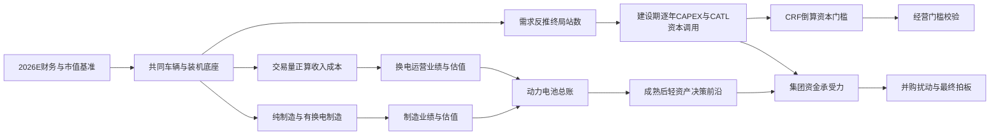

# 换电毛估估：战略投入产出与资本循环 v4.0

> 本报告由 `换电战略决策模型_v4` 自动生成。外部参数集中在 `configs/base.toml`，正文结果来自 `outputs/decision_snapshot_v4.json`；模板不保存业务结果数字。报告可以独立阅读，不要求读者翻看 Python。

## 一页拍板

中性假设下结论为 **支持重注**：建设期维持40%经济权益，把需求反推的站网在2028年以前建完；CATL建设期累计资本调用约 **442.7亿元**，单年峰值约 **98.2亿元**。2030E动力电池业务线价值约 **16,491.1亿元**；其中可归因换电价值约 **6,673.3亿元**，相当于当前宁德时代A+H市值的 **33.4%**。集团当前资金模型不要求提前出表；业务成熟后若出现更高回报的明确资金用途，30%是第一档轻资产方案。

本报告回答的是一个战略问题：**宁德时代是否值得在换电的基础设施期下重注；业务跑通后，是否以及做到什么程度的轻资产化，才能在保留数据、标准与技术验证场景控制权的同时，为其他战略重新装填“子弹”？**

研究边界有两条：

- 估值只做到动力电池业务线。储能、AIDC、矿山、软件与AI等仅作为资金需求敞口，不预测其未来利润与市值。
- 并购是扰动项。启源与蔚来站体不预设物理兼容；除非另有技术论证，只计算网络、客户、电池资产、竞争摩擦和市占率协同。

## 方法、口径与关键参数

### 推导主链

### 事实基准与来源

| 事实基准 | 本模型采用内容 | 来源 |
|---|---|---|
| 2025A | 集团与动力电池收入、归母净利润、经营现金流 | [宁德时代2025年报](https://www.catl.com/uploads/1/file/public/202603/20260310105829_c5p2l3q9ll.pdf) |
| 2026H1 | 集团与动力业务毛利、归母净利润、CFO、现金及交易性金融资产 | [港交所披露检索](https://www1.hkexnews.hk/search/titlesearch.xhtml?category=0&market=SEHK&stockId=1000259940) |
| 2026E | 集团归母净利润一致预期中性值 | [盈利预测汇总](https://basic.10jqka.com.cn/300750/worth.html) |
| 换电建站 | 官方2026目标为骐骥900座、巧克力超3,000座；模型按1,000/3,000，并在2028完成需求站数 | [宁德时代换电网络进展](https://www.catl.com/news/9516.html) |
| 分红习惯 | 连续三年按归母净利润约50%现金分红，作为资金压力情景 | [2025年报致股东信](https://www.catl.com/en/uploads/1/file/public/202603/20260310105310_46xjbwckvn.pdf) |
| 蔚来站网 | 站数、累计换电量和累计交付电量 | [蔚来1亿次换电公告](https://www.nio.com/news/20260206001) |
| 蔚能电池资产 | ABS底层样本资产评估、出租率与租金 | [世联资产评估报告](../media/武汉蔚能电池资产有限公司2026年第一期ABS-世联资产评估报告.pdf) |
| 蔚能整体参考 | 电池银行规模、用户、资产负债与融资估值整理 | [蔚能REITs案例分析](../定性分析/蔚能REITs案例分析.md) |
| 市值 | 用户给定的2026-08约2万亿元A+H市值快照；仅作比较基准 | 用户给定市场快照，不外推其他业务线 |

### 核心外部参数

| 参数 | 中性值 | 来源/用途 |
|---|---|---|
| WACC | 7.5% | 照抄蔚来ABS横向基准；只用于现值折现 |
| 资本回收系数CRF | 15.0% | 期望回报10%—15%对应区间的中值；用于倒算年资本要求 |
| 建设期CATL经济权益 | 40.0% | 2030前用于资本调用与归母价值；轻资产只在业务成熟后讨论 |
| 项目债务比例 | 60.0% | 项目资本结构 |
| 制造估值 | 20.0× PE | 制造归母净利润×PE |
| 换电运营估值 | 18.0× | EBITDA×倍数－债务，再乘CATL权益 |
| 资管平台估值 | 费率1.0% / 净利率40% / PE 25× | 全部为可调研究参数，不冒充公司指引 |
| 电池价格路径 | 2026:590.0 / 2027:590.0 / 2028:590.0 / 2029:566.4 / 2030:543.7 | 2026—2028平台期，之后先快降、再慢降；由曲线参数生成 |
| 退役回收率 | 44.0% | 储能/动力价格比×退役SOH×二手折价；不是期末残值率 |

WACC与CRF不是同一个参数：WACC衡量资金现值，CRF衡量项目应交付的年资本回报。把二者设成同一个数，会把经营门槛压低。

### 2026E动力电池比较基准

| 2026E动力电池基准拆分 | 公式 | 结果 |
|---|---|---|
| H1动力毛利润 | 动力收入×动力毛利率 | 396.4亿元 |
| H1集团毛利润 | 集团收入×集团毛利率 | 662.7亿元 |
| 动力归因比例 | 动力毛利润÷集团毛利润 | 59.8% |
| 2026E动力归母净利润 | 集团一致预期净利润×动力归因比例 | 598.1亿元 |
| 2026E动力市值贡献 | A+H市值×动力归因比例 | 11,962.5亿元 |
| 2026E道路电动车制造基准净利润 | 644GWh×当年电池价格×15% | 569.9亿元 |
| 2026E道路电动车制造基准价值 | 道路电动车制造净利润×PE | 11,398.8亿元 |
| 校验 | 动力市值＋其余业务当前市值＝当前A+H市值 | 20,000.0亿元 |

这里保留两个互补基准：用H1毛利占比分摊当前A+H市值，回答“当前动力分部约值多少”；用644GWh×价格×净利率×PE，回答“与2030道路电动车制造盘同口径相比是多少”。两者都展示，不混用分母，也不代表对其他业务做了预测。

## Part 1　共同规模底座：车、装机与站网

### 1.1 同一车辆底座如何供三条业务链调用

对每个车型、使用场景和年份：

`市场换电车辆 = 电动车数量 × 换电渗透率`

`市场充电车辆 = 电动车数量 ×（1－换电渗透率）`

`CATL换电车辆 = 市场换电车辆 × CATL换电市占率`

`CATL充电车辆 = 市场充电车辆 × CATL充电市占率`

`装机GWh = CATL车辆数 × 单车带电量`

换电与充电渗透率逐场景相加为一，但CATL在两条路线使用不同市占率。由此得到的装机同时供制造、运营和CAPEX模块调用，不在后续重复输入。

| 年份 | CATL换电装机 | CATL充电装机 | 无换电纯制造装机 |
|---|---|---|---|
| 2026 | 57.5GWh | 359.5GWh | 315.0GWh |
| 2027 | 64.5GWh | 405.3GWh | 355.4GWh |
| 2028 | 75.5GWh | 484.7GWh | 425.1GWh |
| 2029 | 88.5GWh | 580.9GWh | 509.9GWh |
| 2030 | 102.5GWh | 652.6GWh | 574.5GWh |

日均换电频次不作为结果参数输入，而由每个场景的日均里程、背电量、余电比例和百公里电耗推导：

`日均频次 = 日均里程 ÷（背电量×可用电量比例÷单位里程电耗）`

| 车型 | 累计CATL换电车 | 加权日频次 | 推导 |
|---|---|---|---|
| 重卡 | 38.0 | 1.83 | Σ场景车辆×(日均里程÷可用续航)÷Σ场景车辆 |
| 城配物流 | 85.5 | 1.27 | Σ场景车辆×(日均里程÷可用续航)÷Σ场景车辆 |
| 出租车 | 20.9 | 1.51 | Σ场景车辆×(日均里程÷可用续航)÷Σ场景车辆 |
| 网约车 | 17.1 | 1.15 | Σ场景车辆×(日均里程÷可用续航)÷Σ场景车辆 |
| Robotaxi | 50.0 | 1.51 | Σ场景车辆×(日均里程÷可用续航)÷Σ场景车辆 |
| 私家车 | 144.4 | 0.20 | Σ场景车辆×(日均里程÷可用续航)÷Σ场景车辆 |

### 1.2 终局站数由需求反推，建设节奏由规划约束

`工位上限 = 营业秒数 ÷ 单次换电秒数`

`能量上限 = 充电功率×营业小时×RTE ÷ 单次净补电量`

`物理上限 = min（工位上限，能量上限）`

`规划能力 = 外生运营假设，并校验不得超过物理上限`

`终局站数 = 向上取整（2030累计换电车队日需求 ÷ 规划能力）`

| 站网 | 工位上限 | 能量上限 | 规划能力（外生） | 物理余量 | 成熟日需求 | 终局站数 | 2026目标 | 建成 |
|---|---|---|---|---|---|---|---|---|
| 骐骥重卡 | 192 | 484 | 192 | 0% | 694,247次 | 3,616座 | 1,000座 | 2028 |
| 巧克力 | 864 | 552 | 300 | 84% | 2,635,632次 | 8,786座 | 3,000座 | 2028 |

这里刻意区分“站数”和“时间”：站数仍由本模型的车辆需求反推；时间上按换电站先行处理，2026先达到已披露里程碑，模型所需终局站数在2028年完成，2029—2030不再安排新增站体。

### 1.3 为什么车辆看起来没变，站数仍会变化

站数只可能被三个量改变：`CATL换电车辆数 × 日均换电频次 ÷ 单站规划能力`。本轮并没有让启源收购进入这条基准链：启源已摘牌的现金对价进入集团资金表，但在“业务尚未整合”的基准情景里，`重卡市占率协同=0`、`物理复用站数=0`。因此，启源不会改变基准车辆数、日需求或站数；它只在Part 7的并购情景中作为扰动项。

| 车辆组 | v3.2车辆(万) | v4车辆(万) | v3.2频次 | v4频次 | v3.2日需求(万次) | v4日需求(万次) | 差异解释 |
|---|---|---|---|---|---|---|---|
| 重卡 | 38.0 | 37.996 | 1.80（展示值） | 1.827 | 68.40 | 69.42 | 车辆几乎不变；v4不把分场景频次先四舍五入 |
| 城配物流 | 87.0 | 85.500 | 1.30（展示值） | 1.266 | 113.10 | 108.21 | v3把85.5万和1.266分别展示成87万、1.3后再相乘 |
| 乘用营运（出租+网约+Robotaxi） | 88.0 | 87.955 | 1.42（合并展示值） | 1.436 | 124.96 | 126.34 | v4逐车型计算；网约频次上修抵消部分城配下修 |
| 私家车 | 145.0 | 144.438 | 0.20（展示值） | 0.201 | 29.00 | 29.02 | 只剩未取整差异 |
| 巧克力合计 | 320.0 | 317.893 | 按三段加总 | 0.829 | 267.06 | 263.56 | 需求下降3.50万次/日；规划能力仍为300次/日 |

结论很明确：

- 重卡从3,563座变为当前反推值，不是车辆因启源而增加，而是同一批车辆的分场景频次从旧版展示用的1.80恢复为未取整的精确加权值；2025既有0.7万辆CATL换电重卡在新旧主链中都应存在。
- 巧克力站减少，主要是旧版把城配85.5万辆、频次1.266分别展示成87万辆、1.3后再相乘；v4直接对每一行未取整结果求和。出租、网约、Robotaxi和私家也按同一原则处理。
- 巧克力300次/日仍是毛估估的外生规划能力，不是由所谓“1.84倍设计冗余”严格倒算出来的工程参数。程序只验证300低于物理上限，不再让倒算出来的冗余度伪装成输入依据。

### 1.4 站数如何传导到CAPEX、EBITDA和估值

在车辆和换电需求固定时，增加站数不会增加换电服务收入、车端电池租金或按换电次数计的人工成本；这些项目都由车辆与交易量驱动。站数只沿下面的链传导：

`站数 → 站体CAPEX + 站内周转电池CAPEX → 全周期资本与项目债务`

`站数 → 站内电池峰谷套利收入 − 单站场租 → EBITDA的站级变化`

`CATL运营价值变化 =（EBITDA变化×EV/EBITDA − 全周期资本变化×债务比例）×CATL权益`

以下先按每1,000座展示单元传导，再把v3.2与v4的站数差异代入。它是“车辆需求固定”的一阶归因表，专门回答站数本身的影响，不把车辆、频次、价格等其他变化混进来。

| 每增加1,000站 | 站内电池(GWh) | 初装CAPEX | 全周期资本 | 套利收入/年 | 场租/年 | 固定需求下EBITDA变化 | CATL运营价值变化 |
|---|---|---|---|---|---|---|---|
| 骐骥重卡 | 4.104 | 74.2 | 86.2 | 5.29 | 3.00 | 2.29 | -4.23 |
| 巧克力 | 0.784 | 24.6 | 28.5 | 1.01 | 3.00 | -1.99 | -21.16 |

| 站网 | v3.2站数 | v4站数 | 站数变化 | 初装CAPEX一阶变化 | 稳态EBITDA一阶变化 | CATL运营价值一阶变化 |
|---|---|---|---|---|---|---|
| 骐骥重卡 | 3,563 | 3,616 | +53 | 3.93 | 0.12 | -0.22 |
| 巧克力 | 8,902 | 8,786 | -116 | -2.86 | 0.23 | 2.45 |
| 合计 | 12,465 | 12,402 | -63 | 1.08 | 0.35 | 2.23 |

这也说明了为什么必须先把站数链对齐：站数会显著改变站体和站内电池资本，但对EBITDA只通过套利与场租产生较小的边际变化。不能把由车辆增加带来的服务费、租金和人工变化误归因到“多建了站”。

> **规模与网络｜支持**：共同车辆底座闭合；需求反推终局站数，建设节奏按2026里程碑、2028完成网络处理。  
> 证据：重卡站=3616；巧克力站=8786；2028后新增站=0  
> 风险：站网先行与车辆后放量造成早期利用率爬坡风险。

## Part 2　投入账：建设期逐年CAPEX与资本峰值

### 2.1 年度资金链

`项目年度CAPEX = 新增车辆电池 + 新增站内周转电池 + 新增站体 + 到期更新净支出`

`到期更新净支出 = 更新电池毛支出－退役电池回收`

`退役电池回收率 = 储能/动力价格比×退役SOH×二手交易折价`

`CATL资本调用 = 项目年度CAPEX ×（1－项目债务比例）× CATL建设期经济权益`

| 年份 | 新增/累计重卡站 | 新增/累计巧克力站 | 车辆电池 | 站内电池 | 站体 | 首轮更新净支出 | 项目CAPEX | CATL资本调用 |
|---|---|---|---|---|---|---|---|---|
| 2026 | 1,000/1,000 | 3,000/3,000 | 339.4 | 38.1 | 110.0 | 0.0 | 487.5 | 78.0 |
| 2027 | 1,308/2,308 | 2,893/5,893 | 380.6 | 45.1 | 123.3 | 0.0 | 548.9 | 87.8 |
| 2028 | 1,308/3,616 | 2,893/8,786 | 445.4 | 45.1 | 123.3 | 0.0 | 613.7 | 98.2 |
| 2029 | 0/3,616 | 0/8,786 | 501.4 | 0.0 | 0.0 | 9.8 | 511.1 | 81.8 |
| 2030 | 0/3,616 | 0/8,786 | 557.2 | 0.0 | 0.0 | 48.6 | 605.8 | 96.9 |

2029—2030表中仍可能有车辆电池和首轮更新，但新增站数必须为零。这不是继续建网，而是车队放量与早期短寿命电池开始更换。

### 2.2 从年度投入到生命周期资本底座

全周期资本倍数不是配置结果，而是逐次计算：每次重置的“届时买新价格－届时卖旧回收”先按WACC折回批次初装时点，再与初装1相加；观察期末残值率则由届时储能价格、在役批年龄、SOH和二手折价推导。

| 电池寿命 | 全周期资本倍数 | 观察期末残值率 | 推导口径 |
|---|---|---|---|
| 10年 | 1.204× | 32.3% | 初装1＋历次(买新－卖旧)按WACC折现；残值由期末在役批年龄推导 |
| 3.8年 | 1.831× | 33.3% | 初装1＋历次(买新－卖旧)按WACC折现；残值由期末在役批年龄推导 |
| 5.7年 | 1.496× | 33.3% | 初装1＋历次(买新－卖旧)按WACC折现；残值由期末在役批年龄推导 |

旧版展示用的EAC倍数经过逐项圆整；本版不把任何倍数或期末残值率作为校准锚，而是保留价格曲线的未取整计算结果。因此，新旧结果可以接近，但不应为了复现旧表而反向调参。

| 指标 | 计算 | 结果 |
|---|---|---|
| 初装项目CAPEX | 各年车辆电池＋站内电池＋站体 | 2,708.7亿元 |
| 建设期首轮更新 | 到期电池重购－残值回收 | 58.4亿元 |
| CATL初装权益投入 | 初装项目CAPEX×权益资本比例×CATL权益 | 433.4亿元 |
| CATL建设期首轮更新投入 | 首轮更新净支出×权益资本比例×CATL权益 | 9.3亿元 |
| 等效全周期资本底座 | Σ各批初装电池×派生资本倍数＋站体 | 3,925.0亿元 |
| 稳态项目债务 | 等效全周期资本底座×项目债务比例 | 2,355.0亿元 |
| CATL全周期权益承诺 | 等效全周期资本底座×权益资本比例×CATL权益 | 628.0亿元 |
| 年资本要求 | 等效全周期资本底座×CRF | 588.7亿元 |
| CATL累计资本调用 | 项目CAPEX×权益资本比例×CATL权益 | 442.7亿元 |
| CATL单年峰值 | 年度资本调用最大值 | 98.2亿元（2028年） |

等效全周期资本底座用于建立资本回报门槛；建设期逐年现金峰值用于回答会不会挤占集团其他战略。前者是稳态资本要求口径，后者是实际资金时点口径，两者不能互相替代。

“稳态项目债务”按全周期资本底座的目标资本结构计算，用于成熟期估值与利息；“建设期CATL资本调用”只按2026—2030实际发生的初装和首轮更新现金计算。两者不是同一张时点资金表。

> **资本开支｜支持**：建设期累计与单年峰值均从年度站体、车辆电池、站内电池和首轮更新逐项推导。  
> 证据：CATL累计资本调用=442.7；CATL单年峰值=98.2；峰值/当年可用CFO=9.2%  
> 风险：项目融资比例和车辆放量速度会改变CATL实际现金调用时点。

## Part 3　回报账：倒算、正算与制造线

三条回报链分开计算：

1. CAPEX＋CRF倒算的是换电运营必须交付的最低资本回报。
2. 交易量正算的是换电运营在中性价格与成本下能够交付的业绩。
3. 制造线计算纯制造和加入换电后的电池销售利润。

第一、第二条互为校验，不能相加；第三条与换电运营线在Part 4合并。

### 3.1 CAPEX＋CRF倒算门槛

| 倒算步骤 | 公式 | 结果 |
|---|---|---|
| 等效全周期资本底座 | 初装＋历次净更新折现；不以结果锚校准 | 3,925.0亿元 |
| 资本要求FCFF | 资本底座×CRF | 588.7亿元 |
| 成熟期折旧 | 各批初装×(全周期倍数－期末残值率)÷寿命＋站体÷年限 | 578.4亿元 |
| 门槛EBITDA | (FCFF－折旧×税率)÷(1－税率) | 592.2亿元 |
| 正算覆盖 | 正算EBITDA÷门槛EBITDA | 1.33× |

### 3.2 换电经营正算完整链

| 经营链项目 | 公式口径 | 结果 |
|---|---|---|
| 换电服务收入 | 年交易电量×服务费 | 583.2亿元 |
| 电池租金 | 可收费电池GWh×年租金 | 466.2亿元 |
| 峰谷套利 | 站内电池×价差×效率×运营天数 | 28.0亿元 |
| 辅助服务 | 外部参数 | 5.2亿元 |
| 营业收入 | 以上收入合计 | 1,082.5亿元 |
| 现金OPEX | 损耗电费＋场租＋人工＋软件 | 297.6亿元 |
| EBITDA | 收入－现金OPEX | 785.0亿元 |
| 项目净利润 | (EBITDA－折旧－利息)×(1－税率) | 110.8亿元 |
| CATL归母净利润 | 项目净利润×建设期权益 | 44.3亿元 |
| 项目EV | EBITDA×EV/EBITDA | 14,129.4亿元 |
| CATL运营价值 | (项目EV－项目债务)×建设期权益 | 4,709.8亿元 |

### 3.3 制造线

| 制造情景 | 装机 | 收入 | 净利率 | 归母净利润 | PE | 估值 |
|---|---|---|---|---|---|---|
| 2030E无换电纯制造 | 574.5GWh | 3,123.8 | 12.5% | 390.5 | 20× | 7,809.4 |
| 2030E重资产换电 | 722.2GWh | 3,927.1 | 15.0% | 589.1 | 20× | 11,781.4 |

> **换电经营｜支持**：正向经营链覆盖15% CRF资本门槛；7.5%只用于折扣链中历次净更新的现值折算。  
> 证据：正向EBITDA=785.0；门槛EBITDA=592.2；覆盖倍数=1.3  
> 风险：电池租金、服务费、换电频次和站均利用率是主要敏感项。

## Part 4　动力电池总账：现在、2030纯制造与2030有换电

### 4.1 两条线合并

`有换电动力电池归母净利润 = 有换电制造归母净利润 + CATL换电运营归母净利润`

`有换电动力电池价值 = 有换电制造价值 + CATL换电运营权益价值`

| 观察口径 | 制造净利润 | 运营归母净利润 | 动力电池归母净利润 | 制造价值 | 运营价值 | 动力电池价值 |
|---|---|---|---|---|---|---|
| 2026E道路电动车制造基准 | 569.9 | 0 | 569.9 | 11,398.8 | 0 | 11,398.8 |
| 2026E动力分部市值分摊基准 | — | — | 598.1 | — | — | 11,962.5 |
| 2030E无换电纯制造 | 390.5 | 0 | 390.5 | 7,809.4 | 0 | 7,809.4 |
| 2030E重资产换电 | 589.1 | 44.3 | 633.4 | 11,781.4 | 4,709.8 | 16,491.1 |

这里的“分部加总”只发生在动力电池内部：制造用PE，运营用EV/EBITDA。没有加入任何对储能、AIDC或其他集团业务的2030预测。

### 4.2 有换电相对纯制造的完整增量桥

| 增量桥 | 利润增量 | 价值增量 | 是否计入可归因换电价值 | 计算含义 |
|---|---|---|---|---|
| 制造销量/市占率差 | 100.4 | 2,008.4 | 否 | (有换电收入－纯制造收入)×纯制造净利率 |
| 道路电动车制造盘利润率保护 | 98.2 | 1,963.6 | 是 | 有换电制造收入×净利率差；本次仅含已建模道路电动车 |
| 制造线情景差额合计 | 198.6 | 3,971.9 | 部分 | 制造销量/市占率差＋利润率保护 |
| 换电直接运营 | 44.3 | 4,709.8 | 是 | 项目归母净利润与归母权益价值 |
| 可归因换电价值合计 | 142.5 | 6,673.3 | 是 | 道路电动车制造盘利润率保护＋直接运营 |
| 完整有换电－纯制造差额 | 242.9 | 8,681.7 | 情景上限 | 制造线全部差额＋直接运营 |

“制造销量/市占率差”单列为完整情景差额，但不计入可归因换电主值。可归因主值只认领两项：本报告已建模道路电动车制造盘的利润率保护，以及换电直接运营价值。电动船舶、eVTOL、机器人等未建立规模底座的用途不进入制造总账，留待专项研究。

### 4.3 对当前宁德时代意味着什么

| 战略观察 | 计算 | 结果 |
|---|---|---|
| 较2026道路电动车制造基准增加 | 2030有换电动力价值－2026同口径制造价值 | 5,092.3亿元 |
| 2030动力价值/2026道路电动车制造基准 | 2030有换电动力价值÷2026同口径制造价值 | 1.45× |
| 2030动力价值/2026动力分部市值分摊 | 2030有换电动力价值÷H1毛利占比分摊的当前动力价值 | 1.38× |
| 可归因换电价值/2026道路电动车制造基准 | 可归因换电价值÷同口径2026制造价值 | 58.5% |
| 可归因换电价值/2026动力分部市值分摊 | 可归因换电价值÷当前动力业务市值贡献 | 55.8% |
| 可归因换电价值/当前宁德时代市值 | 可归因换电价值÷当前A+H市值 | 33.4% |
| 完整情景差额/当前宁德时代市值 | 完整有换电－纯制造差额÷当前A+H市值 | 43.4% |
| 换电价值/2030前CATL现金调用 | 可归因换电价值÷建设期实际权益现金 | 15.07× |
| 换电价值/CATL全周期权益承诺 | 可归因换电价值÷全周期权益资本承诺 | 10.63× |
| 稳态归母净利润/全周期权益承诺 | 换电运营归母净利润÷全周期权益资本承诺 | 7.1% |

ROI需要分层读：CRF是项目资本要求的收益率锚；“2030前现金调用”回答基础设施期实际消耗多少集团子弹；“全周期权益承诺”把后续更新义务也纳入分母；稳态归母净利润收益率则只看可落到CATL账面的运营利润，不把市值增量当现金回报。四个口径不能混成一个数字。

> **动力电池总账｜支持**：制造线与运营线已经合并；制造只覆盖已建模道路电动车，换电护价与完整情景差额分开。  
> 证据：2030动力电池价值=16,491.1；可归因换电价值=6,673.3；占当前集团市值=33.4%；占2026同口径动力制造基准=58.5%；换电价值/CATL全周期权益承诺=10.6  
> 风险：市占率与制造净利率差是情景变量，不能把全部动力业务成长归因给换电。

## Part 5　成熟后轻资产：市值、回款与权益的决策前沿

轻资产不绑定具体交易年份。触发条件是：网络和车辆已经形成稳定现金流、资产可独立评估、治理协议能保证数据和标准控制权。2030可以成熟，也可能更晚；本报告不把战术执行年份写死。

### 5.1 三层价值分别怎么估

| 价值层 | 估值公式 | 参数解释 |
|---|---|---|
| 制造线 | 归母净利润×制造PE | 中性20× |
| 重资产运营线 | (EBITDA×EV/EBITDA－项目债务)×CATL权益 | 中性18×；沿用v3 §4.1的含战略溢价基建运营口径 |
| 轻资产后底层权益 | (费后资产EV－债务)×保留权益 | 管理费由SPV支付，先扣费再估权益，防止双算 |
| 资管平台 | AUM×管理费率×资管净利率×资管PE | 平台费收入与底层资产价值分开；参数可调 |

运营18×沿用[v3.0 §4.1](换电毛估估_折扣链与总表_v3.0.md#41-倍数影响极大)的可比框架：它是含标准、数据和电池供应协同溢价的基础设施运营估值，不是把宁德时代直接类比成Blackstone。资管平台只有在真实收取管理费并承担持续管理职能后才单列估值。

### 5.2 资管平台价值的推导

| 资管平台推导 | 公式 | 结果 |
|---|---|---|
| 管理资产AUM | 经营EBITDA×运营倍数÷(1＋费率×运营倍数) | 11,974.1亿元 |
| 管理费收入 | AUM×管理费率 | 119.7亿元 |
| 资管净利润 | 管理费收入×资管净利率 | 47.9亿元 |
| 资管平台价值 | 资管净利润×资管PE | 1,197.4亿元 |

### 5.3 轻资产交易链

`净回款 = 费后项目权益价值 ×（40%－终局权益）×（1－交易成本率）`  
`持续动力价值 = 制造价值 + 保留运营权益价值 + 资管平台价值`  
`含回款后动力价值 = 持续动力价值 + 净回款`

| 终局权益 | 毛回款 | 净回款 | 制造价值 | 保留运营价值 | 资管平台价值 | 持续动力价值 |
|---|---|---|---|---|---|---|
| 10% | 2,885.7 | 2,828.0 | 12,349.6 | 961.9 | 1,197.4 | 14,508.9 |
| 20% | 1,923.8 | 1,885.3 | 12,160.2 | 1,923.8 | 1,197.4 | 15,281.4 |
| 30% | 961.9 | 942.7 | 11,970.8 | 2,885.7 | 1,197.4 | 16,053.9 |
| 40% | 0.0 | 0.0 | 11,781.4 | 4,709.8 | 0.0 | 16,491.1 |

### 5.4 决策前沿

| 终局权益 | 持续价值保留率 | 经常利润保留率 | 持续动力价值变化 | 含净回款后变化 | 回款/持续价值损失 | 决策位置 |
|---|---|---|---|---|---|---|
| 10% | 88.0% | 105.4% | -1,982.3 | 845.8 | 1.43× | 极端资本释放档，不作为中性方案 |
| 20% | 92.7% | 104.2% | -1,209.8 | 675.6 | 1.56× | 资金约束加重时的第二档 |
| 30% | 97.3% | 103.1% | -437.2 | 505.4 | 2.16× | 第一档轻资产：出现明确资金用途时优先评估 |
| 40% | 100.0% | 100.0% | 0.0 | 0.0 | — | 基准终局：资金不短缺时不出表 |

经常利润保留率可能略高于原值，原因是降低底层权益后，更多电池转为对SPV的外部制造销售，同时新增管理费利润；这不是把同一利润重复计算。持续价值仍会因运营权益下降而减少，因此不能只看利润保留率下结论。

当前资金表没有触发流动性缺口，因此中性终局仍是保留 **40%**、暂不出表。若成熟后出现已经拍板且回报更高的资金用途，优先测试保留 **30%**：可净回款 **942.7亿元**，代价是持续动力价值减少 **437.2亿元**；计入回款后净增加 **505.4亿元**。其余更低权益档只有在资金缺口进一步扩大、且替代项目价值足以覆盖更大的持续价值损失时才进入选择。

> **成熟期资本循环｜支持设置决策前沿**：当前资金模型无缺口，基准保留40%；若出现明确战略资金用途，30%是第一档轻资产方案，不预设某一更低权益档最优。  
> 证据：当前选择权益=40.0%；30%净回款=942.7；30%持续动力价值变化=-437.2；30%含回款净变化=505.4  
> 风险：控制权、数据权、标准权和技术验证场景必须由交易协议保障。

## Part 6　集团资金承受力：现有子弹、固定回报与未决敞口

### 6.1 资金表如何读

资金起点使用2026H1货币资金加交易性金融资产。2026可用CFO只取全年预测减已实现H1 CFO，避免重复。分红按连续三年50%的习惯做全年储备；已宣告中期分红属于该储备的一部分，不再另扣一次。

| 年份 | 预测归母净利润 | 可用CFO | 分红率 | 分红储备 | 回购储备 | 已识别直接并购现金 | 换电资本 | 期末液态资源 | 高于流动性底线 |
|---|---|---|---|---|---|---|---|---|---|
| 2026 | 1,000.0 | 847.8 | 50% | 500.0 | 400.0 | 54.6 | 78.0 | 4,217.3 | 1,217.3 |
| 2027 | 1,160.0 | 1,600.0 | 50% | 580.0 | 0.0 | 0.0 | 87.8 | 5,149.5 | 2,149.5 |
| 2028 | 1,320.0 | 1,800.0 | 50% | 660.0 | 0.0 | 0.0 | 98.2 | 6,191.3 | 3,191.3 |
| 2029 | 1,500.0 | 2,000.0 | 50% | 750.0 | 0.0 | 0.0 | 81.8 | 7,359.5 | 4,359.5 |
| 2030 | 1,700.0 | 2,250.0 | 50% | 850.0 | 0.0 | 0.0 | 96.9 | 8,662.6 | 5,662.6 |

“期末液态资源”尚未扣除没有明确金额和时点的固态、储能/AIDC、软件AI等项目，因此它是战略动作前的可用上限，不是自由现金承诺。

### 6.2 已披露或已识别的资本事项

| 事项 | 披露/交易总额 | 计入资金表现金 | 口径 | 时点 | 处理 | 来源 |
|---|---|---|---|---|---|---|
| 2026年A股回购计划 | 400.0 | 400.0 | 宁德时代合并口径 | 2026年，按已披露200—400亿元区间上限预留 | 资金表采用上限，属于审慎压力口径。 | [披露文件](https://www1.hkexnews.hk/search/titlesearch.xhtml?category=0&market=SEHK&stockId=1000259940) |
| 中恒电气交易 | 41.0 | 29.0 | 宁德时代合并口径 | 2026年 | 总对价含时代天源股权作价11.96364亿元；资金表只扣现金部分。 | [披露文件](https://static.cninfo.com.cn/finalpage/2026-04-09/1225083748.PDF) |
| 世纪互联交易 | 64.0 | 0.0 | 宁德时代非控制、非并表关联方 | 2026年交易安排 | 约9.42亿美元为买方关联方投资，未证明由上市公司合并现金承担，故不直接扣减。 | [披露文件](https://ir.vnet.com/static-files/848f4589-7db7-49db-8c1d-61202816a7dc) |
| 矿产资源投资公司 | 300.0 | 0.0 | 注册资本上限，现金与股权出资混合 | 实缴节奏未披露 | 不得机械均摊至2026—2028年；作为承诺上限和资金预警项单列。 | [披露文件](https://static.cninfo.com.cn/finalpage/2026-04-16/1225107944.PDF) |

矿产资源投资公司的300亿元是注册资本安排，且含现金与股权出资，实缴时点未披露；世纪互联买方是宁德时代非控制、非并表关联方。两项都不能为了让表格“完整”而机械均摊进集团年度现金流。

### 6.3 未决战略资金敞口：只作压力刻度

| 未决战略方向 | 若全部新建所需投入 | 假设产线/资产复用率 | 仍需新增资金 | 性质 |
|---|---|---|---|---|
| 固态电池新产线 | 1,000.0 | 25% | 750.0 | 研究情景，不是公司预算 |
| 储能与AIDC扩产 | 800.0 | 60% | 320.0 | 研究情景，不是公司预算 |
| 新增矿山投资 | 300.0 | 0% | 300.0 | 研究情景，不是公司预算 |
| 软件与AI能力 | 200.0 | 0% | 200.0 | 研究情景，不是公司预算 |
| CVC与内部孵化 | 200.0 | 0% | 200.0 | 研究情景，不是公司预算 |
| 合计 | — | — | 1,770.0 | 仅作压力刻度 |

“若全部新建所需投入”是普通投资者口径；考虑现有液态产线、厂房和公用工程可复用后，才得到“仍需新增资金”。这些金额是情景参数，不替代后续对固态、储能和AIDC逐条线的专项研究。

### 6.4 成熟后出表能给其他战略补多少血

| 终局权益 | 成熟后净回款 | 未来更新资本释放 | 可覆盖未决战略敞口情景 | 解释 |
|---|---|---|---|---|
| 10% | 2,828.0 | 160.2 | 159.8% | 极端资本释放档，不作为中性方案 |
| 20% | 1,885.3 | 106.8 | 106.5% | 资金约束加重时的第二档 |
| 30% | 942.7 | 53.4 | 53.3% | 第一档轻资产：出现明确资金用途时优先评估 |
| 40% | 0.0 | 0.0 | 0.0% | 基准终局：资金不短缺时不出表 |

> **集团资金｜支持**：以2026H1液态资产为起点，扣除分红储备、回购上限、已识别直接并购现金和换电资本后检验余量。  
> 证据：最低流动性余量=1,217.3；未决战略资金敞口情景=1,770.0；2026H1液态资产=4,402.1  
> 风险：矿产300亿元为注册资本上限、世纪互联由非并表关联方投资，均不能机械计入年度现金支出。

## Part 7　并购扰动：启源与蔚来怎么接入投入产出

### 7.1 先把蔚来资产底座拍清楚

| 资产 | 规模/财务锚 | 估值或交易含义 |
|---|---|---|
| 蔚来换电网络 | 3,790座；累计1.0亿次；52.8亿kWh | 按150万元/站重置成本约56.9亿元；只作交易锚 |
| 蔚能电池银行 | 42.0GWh+、55万+用户 | 参考权益价值100亿元以上；加负债后的资本承载约324.8亿元 |
| ABS评估样本 | 5,369块、0.490GWh、出租率92% | 账面5.001亿元、评估5.06亿元；75/100—102kWh月租728/1,128元 |

ABS评估样本不是蔚能全部资产的估值。它证明了电池资产可以按租赁现金流独立评估；蔚能整体42GWh级资产银行仍需同时看权益价值、负债和存量融资。蔚来站网则按重置成本只作交易价格锚，不等于可直接兼容巧克力站。

### 7.2 收购价款与后续资本调用是两笔钱

- 收购现金：买入已经存在的权益、站网或电池银行，加整合成本。
- 承接负债：进入资产负债表或SPV的资本负担，不等于交易日现金。
- 剩余自建资本调用：为实现本模型2030规模仍需投入的车辆、站内电池和站网权益资本。

| 方案 | 买入资产 | 现金支出 | 承接负债 | 总资本负担 | 剩余自建资本调用 | 布局提前 | 价格依据 |
|---|---|---|---|---|---|---|---|
| 启源股权收购已完成；暂不假设物理整合，不收购蔚来 | 站网0座 / 电池银行0.0GWh | 25.6 | 0.0 | 25.6 | 442.7 | 0.25年 | 启源芯动力25%股权摘牌价 |
| 启源股权收购，加收购蔚来网络与电池银行 | 站网3,790座 / 电池银行42.0GWh | 189.8 | 224.8 | 414.7 | 457.8 | 0.75年 | 启源25.56亿＋蔚能剩余权益约92.42亿＋3790站按150万元/站重置成本56.85亿 |
| 启源股权收购，加收购蔚来电池银行；站网由地方国资持有 | 站网0座 / 电池银行42.0GWh | 128.0 | 224.8 | 352.8 | 454.6 | 0.60年 | 启源25.56亿＋蔚能参考股权价值100亿扣除CATL现持7.58%后的约92.42亿 |

收购后剩余自建资本调用可能小幅增加，因为模型把网络协同转成更高的CATL换电市占率，服务车辆和电池需求随之上升；当前没有假设买来的异构站体可直接抵扣新建站。

### 7.3 从收购到动力电池价值的传导

`买入存量网络/电池资产 → 布局提前与市占率协同 → 换电运营价值增量 + 制造利润保护增量 → 可归因换电价值增量 → 动力电池业务线增量`

| 方案 | 收购资产参考价值 | 换电运营协同增量 | 制造协同增量 | 可归因换电增量 | 动力线协同增量 | 动力线毛增量含买入资产 | 扣现金后股东价值创造 |
|---|---|---|---|---|---|---|---|
| 启源股权收购已完成；暂不假设物理整合，不收购蔚来 | 0.0 | 0.0 | 0.0 | 0.0 | 0.0 | 0.0 | 0.0 |
| 启源股权收购，加收购蔚来网络与电池银行 | 149.3 | 146.1 | 6.5 | 152.5 | 184.8 | 334.1 | 169.8 |
| 启源股权收购，加收购蔚来电池银行；站网由地方国资持有 | 92.4 | 124.0 | 4.9 | 128.9 | 153.4 | 245.9 | 143.4 |

“收购资产参考价值”是把现金换成动力电池线内的存量资产，本身不等于价值创造；“扣现金后股东价值创造”才把协同价值、买入资产和现金流出放在同一口径。启源与蔚来站体物理复用仍为零，待技术兼容性另行论证。

## Part 8　提交拍板：各模块先下判断，再做总决策

| 模块负责人 | 判断 | 先提交的子结论 | 关键风险 |
|---|---|---|---|
| 规模与网络 | 支持 | 共同车辆底座闭合；需求反推终局站数，建设节奏按2026里程碑、2028完成网络处理。 | 站网先行与车辆后放量造成早期利用率爬坡风险。 |
| 资本开支 | 支持 | 建设期累计与单年峰值均从年度站体、车辆电池、站内电池和首轮更新逐项推导。 | 项目融资比例和车辆放量速度会改变CATL实际现金调用时点。 |
| 换电经营 | 支持 | 正向经营链覆盖15% CRF资本门槛；7.5%只用于折扣链中历次净更新的现值折算。 | 电池租金、服务费、换电频次和站均利用率是主要敏感项。 |
| 动力电池总账 | 支持 | 制造线与运营线已经合并；制造只覆盖已建模道路电动车，换电护价与完整情景差额分开。 | 市占率与制造净利率差是情景变量，不能把全部动力业务成长归因给换电。 |
| 成熟期资本循环 | 支持设置决策前沿 | 当前资金模型无缺口，基准保留40%；若出现明确战略资金用途，30%是第一档轻资产方案，不预设某一更低权益档最优。 | 控制权、数据权、标准权和技术验证场景必须由交易协议保障。 |
| 集团资金 | 支持 | 以2026H1液态资产为起点，扣除分红储备、回购上限、已识别直接并购现金和换电资本后检验余量。 | 矿产300亿元为注册资本上限、世纪互联由非并表关联方投资，均不能机械计入年度现金支出。 |

> **最终拍板｜支持重注**：按中性假设，建设期维持40%并完成网络与电池银行；成熟后只有出现高价值资金用途时，才从30%开始分档出表。  
> 证据：2026E动力电池市值基准=11,962.5；2026E同口径制造价值=11,398.8；2030E动力电池价值=16,491.1；可归因换电价值=6,673.3；相当于当前宁德时代=33.4%  
> 风险：结论依赖中性参数，需由后续Dashboard做敏感性复核；报告本身保留完整推导链。

## 附录A　v3.2主链与v4当前参数全量核对

对照对象是旧报告主文的有效计算链。该文件名仍为v3.0、页首已迭代到v3.4，用户讨论中沿称“v3.2”；旧文内部若出现主文与附录/变更记录冲突，本表明确写出，并以正文方法论与经济含义一致性为裁决依据。下表覆盖所有进入车辆、站网、CAPEX、经营、制造、估值、资金、轻资产和并购主链的数值参数；纯文本标签和来源URL不属于数值参数，未重复罗列。

| 模块 | 参数 | v3.2主链 | v4当前 | 核对结论 | 原因/处理 | 影响 |
|---|---|---|---|---|---|---|
| 模型边界 | 建设/目标年份 | 2026—2030 | 2026—2030 | 一致 | 共同规模窗口 | 车辆、装机、建设期CAPEX |
| 模型边界 | 全周期观察期 | 15年 | 15年 | 一致 | 用于重置与期末残值 | 全周期资本、折旧 |
| 资本 | WACC | 7.5% | 7.5% | 一致 | 横向照抄蔚来ABS，只作折现 | 重置现值、残值现值 |
| 资本 | 回报要求/CRF | 10%—15%；主链CRF=15% | 10%—15%；CRF=15% | 一致 | CRF不由WACC推导 | 门槛FCFF、门槛EBITDA |
| 资本 | 税率/债务比例/债息 | 25% / 60% / 2.5% | 25% / 60% / 2.5% | 一致 | 资本结构未改 | 净利润、债务、运营价值 |
| 资本 | 建设期CATL经济权益 | 40% | 40% | 一致 | 2030前不分档 | 资本调用、归母利润与价值 |
| 估值 | 制造PE/运营EV-EBITDA | 20× / 18× | 20× / 18× | 一致 | 沿用v3主估值口径 | 制造价值、换电运营价值 |
| 估值 | 资管平台参数 | v3正文未形成独立可调三参数 | 费率1.0% / 净利率40% / PE25× | v4新增 | 只在成熟轻资产情景启用 | 资管平台价值 |
| 估值 | 交易成本率 | 未单列 | 2.0% | v4新增 | 从毛回款扣除 | 轻资产净回款 |
| 需求 | 重卡存量/更新周期 | 900万 / 9年 | 900万 / 9年 | 一致 | 存量更新法 | 重卡EV基数 |
| 需求 | 重卡NEV渗透率 | 35%/43%/46%/48%/50% | 35%/43%/46%/48%/50% | 一致 | 逐年S曲线 | 重卡EV基数 |
| 需求 | 重卡场景权重 | 38%/50%/12% | 38%/50%/12% | 一致 | 短/中/长途 | 重卡车辆与频次加权 |
| 需求 | 重卡换电渗透率 | 30%/50%/70% | 30%/50%/70% | 一致 | 逐场景相乘 | 重卡CATL换电车辆 |
| 需求 | 重卡CATL换电市占率 | 30%/30%/70% | 30%/30%/70% | 一致 | 基准不确认启源协同 | 重卡CATL换电车辆 |
| 需求 | 2025既有CATL换电重卡 | 0.7万 | 0.7万 | 已恢复 | 作为2026累计底座，不是启源协同 | 重卡车辆、装机、站数、CAPEX |
| 需求 | 重卡单车电量/寿命 | 500kWh / 5.7年 | 500kWh / 5.7年 | 一致 | 制造装机与重置 | 制造收入、电池CAPEX |
| 需求 | 重卡里程/背电/电耗 | 130/400/650km；342/513/513kWh；1.5/1.7/1.7 | 130/400/650km；342/513/513kWh；1.5/1.7/1.7 | 一致 | 频次改为逐场景未取整推导 | 重卡日需求、站数、交易量 |
| 需求 | 城配存量/周期/NEV | 1,500万 / 8年 / 50%—95% | 1500万 / 8年 / 50%/65%/80%/90%/95% | 一致 | 高频场景权重另列 | 城配EV基数 |
| 需求 | 城配场景 | 高频30%，换电50%，CATL 80%；低频不换电 | 高频30%，换电50%，CATL80%；低频不换电 | 一致 | 不先合成平均比例 | 城配换电车辆 |
| 需求 | 城配电量/里程/电耗/寿命 | 80kWh / 300km / 0.27 / 3.8年 | 80kWh / 300km / 0.27 / 3.8年 | 一致 | 频次精确推导 | 城配交易量、CAPEX |
| 需求 | 出租/网约里程池参数 | 3,500亿km；Robotaxi 50万×350km×330天；有人350km×330天；出租139万 | 3500亿km；50万×350×330；有人350×330；出租139万 | 一致 | 需求侧反推活跃车 | 出租/网约存量 |
| 需求 | 出租/网约NEV渗透率 | 92%/94%/96%/98%/100% | 92%/94%/96%/98%/100% | 已恢复 | 旧代码曾误写96%平值；v4按主文逐年值 | 出租/网约车辆 |
| 需求 | 出租与网约日里程 | 450 / 342km | 450 / 342km | 一致 | 分别计算频次 | 巧克力日需求 |
| 需求 | 出租/网约共用参数 | 56kWh；8年；换电50%；CATL 50%；寿命3.8年 | 56kWh；8年；换电50%；CATL50%；寿命3.8年 | 一致 | — | 车辆、装机、交易量 |
| 需求 | Robotaxi逐年净增 | 0/0/5/15/30万 | 0/0/5/15/30万 | 一致 | 累计50万 | 车辆、装机、交易量 |
| 需求 | Robotaxi运营参数 | 56kWh；450km；换电/CATL 100%；寿命3.8年 | 56kWh；450km；换电/CATL 100%；寿命3.8年 | 一致 | 站数频次沿用主文450km | 巧克力日需求、CAPEX |
| 需求 | 私家车逐年净增 | 1,200/1,300/1,600/2,000/2,300万 | 1200/1300/1600/2000/2300万 | 一致 | 累计8,400万 | 私家车底座 |
| 需求 | 私家价格带权重 | 12.3%/40.4%/47.3% | 12%/40%/47% | 一致 | 分档计算 | 私家换电车辆 |
| 需求 | 私家换电渗透/CATL市占 | 0%/5%/3%；CATL 50% | 0%/5%/3%；CATL 50% | 一致 | 中性情景 | 私家换电车辆 |
| 需求 | 私家电量/里程/电耗/寿命 | 56kWh / 60km / 0.15 / 10年 | 56kWh / 60km / 0.15 / 10年 | 按主文 | 旧配置66.7km/90%与主文60km/80%冲突；v4跟主文 | 频次、站数、CAPEX |
| 需求 | 无换电CATL份额 | 营运35%；私家33% | 重卡/城配/出租/网约/Robotaxi 35%；私家33% | 一致 | 纯制造对照 | 无换电制造装机 |
| 频次 | 可用电量比例 | 80% | 80% | 一致 | 剩余20%换电 | 全部车型频次与交易电量 |
| 频次 | 重卡加权频次 | 1.80次/日（展示值） | 1.827次/日 | 精度变化 | 逐场景原值加权，不把0.7/1.7/2.7先圆整 | 重卡站数3563→3616 |
| 频次 | 城配频次 | 1.30次/日（展示值） | 1.266次/日 | 精度变化 | 300÷(80×80%÷0.27) | 城配日需求下降 |
| 频次 | 出租/网约/Robotaxi/私家 | 1.5/1.1/1.5/0.2 | 1.507/1.145/1.507/0.201 | 精度变化 | 由里程、背电与电耗直接推导 | 巧克力日需求与站数 |
| 站网 | 重卡站体/库存/寿命 | 500万/24块×171kWh/5.7年 | 500万/24块×171kWh/5.7年 | 一致 | 站体不含电池 | 站体与站内电池CAPEX |
| 站网 | 重卡物理校验 | 4,500kW/16h/300秒 | 4,500kW/16h/300秒 | 一致 | 只校验规划能力不越过物理上限 | 诊断项，不直接进入CAPEX |
| 站网 | 巧克力站体/库存/寿命 | 200万/14块×56kWh/3.8年 | 200万/14块×56kWh/3.8年 | 一致 | 站体不含电池 | 站体与站内电池CAPEX |
| 站网 | 巧克力物理校验 | 1,120kW/24h/100秒 | 1,120kW/24h/100秒 | 一致 | 只校验规划能力不越过物理上限 | 诊断项，不直接进入CAPEX |
| 站网 | 重卡规划能力 | 192次/日 | 192次/日 | 一致 | 官方16h×5分钟口径 | 重卡站数分母 |
| 站网 | 巧克力规划能力 | 300次/日（毛估估） | 300次/日（外生） | 口径澄清 | 不再用1.84倍冗余倒算；物理上限只作校验 | 巧克力站数分母 |
| 站网 | 巧克力工位物理上限 | 822次/日（含衔接裕量） | 864次/日（100秒理论值） | 诊断差异 | 两者均高于能量上限且不参与300规划值 | 无主模型数值影响 |
| 站网 | 终局站数 | 重卡3,563；巧克力8,902 | 重卡3,616；巧克力8,786 | 结果变化 | 车辆未取整、频次未取整；基准启源协同为0 | 站体/站内电池CAPEX、场租、套利 |
| 站网 | 2026累计/2028完工 | v3排期按总量均摊至2028（1,247/3,116起） | 2026=1,000/3,000；2028完工 | 规划校准 | 按公司规划里程碑约束时点 | 年度CAPEX峰值；不改终局需求 |
| 电池价格 | 2026—2030价格路径 | 590/590/590/566.4/543.7元/kWh | 590.0/590.0/590.0/566.4/543.7元/kWh | 一致 | 平台至2028，2029起年降4% | 初装、更新、制造收入 |
| 电池价格 | 平台/快降/慢降 | 2028止；2033止；-4%/-2.5%~3% | 2028止；2033止；-4.0%/-2.75% | 一致 | 将旧表年份数组改为曲线生成 | 所有未来电池价格 |
| 残值 | 储能/动力价格比×退役SOH×二手折价 | 0.917×80%×60%（旧表每次再乘届时价格折） | 0.917×80%×60%=44.02%（相对同年新电池） | 公式澄清 | 44.016%不是相对初装的固定残值率 | 每次更新净CAPEX |
| 残值 | 期末在役批残值率 | 5.7/3.8年约32.9%；10年约31.7% | 10年:32.3%/3.8年:33.3%/5.7年:33.3% | 派生精度 | 按届时价格、批次年龄、SOH和WACC路径推导 | 折旧基数 |
| 残值 | 全周期资本倍数 | 5.7年1.46×；3.8年1.78×；10年1.21× | 10年:1.204×/3.8年:1.831×/5.7年:1.496× | 派生精度 | 不拿旧圆整结果反向校准 | 全周期资本、门槛EBITDA、债务 |
| 更新 | 3.8年首轮更新年度拆分 | 第3年20%＋第4年80% | 事件年3.8按相邻年度20%/80% | 一致 | 非整数寿命批次分配 | 2029—2030更新CAPEX |
| 经营 | 运营天数/服务费/电池年租金 | 350天 / 0.4元/kWh / 120元/kWh年 | 350天 / 0.4元/kWh / 120元/kWh年 | 一致 | 核心经营单价 | 服务收入、租金收入 |
| 经营 | 租金资产范围 | 主文：仅装车；修订记录：装车+站内×60%（内部冲突） | 仅装车电池 | 主文优先 | 站内库存是合并项目备货，不重复记外部租金 | EBITDA与运营估值下降；站数不再影响租金 |
| 经营 | 峰谷/RTE/自耗/谷价 | 0.4 / 92% / 2% / 0.3元 | 0.4 / 92% / 2% / 0.3元 | 一致 | 净额法 | 套利与损耗电费 |
| 经营 | 场租/人工/软件 | 30万站年；重卡30元/次、乘用13元/次；20亿/年 | 30万站年；30/13元/次；20亿/年 | 一致 | 现金OPEX | EBITDA |
| 经营 | 辅助服务 | 约5.15亿元/年 | 5.15亿元/年 | 一致 | 外生小项 | EBITDA |
| 制造 | 换电资产外部权益/制造确认 | 60% | 60% | 一致 | 40%内部经济权益简化抵销 | 换电电池制造出货 |
| 制造 | 有/无换电净利率 | 15% / 12.5% | 15.0% / 12.5% | 一致 | 道路电动车制造盘定价权保护 | 制造净利润与价值 |
| 制造 | 制造范围 | 只算已建模道路电动车 | 只算已建模道路电动车；未建模装机不并入 | 已纠错 | 取消来历不明的其余动力装机CAGR | 制造价值回到约v3口径 |
| 资本结果 | 项目债务口径 | 全周期资本底座×60% | 3,925.0×60%=2,355.0亿元 | 已纠错 | 不是初装CAPEX×60% | 利息、运营权益价值 |
| 集团资金 | 期初液态资源 | 3,335亿元（旧时点） | 4,402.11亿元 | 时点更新 | 2026H1现金+交易性金融资产 | 集团资金余量 |
| 集团资金 | 净利润/CFO预测 | 净利未单列；CFO 1,200/1,275/1,350/1,500/1,800 | 净利1000/1160/1320/1500/1700；CFO1450/1600/1800/2000/2250 | v4新增/更新 | 用于显式推分红及可用现金 | 年度资金表 |
| 集团资金 | 分红率/回购 | 分红绝对额约1/3净利口径；回购400亿 | 分红50%；回购400亿 | 时点更新 | 按近年习惯作压力情景 | 年度资金余量 |
| 集团资金 | 最低流动性 | 3,000亿元储备线 | 3000亿元 | 一致 | 战略安全垫 | 轻资产触发判断 |
| 集团资金 | 已识别直接并购现金 | 未纳入 | 2026年29.03亿元 | v4新增 | 只计CATL合并口径可确认现金 | 年度资金余量 |
| 轻资产 | 终局权益档 | 10%/20%/30%/40% | 10%/20%/30%/40% | 一致 | 仅成熟后比较 | 回款、持续利润与价值 |
| 轻资产 | 数据/标准/技术场景控制 | 所有档位必须保留 | 三项均为硬约束 | 一致 | 经济权益与业务控制分开 | 方案可行性门槛 |
| 并购 | 启源基准现金/市占协同/物理复用 | v3未建模 | 25.56亿元 / +0% / 0站 | v4新增且隔离 | 已摘牌但未整合；基准不提前确认协同 | 现金支出；不改变基准车辆、站数、CAPEX或EBITDA |
| 并购 | 蔚来两种收购方案 | v3未建模 | 全网络+电池银行 / 仅电池银行 | v4情景项 | 只在Part 7扰动主模型 | 交易负担、协同增量与剩余自建 |

### A.1 参数变化最终落到哪些拍板结果

| 拍板结果 | v3.2 | v4当前 | 变化 | 归因 |
|---|---|---|---|---|
| 2026E道路电动车制造基准价值 | 11,399 | 11,398.8 | 基本一致 | 同为644GWh×590元×15%×PE20 |
| 2026E动力分部市值分摊基准 | 未作为主分母 | 11,962.5 | v4新增并保留双基准 | 2026H1动力毛利润占集团毛利润×当前A+H市值 |
| 重卡/巧克力终局站数 | 3,563 / 8,902 | 3,616 / 8,786 | +53 / -116 | 车辆与频次使用未取整逐行结果；启源基准协同为0 |
| 初装项目CAPEX | 2,782.0 | 2,708.7 | -73.3 | 取消结果锚校准；由逐年车辆、站内电池和站体直接求和 |
| 2029—2030首轮更新净CAPEX | 58.1 | 58.4 | 0.3 | 同为3.8年寿命20%/80%拆分，差异来自未取整批次 |
| 等效全周期资本底座 | 4,015.0 | 3,925.0 | -90.0 | 旧EAC展示倍数取整；v4逐批次按价格路径与WACC计算 |
| 稳态项目债务 | 2,409.0 | 2,355.0 | -54.0 | 两版均为全周期资本×60%；差异随资本底座 |
| CRF门槛EBITDA | 583.0 | 592.2 | 9.2 | 全周期资本与按批次折旧税盾同时变化 |
| 正算换电EBITDA | 805.0 | 785.0 | -20.0 | v4按主文只对装车电池计租金，并采用未取整交易量与站数 |
| CATL换电运营价值 | 4,829.0 | 4,709.8 | -119.2 | EBITDA×18－全周期债务后乘40% |
| 2030E有换电制造价值 | 11,779.0 | 11,781.4 | 2.4 | 已删除未建模动力装机，回到道路电动车制造口径 |
| 可归因换电价值 | 6,792.0 | 6,673.3 | -118.7 | 制造利润率保护基本不变；主要随运营价值下修 |
| 2030E有换电动力电池价值 | 16,608.0 | 16,491.1 | -116.9 | 制造价值＋CATL换电运营价值 |
| CATL建设期累计资本调用 | 454.4 | 442.7 | -11.7 | 实际初装与首轮更新×40%权益资本×40%CATL权益 |
| CATL单年资本调用峰值 | 99.9 | 98.2 | -1.7 | 峰值时点由旧版2030年前移至2028年，因站网按规划前置；峰值规模仍约100亿 |

## 计算审计与Dashboard接口

- 纯外部参数只保存在 `configs/base.toml`；模块间传递对象，不复制派生结果。
- 报告结果、JSON快照和Dashboard参数注册表由同一次运行生成。
- CRF门槛链与经营正算链不相加；两者只做覆盖校验。
- 未来集团其他业务不做2030估值预测；只保留当前集团市值作为换电贡献的比较分母。
- 轻资产先比较持续动力价值损失，再看回款和资本释放；不再用任意权重评分直接选择某一档权益。
- Dashboard可以改变参数并展示决策变化，但不能取代本报告的方法与推导链。
