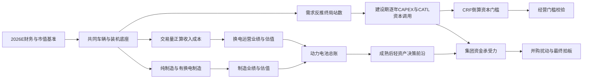

# 换电毛估估：战略投入产出与资本循环 v4.1

> 本报告由 `$model_name` 自动生成。外部参数集中在 `configs/base.toml`，正文数字来自 `outputs/decision_snapshot_v4_1.json`；模板不保存业务结果数字。报告按“问题—方法—参数—推导—判断—质疑—拍板”组织，可以脱离 Python 独立阅读。

### 版本历史

| 版本 | 定位 | 关键变化 |
|---|---|---|
| v3.2（旧报告沿称） | 完整方法链与第一版战略总表 | 保留为历史基准，不改写 |
| v4.0 | 模块化程序与自动报告首版 | 建立规模、CAPEX、经营、总账、轻资产、集团资金、并购七条程序链 |
| v4.1（本版） | 对 v4.0 的校准修订 | 解释城配87/85.5差异；车辆和频次在终局决策节点保留1位；扣除2025末存量站；重写残值、现金回报、滚动AUM、集团CFO及并购负债口径；补齐可独立审阅的大表 |

### 一页拍板

$executive_summary

本报告回答的是一个战略问题：**宁德时代是否值得在换电的基础设施期下重注；业务跑通后，是否以及做到什么程度的轻资产化，才能在保留数据、标准与技术验证场景控制权的同时，为其他战略重新装填“子弹”？**

研究边界有两条：
- 估值只做到动力电池业务线。储能、AIDC、矿山、软件与AI等仅作为资金需求敞口，不预测其未来利润与市值。
- 并购是扰动项。启源与蔚来站体不预设物理兼容；除非另有技术论证，只计算网络、客户、电池资产、竞争摩擦和市占率协同。

## 方法、口径与关键参数

### 推导主链

### 事实基准与来源

$source_table

### 核心外部参数

$parameter_table

WACC与CRF不是同一个参数：WACC衡量资金现值，CRF衡量项目应交付的年资本回报。把二者设成同一个数，会把经营门槛压低。

### 2026E动力电池比较基准

$baseline_table

这里保留两个互补基准：用H1毛利占比分摊当前A+H市值，回答“当前动力分部约值多少”；用644GWh×价格×净利率×PE，回答“与2030道路电动车制造盘同口径相比是多少”。两者都展示，不混用分母，也不代表对其他业务做了预测。

$baseline_method_gap_table

两种方法的差额只是估算口径差。没有公开证据支持把这几十亿元净利润直接归入电动船舶、eVTOL或机器人，因此本报告不编造归因。

## Part 1　共同规模底座：车、装机与站网

### 1.1 同一车辆底座如何供三条业务链调用

对每个车型、使用场景和年份：
`市场换电车辆 = 电动车数量 × 换电渗透率`
`市场充电车辆 = 电动车数量 ×（1－换电渗透率）`
`CATL换电车辆 = 市场换电车辆 × CATL换电市占率`
`CATL充电车辆 = 市场充电车辆 × CATL充电市占率`
`装机GWh = CATL车辆数 × 单车带电量`

换电与充电渗透率逐场景相加为一，但CATL在两条路线使用不同市占率。由此得到的装机同时供制造、运营和CAPEX模块调用，不在后续重复输入。

本报告采用“节点四舍五入”，而不是“每一步都四舍五入”：年度队列、折现和价格曲线保留计算精度，避免误差逐层放大；在进入终局站网、CAPEX和经营模型前，将各车型累计车辆数与加权频次统一保留小数点后1位。正文金额统一显示到0.1亿元。这样符合“毛估估”的可读性，也不会因为过早取整改变经济关系。

$annual_scale_table

日均换电频次不作为结果参数输入，而由每个场景的日均里程、背电量、余电比例和百公里电耗推导：

`日均频次 = 日均里程 ÷（背电量×可用电量比例÷单位里程电耗）`

$frequency_table

### 1.2 终局站数由需求反推，建设节奏由规划约束

`工位上限 = 营业秒数 ÷ 单次换电秒数`
`能量上限 = 充电功率×营业小时×RTE ÷ 单次净补电量`
`物理上限 = min（工位上限，能量上限）`
`规划能力 = 外生运营假设，并校验不得超过物理上限`
`终局站数 = 向上取整（2030累计换电车队日需求 ÷ 规划能力）`

$station_demand_table

这里刻意区分“站数”和“时间”：站数仍由本模型的车辆需求反推；时间上按换电站先行处理，2026先达到已披露里程碑，模型所需终局站数在2028年完成，2029—2030不再安排新增站体。

### 1.3 为什么车辆看起来没变，站数仍会变化

站数只可能被三个量改变：`CATL换电车辆数 × 日均换电频次 ÷ 单站规划能力`。本轮并没有让启源收购进入这条基准链：启源已摘牌的现金对价进入集团资金表，但在“业务尚未整合”的基准情景里，`重卡市占率协同=0`、`物理复用站数=0`。因此，启源不会改变基准车辆数、日需求或站数；它只在Part 7的并购情景中作为扰动项。

$station_reconciliation_table

结论很明确：

- 重卡车辆和加权频次在终局节点分别显示38.0万辆、1.8次/日，反推站数应与旧版3,563座对齐；它没有因启源收购而增加。2025既有0.7万辆CATL换电重卡在新旧主链中都应存在。
- 城配旧版87万辆并不是另一套市场规模，也不是把1.266当成2025存量；1.266是日均换电频次。87来自旧表先把`1,500÷8×30%=56.25万辆/年`取整成57万辆，再继续乘5年、76%、50%、80%，得到86.64并显示87。若保留原始56.25到车型终局节点，则是85.5万辆。本版采用后者，再统一保留1位；这属于修正过早取整，不是改动汽车总量。
- 巧克力站相应变化还叠加了出租、网约、Robotaxi和私家各自的终局节点取整；完整链见上表，不再把展示值重新投入计算。
- 巧克力300次/日仍是毛估估的外生规划能力，不是由所谓“1.84倍设计冗余”严格倒算出来的工程参数。程序只验证300低于物理上限，不再让倒算出来的冗余度伪装成输入依据。

### 1.4 站数如何传导到CAPEX、EBITDA和估值

在车辆和换电需求固定时，增加站数不会增加换电服务收入、车端电池租金或按换电次数计的人工成本；这些项目都由车辆与交易量驱动。站数只沿下面的链传导：

`站数 → 站体CAPEX + 站内周转电池CAPEX → 全周期资本与项目债务`

`站数 → 外部权益站内电池租金 + 站内电池峰谷套利收入 − 单站场租 → EBITDA的站级变化`

`CATL运营价值变化 =（EBITDA变化×EV/EBITDA − 全周期资本变化×债务比例）×CATL权益`

以下先按每1,000座展示单元传导，再把v3.2与v4.1的站数差异代入。它是“车辆需求固定”的一阶归因表，专门回答站数本身的影响，不把车辆、频次、价格等其他变化混进来。

$station_unit_impact_table
$station_delta_impact_table

这也解释了“同样增加1,000座站，骐骥EBITDA为正、巧克力为负”的表面反差：骐骥单站配置24×171kWh，站内电池租金和峰谷套利足以覆盖30万元场租；巧克力单站只有14×56kWh，固定场租高于这两项站级收入。服务交易量、车端租金和人工在这个固定需求敏感性里均不变。若取消站内外部权益电池租金，两类站都会更弱，因此这一参数已在经营大表中单列，不能隐含。

$scale_memo

## Part 2　投入账：建设期逐年CAPEX与资本峰值

### 2.1 年度资金链

`项目年度CAPEX = 新增车辆电池 + 新增站内周转电池 + 新增站体 + 到期更新净支出`

`到期更新净支出 = 更新电池毛支出－退役电池回收`

`退役电池回收率 = 储能/动力价格比×退役SOH×二手交易折价`

`CATL资本调用 = 项目年度CAPEX ×（1－项目债务比例）× CATL建设期经济权益`

$capex_table

2029—2030表中仍可能有车辆电池和首轮更新，但新增站数必须为零。这不是继续建网，而是车队放量与早期短寿命电池开始更换。

### 2.2 从年度投入到生命周期资本底座

全周期资本倍数不是配置结果，而是逐次计算：每次重置的“届时买新价格－届时卖旧回收”先按WACC折回批次初装时点，再与初装1相加；观察期末残值率则由届时动力电池价格、储能/动力价格比、末批在役年龄、SOH和二手折价推导。

第15年动力电池价格路径对所有车型相同，但“期末在役的究竟是哪一批电池”不同：3.8年和5.7年寿命在15年内会多次更换，末批电池年龄较轻、SOH较高；10年寿命的末批在役5年、SOH较低。因此，寿命不改变第15年市场价格，却会通过末批年龄改变期末在役批残值。若把第15年所有电池强制设成同一个SOH，才会得到完全相同残值率，但那会忽略更新批次。表中已经把共同价格折、末批年龄和SOH拆开，便于核查。

旧版展示用的EAC倍数经过逐项圆整；本版不把任何倍数或期末残值率作为校准锚，而是保留逐批次现金流精度，仅在报告显示时取整。因此，新旧结果可以接近，但不应为了复现旧表而反向调参。

$capex_summary

等效全周期资本底座用于建立资本回报门槛；建设期逐年现金峰值用于回答会不会挤占集团其他战略。前者是稳态资本要求口径，后者是实际资金时点口径，两者不能互相替代。

“稳态项目债务”按全周期资本底座的目标资本结构计算，用于成熟期估值与利息；“建设期CATL资本调用”只按2026—2030实际发生的初装和首轮更新现金计算。两者不是同一张时点资金表。

$capex_memo

## Part 3　回报账：倒算、正算与制造线

三条回报链分开计算：

1. CAPEX＋CRF倒算的是换电运营必须交付的最低资本回报。
2. 交易量正算的是换电运营在中性价格与成本下能够交付的业绩。
3. 制造线计算纯制造和加入换电后的电池销售利润。

第一、第二条互为校验，不能相加；第三条与换电运营线在Part 4合并。

### 3.1 CAPEX＋CRF倒算门槛

$required_ebitda_table

### 3.2 换电经营正算完整链

$operating_table

上表刻意把换电量、服务单价、可收租装机量和租金单价放在收入结果之前。租金资产分成两层：车辆端在运电池全部计租；站内周转电池只对外部股东对应的60%计租，CATL自身40%权益不对合并项目虚构内部租金。这样既恢复v3.2修订后的经济口径，也能清楚解释站数对EBITDA的边际影响。

### 3.3 制造线

$manufacturing_table

无换电纯制造情景虽然业绩缩水，仍暂用20×PE，并不是认为萎缩制造业务天然应得高估值，而是先假设市场仍会把宁德时代作为“动力制造＋储能＋AIDC等高增长场景”的组合来定价，动力制造在分部估算中分享了集团成长溢价。这是中性比较锚，不是对储能和AIDC单独做2030盈利预测；若未来这些业务不能提供增长支撑，20×需要下修。

$business_memo

## Part 4　动力电池总账：现在、2030纯制造与2030有换电

### 4.1 两条线合并

`有换电动力电池归母净利润 = 有换电制造归母净利润 + CATL换电运营归母净利润`

`有换电动力电池价值 = 有换电制造价值 + CATL换电运营权益价值`

$power_total_table

这里的“分部加总”只发生在动力电池内部：制造用PE，运营用EV/EBITDA。没有加入任何对储能、AIDC或其他集团业务的2030预测。

### 4.2 有换电相对纯制造的完整增量桥

$bridge_table

“制造销量/市占率差”单列为完整情景差额，但不计入可归因换电主值。可归因主值只认领两项：本报告已建模道路电动车制造盘的利润率保护，以及换电直接运营价值。电动船舶、eVTOL、机器人等未建立规模底座的用途不进入制造总账，留待专项研究。

### 4.3 对当前宁德时代意味着什么

$current_comparison_table
ROI需要分层读：CRF是项目资本要求的收益率锚；“2030前现金调用”回答基础设施期实际消耗多少集团子弹；“全周期权益承诺”把后续更新义务也纳入分母；稳态归母净利润收益率则只看可落到CATL账面的运营利润，不把市值增量当现金回报。四个口径不能混成一个数字。
$cash_return_table
对运营/基础设施业务，更重要的是可分派现金而不是会计净利润收益率。按稳态正算，项目FCFF扣项目利息后形成可分派现金，再按CATL 40%经济权益归属；初装与全周期回收期均较短。再叠加成熟后可滚动发行ABS/REITs，换电不仅是战略防御，也具备可循环的投资型业务属性。这里未计爬坡期，不能把稳态回收期误读成从2026年起的日历回收期。
$ledger_memo
## Part 5　成熟后轻资产：市值、回款与权益的决策前沿
轻资产不绑定具体交易年份。触发条件是：网络和车辆已经形成稳定现金流、资产可独立评估、治理协议能保证数据和标准控制权。2030可以成熟，也可能更晚；本报告不把战术执行年份写死。
### 5.1 三层价值分别怎么估
$valuation_method_table
$valuation_comparable_table
$valuation_note
### 5.2 资管平台价值的推导
$manager_table
$manager_ramp_table
中国当前ABS与公募REITs市场的年度承接量有限，而换电资产终局规模很大。基准估值因此把“已确认AUM”设为零：尚未发行、仍在CATL或项目公司表内的资产不产生资管平台价值。200/500/1,000亿元只是滚动发行后的向上情景，并且500—700亿元约等于现阶段研究对3—5年可承接ABS+REITs规模的毛估区间，不能在交易第一天把全部可出表资产一次性当作AUM。
### 5.3 轻资产交易链
$light_formula
$light_transaction_table
### 5.4 决策前沿
$light_decision_table
$profit_retention_note
$light_conclusion
$light_memo
## Part 6　集团资金承受力：现有子弹、固定回报与未决敞口
### 6.1 资金表如何读
$funding_method_note
$historical_cfo_table
$funding_table
“其他战略动作前期末液态资产”尚未扣除没有明确金额和时点的固态、储能/AIDC、软件AI等项目，因此它是战略动作前的可用上限，不是自由现金承诺。“预留给其他战略项目的资金储备”则是在此基础上再扣流动性底线，直白表示还能为未决战略保留多少资金池。
### 6.2 已披露或已识别的资本事项
$commitment_table
$commitment_method_note
### 6.3 未决战略资金敞口：只作压力刻度
$exposure_table
“若全部新建所需投入”是普通投资者口径；考虑现有液态产线、厂房和公用工程可复用后，才得到“仍需新增资金”。这些金额是情景参数，不替代后续对固态、储能和AIDC逐条线的专项研究。
### 6.4 成熟后出表能给其他战略补多少血
$light_support_table
$funding_memo
## Part 7　并购扰动：启源与蔚来怎么接入投入产出
### 7.1 先把蔚来资产底座拍清楚
$nio_fact_table
$nio_method_note
### 7.2 收购价款与后续资本调用是两笔钱
- 收购现金：买入已经存在的权益、站网或电池银行，加整合成本。
- 项目端承接负债：资产仍由原项目主体持有时，原则上由项目现金流续作和偿付，不等于CATL交易日现金，也不自动等于CATL新增资本负担；只有存在追索、担保、增信或到期必须注资时才转化为集团现金压力。
- 剩余自建资本调用：为实现本模型2030规模仍需投入的车辆、站内电池和站网权益资本。
$mna_input_table
上表以“纯自建CATL资本调用”为统一分母：买入存量资产能节省多少自建现金，交易本身又需要多少现金，两者相抵才是收购相对纯自建的集团现金增量。收购后剩余自建资本调用也可能增加，因为模型把网络协同转成更高的CATL换电市占率，服务车辆和电池需求随之上升；当前没有假设买来的异构站体可直接抵扣新建站。
$mna_debt_table
### 7.3 从收购到动力电池价值的传导
`买入存量网络/电池资产 → 布局提前与市占率协同 → 换电运营价值增量 + 制造利润保护增量 → 可归因换电价值增量 → 动力电池业务线增量`
$mna_bridge_table
“收购资产参考价值”是把现金换成动力电池线内的存量资产，本身不等于价值创造；“扣现金后股东价值创造”才把协同价值、买入资产和现金流出放在同一口径。启源与蔚来站体物理复用仍为零，待技术兼容性另行论证。
## Part 8　提交拍板：各模块先下判断，再做总决策
$memo_table
$final_conclusion
## 附录A　v3.2主链与v4.1当前参数全量核对
对照对象是旧报告主文的有效计算链。该文件名仍为v3.0、页首已迭代到v3.4，用户讨论中沿称“v3.2”；旧文内部若出现主文与附录/变更记录冲突，本表明确写出，并以正文方法论与经济含义一致性为裁决依据。下表覆盖所有进入车辆、站网、CAPEX、经营、制造、估值、资金、轻资产和并购主链的数值参数；纯文本标签和来源URL不属于数值参数，未重复罗列。
$v32_audit_table
### A.1 参数变化最终落到哪些拍板结果
$v32_outcome_audit_table
## 计算审计与Dashboard接口
- 纯外部参数只保存在 `configs/base.toml`；模块间传递对象，不复制派生结果。
- 报告结果、JSON快照和Dashboard参数注册表由同一次运行生成。
- CRF门槛链与经营正算链不相加；两者只做覆盖校验。
- 未来集团其他业务不做2030估值预测；只保留当前集团市值作为换电贡献的比较分母。
- 轻资产先比较持续动力价值损失，再看回款和资本释放；不再用任意权重评分直接选择某一档权益。
- Dashboard可以改变参数并展示决策变化，但不能取代本报告的方法与推导链。