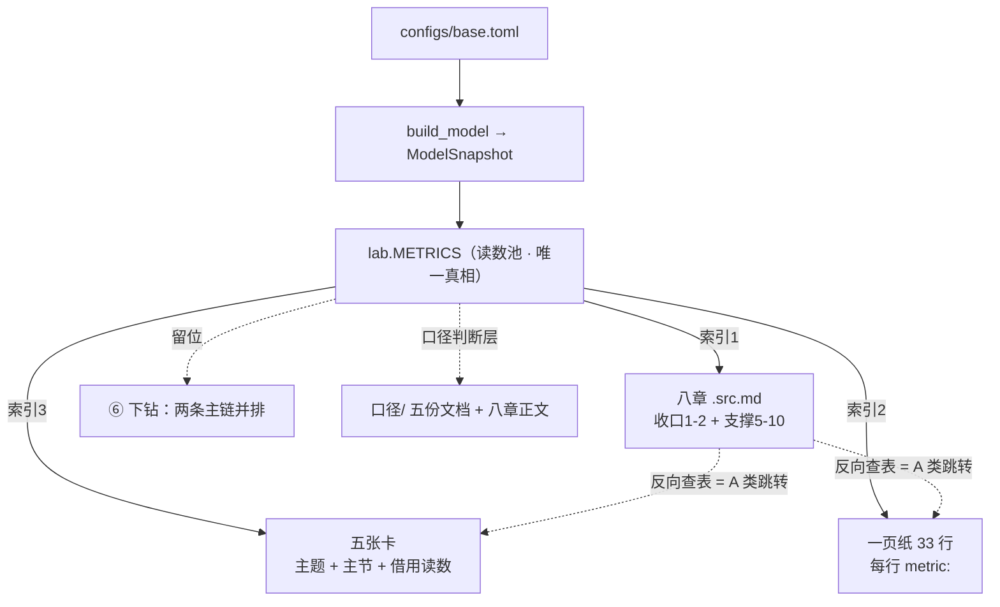

# prompt

我对宁德时代换电业务投资价值的研究素材基本上已经齐了，不论是定性分析，还是定量测算，沉淀在 `D:\AI\证券投资\投研\能源\宁德时代`，现在就需要把它们组装起来。
最后的目标有两个：
1. 能出一份报告，如果能让出报告的流程自动化更好，比如如何提问、如何探索、如何整理分析资料等等。
2. 能把中间的方法论沉淀成 skill和agent，用来做“非共识投资”这种主题的后续研究。

希望你能在 `D:\AI\证券投资\投研\能源\宁德时代\业务\换电\定量计算\换电战略决策模型_v4_3` 基础上迭代，其中 `交接.md` 第32行对第4份文件的诊断缺失需要补上，第25-37行列示的是在研究过程不同阶段已经写出来的报告，你需要再针对本次最终的目标和现状做一次全方位诊断，看`框架提案.md` `交接.md` 给的方案是否合理，需要怎么做调整才能用最快速度做完，请你给出分析，我希望能在路径清晰后再启动正式工作，并且是你主做、我审核的高效协作方式。

# 当前进度：[5. hy4 报告骨架方案 -20260911](#5-hy4-报告骨架方案---20260911)

# 1. reply-claude-20260907 7:00pm UTC+8 （已过时） 

已经把仓库和引擎都实跑过一遍了。先给诊断，路径清楚了再动手。

---

## 一、先补上 `交接.md` 第 32 行：文件 4 的诊断

`定性分析/宁德时代换电战略推演_七层框架.md`（63 KB，L-1→L6 八层）

| 长处 | 短处 / 定位 |
|---|---|
| **六份里唯一一份完整的「判断流程」而不是「判断结论」**：问题界定→需求原点→产业结构→战略必要性→能力圈与财务→合作方博弈→挑战→终局双轨。**每条判断都带「确定性等级＋时间有效期＋更新触发条件」三个元数据**；L3 能力圈 8 维度、L4「站在合作方角度算账」是现成的**能力门／博弈门**框架来源 | 建在**十万站／私家车**的旧定义域上，**全部数字作废**（09-05g）；L6 用**概率期望值**（30/45/25%）——与已定的"相变型不报期望值、给双峰赔率""不给概率、给一定不成的条件＋逼近度"**直接冲突**；必要性论证是"不做则标准定义权旁落"的**竞争威胁式**，不是已定的**防守反击**；决策主体是 **CATL 自己**，不是投资人。**只继承框架与那三个元数据字段，不继承任何数字与结论形态** |

那三个元数据字段是它真正的独家贡献，下面第三节会讲它为什么重要。

---

## 二、机器体检：引擎是好的，问题不在这儿

我把仓库整个复制到沙箱跑了一遍（没动你的文件）：

| 命令 | 结果 | 耗时 |
|---|---|---|
| `run.py` | 通过，最终判断"支持重注" | 0.6 s |
| `build.py` | 三步全过，13 份专题零裸数字 | 0.6 s |
| `tree.py` | **166 节点 / 57 个可校验内部节点，三情景全部自洽** | 1.2 s |

**结论：`交接.md` 第四节说"零件基本都造好了、主要工作在接缝"是准确的。** 引擎不但能跑，而且快到可以塞进任何循环里——这一点后面有用。

（一个环境事实：`config_loader.py` 依赖 `tomllib`，需要 Python ≥ 3.11。你机器上是 3.11/3.14，没问题。）

---

## 三、四处结构性发现

### 发现 1（最重要）· 裸数字 lint 是**不等式**，不是恒等式——你自己的纪律没用在自己身上

你的踩坑清单·方法类第一条写着：

> **断言写成恒等式，不要写成不等式。`≤` 型只能证伪不能证实。**

`build.py` 的裸数字 lint 正是 `≤` 型：它检验"叙述层**没有**脱钩的数"，不检验"叙述层**有没有接上**数。**一份一个数字都不写的文件，能以满分通过。**

实测：

| | 数量 |
|---|---:|
| `facts.json` 事实条数 | 113 |
| 被叙述层引用的 | **23** |
| **孤儿事实** | **90（79.6%）** |
| 13 份专题中**引用事实数为 0** 的 | **10 份** |

最刺眼的两份：

- `增量价值_运营单体加制造影响` —— 框架提案 §1.5 明写"它的真正产出不是结构图三个字，**是一个数：合并净影响**"。**实际引用 0 个事实。**
- `赔率与跟踪_从世界A到世界B` —— 收口是"地板/天花板/今天离 A 多远"，**三个都是数**。**实际引用 0 个事实。**

这改写了 §5.0 的病因诊断。5.0 说根因是"输出侧一直是空的"——对，但更深一层是：**唯一在工作的那个反馈环是单侧的，所以它在 09-06 就该报警的地方保持了绿灯。** 你不是缺反馈环，你是有一个**只能证伪、不能证实**的环，于是"写了 13 份与模型无关的专题"这件事，机械上根本发现不了，只能等人发现。

**恒等式版本**（机械可判，10 行代码）：
```
每份 .src.md 的引用事实数 ≥ 1，否则失败并说明"这份文件与模型无连接"
每条 fact 要么被引用，要么在 facts.py 里显式标 exempt（并写一句为什么）
输出一张覆盖率表：章/专题 × 引用事实数
```
这一条进 `build.py` 之后，"章还没写"和"章写了但没接上"都会自己喊出来，不需要你当验证器。

### 发现 2 · 第 6 步滑块被放在了闸门位置，但它验的不是报告那条链

`交接.md` §5.3 开头："**只有第 6 步验收通过，才动下面任何一条。**"

但这两条链不是同一条：

```
报告链：  base.toml → 计算 → facts.json → 占位符 → 正文        ← 第 5 步已经全验完
交互链：  facts.json → JS 插值 → DOM 红绿标记                   ← 第 6 步验的是这条
```

第 5 步（3B 经济门一节，三个数全部注入）**已经端到端穿过了 L0–L4 里报告需要的全部层**。第 6 步加验的是交互层——它对应的是 1.2 表里"交互要用上文件 6 那种方式"这个**加分项**，不是投资判断的任何一环。

而它同时是六步里**最贵、最容易卡住**的一步（新建 HTML、弹性插值、事件绑定）。把整个 5.3（八章报告的全部）挂在它后面，等于**让一个演示挡住主线**。

另外，滑块的成本几乎与它驱动的参数个数无关：为 1 个数做和为 20 个数做，工作量差不多。**推迟它不但解阻塞，还更省。**

### 发现 3 · 5.3 的横向铺开是九步串行，而八章之间是有向图不是链

5.3 的九步每步都要走一遍协作协议四步（说明→你拍板→改→你 diff）。按 `DECISIONS.md` 的实际节奏，这是几周。

更关键的是，**逐章推进在方法上也不比一次成稿更能验证**。你自己的骨架就说：第 1 章依赖第 5 章的双峰赔率、第 0 章是摘要最后写、头尾六问必须是同一串问句。**这是一个依赖图，图的自洽性没法一个节点一个节点地验。** 写完第 2 章你只知道第 2 章内部通顺，不知道它和第 5 章会不会打架。

同时——**一次写完八章不违反 §5.0 的纪律**。5.0 反对的是"输入侧无反馈地横向铺"（参数、口径、专题）。八章正文是**输出侧**，写得越多，能反过来打我的东西越多，不是越少。

### 发现 4 · 三个具体的地基缺口

| # | 缺口 | 证据 | 影响 |
|---|---|---|---|
| a | **仓库不在 git 下** | `git status` → `fatal: not a git repository`（一路查到挂载点） | 协作协议第 4 步（你 `git diff` 逐行看）**现在根本执行不了**。"我主做、你审核"的审核动作没有载体 |
| b | **`README.md` 自己在手写模型数字，而且已经漂了** | README §七写 `105 节点 / 38 个内部节点 / 隐含 6.67× / 押注 3,855.4 亿`；实跑是 `166 / 57`，交接 §4.2 是 `7.98× / 3,407.9 亿` | 裸数字纪律只管住了 `narrative/`，没管住**纲领层**。这是 5.0.1 那张"一件事两个家"表的第七行 |
| c | **`交接.md` §5.2 与 `框架提案.md` §4.1 是同一张表写了两遍** | 六步表、专题定稿判据、代码坑分期，三处逐字重复 | 09-06g 已经因为这个瘦身过一次，又长回来了。按你自己的目标态/当前态分工：**顺序归框架提案，进度归交接**，交接那张表该退化成"指针＋进度列" |

**c 顺带解释了一件事**：为什么"纪律登记表"会越长越长。同一条纪律住在两个文件里，两边都要维护，于是维护成本靠"再加一条纪律"来补偿——这正是 5.0 说的"没有反馈的系统只能靠增加前馈补偿"，只不过它发生在文档治理层，而不是模型层。

---

## 四、对现有方案的裁决

**总判：`框架提案.md` 与 `交接.md` 的方案是对的，我不推翻主线。** §5.0 的开环诊断、"最窄端到端"的选法、"skill 从跑通的流程里长出来"、"一件事一个家"——这四条我全部保留。要改的是三处**排程**，不是判断。

| 条目 | 裁决 |
|---|---|
| §5.0 开环诊断、5.1 选 3B 经济门做走通骨架 | **留**，选得准（由数收口、三个数都是数、专题依赖最少） |
| §5.2 第 1、2 步（三情景一个家／两版互校） | **留**，马上做，无争议 |
| §5.2 第 3、4、5 步（门的形状／`gate.*`／写一节） | **留**，这是真正的走通骨架 |
| §5.2 第 6 步滑块作为闸门 | **改**：降级为并行支线，挪到装配期。闸门改为第 5 步 |
| §5.3 九步串行横向铺开 | **改**：3B 补齐 + 八章**一次成稿**，然后整本硬化 |
| §5.3 第 9 项 skill 全部最后做 | **改**：skill 1（非共识标的诊断）**现在并行写**——它是三个里唯一不依赖管线的（你自己的迁移列写的就是"几乎不改"）；skill 2/3 仍然等跑通 |
| §6 沉淀形态"三 skill ＋ 一个反方审稿 subagent"，等跑通再写 | **改**：**反方审稿 subagent 提前到写章之前**。5.0 说"只有你一个人在做验证器"——这个 agent 就是第二个验证器。它先审我的稿再给你，你的审核时间才花在判断上而不是抓错上。这直接对应你要的"我主做、你审核" |
| §4.3 第 8 项装配 `report.html` | **留**在后段，但它是"能出一份报告"的必要条件，不能再往后挪 |

---

## 五、重排后的路线：四阶段，约 6–8 个审核轮次

> 原则不变：**先让一条最窄的路端到端通，再横向铺**。改的只是"闸门放在哪"和"横向那一段怎么切"。

**Phase 0 · 装地基**（1 轮）
git 初始化＋基线提交 → 覆盖率 lint 进 `build.py`（发现 1）→ 修 §5.2 第 1、2 步 → 交接第 32 行补上 → 三份纲领去重（发现 4b/4c）
　*验收*：`build.py` 绿 ＋ 打印覆盖率表 ＋ `git log` 有基线

**Phase 1 · 打通一条线**（1 轮）
§5.2 第 3、4、5 步：门的形状 → `gate.*` 事实键 → `3B_可行性.src.md` 经济门一节
　*验收*：产物里出现一句带数判断，**三个数全部来自注入**；覆盖率表显示 3B 章引用 ≥ 3 个事实。**这一步过了就开闸**

**Phase 2 · 八章一次成稿**（2–3 轮）
先建反方审稿 subagent → 按依赖顺序一口气写：3B 另四门 → 2 → 3A → 4 → 5 → 1 → 6 → 0 → 7。每章收口必须落在注入的数上；**写不出收口数的章，当场标"缺哪条事实"回头补 `facts.py`，不许硬写**。红队先审，再交你
　*验收*：八章齐全 ＋ `build.py` 绿 ＋ 覆盖率达标 ＋ 一份红队报告

**Phase 3 · 装配与交互**（1–2 轮）
`report.html` 薄容器 → 服务费滑块 → 树下钻打通
　*验收*：框架提案 §7 那四条完工标准

**Phase 4 · 沉淀**（1 轮，从 Phase 2 起并行）
skill 1 现在写 → skill 2/3 ＋ 反方审稿 agent 在 Phase 3 后定稿 → 拿储能或 AIDC 做一次**B 型验收**（喂一个普通业务拓展，它必须判成 B 并拒绝给双峰赔率）
　既有素材要并进来不要重写：根目录 `提问skill.md`、`_方法论索引/`、44 条 `→skill:` 标记

---

## 六、发现 1 的一个副产品，值得单独说

文件 4 的那三个元数据字段（**确定性等级 / 时间有效期 / 更新触发条件**），正好补上你现在缺的那一半。

`facts.py` 的 `watch` 阈值是**数值判断**的复核机制——数动超阈值，引用它的段落自动标"待复核"。但**定性判断目前没有等价物**：一条"竞争格局是三足鼎立"的判断放三个月，没有任何机制提醒它该复核了。

把那三个字段做成 `narrative/**` 每份文件头的必填项，`build.py` 检查"有没有超期未复核的判断"——这又是一个**机械可判**的环，符合你自己那条"只有做成机械可判的环才会真的被跑"。**这是文件 4 唯一值得继承进 skill 的东西，也是六份参考文件里唯一没被 v4_3 吸收的机制。**

---

## 七、待你拍板

方案说完了，按协作协议第 2 步，四件事需要你说过／停／改。

# 2. hy4 对 Claude 的分析 - 20260907 8pm UTC+8（已过时）

先核三条可查的事实，再评。

## 零、我先核了他给的四个可查事实

| 他的论断 | 实测 | 判定 |
|---|---|---|
| `facts.json` 113 条，叙述层只引用 23 条 | 113 条；被引用 **24** 条，孤儿 **89** | ✅ 准（差 1，计数口径问题） |
| 13 份专题里 **10 份引用为 0** | 确实 10 份为 0；只有 `估值`(14)、`目标用户`(7)、`业务本质`(2) 三份接上了 | ✅ 准 |
| `增量价值`／`赔率与跟踪` 两份收口是数却引用 0 | 实测均为 0 | ✅ 准，而且**这两份选得极准**——正是"该有数却没数"的那两份 |
| **仓库不在 git 下** | `git rev-parse` → `D:/AI/证券投资`，HEAD = `5c3ccd0`，项目目录内**无嵌套 .git** | ❌ **错**，见下 |

**所以：他的体检部分可信度很高（三条实测全中），但 4a 是事实错误。**

---

## 一、诊断：四条里三条成立，一条是伪发现

**发现 1（覆盖率恒等式）——全篇最值钱，无条件采纳。**
它把"只有你一个人能发现的病"变成了机械可判的：你不是缺反馈环，是有一个**只能证伪不能证实**的环（≤ 型），所以 10 份与模型无关的专题全程绿灯。用它自己踩坑清单第一条（断言写成恒等式）去打它自己的系统，这个论证很难反驳。

**但它的分母选错了，照做会制造第二件要维护的事。** 我拆了 89 条孤儿的构成：

```
sens.*  19  敏感性表 —— 审计用，本就不该进正文
base.*  14  多为输入参数（wacc / debt_ratio / mfg_pe…）
q1/q2/q4 28 + q3 20 + dcf 8  → 等章来点名的结论量
```

而被引用的 24 条里 **16 条是 `ext.*`**（09-06 才建的外部事实命名空间）——**说明专题接上的是外部事实，模型自己算出的数一条都没进过正文。**

后果：他的恒等式是"每条 fact 要么被引用、要么显式 exempt 并写理由"。按这个分母，Phase 0 第一天就要给 `sens` 19 条 + `base` 输入参数 14 条写 **30 多条 exempt 理由** = 一次性输入侧工作，而且 exempt 清单本身又是"第二个家"——**正是他在 4c 里批评的那个病，他会在同一份方案里把它再犯一次。**

> **修法（很小）**：`facts.py` 里给每条 fact 加一个 `role` = `conclusion / input / audit`，**只对 `conclusion` 做全覆盖恒等式**。这样真正在等章的是 40 多条，且 exempt 永远不需要写。

**发现 2（滑块不该当闸门）——一半对，一半错。**
对：交互链 ≠ 报告链，把八章挂在演示后面不合理，闸门该放在第 5 步。
错：他把滑块定性成"加分项/演示"是纯工程视角。对你来说它是**唯一一个 5 秒内能反复自证的东西**——拖一下，报告里的数变了、`.src.md` 一个字没改。你现在对这个系统（configs/src/outputs 三件套）的不信任感，恰恰只能靠这个动作消解，不能靠"build.py 绿了"。
> 建议：**不当开八章的闸门**（同意他），但也**别压到 Phase 3**。放在 Phase 1 之后紧跟着做，成本一样，但它早做一次，能省掉后面八章里无数次"这个数你确定注入对了吗"的肉眼核对。

**发现 3（八章一次成稿）——我反对，这是全篇风险最大的一条。**
他的论证"八章是输出侧，写得越多反馈越多"——区分本身聪明，但**混淆了"反馈的量"和"反馈的可判定性"**：

1. **他的依赖图论证指向相反的结论。**他说"写完第 2 章不知道和第 5 章打不打架"——但第 5 章还没写的时候，"打架"这件事本来就不该在第 2 章判，等写到第 5 章判一次即可。依赖图要求的恰恰是**按拓扑序推进**，不是一次性全写。一次成稿把"发现打架"的时点**从写第 5 章时推迟到八章都写完时**，更贵不是更省。
2. **它会击穿你 09-07 刚定的那条判断**（"不再横向铺，先走最窄的端到端"）。那条的意义不在"少写"，在"让反馈小到你能判"。一次八章 = 一轮几万字，你一个人审，实际会退化成签字——**正是你最担心的"AI 主做、我审核"变成"AI 全做、我确认"**。
3. **它规模化了你最怕的那个错误形态**：章与章互相引用为信源 → 循环论证（你 09-06 定过"素材之间不能互相引用为信源"）。一次成稿时，谁是先验、谁是推导的界线最模糊。

> **折中：按依赖簇分批，簇内一次成稿，簇间设闸门。**
> `{3B, 2, 3A}` → `{4, 5}` → `{1, 6, 0, 7}`
> 同一簇内部可以互相校准（拿到他要的"图内自洽"），簇间仍可判定。

**发现 4b/4c——成立，且 4b 的治法他没说全。**
README 手写 `105 节点 / 38 内部 / 6.67× / 3,855.4 亿` 已漂到 `166 / 57 / 7.98× / 3,407.9 亿`：成立。**但修法不是把数字改对**——那是又造一个需要手工同步的家。治法跟 `facts.json` 一样：**改成占位符或删掉**。
4c 的判据（顺序归框架提案、进度归交接）正确，直接用。

**发现 4a——伪发现，而且照做会踩坑。**
他第二节自己写了"我把仓库整个复制到沙箱跑了一遍"。**`fatal: not a git repository` 是他复制目录脱离外层仓库造成的，不是你的现状。** 你这边 git 是好的（HEAD `5c3ccd0`，`git diff` 逐行看这个动作一直在用）。
⚠️ **如果他照这条执行 `git init`，会在 `换电战略决策模型_v4_3/` 下建一个嵌套仓库——那正是你自己踩坑清单里那条"一个目录只能有一个 .git，不能嵌套"。** 这条必须回绝，并要求他区分"沙箱环境事实"和"你的环境事实"。

---

## 二、方案：裁决表我改三处

| 他的裁决 | 我的意见 |
|---|---|
| §5.0 开环诊断、选 3B 经济门 | **过**。选得准 |
| §5.2 第 1、2 步（三情景一个家／两版互校） | **过**，机械、无争议 |
| §5.2 第 3–5 步（门的形状／`gate.*`／写一节） | **过**。但先定死门的**五字段契约**（各自的类型与来源）再写实现，否则"翻转参数"在 `base.toml` 里是分情景的，二分 solve 会又变成一处没有第二个家的声明 |
| 滑块降级为并行支线、挪到装配期 | **改**：降级同意（不做闸门），但**提前到 Phase 1 之后**，不要压到最后 |
| 八章一次成稿 | **改**：按依赖簇分三批 |
| 反方审稿 subagent 提前到写章之前 | **方向过，但要先补一样东西**（见下） |
| skill 1 现在并行写 | **过**。理由比他给的更硬：判断流程（七层框架＋这半年 DECISIONS）已经跑通了，它本来就不依赖管线 |
| Phase 0 一轮塞 4 件事 | **改**：违反你自己"一次交付只改一个关注点"的硬约束，拆成 2–3 轮 |

**红队 agent 缺的那一样**：它的审稿标准从哪来？如果没有一份**机械检查清单**，subagent 只会用同一套前提再写一遍、得出同样结论——变成第二个生成者，不是第二个验证器。
> 先定义清单，再建 agent。清单里至少四条：① 每个数有没有可点击的外部信源 ② 是外部信源还是经验假设（必须标注） ③ 有没有章/专题互相引用为信源 ④ 先行指标有没有标推/拉。

**第六节（三元数据必填）——好，但要防副作用。**
"确定性等级／时间有效期／更新触发条件"做成文件头必填 + `build.py` 查超期，确实补上了定性判断没有复核机制这个真空（这是文件 4 唯一值得继承的东西，他说对了）。
但两个限制：① **只对 `chapters/**` 强制**，`topics/` 不强制，否则它变成第二张"纪律登记表"——你 09-07 刚把那张表重新定位成症状；② **"更新触发条件"必须是可观察事件**（"某合作方官宣 X"），不能是"情况变化时"——后者是永不为真的字段。

---

## 三、他漏掉的一条（我认为比他提的四条都要紧）

整篇方案**没有任何一条防线管"信源"**。而 Phase 2 一次写八章，正是循环论证最容易规模化的形态。

> 必须在 Phase 0 的 lint 里同时加：
> ① 每条数值 fact 必须带 `source`，且是**外部可点击链接**；
> ② **章与章、专题与专题之间不得互相作为信源**（只允许指向 `facts.json` 或外部）；
> ③ 分母类数字（销量/保有量）如果不是外部独立信源，直接标红。

这条不做，八章写得越快，回头拆雷越贵。

---

## 四、总判

**诊断价值高、方案排程有害。** 他做对了两件事：找到"只能证伪的环"这个真病因（发现 1），以及把"输出侧 ≠ 输入侧"这个区分说清楚（发现 3 的前提）。但他从"八章是输出侧"推出的"所以可以一次写完"是**把 5.0 的诊断用反了**——5.0 要的是最小可判定，不是最小工作量。

一处事实错误（4a，且照做会踩嵌套 git 的坑）、一处分母错误（覆盖率把输入参数与审计量算进孤儿）、一处漏防（信源与循环引用）。**这三处修掉，这份方案可以用。**

他第七节"待你拍板"被截断了——如果你要，我可以按上面这版替你拟成给他的四条 `过/停/改` 回复原文。

---

# 3. hy4 更新快速闭环方案 - 20260907 12pm UTC+8（已完成）

## 一、前面方案的问题：诊断都对，救法都落在"报告优先"范式里

前面两版（Claude 初版、hy4 复审）共享一个未言明的假设——**价值在报告里、验证在报告后**。这才是要改的根。

### 1.1 Claude 初版（2026-08-07）：诊断四条都对，但救法是"把报告做出来"

诊断（至今成立）：
- **发现 1 · 裸数字 lint 是 ≤ 型（只能证伪不能证实）**：一份零引用的专题能满分过。修法是改成恒等式（每条 fact 被引或显式 exempt）。
- **发现 2 · 滑块被放成闸门，但它验的是交互链不是报告链**：把八章挂在一个演示后面不合理。
- **发现 3 · 八章是有向图不是链**：逐章推进不比一次成稿更能验证。
- **发现 4 · 三个地基缺口**：git 初始化、README 手写数字已漂、顺序表在框架提案/交接写了两遍。

**但救法仍卡在"报告"**：它把方案排成 Phase 0–4、八章一次成稿、闸门在第 5 步、skill 从管线长出来。本质是"先把地基打好、再出报告"，从没问一个更短的问题——**最快怎么让你（用户）相信程序跑通了、定性逻辑进代码了？** 那一版默认"出报告"才是交付物。

### 1.2 hy4 复审（2026-09-07）：改进了排程，仍在同一范式

hy4 把方案往"可判定"方向推了一把，并纠了三个真错：
- 覆盖率恒等式的**分母错了**——应给每条 fact 加 `role=conclusion/input/audit`，只对 conclusion 做全覆盖，否则要给 sens/base 写几十条 exempt（又造第二个家）。
- **4a 是伪发现**：`fatal: not a git repository` 是 Claude 把目录复制到沙箱脱离外层仓库造成的；你这边 git 好好的（HEAD `5c3ccd0`），照做会建嵌套仓库踩坑。
- **漏了信源防线**：lint 必须加"数值 fact 带外部可点击信源 / 章专题互不引用为信源 / 分母类须外部独立信源"。
- 还把八章改成**依赖簇分批**（{3B,2,3A}→{4,5}→{1,6,0,7}）、滑块提前到 Phase1 后、红队清单先于 agent。

**但 hy4 仍没跳出"报告优先"**：它的全部精力在"八章怎么切、闸门放哪、清单有几条"，默认目标态还是"一份硬化过的八章报告"。

### 1.3 两版共同的盲区（这才是要改的根）

闭环速度最快的，不是写详细报告，而是**能从数据一眼看出：① 程序跑通了没、② 定性分析逻辑有没有反映在程序逻辑上**。这两件事都不需要八章报告，只需要一张**可口算校验的"一页纸"**：终端数字你能拿脑子里的量级和定性判断去对（"营运车是基本盘、NEV 渗透是摆动项"），拨一下轴数就变、`.src.md` 一字不改。前面两版把"地基/报告"当前提，等于把最快的验证环推到了最后。

> 顺带：DECISIONS 09-02「三情景名不副实」就是这盲区的症状——当初"三情景"只拨了私家车一档、其余恒定，本质是还没一页纸就先搭了报告骨架，于是情景成了装饰。

---

## 二、全新方案：以终为始，先出"一页纸"，情景与敏感性是给它做的准备

### 2.1 "一页纸"是什么

一张（或一小簇）你能**拿心算校验**的结果页，须同时满足三点：
1. **每个终端数字可被口算对**：量级对得上你脑子里的定性判断；
2. **能拨动看数变**：拨一个情景轴，报告数字变、源文件不动——这是你对"configs/src/outputs 三件套"信任感的唯一来源；
3. **定性逻辑可见**：哪些杠杆真能动结果、哪些只是装饰，一眼能辨。

这三点的合取，就是"程序跑通 + 定性逻辑进代码"的机械可判近似。比"build.py 绿了"强：绿只证明跑通，不证明逻辑对。

**2026-09-09 落地**：一页纸的 17 行核心指标＋四列判断已**并入沙盘 HTML**
（`onepager.payload()` 注入，与 xlsx 同源）。于是 ①③ 由「结论校验 · 一页纸」区块承载、
② 由沙盘拨动承载，**三点在同一屏成立**，不必在 xlsx 与 html 之间跳读。
xlsx 保留为可存档/可导出的产物，但不再是决策主界面——Excel 在 IDE 里不能直接看结果。

### 2.2 三个使能件（都是为一页纸服务的，不是终产品）

- **① 情景轴一个家（`[drivers]`）**：轴散落时你没法快速拨；收口后加一个轴只改一处、代码零改动，拨一下就出数。这是一页纸"能拨动"的前提。
- **② 敏感性扫描（lab）是审计，不是产品**：它的职责是拿"模型自己算出的弹性"去和"你的定性判断"对账——哪些高弹性参数其实是你以为不动的（假轴/漏轴），哪些你当摆动的其实是装饰（弹性≈0）。它本身**不进正文**；落 `outputs/敏感性矩阵_v4.3.csv` 仅供机器审计。**你读得懂的是 xlsx 的 `03_敏感性矩阵`**（`python src/lab.py workbook` 生成，红绿配色、带指标中文名），那张裸 CSV 不是给你看的。
- **③ 参数与血缘 xlsx**：把假设/结果/敏感性/双向血缘做成你熟悉的财务三表样式，是敏感性"可读化"的载体。

### 2.3 闭环顺序被反转

- 旧：地基 → 八章报告 → 装配 → 沉淀。
- 新：**一页纸（情景一个家 + 拨动校验 + 敏感性对账）→ 确认定性逻辑进代码 → 再横向铺八章 / 装配 / 沉淀**。

报告从"前提"降级为"一页纸验证通过后的输出侧"。**你刚做完的情景调整、敏感性分析，都是为了这一页纸做准备的，不是终步骤。**

---

## 三、实施动作与结果（含一次关键纠偏）

### 3.1 步骤 0–2：情景轴一个家（已落地）

- `base.toml` 新增 `[drivers]` 段，4 个驱动因子统一结构（`target`/`pass_as`＋三档＋人话），收口散落的 5 处：删 `service_fee_scenarios_rmb_kwh`、净利率档搬进 `[drivers.mfg_margin]`、`charge_share.scenario` 由 `[drivers.charge_share]` 驱动、私家车渗透率由 `[drivers.private_penetration]` 映射。
- `config_loader` 新增 `load_drivers / apply_scenario`，**中性档断言「档值 == 参数本体」** 防两个家漂移。
- `model.build_scenarios()` 成唯一构建入口；`run / build / tree` 全部按 driver 组合**整体重跑**，不再只拨私家车一档。
- `lab.py` 把 `drivers` 加进 `_SKIP_SECTIONS`（档位声明不污染漏轴审计）；`report.py` 把失效的"差异全来自私家车"结论改为如实标注；`src/README` 坑清单同步。

**验证**：`tree / run / build` 全 rc=0、`facts.json` 三情景一致；中性档严格等于基线；**悲观门首次转红 0.92×**（门槛第一次被踩破）；区间从私家车单轴 **±7%** 拉到 **−53% / +63%**；可归因换电增量 **2,847 / 6,103 / 9,977 亿**。

### 3.2 敏感性扫描：先误判、再纠偏（这步是重点）

跑 `lab scan`（212 参 × 37 指标）。**第一版我误把"高弹性"当"该做轴"**：

| 参数组 | 弹性 | 我当时下的结论 |
|---|---|---|
| `vehicles.heavy/city.*`（保有量/更新周期/换电频次） | +0.5~0.6 | ❌ 误判为"最大漏网轴，应升格为轴" |
| `construction.battery_price_curve.*` | 覆盖倍数 −0.85~−1.45 | ⚠️ 列为次漏网轴 |
| `finance.swap_ev_ebitda / manufacturing_pe` | +1.0~+1.5 | 列为次漏网轴 |
| `swap_business.service_fee_rmb_kwh`（已进轴） | 0.51 | 弹性偏小 |

**你用 domain 判断纠了偏——弹性高 ≠ 该做情景轴，这是扫描的硬边界**：

1. **营运车保有量/更新周期/换电频次是宏观固定量**（由社会交运总需求决定，投资视野内变动幅度不大）→ **不做轴**。扫描的高弹性只说明"它是个大分母"，不是"它会摆动"。**推翻 3.2 第一行的结论**；该弹性的正确用法是：一页纸上必须把它摆出来，让你用外部保有量数据口算校验，而不是当情景杠杆。
2. **NEV 渗透率、换电在 NEV 里的占有率**属技术迭代 → **做轴**（摆动项）。营运车这边摆动的也应是其电动化节奏与换电占有率，不是绝对保有量。
3. **电池价格做敏感性是"精确的错误"**：长期必降、但不会跌破成本，最大障碍在最上游矿产的周期。把它当独立 ±X% 外生冲击，既锚不到可观察触发、又和原材料周期/学习曲线内生耦合 → **不做情景轴**（我的看法见 3.4）。
4. **估值倍数必须进情景轴**：它反映"非共识→共识"过程中的市场激烈程度。`估值_为什么拍这个倍数.md` 给的区间——低 **13**（维持制造倍数，即 CATL 自身 13.0×）、高 **22**（比肩轻资产资管平台型上限）→ **`[drivers.valuation_multiple]` 悲观 13 / 乐观 22**。

### 3.3 修订后的情景轴集（待你定取值信源）

保留原 4 轴（`private_penetration` / `fee_level` / `charge_share` / `mfg_margin`）；按 domain 判断**重排**：
- **加** `valuation_multiple`（13→22，必须）；
- **加** 技术迭代摆动项：整体 NEV 渗透率、换电在 NEV 占有率（含营运车侧的电动化节奏/换电占有率）；
- **移除** "营运车绝对保有量/更新周期/频次"和"电池价格曲线"作为轴的念头（前者宏观固定、后者精确的错误）。

### 3.4 我对"电池价格 = 精确的错误"的看法

同意，并补一句为什么扫描会误导：弹性高是因为电池成本占 CAPEX/度电成本比重大，是**结构权重**高，不是**情景摆动**大。把它当情景轴，等于假设"未来电池价格会 exogenous 地整体 ±X%"，但真实世界里它受矿产周期（上）与规模/工艺学习曲线（下）双向内生约束，没有一个可观察的"触发事件"对应某档取值。

没有触发事件的轴，正是你 09-07 定的"更新触发条件不能是'情况变化时'"那条的变体——**不可观测的轴 = 永不为真的字段**。所以电池价格最多在敏感性表里当 footnote 存在，**不进情景轴**。

### 3.5 代码改动（已落地：`python src/run.py` 一键出全部）

- `src/config_loader.py`：支持 `targets`（同源多参数扇出，可点分路径进列表下标）与 `mode="relative"`（相对基线乘档值）；`load_drivers` 允许 `targets` 并对 relative 中性档断言 1.0。
- `configs/base.toml` `[drivers]`：新增 `valuation_multiple`（13/18/22，target=`finance.swap_ev_ebitda`）与 `commercial_swap_share`（relative，±30% 平移重卡/城配各场景换电渗透率，对应"换电在 NEV 占有率"）。
- `configs/base.toml` `[drivers]`（续）：新增两条车辆规模轴——`commercial_nev_penetration`
  （relative ±15% 平移重卡/城配/出租/网约的 `nev_rates` S 曲线，`cap=1.0`）与 `catl_swap_share`
  （relative ±15% 平移全部场景的 CATL 换电市占，`cap=1.0`）。`config_loader` 相应支持
  relative 对数组**逐元素乘**与 `cap` 上限钳制。
- `src/capex.py`：站数单调钳制。向下摆 NEV 渗透率会让规划站数跌破 2025 年末存量（站是存量、
  不能"拆"），原逻辑直接抛错；改为 `max(存量, 规划)`，基线/乐观档为恒等、不受影响。
- `src/lab.py`：三处口径修正——① **总影响力锚定**在最终投资指标 `val.swap_increment`（换电增量价值），
  不再按"受影响指标个数 / 多指标求和"加总，否则 `rte` 这类成本参数会顺着
  电量→EBITDA→估值 链式传染、被虚高排名（修后 `rte` 从第 1 落到第 7）；
  ② **参数枚举穿透数组**（`scenes` 带下标展开、`nev_rates` 按整条曲线平移）——此前
  `isinstance(node, list): pass` 让场景级与曲线型参数**从未进过扫描**，
  "车辆规模"整条轴一直是隐形的（212 → 272 个参数）；
  ③ 新增**【表 0】轴级敏感性**：把一条轴的全部 targets **一起** +10%，
  补上单参数扫描永远看不到的"整条轴合力"。
- `src/lab.py` + `base.toml [sensitivity]`：新增 `not_adjustable` 不可调事实名单
  （如 `operating_days=350` 是运营事实不是假设），不扫、不进 01 表；
  轴级扫描跳过字符串档位选择器（修掉 `charge_share` "不可算"的假警报——
  它其实是有效的，三档虹吸 −91/−58/−31 亿确实在变）。
- `src/run.py`：接入 `lab.cmd_workbook` / `tree` / `onepager`，现在 `python src/run.py`
  一键产出报告 + 参数与血缘 xlsx + 决策树 xlsx + 一页纸 xlsx；裸 `敏感性矩阵_v4.3.csv` 不再产出。
- **实测**（含新增两条车辆规模轴后）：三情景 可归因换电增量价值 **305 / 6,103 / 16,615 亿**、
  EBITDA 覆盖倍数 **0.92 / 1.14 / 1.32**（悲观门转红）；轴级杠杆 `catl_swap_share` **0.98**、
  `commercial_nev_penetration` **0.68**、`commercial_swap_share` **0.65**——与估值倍数（1.00）
  同量级，坐实车辆规模不是装饰。

### 3.6 待你拍板（回到一页纸）

- 各轴乐观/悲观**取值与信源**：新增两条车辆规模轴现在是 **±15% 骨架值、待你校准**（不是结论）。
  分母类（NEV 渗透率/占有率）须外部独立信源（中汽协/乘联会上险），
  **不得用模型自身推导值自证**；估值倍数 13/22 已锚定 `估值_为什么拍这个倍数.md:38-44`。
- **"NEV 渗透率"已不再是"另议"**：3.5 已把它落成 `commercial_nev_penetration`
  （平移 `nev_rates` S 曲线，`cap=1.0`）。此前担心的"没有干净旋钮"，
  由"数组型参数可扫 + relative 逐元素乘 + cap 钳制"解决了。
- 轴定后：步骤 3（`tree`）与步骤 4（四列 + 一页纸）均已在 3.7 落地。
- **剩下的开放项**：① 永续账 DCF 对照（决定 3.17× 溢价是真押注还是口径差，见 3.7）；
  ② 两条新轴 ±15% 的取值与信源；③ 分母类外部独立信源补齐。
- **目标态始终是一页纸**：拨轴 → 数变 → 你拿心里量级口算对得上 → "定性逻辑进代码"的证据就齐了。报告是之后的事。

### 3.6.1 交互沙盘（`src/sandbox.py`）开发踩坑记录（2026-09-09）

沙盘是"给用户用手拨"的，和"算得对"是两件事。这一路踩的坑，**没有一个是建模错，全是"状态与展示"错**，
且都逃过了 Python 侧的单测——因为它们只发生在浏览器里。按代价从大到小记下来，防止再犯。

| # | 坑 | 症状 | 根因 | 防复发规则 |
|---|---|---|---|---|
| 1 | **单位错配** | 关键读数放大 **7 倍**（增量价值 6,103 亿→4.3 万亿） | 估算基线用**显示单位**（月租 10），状态 `S` 存**模型单位**（年租 120），(120−10)/10 = +1100% | 显示换算只允许出现在**读/写边界**；中间状态一律模型单位 |
| 2 | **打包后成员失去弹性通道** | 组合调参里"需求与规模"**整组消失** | 轴成员被排除出逐参数表，却在 `analyze` 里用 `D.params[p]` 取弹性 → 恒为 0 → `continue` 掉 | 打包轴必须自带 `elas` / `dElas`，由 Python 算好下发 |
| 3 | **模板对异构行取同一字段** | 点"分析"**毫无反应** | 轴行没有 `p`，模板里却写 `r.p.path` → TypeError，前端静默吞掉 | 行模板对异构数据必须分支；**前端异常不会报，必须点一遍** |
| 4 | **UI 状态只写不回读** | 一键三档/复位后**滑块不动**（停在右端） | ① 轴滑块构建后从未回写 `value`；② 复位漏了曲线型偏移 `S[array]=0` | 刷新函数必须同时回写**滑块位置 + 数值文本 + 档位高亮**三处 |
| 5 | **把"三档"当成"边界"** | 拖到底也出不去（重卡短途卡在 0.21–0.39） | 用乘数档位（悲观/乐观）当滑块上下界 | **三档只是判断参考点，不是边界**；比率类唯一硬边界是 `[0, cap]` |
| 6 | **偏移未量化到步长倍数** | 出现第三位小数、滑块停不到端点 | 各成员基线不同，平均偏移是 0.0755/0.120 这类非整数倍 | 偏移与端点一律 **round / floor / ceil 到步长倍数** |
| 7 | **交互流程方向反了** | 必须点"应用"才看得到效果 | 预览只算不写 | **预览 = 写入并可继续微调；应用 = 只做确认**，绝不覆盖用户微调 |

| 8 | **轴状态有两套语义** | 复位后数值/滑块/高亮三者互相矛盾 | 曲线型成员的 `S` 存"偏移"、标量成员存"绝对值"，而刷新只有一套公式 → **真相有两处** | 轴状态只保留偏移 δ **一处**，成员值一律 `axMem()` 现推，`S` 不再存轴成员 |
| 9 | **取了尚不存在的元素** | 首次点"分析"**毫无反应**（第 3 条的复发） | `hiBtn()` 在渲染组合表**之前**就遍历 `bnPrev/bnApply`，此时它们是 `null` → `null.classList` 抛错 | 凡按 id 取元素并改样式，**一律先判空**；并加 `window.onerror` 把脚本错误显示在页面上 |
| 10 | **加减范围由档位偏移拼出** | 正负不对称（+0.10 / −0.15），且拖不到物理上限 | 各成员基线不同（重卡 0.44 vs 城配 0.76），平均偏移天然不对称 | 范围改由**物理边界**决定并左右对称：`span = 所有成员到 [floor, cap] 的最短距离，向下取步长整倍数` |
| 11 | **排序键取了不存在的字段（第 3 类错第 3 次）** | 组合表顺序混乱，"敏感度"列形同虚设 | 排序键又写成 `r.ax.e`（undefined → NaN → 排序静默失效） | 弹性取值只走**一个** `sensOf(r)`，不许在排序、展示两处各写一份 |
| 12 | **推荐值没有钳到可行域** | 负债率 −7.9、月租 36、持股比例 1.17——用户一眼判定"不可信" | 达标值直接用线性解 `base×(1+gap/e)`，没 clamp 到参数自己的 `[floor, cap]` | **推荐值必须钳边界**，并用两列明确语义：**"预计读数"**（光调这一项关键读数会变成多少）、**"补目标缺口"**（能补上当前值→目标值这段缺口的百分之多少）——后者才是用户做"先调谁"判断时用到的数 |
| 13 | **派生列是死数，不跟用户输入走** | 在可行性表"操作"列填自己的数，左边"预计读数/补目标缺口"纹丝不动；只有点"预览组合"才出组合读数 | `crow()` 用触边界的 `r.contrib` 算死数；`setCombo()` 只更新 `comboRows[i].v`，**不重算那两格、也不重算底部预览** | **派生值一律现推**：新增 `rowReading(i)` 按用户当前"设值"`comboRows[i].v` 实时算该行读数+补缺口；底部新增**"组合实时试算"**框，每次改值/勾选即更新；`setCombo` 顺带回写勾选框（用户填值＝启用该项）。"触边界"结果降为参考列"边界读数*" |
| 14 | **不是用户视角** | "可贡献""触边界可贡献"等词用户读不懂；列只从"程序怎么算"出发，不从"用户要验证什么"出发 | 设计前没先想清楚"做成什么体验才能让用户信任"，逐条被用户点出问题才补 | **动手前先打体验草稿**：以"用户怎么建立信任"为准绳——实时反馈、单一真相、先看到再确认；每个可调量都给用户"设值→立刻看到后果"的闭环。草稿见 `sandbox-ux-draft.md`，待磨 |
| 15 | **单参数表把轴当参数访问 `r.p.disp`** | 当前已是乐观、点"分析"直接报错 `Cannot read properties of undefined (reading 'disp')`（第 256 行） | 轴也可能"单参数可达"，但 `srow()` 只按参数生成 HTML，访问了 `r.p.path/disp` | 单参数表和组合表统一按「参数 / 轴」分支生成；单参数表也改成「设值」输入框实时写入面板，与 Q1 一致 |
| 16 | **输入框超可行域无提示** | 用户问 Q3 怎么定：超限必须提示；但之前组合表/单参数表都不钳制 | 只想着让输入自由，没给用户"边界在哪"的反馈 | 所有可行性表输入都钳制到 `[min,max]`：模型用钳后值；输入框红框 + title 显示「已钳制到可行域 X ~ Y」 |
| 17 | **总览卡放底部、批量按钮不显眼** | 用户以为"组合实时试算"功能没了、也找不到"全选 / 全不选" | ① 总览卡（组合实时试算）最初放在列表最下方，离顶部读数远，用户第一眼看不到；② 批量按钮用默认样式、淹没在说明文字里，用户以为被取消 | **用户视角布局**：① 关键总览卡贴着它所反映的顶部读数放（列表上方）；② 批量操作按钮用主色高亮（`class="pri"`），一眼能找到；③ 默认全不选时，总览读数 = 当前模型真实读数，状态与读数同源同刻 |

| 18 | **一键三档与一页纸对不上（双源）** | 用户发现"一键三档"的乐观/悲观和一页纸三档列不一致——中性碰巧相同，一偏离就分叉 | 顶部「关键读数」用**弹性线性外推**（`base×(1+Σ弹性×变动率)`），一页纸用 **Python 三情景整体重跑** `build_model`——**两套算法并存**：中性都等于基线故一致，偏离基线后外推（线性）与重跑（非线性）分叉 | **档位态顶部读数必须用 Python 预计算的 `tierValues`（与一页纸同源同一套 `build_model`），绝不再外推**。另加 `check_tier_direction` 校验档位方向（见 §3.6.2 一页纸行） |
| 19 | **一页纸「当前（实时）」列只 7/17 行、还标 ≈±30%** | 用户质问"当前列为什么只有一部分数据、不应该是按新取值实时算全套吗"，并指出"弹性外推 / ±30% 内可信"让调参显得**不严肃、难相信** | 自定义态顶部读数 + 当前列仍走**弹性线性外推**：`est()` 用 37 指标的弹性矩阵链接，但**树口径专有量（DCF/押注/资本底座/站数）无弹性通道** → 这些行只能标"—"；外推值还被当成精确实跑值呈现，与同源单程原则自相矛盾 | **同源单程无例外**：自定义态也改用 **Pyodide 在浏览器内重跑同一套 `build_model`** 取**全套 17 行精确值**（离线退回生成快照精确值）；**任何位置删除"弹性外推 / ≈±30%"字样**——外推值长得像精确实跑值就是骗，调参绝不能有"可信区间伪装"。改完须重新生成 HTML 并在浏览器点一遍（见 `研究项目约定.md` §6.1 交付前必做） |
| 20 | **把源码直接内嵌进 `<script>` 不转义，页面泄漏 JS 代码** | 用户打开 HTML 看到满屏代码/乱码，标题和按钮之外全是源码文本 | 为了浏览器内 Pyodide 重跑，把 `MODEL_BUNDLE`/`PY_BOOT` 用 `json.dumps` 直接塞进 `<script>` 标签；但 `MODEL_BUNDLE` 里打包了 `sandbox.py` 自身的 HTML 模板，其中含 `</script>` 结束标签 → HTML 解析器**在 JS 字符串内部就提前闭合 `<script>`**，后续 JS 全部变成正文文本 | **内嵌任意字符串到 `<script>` 必须先转义或 base64**：把 `D` / `PY_BOOT` / `MODEL_BUNDLE` 先 JSON（**`ensure_ascii=True`**，中文转 `\uXXXX` 纯 ASCII）再 **base64**，浏览器里用 **`TextDecoder("utf-8")` 真解码**（封装成 `b64utf8()`），再 `JSON.parse()`——① base64 字母表不含 `<>`/`/`，从物理上避免 `</script>` 提前闭合；② **绝不能裸 `atob()`**：`atob` 按 Latin-1 解释字节，中文（及一切非 ASCII）会乱码，必须用 `TextDecoder` 走 UTF-8。这是前端注入的硬纪律 |
| 21 | **同源单程的"引擎实现正确性"三坑：recompute 把方向做反、类型丢光** | 用户把换电增量价值 6103 设目标 10000、勾选 `CATL充电市占率`（推荐 δ=+0.1754），读数非但不升反跌到 −451、且勾得越多越负；此前两轮错误还被静默吞掉，表现一直是"面板联动了、数字不动" | 三个独立 bug 都藏在「克隆 config → `_set_path` 覆盖 S/A → `build_model`」这段 `recompute` 路径，且异常被静默：① `recomputeExact` 把 `JSON.stringify(state)` 直接拼进 Python `recompute({...})`，轴里 `isArray` 布尔（true/false）不是 Python 关键字 → `NameError`，被 `.catch` 吞；② JS 把数组型参数（nev_rates）在 `S` 里设成 `0`，`_set_path` 把 config 整条数组替换成 0，`build_model` 做 `[year_index]` 下标 → `'float' object is not subscriptable`；③ recompute 标量分支 `max(lo,min(hi,base+d))` 把轴 `lo/hi`（**δ 范围**）当值范围钳，正向 δ 被压回基线以下、价值暴跌为负 | **防复发**：① state 经 `pyodide.globals.set("__state_json", JSON.stringify(state))` 传字符串、Python 内 `json.loads` 解析（true/false/null 原生支持），绝不当字面量拼装；② 删 `D.arrays.forEach(a=>S[a.path]=0)`（数组只由轴 `A` 管理），recompute 数组分支改读 `ax["cur"][p]`（保留原始 list）逐元素位移；③ 标量分支先 `d=clamp(d,lo,hi)` 再 `new=base+d`、最后 `clamp(new,0,cap)`。统一"错误显形"：`recompute` 的 try 把异常打到页面红条、绝不静默。根源见 DECISIONS「2026-09-10」 |
| 23 | **①② 结论区是生成期死数，拖滑块时只有 ③ 区在动** | 用户拖"CATL持股比例 / EV-EBITDA倍数"滑块，③ 定量看板读数全变，① 顶部结论、② 定性逻辑里"持股 40%""×18 倍"纹丝不动——同一个页面里两个数字互相打架 | `_build_verdict`（`sandbox.py`）在**生成期**用基线算一次 vals 就写死进 HTML；`renderVerdict()/renderNarrative()` 只在初始化被调一次，`render()` 里**没有**它们。违反"实时反馈 / 数值-滑块-档位同源同刻，任一不动＝信任归零" | **vals 抽成单一函数 `src/verdict.py::build_vals(snap,cfg)`，生成期与浏览器共用**：生成期对三档复用已有 snapshot 算出 `D.tierVals`；`py_boot.recompute` 重跑后一并返回 `vals`；JS 侧 `refreshVerdict()` 在 `render()` 与重跑回调里都调，**不写任何算式**（算式写两遍必然漂移）。配套：占位符正则放宽为 `{a-z_0-9}`（原正则导致 `{{target_year}}` 渲染成 `{2030}`、含点路径与空 `{}` 原样输出）；生成期 `_check_placeholders` 做"MD 占位符 ⊆ PLACEHOLDER_KEYS"的机械校验，缺一个即终止生成 |
| 24 | **占位符语法撑不住 MD 实际写法** | `{{target_year}}` 页面显示成 `{2030}`（多一个花括号）、`{{vehicles.heavy.stock_wan}}`（含点）完全不匹配原样输出、17 处空 `{}` 原样输出 | JS 渲染正则只有 `/\{([a-z_]+)\}/g`，只认小写字母+下划线 | 取消 `{{a.b.c}}` 写法，全部改**扁平具名**占位符（`{target_year}`、`{heavy_stock_wan}`…）；正则放宽为 `/\{([a-z_][a-z0-9_]*)\}/gi`，并与 Python 侧 `_PH_RE` 同形态，生成期扫描比对 |
| 22 | **Python 源码里嵌 HTML/CSS/JS，四层语言嵌套、单文件千行** | 用户看到 `sandbox.py` 一千多行就本能警惕："不同语言堆在一起，是不是本身就比较难维护？"——且改一个按钮颜色要动 Python；IDE 把字符串里的 JS 当普通文本，无高亮、无补全、无 lint，语法错要等浏览器里跑才暴露 | 终产物需要 HTML，于是把 HTML/CSS/JS 全写成 Python 字符串常量：`HTML = """..."""`（约 600 行，其中 JS 约 535 行），另有 `PY_BOOT`（约 80 行）是**"Python 字符串里写 Python"**——`PY_BOOT` 本身又是给浏览器端 Pyodide 执行的启动脚本，共四层嵌套 | **模板外置，语言不混写**：HTML／CSS／JS 各自进 `templates/`；`PY_BOOT` 抽成 `src/py_boot.py`（变成真 `.py` 后可被 IDE 检查、可单测）；生成器只做"跑模型 → 打包 → 读模板 → 替换 → 写文件"。**判据：改一个按钮的颜色，需不需要碰 `.py` 文件？需要 → 就没拆干净。** 另：这同时让"把 HTML 删掉重写，报告结论一个字不变"（`框架提案.md` §7 第 4 条）这条完工标准重新可执行——此前删 HTML 等于删 Python 的一部分。已进 `研究项目约定.md` §6.1 与 `框架提案.md` §3，根源见 DECISIONS「2026-09-10b」 |

**三条贯穿性的教训：**

1. **"一个家"在前端同样适用：** 一个可调量只能有一处真相。凡出现"程序能改、用户也能改"的状态
   （轴偏移、滑块位置、档位高亮），刷新逻辑必须**统一从这个状态回写**，不能靠 DOM 自己记。
   坑 4、5、6、8 本质都是"真相有两处"。
2. **配置要能解释界面：** 早期把轴步长藏在 `sandbox.py` 常量里，`base.toml` 看不见，
   于是"配置按乘数写、界面按加减走"对不上，排查了好几轮。
   现已把步长写成 `step` 显式进每条轴，并在 `[drivers] ① 规模轴` 段头写清两套语义。
3. **同一类错会反复犯，除非改成纪律：** 坑 3（取不存在的字段）在本轮以坑 9 的形式**原样复发**——
   说明只修点位没用，必须把它写成可执行的规则（判空 + 错误可见化），见 `研究项目约定.md` §6.1。
4. **"能跑通"不等于"算得对"，同源单程要验到数值层：** 坑 19/20 解决"代码能跑、界面能联动"；
   坑 21 暴露 recompute 跑通了却把方向做反、把数组类型丢光——**验收必须含数值对账**：
   拨一个已知方向、已知量级的轴，看顶部读数是否按预期变化（增对增、减对减），不能只看"没报错"。
   凡"面板联动但数字不对"都发生在浏览器内、Python 单测覆盖不到的路径，必须端到端点。

### 3.6.2 沙盘的最终形态（新方案，已落地）

| 维度 | 做法 |
|---|---|
| **状态** | 单参数：`S[path]`（模型单位）。打包轴：**只有偏移 `A[i]` 一处**，成员值现推 |
| **轴的加减** | 纯绝对加减，步长 `step`（规模轴 0.05、私家车 0.01）；范围由物理边界对称决定；硬边界 `[floor, cap]` 由 `bounds`/`cap` 声明 |
| **三档** | 仍是乘数（`relative`），用于三情景重跑；在沙盘里只是"一键到档"的参考点，量化到步长倍数，**不是边界** |
| **单位** | 配置与计算同单位（月租全程月租，年租=月租×12 只在用到的那一行换算）；不设展示层换算 |
| **配置** | 只有 `[drivers]` 一个家（有 target、有三档、`bounds`、`step`）；`[param_bounds]` 已删除；微扰幅度改名 `perturb`（≠滑块 `step`） |
| **流程** | 分析 → 在可行性表里勾选 / 改「设值」即实时写入 `S/A`；取消即复位；不再有预览/应用两步；「全选 / 全不选」一键批量 |
| **布局/用户视角** | 关键总览卡（组合实时试算）贴着顶部读数放（列表上方）；批量按钮主色高亮；默认全不选时总览 = 真实读数。**① 结论区＝「结论写在最前 + 五张卡片」**（业绩/估值/卡位/ROI/重点，`# 结论卡片` 的每个 `##` 一张卡，`重点` 正文最长占整行，`grid` 窄屏一列、≥760px 两列）；卡片数量/顺序/措辞随 MD 变，不动 `.py`/`.js`。**次序**：「定量支撑」在「定性逻辑」之前（先看数站不站得住，再看为什么）。触发点：原六行 bullet 连排，用户评"一堆文字数字看晕了"（2026-09-11） |
| **一页纸** | 原 `换电一页纸_v4.3.xlsx` 的 17 行核心指标已**重构为 32 行、三层分组**（①业务值多少钱 ②规模与市场地位 ③要付出多大代价）并**并入沙盘 HTML（唯一出口，xlsx 已停产、outputs/换电一页纸_v4.3.xlsx 留作旧存档不再生成）**；内容源 `narrative/一页纸.md`（不带 .src.md 后缀，由 onepager 显式 lint/inject，零硬编码、信源只引 `{{src.xxx}}`）。表内是**三情景精确实跑值**。**同源单程无例外**：档位态"一键三档"直接取 Python 预计算的 `tierValues`（＝一页纸对应档列，同源同一套 `build_model`）；**自定义态也由 Pyodide 在浏览器内重跑同一套 `build_model` 取精确值**（离线时退回生成快照精确值并提示回跑 `run.py`），**任何位置都不外推、不标 ≈±30%**。`check_tier_direction` 每次 `run.py` 校验经营类 driver 的档位方向（成本类须反向填），违反打印 ⚠。**一页纸「当前（实时）」列＝全套 32 行精确值**：停在档上＝该档精确实跑值、自定义态＝Pyodide 精确重跑（数值列与解释列一并刷新）——**无"—"、无"≈"、无外推字样**（此前"当前列只有 7/17 行、还标≈±30%"是让用户觉得调参不严肃、难相信的根因，已根除，见 §3.6.1 坑 19）。 |
| **防呆** | `window.onerror` 把脚本错误直接显示在页面底部——前端异常不再静默 |
| **文件构成（生成期／运行期分开）** | **生成期**（本机 `python src/sandbox.py`）：`src/sandbox.py` 只做"跑模型算基线 → 打包 bundle → 读模板替换占位符 → 写 HTML"；`templates/sandbox.html`（骨架）／`.css`（长什么样）／`.js`（行为）／`src/py_boot.py`（浏览器端 Python 启动脚本）。**运行期**（浏览器）：JS 管 DOM 与转发状态，Pyodide＋`build_model` 管计算。**语言不混写**——详见 `框架提案.md` §3 与 §3.6.1 坑 22 |
| **沙盘＝报告容器（目标态）** | 不只调参玩具，最终承载四块：① 定性分析论证（`chapters/`＋`topics/`）② 定量计算链（过程折叠、关键读数常显）③ 一页纸（T 字概要）④ 补充定性。**四块共用同一份 `facts`**——用户调完参数四块数字一起变，是结构保证不是同步维护。叙述层读 `facts`（内存对象）而非 JSON 文件，故浏览器端重跑即得当前 facts，无需经过快照文件（见 DECISIONS「2026-09-10b」） |
| **定性内容外置 MD（沙盘）** | 沙盘①顶部结论、②定性逻辑三支柱的论证文案住 `narrative/沙盘结论区.md`（`# 顶部结论` 空行分段＝**结论**（写在最前）、`# 结论卡片` 下 `##` 分段＝业绩/估值/卡位/ROI/重点 五张卡、`# 定性逻辑` 下 `##` 分段＝三支柱）；`sandbox.py` 读 MD、`{key}` 占位符由模型算出的 `vals` 填；`templates/` 只含格式，**任何定性描述不进 `.py`**。改文案**与版面**＝改 MD＋重生成 HTML（与一页纸同源） |
| **定量支撑紧凑＋检验内嵌** | ③ 关键读数用紧凑网格（`repeat(auto-fill,minmax(160px,1fr))`，一行多排不滚屏）；三道门（检验门槛）直接内嵌到对应指标卡（✓/✗＋阈值＋hover 解释），删除独立 #gates 段——用户一眼看到"指标过没过门槛" |
| **可复现＝产物字节稳定** | `axis_members` 用保序列表（原 `set` 受 Python 哈希随机化影响导致产物顺序漂移）；四种哈希种子下产物 md5 一致，diff/复现可信（坑源见 DECISIONS「2026-09-10c」） |

### 3.7 步骤 3–4：把审计件收成一页纸（已落地）

3.1–3.5 做出来的东西，没有一样是 §2.1 定义的"一页纸"——这点是在收尾时才看清的：

| 产物 | 粒度 | 回答的问题 | 为什么不是一页纸 |
|---|---|---|---|
| `换电模型_参数与血缘_v4.3.xlsx` | 参数级，200+ 行 × 37 指标 | 每个参数影响谁 | 审计件，不是决策页 |
| `换电决策树_v4.3.xlsx` | 审计级，167 节点含全部中间量 | 这条链算得对不对 | 可折叠，但展开态不是一页 |
| **`换电一页纸_v4.3.xlsx`**（新增） | 15 行核心终端指标 | 这几个数我拿心算对得上吗 | —— |

一页纸只取决策树的**核心终端节点**，配步骤 4 要求的判断列（原方案只写了两列，
收尾时扩成四列——"核心问题"和"外部锚"是补上的，因为只有阈值而没有"这数回答什么问题、
锚在哪个外部事实上"，仍然看不出定性逻辑进没进代码）：

    核心问题 ｜ 指标 ｜ 悲观/中性/乐观 ｜ 单位 ｜ 合理量级（心算校验）｜ 什么会推翻它 ｜ 外部锚/信源

取值全部走 `build_ctx` 实跑、与决策树同源，**不手写任何数字**；节点 key 找不到会当场报错，
不会静默漏行——所以模型改版、轴拨动，这一页跟着变，不会和代码脱钩。

**口算校验结果（闸门 A）**：中性档主干五层全部心算复算得上——
`服务费 1450.4 亿kWh × 0.3 = 435.1` → `年收入 939.5` → `EBITDA 850.4` →
`EV = 850.4 × 18 = 15,307` → `权益 = 15,307 − 1,566 = 13,742` →
`运营侧 = 13,742 × 40% = 5,497` → `增量价值 = 5,497 + 607 = 6,103`。
量级比 **运营 : 制造 ≈ 9 : 1**，与"换电是运营生意、制造只是锁量锁价的溢出"这一定性一致。

**四列写完后，一页纸反而顶出两个新问题**——这正是它该起的作用：把判断逼到明处。

1. **悲观档制造侧是负的 −1,265 亿**。不是 bug：悲观档净利率差为 0（利润率效应=0），
   但量差效应 −63.3 亿（锁定订单 +28.1、充电段虹吸 −91.4）经制造 PE 20× 放大。
   所以悲观档"增量 +305 亿"＝ 运营 +1,570 − 制造 **−1,265** 的净结果；
   叙述层若只写"悲观下仍有 305 亿正价值"，会被误读成换电稳赚——其实制造端在失血。
2. **战略溢价倍数中性 3.17×（乐观 3.95×），已越过我自设的 3× 线**。但分母是 15 年有限期
   CRF 隐含倍数（现金流本身只支持 5.67×），与 18× 的"持续经营"口径**不同源**，
   直接相减会夸大溢价。真正可比的对照是永续账 DCF，而这一步**还没做**——
   它是当前最该补的一处，也是判断"支持重注"能不能站住的关键。

> 顺带纠正一处我自己写的错：初稿把 `cap.annual_req`（项目层年均 644.6 亿＝底座×CRF）
> 误写成"单年峰值 105.3 亿"——后者是 CATL 的峰值出资，两个概念。已在一页纸里分开写明。

---

# 4. hy4 一页纸+交互实时试算闭环方案=报告MVP 20260909（已完成）

## 产品概述
把换电模型「一页纸」从「生成 IDE 读不了的 xlsx + 解释列写死数字 + 问题清单写死在 Python 里」，改造成沙盘 HTML 内一个**三层分组、数值实时同源、零硬编码、信源只引用不新造**的决策速览区块。它同时是**报告 MVP 的第 0 章「决策卡」交互版**。

## 核心特性
1. **单一出口**：停止生成 `换电一页纸_v4.3.xlsx`（旧文件留作存档、README 标注停用）；一页纸只在 `outputs/换电沙盘_v4.3.html` 呈现；不额外产出静态 md。
2. **三层阅读顺序**（卡组内各一张表）：① 业务值多少钱 → ② 做多大规模、什么市场地位 → ③ 要付出多大代价；组头浅灰条 + 一句"这层回答什么"，解决"问题一箩筐、看不到层次"。
3. **定性逻辑外置、与完整报告统一管理**：三层问题与判断文本写进 `narrative/一页纸.md`（narrative 根目录、不带 `.src.md` 后缀 → inject 自动跳过、不产 md），复用 `inject.lint()` / `inject.inject()` 与 `{{key}}` 占位符；`configs/base.toml` 只补数值，不装定性逻辑、不重复贴 URL。
4. **信任功能（首要目的）**：第②层给可心算、可反推验算的基础数据与分母——累计换电装车数（用户数）、累计装机 GWh（出货量）、换电站数（网络规模）、年换电量（交易量），并给出对储能装机、全社会用电量的占比，让人拿常识判断"程序有没有算错"；与沙盘实时交互、可行性验证构成同一套信任链。
5. **结论功能**：第①层收口到最精简的投资结论——新业务单体价值（可比倍数法 / DCF 内在价值）、对老业务（制造）的价值与净利影响、合并增量价值，每个口径成对给出「业务整体」与「归属股东」。
6. **数值同源、解释随参数实时重算**：三情景列 / 当前（实时）列 / 顶部读数 / 可行性验证全部读同一份 `read_metrics`；Pyodide 重跑后数值列与解释列一并刷新；任何位置不出现"弹性外推 / ±30% / ≈"。
7. **信源与链接单一真相**：URL / 名称 / 抓取日期 / 分级只住 `audit/信源审计台账.md` 新增的「信源索引（机读）」表；数值只住 `configs/base.toml`（注释写 `信源：src.xxx`）；一页纸 md 的「锚」列只写 `{{src.xxx}}` 占位符，渲染为可点击链接 + 抓取日期。
8. **零硬编码**：md 内任何数字与链接写成占位符，裸数字由 `inject.lint()` 中断；判断阈值（1,000 亿 / 10% / 20% / 15% / 3× / 50% / 70%）源头搬进 `base.toml [decision_thresholds]`，再由 facts 登记引用。

## 技术栈
沿用现有栈、不引入新依赖：Python 3（dataclass + toml）+ `openpyxl`（其它产物仍在用，一页纸不再用）+ 单文件离线 HTML / 原生 JS / Pyodide（`src/sandbox.py` 现有机制，数据 base64 内嵌）。

## 实现思路
**文本外置（narrative）+ 数值注入（facts）+ 取数同源（lab.METRICS 结果注册表）+ 信源单一真相（台账机读索引）+ 机械检查。** 程序只做：解析 md → 取实跑值 → 渲染 → 校验；HTML 只做组装（框架提案 §2 第 308 行：HTML 只做组装、逻辑住在 MD、计算住在程序）。

### 关键决策与权衡
| 决策 | 理由 |
|---|---|
| md 放 `narrative/一页纸.md`，不带 `.src.md` 后缀 | 报告的家在 `narrative/`；不带 `.src` → `inject.py` 的 `rglob("*.src.md")` 自动跳过、**不产出 `outputs/一页纸.md`**；检查与注入仍由 `onepager.py` 显式调用同一套 `inject.lint()` / `inject.inject()`，纪律不打折。 |
| 占位符复用 `{{key}}` / `{{key:n}}`，不新造语法 | `inject.inject(text, facts)` 接收**任意 facts dict**，同一份 md 可在生成期与 Pyodide 内按不同状态渲染；`TOKEN_RE` 的 key 只允许 `[A-Za-z0-9_.]`，故信源也用 `src.xxx` 形式，零新解析器、零新白名单。 |
| 数值列改用 `lab.METRICS`（`read_metrics`） | 沙盘顶部读数 / 三道门 / 可行性 / tierValues / Pyodide recompute / 敏感性 / 血缘 Excel 全用 METRICS；一页纸沿用即"同页一个数只有一个出处"；删除 `payload()` 里按数值模糊匹配 mkey 的旧逻辑（两套数据源的根因）。 |
| `lab.METRICS` 升格为唯一结果注册表 | 现状同一个量在 4 处各登记一遍：`lab.METRICS`（37 项，getter 收 ModelSnapshot 对象）、`facts.F`（约 87 条，`dig("a.b.c")` 收 dict）、`tree.py` 节点（约 105 个）、`report.py`（直读字段）。本轮：METRICS 承载 key/中文名/getter/单位/小数位/分组/口径说明；facts 新登记项一律带 `mirror` 指向 METRICS key 并加**机械断言**（不等即报错）；tree/report 迁移列 `交接.md` TODO，本轮不动。 |
| **URL 只住台账「信源索引（机读）」表** | 用户明确要求：信源与链接也是数据，不要到处有、不要新创造。台账现在是叙述性审计记录（URL 散在单元格、无 key、不可机读），与 base.toml 注释重复。本轮在台账末尾新增可解析的索引表；base.toml 新增参数注释只写 `信源：src.xxx`；其它文件只能引用。既有重复本轮不清理，列 TODO。 |
| `facts.build_facts` 增 `strict` 开关 | 现状任一事实取不到即 raise；一页纸/浏览器端没有 `snap["sensitivity"]` 与 `_extra.scenarios`，必须能跳过，否则整体失败；生成期仍 strict。 |
| 本轮不动 `tree.py` | 新指标统一进 METRICS，避免第二套口径与双倍维护；tree 仍是估值/资本/体检主干的审计件。 |
| xlsx 停止生成、旧文件留档 | 用户确认；代码删 `export` / `_export_axis_sheet` / `XLSX_PATH`；`axis_tier_effect` + `check_tier_direction`（`structure=true` 跳过）保留，只打印 ⚠。 |

### 数据流
```
configs/base.toml ──build_model──▶ ModelSnapshot（结果数据库）
   │                                   │
   │                    ┌──────────────┼───────────────┐
   │                    ▼              ▼               ▼
   │        lab.read_metrics(snap)  facts.build_facts  narrative/一页纸.md
   │        = 顶部读数/门/可行性     (snap_dict +       (三层 × 每行 6 字段：
   │        = 一页纸三档列/当前列     _extra{config},    metric/指标/问题/
   │                                  strict)           量级/推翻/锚)
   │                                   │                   │
   └── audit/信源审计台账.md            └──── inject.inject() ──┘
       「信源索引（机读）」──▶ RefFact（src.*）         ▼
                                              渲染后文本 ──▶ 沙盘 HTML（三层分组表）
                        生成期与 Pyodide 端跑的是同一段代码（onepager.render）
```

## 目录结构
```
换电战略决策模型_v4_3/
├── audit/
│   └── 信源审计台账.md           # [MODIFY] 末尾新增「信源索引（机读）」表
│                                #   | key | 名称 | URL | 抓取日期 | 分级 | 用于 |
│                                #   ← URL/名称/日期的唯一家；既有正文不动
├── configs/
│   └── base.toml                # [MODIFY] ①新增 [national_power_market]：全社会用电量
│                                #   最新年度值 + 2030 预测值（亿kWh，注释只写「信源：src.xxx」）
│                                #  ②[decision_thresholds] 补一页纸判断阈值
├── narrative/
│   ├── 一页纸.md                # [NEW] 一页纸唯一内容源：## 三层 / ### 每行
│   │                            #   (metric/指标/问题/量级/推翻/锚)，零裸数字、零手写链接
│   └── README.md                # [MODIFY] 补：一页纸 md 不受 inject 自动扫描（无 .src 后缀），
│                                #          由 onepager 显式调用同一 lint/inject
├── src/
│   ├── facts.py                 # [MODIFY] ①新增 RefFact（kind="src"）并从台账索引表加载
│   │                            #  ②Fact 增 mirror 字段 ③build_facts 增 strict
│   ├── lab.py                   # [MODIFY] METRICS 升格唯一结果注册表；新增约 14 项指标
│   │                            #   （净利润/累计装机GWh/DCF内在价值/整体vs归属/名义累计/
│   │                            #    峰值年/站数合计/四类市占率…），Metric 增口径说明
│   ├── onepager.py              # [REWRITE] 删 CORE_ROWS / xlsx 出口 / 模糊 mkey；新增
│   │                            #   load_rows(md 解析) / load_sources(台账) / render(facts+inject)
│   │                            #   / payload(三层) / 机械校验；保留 axis_tier_effect
│   │                            #   与 check_tier_direction
│   ├── sandbox.py               # [MODIFY] bundle 增打包 一页纸.md 与 信源审计台账.md；
│   │                            #   EMBED 指标集合＝顶部 6 个 ∪ 一页纸 metric；PY_BOOT 返回
│   │                            #   全量 metrics + 渲染文本；HTML 三层分组 + Metric.decimals
│   └── run.py                   # [MODIFY] 步骤4 不再提 xlsx，改提示"已并入沙盘 HTML"
├── outputs/
│   ├── 换电一页纸_v4_3.xlsx      # [KEEP] 旧存档，不再更新
│   └── 换电沙盘_v4.3.html        # [REGEN] 一页纸唯一出口
└── README.md / DECISIONS.md / 研究项目约定.md / sandbox-ux-draft.md /
    review-plan_claude_20260907.md / 交接.md / narrative/README.md  # [MODIFY]
    # 出口变更、三层分组纪律、结果注册表 TODO、信源去重 TODO、一页纸＝报告 MVP 第 0 章的定位
```

## 关键结构

**① 台账「信源索引（机读）」表**（新增在 `audit/信源审计台账.md` 末尾，程序按该 `##` 标题定位 + 解析；解析不到即中断）：
```
## 信源索引（机读）

| key | 名称 | URL | 抓取日期 | 分级 | 用于 |
|---|---|---|---|---|---|
| src.nea_storage_2026 | 国家能源局《中国新型储能发展报告（2026）》 | https://www.nea.gov.cn/... | 2026-09-09 | 一手 | national_battery_market.storage_install_gwh_2025 |
| src.society_elec_latest | 全社会用电量（最新年度） | https://... | 2026-09-09 | 一手 | national_power_market.society_electricity_yi_kwh_latest |
| src.society_elec_2030 | 2030 全社会用电量预测 | https://... | 2026-09-09 | 二手/假设 | national_power_market.society_electricity_yi_kwh_2030 |
```

**② `facts.py` 新增的引用型事实**（与 Fact / ExtFact 并列，走同一个 `{{key}}` 渲染）：
```python
@dataclass(frozen=True)
class RefFact:
    """信源引用事实：URL/名称/抓取日期只住 audit/信源审计台账.md 的「信源索引（机读）」表。

    text 渲染为 [名称](URL)（抓取于 YYYY-MM-DD）；md 里写 {{src.xxx}} 即可，
    其它文件不得手写链接——信源也是一种数据，不新创造、只引用。
    """
    key: str        # 必须以 src. 开头，与 Fact/ExtFact 命名空间隔离
    label: str      # 名称
    url: str        # 外部可点击信源
    as_of: str      # 抓取日期 YYYY-MM-DD
    grade: str = "" # 一手 / 二手 / 假设
    used_by: str = ""   # 用于哪个 base.toml 参数
```

**③ `narrative/一页纸.md` 格式**（`##` 分层、`###` 分行、`- 字段:` 取值）：
```markdown
## ② 规模与市场地位
### 换电网络总装机相当于多少储能？（可心算验算）
- metric: mk.share_storage_gwh_2030
- 指标: 累计装机 GWh 占 2030 储能装机预测
- 问题: 换电本质是分布式储能电网，装机量对储能大盘是什么量级？
- 量级: 累计装机 {{q1.gwh_total}} 对 2030 储能装机预测 {{ext.storage_gwh_2030}}；
       另可对照最新储能装机 {{ext.storage_gwh_2025}}（单位已统一为 GWh）。
- 推翻: 若储能装机预测被上修到 {{ext.storage_gwh_2030}} 的数倍，"分布式储能电网"的定性就站不住。
- 锚: {{src.nea_storage_2026}}；2030 预测值 {{ext.storage_gwh_2030}} 为国务院文件推算（经验假设，非外部硬信源）
```
- `metric:` 必须存在于 `lab.METRICS`（否则中断）；三档列 / 当前列 / 顶部读数同源于它。
- 占位符只允许 `{{key}}` / `{{key:n}}`，且必须能在**浏览器端可算的 facts 集合**内解析。

## 执行要点（防回归）
- **机械校验（任一失败即中断并打印行号/键名）**：
  1. `inject.lint(md)` 检出裸数字 → 中断（与叙述层同一函数、同一白名单；链接由 `{{src.xxx}}` 渲染，不手写）。
  2. md 引用的占位符 key ∉ 浏览器端可算 facts 集合（`build_facts(strict=False)` 在只含 `_extra.config` 的快照上的键集）→ 中断（即禁止引用依赖 `sens.*` / `_extra.scenarios` 的键，否则浏览器重渲染不出来）。
  3. 每行 `metric` ∉ `METRIC_BY_KEY`，或带 `mirror` 的 fact 值与 METRICS 值不相等 → 中断。
  4. 台账缺「信源索引（机读）」节或表头列不全、或 md 引用的 `src.*` 不在索引表 → 中断；索引表里无人引用的 key 只警告不中断。
- **浏览器端同源**：`model_bundle()` 必须额外打包 `narrative/一页纸.md` 与 `audit/信源审计台账.md`（写入 `/app/...` 同相对路径），否则 Pyodide 读不到、会静默退回旧文本/旧链接。
- **PY_BOOT** 改为：`build_model(cfg)` → `read_metrics(snap)`（返回一页纸全量 metric）→ `asdict(snap)` + `_extra={"config": cfg}` → `facts.build_facts(strict=False)` → `inject()` 渲染解释文本 → 返回 `{"metrics": {...}, "texts": [...]}`，只跑一次 `build_model`。
- **sandbox 前端**：`EMBED_METRIC_KEYS` = 顶部 6 个 ∪ 一页纸 metric 集合；`tier_metric_vals` 自动覆盖三档（已有机制）；`recomputeExact()` 传的 `metrics` 列表改为同一集合（原仅 6 个）；数值格式化改用 `Metric.decimals`（原固定 2 位）。
- **口径纪律**：市占率分母统一单位（GWh / 亿 kWh）；经验假设显式标注"经验假设（非外部信源）"；**不伪造链接**，查不到就标待补、数值不落 base.toml。
- **不改既有行为**：一页纸任何位置不得出现"弹性外推 / ±30% / ≈"；档位态取 `D.tierValues` 精确实跑值；`window.onerror` 保留；JS 取元素先判空；`highlightOpTier()` 保留。
- **性能**：md 解析 + facts 构建 + 渲染只在生成期与每次 Pyodide 重跑各一次（约 26 行 × 若干占位符），相对 `build_model` 可忽略；不增加重跑次数。
- **验证**：`python src/run.py` → `python src/tree.py`（三情景 0 问题）→ `python src/inject.py --lint-only` → 打开 `换电沙盘_v4.3.html` 点一遍（一键三档 / 拖滑块进自定义态 / 可行性验证），确认三档数值与解释同步、外链可点、无脚本报错条。

## 与报告 MVP 的关系（本轮只写结论、不实现）
一页纸（嵌在沙盘 HTML 里）= 框架提案 §1 的**第 0 章「决策卡」交互版 = 报告 MVP 的第一块**：信任功能由第②层可心算数据 + 沙盘实时交互/可行性验证承担；结论功能由第①层最精简投资结论承担。后续出报告是在它**之上**装配其余章节——`narrative/topics/` 已有 13 篇素材（必要性、业务本质、目标用户、竞争格局、终局年、资本闭环、赔率与跟踪、非共识、估值倍数、增量价值、并购、用人信号、运营期限）是现成零件，缺的是 `narrative/chapters/` 八章正文与 L4 装配容器（可由沙盘 HTML 演进）。此结论写入 DECISIONS / 交接 / 研究项目约定，本轮不实现。

## 设计范围与约束
只改造 `outputs/换电沙盘_v4.3.html` 里「结论校验 · 一页纸」区块。沿用现有单文件 HTML + CSS 变量体系（`--bd/--mu/--ac/--ok/--bad`、`.card`、`.opv`、`.opj`、`.opth.hi`），**不引入组件库与任何 CDN**——产物是离线单文件（模型与配置 base64 内嵌、Pyodide 本地重跑），外链 CDN 会破坏离线可用性，也与既有沙盘视觉不一致。

## 呈现方式：三张分组卡片（自上而下）
1. **层标题条**：每层一张 `.card`，卡片头浅灰条（`background:#f1f5f9`）+ 层号标题（「① 业务值多少钱」「② 规模与市场地位」「③ 要付出多大代价」）+ 一句"这层回答什么"（13px，`--mu`）。行序即决策阅读顺序：先看值不值 → 再看做到多大 → 最后看要付多少。
2. **层内表格（7 列，从左到右 = 问题 → 答案 → 解释 → 注意事项）**：核心问题（宽 30%）｜指标（终端数字）｜三情景（悲观/中性/乐观，右对齐、等宽数字）｜当前（实时）｜单位｜合理量级（心算校验）｜注意事项与批判性思考（"什么会推翻它" + "外部锚 / 信源"两段小标题）。由现有 8 列合并为 7 列，减少横向拥挤。
3. **双口径并置**：「业务整体 / 归属股东」成对紧邻排列，归属行加浅底（`background:#f8fafc`）区分，避免两个口径被读成同一个数。
4. **可验算行强调**：第②层的基础数据行（累计装车数 / 累计装机 GWh / 站数 / 年换电量）加左侧主色细边（`border-left:2px solid var(--ac)`），提示"这几行是给你心算用的"。
5. **数值精度**：按 `Metric.decimals` 格式化（原固定 2 位），与顶部关键读数同一精度；三档按钮高亮对应列（`highlightOpTier`）不变。
6. **信源链接**：「外部锚 / 信源」列渲染为可点击链接 + 抓取日期（`[名称](URL)（抓取于 YYYY-MM-DD）`），链接来自台账索引表，不在 HTML 里手写。
7. **响应式与降级**：表格外层 `overflow-x:auto` 保留；判断三列沿用 `.opj`（12px、`--mu`、限宽 280px）；表头下一行保留状态注（三档＝精确实跑值 / 自定义态＝Pyodide 精确重跑 / 离线＝生成快照 + 提示回跑 `python src/run.py`），不出现"弹性外推 / ±30% / ≈"。

## Agent Extensions
### SubAgent
- **code-explorer**
  - 用途：动手前穷尽定位受影响点——`CORE_ROWS` 与 xlsx 的全部引用（run.py、sandbox.py 的 `PY_BOOT`、`README.md` 第 153 行、`DECISIONS.md`、`review-plan_claude_20260907.md`、`sandbox-ux-draft.md`、`研究项目约定.md`），以及新增约 14 项指标在 `ModelSnapshot` 里的确切字段路径、现有 `lab.METRICS` / `facts.F` 是否已覆盖（避免重复登记第二个口径）。
  - 预期产出：「待改点清单（文件 + 行号 + 现状）」与「新指标字段路径表」。

## TODOS

- [ ] 用 [subagent:code-explorer] 列出 xlsx/CORE_ROWS 全部引用点与新指标快照字段路径
- [ ] 联网查证用电量数据：台账新增「信源索引（机读）」表，base.toml 新增 [national_power_market] 与判断阈值
- [ ] 起草 narrative/一页纸.md（三层＋metric＋占位符，锚列只引 {{src.xxx}}）
- [ ] lab.METRICS 升格结果注册表并新增约 14 项指标；facts.py 增 RefFact/mirror/strict 并登记新事实
- [ ] 重写 onepager.py：md 与信源解析＋inject 渲染＋四项机械校验，删 xlsx 出口与模糊 mkey，保留档位方向校验
- [ ] sandbox.py 打包 md 与台账、三层分组 7 列表格、解释列随自定义态重渲染；run.py 与 README 出口更新
- [ ] 同步 DECISIONS、研究项目约定、sandbox-ux-draft、review-plan、交接：一页纸＝报告 MVP 第 0 章、结果注册表与信源去重 TODO
- [ ] 跑 run.py、tree.py、inject --lint-only，并在浏览器点通三档/自定义/可行性全流程

# 5. hy4 报告骨架方案 - 20260911

## 产品概述
把 `换电战略决策模型_v4_3` 的最终交付物形态定死并落地骨架：一个可实时交互的沙盘 HTML 报告，用「九节论证主链 + 三个横切视图」的架构组织，使顶部结论、一页纸、章节正文三者物理同源（同一个数只有一个出处），并在做的过程中把方法论沉淀进框架提案与 DECISIONS。

## 核心功能（本轮范围）
1. **映射表主语改为「读数池 + 三个视图索引」**——不是「章 → 读数」单向映射，而是三个视图都从 `lab.METRICS` 这一个池子里挑，彼此是重排关系。并区分**收口读数**（每节 1–2 个，判成立与否）与**支撑读数**（每节 5–10 个，供读者跟着算）。
2. **verdict 与 onepager 同构**——把 `sandbox.py` 里违规的 MD 解析器搬进 `verdict.py`，`sandbox.py` 退化为纯组装器（只认识"有一堆区块要拼"）。
3. **消灭第三套数值源**——verdict 里六处绕过 `read_metrics` 的派生量升格进 `lab.METRICS`。
4. **两张卡内容定稿**——卡位卡从"第一大"改为"主要玩家"（两个占比锚）；必要性卡用「一次签单，收一辈子年金（锁量 + 护价）」。
5. 建九节占位正文（含收口头），让检查有对象
6. **叙述层 lint 从 ≤ 型升级为恒等式**——每份 `.src.md` 必须声明自己论证哪个收口读数，并输出覆盖率表。
7. **A 类跳转**——顶部结论五张卡与一页纸行可点击跳到对应节。
8. **补齐程序分工文档与留痕**——`src/README.md` 加「四类分工表」与「我要做 X 改哪里表」；框架提案登记六层架构/跳转规格/下钻规格/跟踪功能；补 09-11 的 DECISIONS 条目。

## 已确认的架构裁决（本轮不再讨论）
1. **0 + 八章 = 主链**（唯一完整覆盖思考过程的一套；第 0 章是开宗明义/决策卡，不是论证链条）。命名按用户口述：0 决策卡 / 1 非共识 / 2 必要性 / 3 目标市场 / 4 可行性 / 5 阶段性业绩 / 6 冲击与重估 / 7 投资建议与操作指引 / 8 反思与后续思考。
2. **六问 = 导航层**（每问一句话答案 + 跳到对应节 + 该节当前读数），不是主链。
3. **顶部结论五张卡 / 一页纸 = 横切视图**，只做「指向 + 摘要」，不许自己写论证与数值。
4. **技术路线：不建库、随时跑随时算、json 只当存档。**
5. **跟踪功能推迟实现**，但「跟踪什么」现在定清单（它是一页纸最右列"什么会推翻"的内容来源），记进框架提案并带恢复条件。
6. **加跳转**，且分清三类：A 论证跳转（卡/一页纸行 → 节）、B 计算跳转（读数 → 树）、C 信源跳转（参数 → 外部信源）。本轮只做 A。
7. **一页纸不补完整计算链路**（v3.2 §211–816）。链路拆两层：计算层归决策树下钻（⑥），口径判断层归八章正文 + `口径/` 五份文档。
8. 卡位卡：改"主要玩家"，用 `mk.share_storage_2025`（9.88%，分子必须是**站内周转装机**）与 `mk.share_elec_latest`（2.17%）两个占比锚；VPP 定性写"尚未定价的期权（桶②）"，不写"运营商"。
9. 必要性卡：「一次签单，收一辈子年金」＝机制，产出**锁量**（保份额）与**护价**（保净利率）两个结果；护价落到钱上是 1,963 亿，收口读数 `val.mfg_increment`。愿景（零碳运营商）不是必要性，放第 6 章。

## 不在本轮范围
八章正文撰写、决策树下钻（⑥）工程实现、跟踪功能实现、`business.py` 两版互校断言、`交接.md`/根目录 `README.md` 文本修订、`src/` 物理分目录（29 个文件 import 改动风险大，先不做）、卡位卡的排名外部信源检索（用户已决定不下排名断言）。


## 技术栈
沿用现有栈、不引入新依赖：Python 3.11+（`tomllib`/dataclass）+ `openpyxl` + 单文件离线 HTML / 原生 JS / Pyodide（`src/sandbox.py` 现有机制，源码与配置 base64 内嵌）。
不引入数据库、不引入前端框架与 CDN——产物必须是离线单文件，外链会破坏离线可用性。

## 实现思路

**一句话**：把"读数池"立为唯一真相，让三个视图都变成对它的索引；同时把每个视图区块改造成同构模块（`.py` + `.md`），由一个纯组装器拼装。



三个问题一次解决：
- **10/13 专题引用数为 0** → 每节声明收口后，专题被节点名才存在，孤儿的病根治；
- **五张卡是第三套数值源** → 升格 + mirror 断言后物理同源；
- **跳转很贵** → 映射表建好后，A 类跳转是反向查表，不是新功能。

### 关键技术决策与权衡

| 决策 | 理由 |
|---|---|
| 映射表改名 `configs/report_map.toml`（不叫 chapter_map） | 主语已改为"读数池 + 三个索引"，文件里是 `[[chapter]]` 与 `[[card]]` 两段索引，不是"章的表"。放 toml 才能被 Python 生成期与浏览器运行期**同一份读取**（`configs/sandbox_dashboard.toml` 是先例）。 |
| verdict 与 onepager 同构，而不是删掉 verdict | `build_vals` 已被生成期三档与 Pyodide 共用，是"结论区唯一算法"，删不得。真正的问题只是它不读自己的 MD。改完后 `sandbox.py` 不再出现"顶部结论/结论卡片/定性逻辑"这些区块专有名词。 |
| 派生量升格进 METRICS，而不是在 verdict 里保留 | 那六处（`reit_mult`/`energy_unit_kwh`/`share`/`repl_share_pct`/`heavy_pen_pct`/TCO 系列）只存在于 verdict，一页纸与章都取不到。升格后符合"一个数只有一个家"。 |
| 收口声明用文件头 `- 收口: <key>`，不用 front-matter YAML | 现有 `inject.lint()` 是逐行正则扫描（无 YAML 依赖）；与一页纸既有的 `- metric: <key>` 同形态，零新解析器。 |
| lint 先只报不中断，索引定稿后再切硬失败 | 13 份专题里 10 份会立刻失败。先出"覆盖率表 + ⚠"，避免一次性阻塞全部管线（与 `facts` 的 `strict` 开关同一手法）。 |
| 八章先建占位文件（收口头 + 该节要回答什么） | 让 lint 有对象、让跳转有落点、让 `build.py` 有产物；正文不动笔。 |
| 只做 A 类跳转 | B（读数→树）要搬 166 节点进沙盘，是六层里最大的一块；C（参数→信源）依赖信源去重 TODO。先做 A，索引表就是它的全部成本。 |

### 九节收口映射（草案，待用户确认后定稿）

| 节 | 收口读数（1–2） | 支撑读数（5–10，示意） |
|---|---|---|
| 0 决策卡 | `val.swap_increment`、`val.incr_over_mktcap` | 三情景区间 + 证伪阈值清单 |
| 1 非共识在哪 | `val.incr_over_mktcap` | 共识锚三条形式证据（外部，非模型数） |
| 2 必要性 | `val.mfg_increment`（＝锁量 + 护价） | 净利率差 2.5%、锁定订单、动力线收入占比 |
| 3 目标市场 | 痛点强度/TCO 改善幅度、**进宁德换电车辆数** | 营运车保有量→更新→NEV→换电渗透→CATL 市占（漏斗五层）、重卡分场景三层、各车型带电量 |
| 4 可行性 | `swap.coverage`、`capex.peak_call` | 五道门各一个通过/余量/翻转阈值 |
| 5 阶段性业绩 | `swap.revenue`、`swap.ebitda` | 装机 GWh、站数、年换电量、卡位两个占比锚 |
| 6 冲击与重估 | 拍定倍数 vs 隐含倍数 | 制造线/运营线 SOTP、四桶分解 |
| 7 投资建议 | `val.swap_increment` 三情景 | 双峰赔率、加减仓与清仓触发条件 |
| 8 反思与后续 | 弹性排名前 N | 未核实参数清单、推翻条件 |

第 3、7 节需补 METRICS（TCO 系列、世界 A/B 边界）——这正是"升格 verdict 派生量"要干的事。

## 实现要点（防回归）

- **数值单一真相**：verdict 升格改完的判据是「内部不再有 `snap.xxx` / `cfg[...]` 直读」；生成期对同义 key 加 mirror 断言（不等即报错），与 `facts` 已有机制同形。
- **机械校验（生成期，任一失败即中断）**：① 索引表里每个 closing/support key ∈ `METRIC_BY_KEY`；② 每个 `[[chapter]]` 至少 1 个收口、至多 2 个；③ 每个 `[[card]]` 的 `chapter` 必须存在于 `[[chapter]]`；④ `沙盘结论区.md` 每张卡必须有 `- 收口:` 字段；⑤ 占位符检查沿用现有 `_check_placeholders`（缺键即终止，已实现）。
- **lint 恒等式**：`inject.lint()` 增一条——`narrative/**/*.src.md` 文件头须含 `- 收口: <key>`，且 key ∈ `METRIC_BY_KEY`；缺则进覆盖率表的"未收口"列。
- **浏览器端同源**：`model_bundle()` 必须额外打包 `configs/report_map.toml`（否则 Pyodide 端跳转表为空，会静默退化成"点了没反应"——正是坑 3/9 那一类"取了不存在的东西"）。
- **跳转渲染**：`sandbox.html` 加八章容器与 `id="ch-N"`；`sandbox.js` 渲染卡片与一页纸行时按反查表包 `<a href="#ch-N">`；**取元素一律先判空**（坑 3/9/15 同一类错复发三次），`window.onerror` 保留。
- **内嵌纪律**：任何字符串进 `<script>` 必须 JSON（ensure_ascii=True）→ base64 → 浏览器端 `TextDecoder("utf-8")` 解码（坑 20），不得裸 `atob()`。
- **性能**：索引表几百字节，反查 O(1)；跳转是原生锚点，不触发重跑；不增加 `build_model` 调用次数。
- **不改既有行为**：任何位置不得出现"弹性外推 / ±30% / ≈"；档位态取 `D.tierValues` 精确实跑值；一页纸仍不产出 xlsx；`narrative/一页纸.md` 的 `metric:` 格式不动。
- **留痕**：本轮每个改动配一条 DECISIONS 条目（09-11 曾破此约束，本轮必须补）。
- **先验算再解释**：不得再用保守下限（如辅助服务的三重折扣）去否定一个上行期权——本轮已犯过一次，须写进 DECISIONS。

## 架构设计

### 六层信息架构（同一个沙盘 HTML，全部实时）
```
① 六问导航条（可点 · 一句话答案 + 跳到节 + 该节当前读数）   ← 本轮只登记规格
② 顶部结论 五张卡（实时）                                  ← 本轮加收口字段 + A 类跳转
③ 一页纸 三层明细账（实时 · 可折叠 · 最右列"什么会推翻"）    ← 本轮加 A 类跳转（格式不动）
④ 八章正文（主链 · 可折叠 · 每节收口 1-2 + 支撑 5-10）      ← 本轮建占位 + 索引表
⑤ 调参抽屉（轴 + 单参数 + 按目标反算）                     ← 已完成
⑥ 下钻（读数 → 树 → 参数 → 信源 + 弹性）                    ← 本轮只登记规格
```

### 数据流（改动后）
```
configs/base.toml ──build_model──▶ ModelSnapshot
                                      │
                     lab.read_metrics(snap)  ← 唯一取数口（升格后更全）
        ┌─────────────────┬──────────────────┼─────────────────┐
        ▼                 ▼                  ▼                 ▼
  verdict.py         onepager.py        chapters.py      （⑥ 下钻留位）
  +沙盘结论区.md      +一页纸.md          +chapters/*.src.md
        │                 │                  │
        └──────── configs/report_map.toml ◀──┘（索引表，双向查表）
                          │
                   A 类跳转：卡 / 一页纸行 → #ch-N
```

### 跟踪功能（本轮只定清单，记进框架提案并带恢复条件）
两类必须分开，合成完整复核机制：
- **定时的 = 指标**（横向）：月度宏观数据（汽车销量、NEV 渗透率、电池装机、碳酸锂价）→ 预测 vs 实际对比表；
- **不定时的 = 触发条件**（纵向）：挂在判断上的"更新触发条件"字段，与 `facts.watch` 的数值触发合成"数值 + 事件"双触发；
- 恢复条件：**八章正文定稿之后**（先有判断，才有可跟踪的判断）。

## 目录结构

```
换电战略决策模型_v4_3/
├── configs/
│   └── report_map.toml          # [NEW] 读数池的三个索引（唯一真相）
│                                #   [[chapter]] 八章 / [[card]] 五张卡
│                                #   生成期与浏览器运行期共用同一份
├── src/
│   ├── lab.py                   # [MODIFY] METRICS 补指标：TCO 系列、reit 倍数、
│   │                            #   度电用能成本、市场占比等（从 verdict 升格）
│   ├── verdict.py               # [MODIFY] ① 接管 _load_sandbox_md（从 sandbox.py 搬入）
│   │                            #   ② build_vals 全部走 read_metrics
│   │                            #   ③ 新增 payload() 与 onepager 同构
│   ├── sandbox.py               # [MODIFY] 删除 _load_sandbox_md 与区块专有名词，
│   │                            #   退化为纯组装器；打包 report_map.toml 与八章 .src.md
│   ├── inject.py                # [MODIFY] lint() 增「收口」恒等式检查 + 覆盖率表
│   └── py_boot.py               # [MODIFY] 浏览器端按同一份 report_map.toml 重算跳转目标
├── templates/
│   ├── sandbox.html             # [MODIFY] 八章容器 + id 锚点（id="ch-0"…id="ch-8"）
│   ├── sandbox.js               # [MODIFY] 卡片/一页纸行按反查表包跳转；取元素先判空
│   └── sandbox.css              # [MODIFY] 跳转链接样式（沿用 --ac 主色，不引入新色）
├── narrative/
│   ├── 沙盘结论区.md             # [MODIFY] 卡位卡改"主要玩家"；必要性卡改新措辞；
│   │                            #   每张 ## 卡片加 `- 收口: <metric_key>`
│   ├── chapters/
│   │   ├── README.md            # [MODIFY] 重写：0+八章新编号 + 每节收口/支撑 + 引用专题
│   │   └── 0_决策卡.src.md … 8_反思与后续思考.src.md   # [NEW] 九份占位：
│   │                            #   文件头 - 收口: <key>；正文只写"这节要回答什么 + 留标题"
│   ├── 一页纸.md                 # [不改格式] 跳转靠 metric 反查
│   └── topics/                  # [不改] 13 份原地不动，等节来点名
├── 口径/                         # [MODIFY] 五份文档各加「我服务哪几个收口读数」声明
│   ├── capex_debt_估值公式链.md
│   ├── TCO口径_JPM整套引用.md
│   ├── 终局处置_出表与轻资产化.md
│   ├── 车辆与站数_推算方法.md
│   └── 运营收入与成本_口径.md
├── src/README.md                # [MODIFY] 新增两张表：四类分工 + 我要做 X 改哪里
├── 框架提案.md                   # [MODIFY] §1.1.1 改 0+八章新编号；新增六层信息架构、
│                                #   三类跳转规格、⑥ 下钻规格（两条主链并排）、
│                                #   跟踪功能（带恢复条件）
├── DECISIONS.md                 # [MODIFY] 补 09-11 架构裁决条目（含 →skill: 标记）
└── outputs/换电沙盘_v4.3.html     # [REGEN] python src/sandbox.py
```

## 关键结构

**① `configs/report_map.toml`（读数池的三个索引，唯一真相）**
```toml
[[chapter]]
no      = 5
title   = "阶段性业绩"
file    = "5_阶段性业绩.src.md"
answers = "到终局年这门生意能形成多大规模的经营业绩"
closing = ["swap.revenue", "swap.ebitda"]        # 收口 1-2 个，必须存在于 METRICS
support = ["ops.annual_energy", "scale.stations_total",
           "mk.share_storage_2025", "mk.share_elec_latest"]   # 支撑 5-10 个
topics  = ["业务本质_第一性原理拆解"]

[[card]]
title   = "卡位"
chapter = 5                                      # 主节（跳转落点）
closing = ["mk.share_storage_2025", "mk.share_elec_latest"]
```

**② `inject.lint()` 新增的收口检查（恒等式版）**
```python
# narrative/**/*.src.md 文件头须含 - 收口: <key>，且 key ∈ METRIC_BY_KEY
# 输出覆盖率表（章/专题 × 收口数）；未收口者列入待办，不静默通过
收口: val.mfg_increment
```

**③ verdict 改完后的判据**
```python
# build_vals 内部不再出现任何从 snap 属性 / cfg 直接取数的路径，一律 read_metrics(snap)
# verdict.payload() 与 onepager.payload() 同构：读自己的 md → 取数 → 渲染 → 返回数据包
```


## Agent Extensions

### SubAgent
- **code-explorer**
  - 用途：动手前穷尽定位受影响点——`verdict.build_vals` 六处绕过 `read_metrics` 的直读点（要升格进 METRICS 的那批，已定位到 L100/L102-104/L125-127/L135-137/L152/L159-166）；`_load_sandbox_md()` 在 `sandbox.py` 的全部调用点与依赖关系；`inject.lint()` 的全部调用方（`build.py`/`onepager.py`/`run.py`）；`templates/sandbox.js` 里渲染卡片与一页纸行的函数，确认插入跳转的落点。
  - 预期产出：「待改点清单（文件 + 行号 + 现状）」与「verdict 派生量 → METRICS 升格对照表」。

### Skill
- **falsifiability-simplicity**
  - 用途：审核九节收口映射表草案——每节收口必须**能被证伪**（能回答"什么会推翻它"）且数量克制（收口 1–2、支撑 5–10）。
  - 预期产出：索引表定稿，标出哪些节还缺可证伪的收口（如第 3 节 TCO、第 7 节双峰赔率）。

- **mwsm-single-model**
  - 用途：指导「消灭第三套数值源」这一改造——verdict 派生量升格、`sandbox.py` 退化为纯组装器，避免用一堆临时映射堆砌复杂度。
  - 预期产出：数值源统

## TODOS

- [ ] 用 [subagent:code-explorer] 定位落点后，把 _load_sandbox_md 搬进 verdict 并与 onepager 同构，用 [skill:mwsm-single-model] 升格六处派生量进 lab.METRICS
- [ ] 建 configs/report_map.toml（含收口/支撑区分）与九份占位 .src.md，用 [skill:falsifiability-simplicity] 审核后重写 chapters/README.md
- [ ] 定稿沙盘结论区.md 两张卡：卡位改"主要玩家"双占比锚、必要性用「一次签单收年金」
- [ ] 改 inject.lint 加「收口」恒等式检查与覆盖率表，先报不中断
- [ ] 加 A 类跳转：sandbox.html 八章锚点容器、sandbox.js 按反查表渲染跳转（取元素先判空）
- [ ] src/README 加四类分工与「我要做X改哪里」两表；口径五份文档加收口服务声明；框架提案登记六层架构/跳转/下钻/跟踪；补 09-11 DECISIONS 条目
- [ ] 跑 run.py、build.py、sandbox.py，并在浏览器点通跳转与三档/自定义/可行性全流程