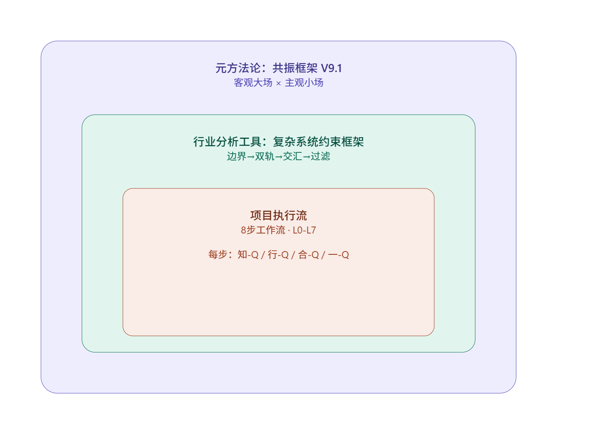
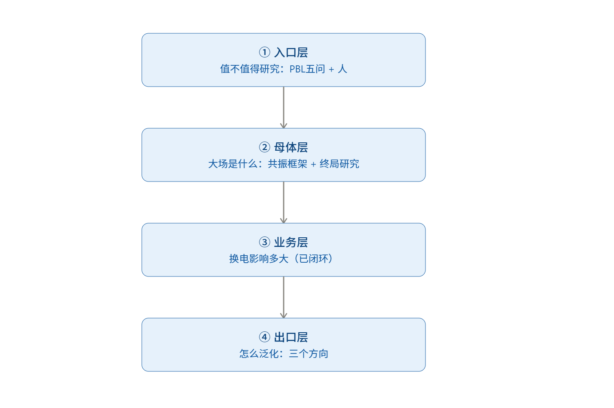
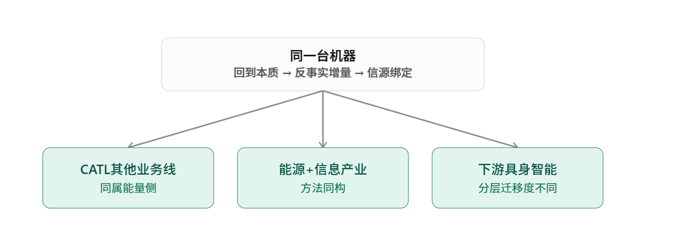

# 讨论过程

## 2026-8-24

### Q1：需求：1 能体现CATL换电完整的研究链路，怎么一步步选取研究课题、找研究方法、得出研究结果；2 能泛化到其他研究上，至少可以拓展到 CATL 其他业务线的研究，比如动力电池在电动船舶、eVOTL、机器人等方面的研究，比如储能、AIDC新业务线的研究，比如回收、矿产投资等，另外我认为电力能源和信息底层同构（都是电子有序流动），是不是也可以泛化到整个电力行业、信息产业特别是电子芯片等，包括汽车、具身智能等新兴硬件。

### A-Claude：

[研究思考链路_换电对CATL业绩影响与重估](D:\AI\证券投资\投研\能源\宁德时代\业务\研究思考链路_换电对CATL业绩影响与重估.md) 这份收敛稿本身已经做得很完整——三层套娃、四条铁律、九个 Agent 模块、还有"研究链路→报告映射"那张表,是我见过组织得最清楚的方法论沉淀之一。你要的图我会拆成三张连续的小图,而不是硬塞进一张——原因很直接:三层套娃+四层递进+三个泛化方向,三件事叠一起画,要么互相打架要么字全糊在一起。三张图分别对应你的两个需求加一个衔接点:①通用机器长什么样,②它在换电上具体跑了一遍是什么样,③同一台机器换个标的能长成什么样。

这是"通用机器"——外层的共振框架决定怎么判断,中间的复杂系统约束框架专门负责"知-Q"这一步怎么解码客观大场,内层的8步工作流是落到单个标的上的具体执行细则。这三层不随标的变化。下面这张图是这台机器在"宁德换电"这个具体课题上跑的一次实例——对应你文档里的"四层递进"。

三张图之外,有一点我想单独说清楚,因为它决定"信息产业、芯片、具身智能"这几个方向的泛化该多大力度地信。

"电池和芯片底层都是电子在电磁力下的有序流动"这句话,其实包含两层,置信度不一样,值得像你 PBL 五问表里区分"100年级"和"结构性"那样拆开看:

**物理层(高置信)**:这层是真的,不只是比喻。信息论和热力学之间有严格的桥——Landauer原理说擦除一个比特必然耗散至少 kT ln2 的能量;电路理论的基尔霍夫定律和信息网络的最大流最小割,在数学结构上本来就是同一套(节点守恒律)。这层站得住,芯片和电池共享这层物理没问题。

**经济结论层(中置信,需要逐个验证)**:"信息侧集中、能量侧commoditize"这条具体推论,严格说不是从"电子怎么流动"直接推出来的,而是从另一组更经济学的性质推出来的——信息复制的边际成本趋近于零(网络效应的根源),能量/物质产品的边际成本是真实的物理成本,没法被"复制"消灭。这组经济性质跟"是不是电子"没有必然绑定:软件换成光子或者机械继电器跑,零边际成本的结论不变;反过来,先进制程晶圆厂一样有极深的know-how壁垒、不commoditize,跟电池是同一种"制药式竞争"。所以这条经济结论,推到电网、芯片这些确实共享电子基底、也确实是你长期研究对象的领域,置信度应该维持"高";但推到具身智能、机器人的时候,你文档自己已经写了"能量层中/信息架构层高/执行层低"——这已经是在把置信度分层处理了,是对的做法,不需要也不应该退回成一句笼统的"同构所以成立"。

反过来说一个更重要的推论:**"回到载体本质→识别真需求→反事实增量→参数信源绑定"这套方法论本身,泛化的时候几乎不需要"电子同构"这个前提撑腰**——它更像第一性原理思考的操作化版本,domain-general,换成研究一家餐饮连锁或者一家医药公司,一样能用。真正需要"电子同构"这个前提的,只是"信息侧集中/能量侧commoditize"这一条具体经验规律,而这条规律的泛化半径,应该按物理基底的远近分层给置信度,而不是一次性推到底。

另外一件事,想确认一下你接下来想怎么走:文档里§3.4说"当前打通了80%,剩下20%是把研究素材→六章论证文字这一步Agent化",这是最后一块。如果你想往这个方向推进,我可以帮你把某一个模块(比如"场解码器"或者"需求识别器")的 prompt 规范先具体写出来,当一个可以复用的模板——你想先从哪个模块入手?

### Q2：我是觉得这些都太过于抽象，根本没有在换电这件事情上有具体的体现。貌似准备了很多套工具、框架和方法，很时髦，很科学，但是我就是跟现在的实例研究对应不起来。

举个例子，换电的客观大场怎么研究，什么是换电的客观大场，这个问题现在就没抽象出来，换电是个啥、属于什么范畴的概念，这个概念又是哪个行业的，下游是电力行业还是交运行业，不同的定位会决定不同的大场选择，那到底选哪个定位，这取决于对换电以及电池本质的深刻认知，是把它作为新型电力系统的关键一环、储能的关键载体，还是作为交通工具的动力源、核心硬件？等等。

再比如，为什么研究换电，是觉得这是个相变机会，财务报表是按制造业务组织解释的，可是业务线上却在这块儿有了越来越大的投入、但是还没在报表上有体现，而且这个业务性质属于运营而不是制造、其他同行还没有开始做，是个值得关注的点。那相变是不是可以提炼出一种方法论？只有相变才可能产生较大的非共识投资机会，什么是相变，怎么发现相变？

如果不能把这个实例里具体的研究思路和方法沉淀下来，比如沉淀成一些可以去写的 prompt，比如以什么样的提问方式来组织（像苏格拉底启发式的逐层提问），那最后它又怎么能泛化到其他具有不同产业背景、技术趋势的业务、公司或行业研究上呢？

### A-Claude：

这个批评是对的,而且说到点子上——我给你的是骨架贴了标签,没有肉。"客观大场""相变"这些词在图里只是盒子上的文字,没有真的带你走一遍"从换电这个具体东西,怎么一步步推出它的客观大场是什么"这条路。补上。

#### 一、换电的客观大场:走一遍,不是贴标签

**第一步,拆功能,不问"它是什么行业"。** 换电剥离掉"新能源""电池"这些行业标签,物理/经济功能上在做三件不重叠的事:①快速补能(电池物理换出换入)②给充电这件事挪时间(站内电池可以挑时间段充,不用跟车主用车时间绑死)③把电池资产集中托管(车电分离,电池变成可以单独运营的资产池)。

**第二步,每个功能追一个下游"谁买单"。** ①的买单方是需要车辆高利用率的运营方(重卡车队、出租、Robotaxi)→下游是交运/物流行业;②的买单方是电网/调度机构(需要灵活性资源)→下游是电力系统;③的买单方是愿意为电池资产融资、但不想自己扛残值风险的车队/车企→下游更接近金融/租赁,是实现①②的"手段",不是独立的"客户"。

**第三步,必要性测试,找主场。** 问:删掉这个功能,商业模式在经济上还成不成立?删掉②(电网调度),前面算过的模型结论量级基本不变——辅助服务/VPP收入占营收比重<1%,可以忽略;删掉①(高频运营车快速补能),模型直接垮掉,营运车贡献了估值的绝大部分。**结论:换电的客观大场是交运/商用车能源补给,不是新型电力系统,后者是尚未兑现的期权层,不是当前主场。**

**第四步,反向校验。** 回头看已经搭好的量化模型——分母用的是重卡/城配/出租/网约/Robotaxi这些运营车队,渗透率对标的是燃油/快充这些交运领域的替代方案,竞品对比对标奥动这类换电运营商而不是电网侧储能商——模型结构本来就隐含了"主场是交运"这个判断,只是没有在客观大场这一步显性地论证过。现在补上了,两者对得上,说明当初搭模型时的直觉是对的,只是没有被检验过。

**这条路径本身可以剥出来重复用**,我把它写成一个可以直接套的诊断:

> **客观大场定位诊断**
> 1. 剥离行业标签,把标的拆成互不重叠的功能清单。
> 2. 对每个功能问:谁会为它买单?这个"谁"属于哪个现有行业?
> 3. 对每个候选场,问:删掉这个功能,商业模式经济上还成立吗?——删了就垮的,是主场;删了基本不受影响的,是加分项。
> 4. 回头查:已经搭的量化模型(分母、竞品对比、渗透率对标),隐含假设的是哪个场?跟第3步选出来的主场一致吗?——一致说明选对了,只是没显性化;不一致说明模型结构和真实主场脱节,要先解决这个撕裂。

#### 二、相变:能不能提炼成方法论——能,而且有具体的物理落点

你概括的那几个特征——报表按制造业组织、真实投入却越来越往运营性质的东西上走、同行还没跟——值得先问一句:这几个特征,是不是真的对应物理学"相变"里那套结构,还是只是借了个好听的词?我觉得可以对应得比较严格,不是硬套比喻。

物理相变里有两个变量:**控制参量**(比如温度,连续可调、由外部条件决定)和**序参量**(比如磁化强度,描述系统内部组织状态、往往是离散/跳变的)。控制参量跨过临界点之前,序参量一直"卡"在旧值不动;跨过之后,序参量可能不是平滑跟随,而是相对突然地切换到新值。临界点附近还有个特征:涨落变大、对扰动的敏感度升高(这也是复杂系统里"临界慢化/早期预警信号"那套文献——生态系统崩溃、金融危机前兆研究——共用的结构)。

对应到换电这个案例:**控制参量 = 真实资源投入**(资本开支、核心团队配置、管理层注意力分配),这个东西是连续变化的,宁德自己知道自己每个季度投了多少;**序参量 = 市场/分析师给这家公司定价时用的分类框架**(制造业倍数还是运营/平台倍数),这个东西是离散的、集体性的,不会随资源投入平滑调整,而是"卡"在旧分类上,直到证据积累够多才切换。**两者之间的差距,就是非共识窗口的大小**——控制参量已经走了很远,序参量还没动,这个差就是还没被定价的部分。

相变投资分两个阶段:**先发现有没有买的机会,买后跟踪要不要卖**,合起来是一套完整的进出策略，前4步是买入前的一次性判断,后2步是买入后的持续循环。

| 步 | 阶段 | 看什么 | 问什么 | 换电案例 |
|---|---|---|---|---|
| 1 序参量——共识量(资本端) | 买前 | 现有估值框架 | 资本现在拿什么框架给它定价?是它自己想呈现,还是行业默认贴的标签?先把基线摸清。 | 宁德 LTM 13倍,按**制造业**给价,不是运营/平台价。 |
| 2 控制参量(实业端) | 买前 | 实际发生的事 | 在现有框架的关键参数里,找跟业务实质、内在属性(商业模式/驱动力)相关的变化;看真实动作(建站、招人、老板表态),财报科目做印证。 | 建站网络、BaaS金融、独立主体"时代电服",性质是**运营/网络**。 |
| 3 好坏变化定性 | 买前 | 怀疑式反问 | 变化是领先于人的"好变化"(才可能真产生相变),还是错误判断的"坏变化"?坏变化直接Pass,不产生机会。 | "电池厂主导标准+车队运营+金融"没人跟:宁德是跨OEM第三方,天然想建跨品牌标准——**是好变化(壁垒),不是没被发现**。 |
| 4 必要性 + 粗估基本面 | 买前 | 动力·阻力·值不值 | 好变化够不够"必要"?不必要→战略定力不足、推动不力;太必要→反成对手/伙伴拿捏的"七寸"。必要性分析判的是新业务推进的动力与阻力,结论可能是"成不了"而否掉。确认有机会后,再毛估估相变兑现后的基本面天花板——若只是续命、不再往下掉,也不可投。 | 标准被抢走机会成本太高(动力足但也是七寸);粗估换电运营/网络化后的营收利润量级,看是否远超当前制造业叙事。 |
| 5 共识达成进度 | 买后 | 空档在哪 | 老板盯的先行指标(快)vs 市场改口要的验证指标(滞后)。**两者收敛=窗口收窄=退出预警**,不是非要等到完全共识。 | 先行已好转(建站/BaaS/单站IRR)vs 验证未兑现(多城盈利/时代电服融资);验证一兑现、定价框架一切换就该准备走。 |
| 6 价格是否严重背离 | 买后 | 价值锚(随业务变形) | 对第4步的粗估持续深化,模型方法可随业务变(PB/PS/FCFF切换),总能找到符合当下市场势能的锚(可相对、可横向,不一定要DCF)。**只有价格严重泡沫才绝对抛;适度泡沫、整体势能还在,就不必卖(不止盈)。** | 运营/平台框架被接受后,持续重估天花板;价格远超锚的特定倍数(严重泡沫阈值待定)才出。 |

#### 三、这两个补丁,落回你原来的框架里是什么位置

"相变"不是一个新加的模块——它是你8步工作流里**第1步"问题界定:战略转折点?"**一直缺的具体操作内容。这一步之前只是个标签,现在有了可以真正执行的检测顺序。"客观大场"同理,第0步现在也有了可执行的诊断,而不只是"解码大场"这四个字。

其他几步(需求验证、产业结构、能力圈、合作方博弈、概率判断)大概率也处在同样的状态——名字很清楚,但没有对应的苏格拉底式提问链。想接着走哪一步?

#### 附：系统科学 / 物理名词速查表

> 核心结构：**「某量 + 中枢值 + 围绕中枢的随机偏差」= 涨落**。零点能/量子涨落虽也带“涨落”二字，但起因不同（量子固有），只是共用这个词。

| 名词 | 学科归属 | 专业含义 | 通俗解释 / 案例 |
|---|---|---|---|
| **涨落 (fluctuation)** | 通用（统计/经济/社会） | 某量围绕其中枢值的随机偏差 | 股价围绕中枢抖、小框内分子数随机变。来源是噪声，**表现幅度受恢复力约束**。 |
| **粒子数涨落** | 统计物理 | 局部观测窗口内粒子数的随机计数偏差（非总量变化） | 大盒子总分子数守恒；小框里的瞬时计数在97~103间跳。≠粒子产生/湮灭，仅是随机进出计数窗口。 |
| **量子涨落** | 量子物理 | 物理量围绕期望值的本质随机偏差（虚粒子生灭等） | 真空里的“水面波纹”，来自不确定性原理。是“抖”，不是确定值。 |
| **零点能 / 零点运动** | 量子物理 | 绝对零度时系统仍保有的基态能量（不可去除） | “静的禀赋”，不是涨落。源于位置-动量不能同时确定。 |
| **真空零点能** | 量子场论 | “真空”这一量子场基态的零点能 | 真空非“无”，而是所有场的最低能态，仍有量子涨落与零点能。是零点能的特例。 |
| **相对论静能 E=mc²** | 相对论 | 物体静止时由质量决定的固有能量 | 与零点能**不同源**：静能来自质量-能量等价，零点能来自量子不确定性。二者不是一回事。 |
| **恢复力 (restoring force)** | 动力学 / 复杂系统 | 系统把状态拉回平衡位置的力（势能谷坡度） | “压住涨落的手”。碗越深，状态越稳、涨落越小。 |
| **临界慢化 (critical slowing down)** | 复杂系统 / 预警科学 | 接近临界点时，系统回归平衡的速度变极慢 | 推一下晃很久回不去。是相变临近的**早期预警信号**。 |
| **临界涨落放大** | 复杂系统 | 临界点附近涨落幅度显著变大 | 分析师观点剧烈分化、估值分歧拉大=市场认知临近切换的信号。 |
| **相变 (phase transition)** | 物理 / 复杂系统 | 控制参量跨过临界值时，序参量发生非连续跳变 | 水→冰；市场从“制造业定价”跳到“运营定价”。 |
| **分岔 (bifurcation)** | 动力系统 | 方程参数变化时，不动点个数/稳定性突变 | 数学上的“大一统”视角：同一方程不同参数区表现不同。实务中也可各写各的模型，分岔非唯一描述。 |
| **动力系统 (dynamic system)** | 数学 / 物理 | 用微分方程 dx/dt=f(x,λ) 描述状态随时间的演化 | 微分的“变化率”天然匹配“持续演化”。ODE(无空间)/PDE(有空间场)。 |
| **耗散 (dissipation)** | 热力学 / 动力学 | 系统把偏离平衡的扰动能量散失到环境、从而回归平衡的机制 | 有摩擦的摆终会停下。开放系统多处于耗散态。耗散的是“扰动”，不是系统本身。 |
| **涨落-耗散定理** | 统计物理 | 恢复速度(耗散)与平衡涨落幅度定量相关 | 一句话：**恢复力越强↔涨落越小；恢复力越弱(临界)↔涨落越大**。因环境既随机踢你(涨落)又阻尼你(耗散)，同源。 |
| **控制参量** | 相变理论 / 复杂系统 | 系统外部、连续可调、决定系统状态的条件变量 | “外部调节旋钮”。如温度、资本开支投入量。宁德案例=真实资源投入。 |
| **序参量** | 相变理论 / 复杂系统 | 描述系统内部组织状态的量，常离散/跳变 | “内部状态指针”。如磁化强度、市场对公司的估值分类。宁德案例=制造业vs运营估值框架。 |
| **早期预警信号 (EWS)** | 生态/金融/气候 | 临界前可观测的方差↑、自相关↑等现象 | 湖突变前、金融崩盘前、宁德认知切换前都能看到“抖动变大”。 |

**关键辨析（易混点）**：

1. **零点能 ≠ 相对论静能**：零点能来自量子不确定性（即使绝对零度也动），静能来自质量（E=mc²）。机制不同。
2. **量子涨落 ≠ 统计物理涨落**：前者是量子固有随机性，后者是经典热运动的计数/偏差，起因不同，仅共用“涨落”一词。
3. **粒子数涨落不违反守恒**：它指“局部观测窗口”的瞬时计数随机变，大系统总量仍守恒；不涉及粒子产生/湮灭。
4. **分岔是可选框架，不是唯一真相**：相变在数学上可写成同一方程的分岔；实务中液相/气相也可各建模型。分岔是为“大一统”的理论便利。
5. **耗散指“扰动的耗散”**：系统偏离平衡后，那部分多余能量被环境吸收，使系统回归。它让涨落被抚平——恢复力越强，涨落越小。

## 2026-8-25

### Q：我看你提出的需求3，电力能源和信息底层同构（都是电子有序流动），是不是也可以泛化到整个电力行业、信息产业特别是电子芯片等，包括汽车、具身智能等新兴硬件。

### A：

1. 首先，我认为你提出的需求3是可以满足的，因为