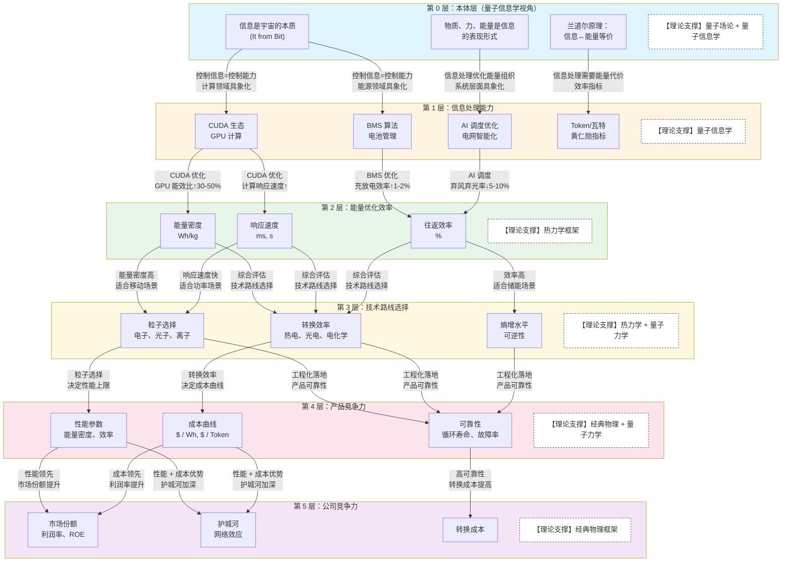

# 能量 - 信息统一投资框架（v2.0 修订版）

## 核心投资问题

> **能源与信息的物理本质是否统一？投资宁德时代与投资英伟达的底层逻辑是否相同？**
> **当前基于"电子可控性"的产业基础是否会被颠覆？**

要回答这个问题，需要理解五个递进问题：

1. **理论体系的演进图谱**（理解物理学的完整框架）
2. **什么是量子？**（理解微观世界的本质）
3. **能量利用的本质是什么？**（为什么人类需要能源）
4. **信息的本质是什么？**（信息与能量的关系）
5. **如何从物理底层推导到公司价值？**

**阅读建议**：
- **第一步**：阅读第一部分，建立量子力学、量子场论、量子信息学的基础认知
- **第二步**：阅读第二部分，应用理论基础构建投资分析框架
- **第三步**：阅读案例分析，验证框架的实际应用效果


***

## 第一部分：物理本质认知——理论基础与局限性

### 1.1 基础理论认知

#### 1.1.1 理论体系的演进图谱（总览）

**理论演进时间线**：

```
理论演进时间线
│
├── 经典物理（1687-1900）
│   └── 牛顿力学、麦克斯韦电磁理论
│   └── 世界观：物质是实体，能量守恒，决定论
│
├── 热力学（1824-1900）
│   └── 能量守恒、熵增定律
│   └── 世界观：能量转换有方向性，效率有上限
│
├── 量子理论簇（1900-至今）
│   │
│   ├── 量子力学（1900-1927）
│   │   └── 波粒二象性、不确定性原理
│   │   └── 世界观：能量量子化，测量影响结果
│   │
│   ├── 量子场论（1927-1970s）
│   │   ├── 标准模型、费曼图、规范场论
│   │   ├── 重正化群理论（1960s-1982）← 量子场论的数学工具
│   │   └── 世界观：物质和力都是场的激发态
│   │
│   ├── 统计物理与凝聚态物理（1950s-至今）
│   │   ├── 多体系统、相变、临界现象
│   │   └── 复杂性科学（1970s-2021）← 统计物理的延伸
│   │       └── 开放系统、自组织、无序与涨落
│   │       └── 世界观：系统必须开放才能演化（Parisi, 2021 诺贝尔奖）
│   │
│   └── 量子信息学（1980s-至今）
│       ├── 早期：量子计算、兰道尔原理、It from Bit（Wheeler）
│       ├── 构造子理论 Constructor Theory（2013-至今）← 量子信息学的最新发展
│       │   └── 可能性空间、变换理论
│       │   └── 世界观：信息定义可能性，能量提供成本，物质作为载体
│       └── 世界观：信息是宇宙的本质，能量 = 实现可能性的成本
```

**关键洞察**：
1. 每个理论都是对前一个理论的**深化而非否定**，投资研究需要**多层理论叠加**。
2. **量子理论簇**是核心主线，包含 4 个分支：量子力学→量子场论→统计物理→量子信息学
3. **量子场论只兼容狭义相对论**，**广义相对论仍未与量子力学统一**
4. **量子引力问题**，如何将广义相对论与量子力学统一，是物理学界最大的未解之谜，但**不影响投资分析**（投资不需要广义相对论），量子场论已足够

**重要说明：相对论与量子理论的关系**：

| 理论 | 处理的问题 | 与量子场论的关系 | 投资分析是否需要 |
|-----|----------|--------------|--------------|
| **狭义相对论**（1905） | 高速运动（接近光速），**不考虑引力** | ✅ 已融入量子场论 | ❌ 不需要 |
| **广义相对论**（1915） | **引力** = 时空弯曲 | ❌ 仍未与量子力学统一 | ❌ 不需要 |

**为什么投资分析不需要广义相对论？**
- 广义相对论只在**极强引力场**（黑洞、宇宙学）中才重要
- 投资涉及的尺度：宏观（公司、产业）→ 介观（技术）→ 微观（粒子）
- 投资分析需要的理论：量子力学（电池、半导体）、量子场论（基本力稳定性）、量子信息学（信息交互）、复杂性科学（生态系统）
- **结论**：即使"量子引力问题"未解决，也不影响投资框架的可靠性

**物理学理论的完整谱系**：

| 理论体系 | 出现时间 | 研究对象 | 核心洞见 | 诺贝尔奖 | 投资研究用途 |
|---------|---------|---------|---------|---------|-------------|
| **经典物理** | 1600-1900 | 宏观物体运动 | 决定论、连续性 | - | 短期基本面分析 |
| **热力学** | 1850-1900 | 能量转换与熵 | 能量守恒 + 熵增原理 | - | 效率上限判断 |
| **量子力学** | 1900-1927 | 微观粒子（电子、原子） | 能量、角动量量子化 | 多次获奖 | 理解电池能级跃迁 |
| **量子场论** | 1927-1970s | 场（电磁场、电子场） | 粒子是场的量子激发 | 多次获奖 | 判断基本力稳定性 |
| **重正化群理论** | 1960s-1982 | 临界现象与相变 | 不同尺度有独立的物理规律 | Wilson(1982) | 理解宏观 - 微观关系 |
| **量子信息学** | 1980s-至今 | 信息（比特、量子比特） | 信息是物理的 | 部分获奖 | 统一能源与信息投资 |
| **复杂性科学** | 1970s-2021 | 复杂系统（开放、远离平衡） | 无序与涨落的相互作用 | Parisi(2021) | 理解开放系统与生态 |
| **构造子理论** | 2013-至今 | 可能性空间（变换） | 信息定义可能性，能量提供成本 | 发展中 | 判断技术变革方向 |

#### 1.1.2 什么是量子？

**量子**（Quantum）：不是粒子，而是**物理量的最小不可分割单位**

**通俗比喻**：

- 金钱的"量子"是 1 分钱（不能再分割）
- 能量的"量子"是光子（一份一份的能量包）
- 角动量的"量子"是 ℏ（普朗克常数除以 2π）

**关键洞察**：

- "量子化" = "不连续" = "一份一份的"
- 经典物理：能量连续（可以任意小）
- 量子物理：能量量子化（有最小单位）

**为什么需要这个概念？** 因为要理解锂电的本质，必须理解电子的能级跃迁是量子化的，这决定了电池电压和能量密度的理论上限。

#### 1.1.3 理论演进的深层逻辑——每个理论解决了什么根本问题？

**量子理论簇的演进逻辑**（主线）：

| 理论 | 解决的问题 | 相对前代的变化 | 核心突破 | 与相对论的关系 |
|-----|----------|--------------|---------|--------------|
| **量子力学** | 经典物理无法解释微观现象（如黑体辐射、光电效应） | 能量从"连续"→"量子化" | 发现能量是一份一份的 | ❌ 不涉及相对论 |
| **量子场论** | 量子力学无法处理粒子产生和湮灭 | 粒子从"实体"→"场的激发" | 物质和力统一为场的激发态 | ✅ 兼容**狭义相对论** |
| **统计物理** | 单个粒子→大量粒子的集体行为 | 从"单个粒子"→"多体系统" | 发现集体涌现现象（相变、临界） | ❌ 不涉及相对论 |
| **量子信息学** | 量子力学只描述"是什么"，不描述"信息的作用" | 从"物质/能量"→"信息" | 信息是宇宙的本质 | ❌ 不涉及相对论 |
| **构造子理论** | 量子信息学只描述"信息是本质"，不描述"信息如何驱动物理变换" | 从"信息是什么"→"信息定义可能性" | 信息定义可能性空间，能量提供实现成本 | ❌ 未统一广义相对论 |

**关键演进路径**：

```
第 1 步：量子化（1900-1927）
  → 发现能量不是连续的，是一份一份的
  → 解决：为什么原子稳定（电子不会掉进原子核）

第 2 步：场论化（1927-1970s）
  → 发现粒子不是实体，是场的激发
  → 解决：粒子如何产生和湮灭（正负电子对产生）

第 3 步：多体化（1950s-1982）
  → 发现大量粒子的集体行为不能用单个粒子描述
  → 解决：相变、临界现象、涌现行为
  → 工具：重正化群理论（Wilson, 1982 诺贝尔奖）

第 4 步：信息化（1980s-至今）
  → 发现信息不是抽象概念，是物理的
  → 解决：量子计算、量子通信、兰道尔原理
  → 延伸：复杂性科学（Parisi, 2021 诺贝尔奖）

第 5 步：元理论化（2013-至今）
  → 发现信息不是"什么东西"，而是"可能性空间的定义者"
  → 解决：技术变革方向的判断
  → 理论：构造子理论（Deutsch, 2013）
```

**投资含义**：
- 每一层理论都回答不同尺度的问题，不能简单还原
- 短期（1-3 年）：经典物理 + 热力学（基本面分析）
- 中期（3-10 年）：量子力学 + 量子场论（技术极限判断）
- 长期（10-50 年）：量子信息学 + 构造子理论（技术变革方向）
- **多层理论叠加**，而非单一理论依赖

#### 1.1.4 量子场论：判断基本力稳定性

**核心贡献**：将**物质**（费米子）和**力**（玻色子）统一为**场的激发态**，兼容量子力学与**狭义相对论**（但不包含广义相对论）。

**关键概念**：

| 关键特性 | 物理含义 | 投资应用 |
|---------|---------|---------|
| **兼容狭义相对论** | 与因果律一致，理论自洽 | 作为长期"认知锚点"，确保基础物理不会崩塌 |
| **物质和力都是场的激发** | 费米子（物质）和玻色子（力）是同一框架下的不同激发模式 | 理解"信息 - 能量 - 物质"的统一性 |
| **规范对称性** | 基本力（电磁力、弱力、强力）由规范对称性决定 | 判断基本力是否恒定（如电磁力常数是否变化） |
| **重整化群流** | 力的强度随能量尺度变化，但低能下稳定 | 判断在宏观尺度下基本力是否稳定 |

**为什么量子场论重要？**

- **回答"基本力是否稳定"**：
  - 半导体产业依赖电磁力的稳定性
  - 量子计算依赖量子态的相干性
  - 长期投资需要确保物理基础不会崩塌

- **投资含义**：
  - 作为长期（50-100 年）"认知锚点"
  - 判断电子设备的长期可靠性
  - 理解"信息 - 能量 - 物质"的统一性

**投资例子**：
- **电磁力常数（精细结构常数α）**：量子场论预测其在宏观尺度稳定
- **如果α变化 1%**：原子结构改变，化学反应失效，现有所有技术崩溃
- **量子场论的预测**：α在宏观尺度稳定→长期投资可以信赖现有物理规律

#### 1.1.4 重正化群理论：理解宏观 - 微观关系

**核心贡献**：Kenneth Wilson 因该理论获得 1982 年诺贝尔物理学奖，提出**不同尺度有独立的物理规律**。

**关键概念**：

| 关键概念 | 物理含义 | 投资应用 |
|---------|---------|---------|
| **尺度变换** | 物理系统在不同尺度下有不同描述 | 不同时间尺度需要不同的投资框架 |
| **临界现象** | 在相变点附近，系统性质发生突变 | 产业变革点（如能源转型）的识别 |
| **普适性** | 不同系统在临界点表现出相同的规律 | 跨行业的投资规律（如所有平台型公司） |
| **标度律** | 宏观性质与微观参数的幂律关系 | 微观创新→宏观竞争力的传导机制 |

**为什么重正化群理论重要？**

- **回答"宏观是否只是微观的统计表现"**：
  - 不是简单的统计叠加
  - 不同尺度有**独立的物理规律**
  - 宏观现象有**涌现性**（不能还原为微观）

- **投资含义**：
  - 短期（微观）：量子力学判断技术极限
  - 中期（介观）：量子场论判断产业稳定性
  - 长期（宏观）：复杂性科学判断生态演化
  - **每一层都有独立的规律，不能简单还原**

**投资例子**：
- **水的相变**：单个水分子没有"液态"概念，宏观相变是涌现现象
- **产业转型**：单个公司行为不能预测产业趋势，产业有独立规律
- **临界点识别**：电动车渗透率 10%→30% 的加速期是临界现象

#### 1.1.6 复杂性科学：理解开放系统演化

**核心贡献**：**伊利亚·普利高津**（Ilya Prigogine，1977年诺贝尔奖）提出**耗散结构理论**，阐明开放系统通过持续与外界交换物质/能量/信息，在远离平衡态时可能形成有序结构；**乔治·帕里西**（Giorgio Parisi，2021年诺贝尔奖）提出**无序与涨落相互作用理论**，发现在看似无序的系统中，通过分析涨落的统计特性，可以识别隐藏的结构信息。

**关键概念**：

| 关键概念 | 物理含义 | 投资应用 |
|---------|---------|---------|
| **开放系统** | 系统与环境持续交换物质、能量、信息 | 公司必须与生态保持信息交互 |
| **远离平衡态** | 系统不处于热力学平衡，有持续的能量流 | 高成长公司必须处于"非平衡"状态 |
| **耗散结构** | 通过耗散能量维持的有序结构 | 公司作为"耗散结构"需要持续投入 |
| **无序与涨落** | 系统中的随机波动和不确定性 | 创新来自"可控的无序" |
| **自组织** | 系统自发形成有序结构 | 生态系统的自发演化 |

**帕里西无序与涨落相互作用理论详解**：

**为什么研究"无序"——"无用之用"**：
- **自旋玻璃**：最简单的复杂系统模型（铁原子随机混合进铜原子网格）
- **阻挫现象**：系统不存在满足所有粒子能量最低的最优构型，呈现"无序"状态
- **研究价值**：通过研究这个最简单的复杂系统，可以普适性地诠释所有无序体系的物理规律

**核心发现**：
- 虽然**单个自旋**的方向是随机的（无序），但**大量自旋的统计行为**存在隐藏规律
- **涨落不是噪声，而是信号**：波动包含系统结构信息
- **无序的个体行为 → 统计规律 → 隐藏的整体秩序**

**从椋鸟群飞行开始的洞察**：
- 帕里西观察成千上万只椋鸟在天空飞行（每只鸟随机改变方向，整体看似混乱）
- 发现鸟群运动存在统计相关性——通过分析涨落的统计特性，可以发现长程关联和隐藏的整体秩序

**从原子到行星尺度的应用**：
- **气候系统**：大气分子的随机运动（无序）+ 温度压力波动（涨落）→ 统计分析发现长期气候规律
- **金融市场**：投资者的随机交易（无序）+ 价格情绪波动（涨落）→ 统计分析发现长期趋势

**投资含义**：
- **在反共识中发现规律**：市场不认可时，往往隐藏着长期趋势
- **分析波动的统计特性**：不是看单次波动，而是看波动的统计规律
- **识别隐藏秩序**：通过大量数据分析，发现市场的结构性规律

**为什么复杂性科学重要？**

- **回答"公司/生态如何演化"**：
  - 公司必须是开放系统，持续与外界交换，才能演化
  - 高成长公司处于"远离平衡态"
  - 在无序和涨落中，通过统计分析发现隐藏规律，可能激发创新

- **投资含义**：
  - **开放系统**：公司必须保持与生态的信息交互，持续获取新资源
  - **远离平衡态**：稳定=死亡，必须持续变革、持续投入
  - **无序与涨落**：允许试错，创新来自随机性，在波动中发现规律
  - **自组织**：生态不是设计的，是自发演化的

**投资例子**：
- **英伟达 CUDA 生态**：开放系统，持续与开发者交换信息→自组织演化
- **特斯拉开源专利**：引入"无序"，激发行业创新→生态壮大
- **字节跳动算法**：利用"涨落"（用户行为随机性）优化推荐
- **巴菲特逆向投资**：在市场恐慌（无序/涨落）中发现被低估的优质资产（隐藏秩序）

#### 1.1.7 构造子理论：判断技术变革方向

**核心贡献**：David Deutsch（2013）提出用信息论重构物理学，将**信息定义为可能性空间**。

**关键概念**：

| 关键概念 | 物理含义 | 投资应用 |
|---------|---------|---------|
| **信息 = 可能性空间（What could be）** | 不是"是什么"，而是"可能是什么" | 判断技术变革方向（如 AI、量子计算） |
| **能量 = 实现成本（How much it costs）** | 不是"驱动力"，而是"变换代价" | 评估实现技术路线的资源需求 |
| **物质 = 稳定载体（Where it is stored）** | 信息的"冻结"形式 | 理解产品的物理实例化 |
| **三位一体** | 信息定义可能性，能量提供成本，物质作为载体 | 协同分析，不单一依赖 |

**为什么 构造子理论 重要？**

- **回答"技术变革的方向"**：
  - 用信息论语言重构量子力学（不是重构广义相对论）
  - 不仅关注"信息是本质"，还关注"信息如何驱动物理变换"
  - **仍在发展中**，尚未统一广义相对论

- **投资含义**：
  - **战略层面**：判断技术变革方向（AI、量子计算、可控核聚变）
  - **哲学层面**：理解"信息 - 能量 - 物质"的本质关系
  - **使用建议**：作为长期战略指导，不作为短期投资依据
  - **重要说明**：即使未统一广义相对论，也不影响其在投资分析中的价值

**投资例子**：
- **电池**：化学能不是"驱动"电子流动，而是"支持"电子流动的成本
- **GPU**：电力不是"决定"计算结果，而是"驱动"计算执行的成本
- **宁德时代**：能量密度高→支持更长续航（可能性）
- **英伟达**：能效比高→支持更大模型（可能性）

### 1.2 能量利用的本质——人类为什么需要能源？

**核心问题**：什么是"好用"的能量？

人类选择能源的标准是什么？**四个维度**：

| 维度        | 含义           | 物理本质         | 投资含义     |
| --------- | ------------ | ------------ | -------- |
| **能量密度**  | 单位质量/体积蕴含的能量 | J/kg 或 Wh/kg | 决定应用场景   |
| **可控性**   | 能否按需获取和释放    | 响应速度 + 精准度   | 决定技术路线   |
| **获取便利性** | 开采/转换的难易程度   | 能量转换效率       | 决定成本曲线   |
| **清洁性**   | 使用后的副作用      | 熵增 + 污染      | 决定长期可持续性 |

**人类能源利用的演进史**：

| 阶段       | 主要能源   | 能量密度 | 可控性    | 获取便利性 | 清洁性 | 综合评分 |
| -------- | ------ | ---- | ------ | ----- | --- | ---- |
| **钻木取火** | 生物质能   | 低    | 低      | 低     | 低   | ⭐    |
| **煤炭时代** | 化学能（煤） | 中    | 中      | 中     | 低   | ⭐⭐   |
| **石油时代** | 化学能（油） | 高    | 中      | 高     | 低   | ⭐⭐⭐  |
| **电气时代** | 电能     | 高    | **极高** | 高     | 中   | ⭐⭐⭐⭐ |
| **未来**   | 核能？    | 极高   | 低      | 中     | 高   | ❓    |

**关键洞察**：

- 人类能源选择的本质：**在四个维度之间寻找最优平衡**
- 电能之所以成为主流，不是因为能量密度最高，而是因为**可控性最高**
- **可控性 = 信息处理能力**（需要精准控制电子流动）

**构造子理论 的新视角**：
- **能量不是"驱动力"**，而是**"实现可能性的成本"**
- 能量不是"什么在驱动"，而是"变换需要多少代价"
- **例子**：
  - 电池：化学能不是"驱动"电子流动，而是"支持"电子流动的成本
  - GPU：电力不是"决定"计算结果，而是"驱动"计算执行的成本
- **投资含义**：
  - 不仅看"能量多少"，还要看"能量支持什么可能性"
  - 宁德时代：能量密度高→支持更长续航（可能性）
  - 英伟达：能效比高→支持更大模型（可能性）

### 1.3 信息的本质

**核心问题**：信息是什么？信息与物质、能量、力是什么关系？

#### 1.3.1 信息的定义演进

| 理论体系        | 对信息的认知                 | 物理地位   |
| ----------- | ---------------------- | ------ |
| **经典物理**    | 未定义                    | 无      |
| **热力学**     | 熵的负值（玻尔兹曼）             | 统计概念   |
| **信息论**（香农） | 不确定性的度量（比特）            | 数学概念   |
| **量子力学**    | 未定义                    | 无      |
| **量子场论**    | 场的副产品                  | 派生概念   |
| **量子信息学**   | **宇宙的本质**（It from Bit） | **本体** |
| **构造子理论** | **可能性空间的定义者** | **元理论** |

**构造子理论 的新认知**：
- **信息不是"什么东西"**，而是**"对可能性的约束"**
- 信息 = 差异的区别（贝特森）= 定义"什么是可能的，什么是不可能的"
- **例子**：
  - DNA：不是"决定"生物体，而是"约束"可能的发育路径
  - 程序代码：不是"执行"操作，而是"定义"可能的计算路径
  - 技术路线：不是"保证"成功，而是"约束"可能的产品形态
- **投资应用**：
  - 宁德时代：BMS 算法不是"保证"电池安全，而是"约束"可能的故障模式
  - 英伟达：CUDA 架构不是"决定"计算结果，而是"定义"可能的计算路径

#### 1.3.3 信息是宇宙本质

**3层本体论框架**：

第 3 层：现象层（宏观世界）
- 物质、能量、力、信息都是可观测的
第 2 层：量子层（微观世界）
- 费米子（物质）、玻色子（力）
- 信息编码在量子态中
第 1 层：本体层（信息）
- 信息是"差异的区别"（贝特森）
- 信息定义"可能的状态空间"

**投资启示**：
- 投资的是"信息处理能力"
- 公司本质：信息处理系统

#### 1.3.3 信息与能量的关系

**兰道尔原理**（Landauer's Principle，1961）：

**定义**：擦除 1 比特信息，至少需要消耗 $kT \ln 2$ 的能量（约 3×10⁻²¹ 焦耳，室温下）

**含义**：

- 信息与能量是等价的
- 信息处理需要能量代价
- 为"万物源于比特"提供物理基础

**实验验证**：

- **2018 年**：法国科学家在《Nature》发表实验验证
  - 精确测量了信息擦除的能量消耗
  - 实验结果与理论预测一致
  - **首次证明信息与能量确实等价**

**投资含义**：

- AI 耗能是物理必然，不是技术缺陷
- 节能算法的价值在于接近兰道尔极限
- 能源与信息的融合是物理必然

#### 1.3.4 信息 - 能量 - 物质三位一体（融合 Wheeler 和 Deutsch 的理论）

```
┌─────────────────────────────────────────────┐
│          宇宙的三层认知框架                    │
├─────────────────────────────────────────────┤
│  第 1 层：本体论（信息是本质）                  │
│  - It from Bit：宇宙源于信息                 │
│  - 信息 = 差异的区别（决定"是什么"）           │
│                                             │
│  第 2 层：实现论（三位一体）                   │
│  - 信息 = 可能性空间（What could be）        │
│  - 能量 = 实现可能性的资源/成本               │
│  - 物质 = 信息的稳定实例化（Where）           │
│                                             │
│  第 3 层：动力学（双向因果）                   │
│  - 信息→能量：信息操作需要能量代价            │
│  - 能量→信息：能量状态编码信息                │
│  - 物质↔信息：物质是信息的载体                │
└─────────────────────────────────────────────┘
```

**关键概念**：
- **信息** = 可能性空间（What could be）：对可能性的约束
- **能量** = 实现可能性的资源/成本（How much it costs）：状态转换的代价
- **物质** = 信息的稳定实例化（Where it is stored）：冻结的信息

**双向因果**：
- **信息→能量**：兰道尔原理（擦除信息需要能量）
- **能量→信息**：能量状态编码信息（如电池电压=电量信息）
- **物质↔信息**：物质是信息的载体（如硬盘磁畴=数据）

**投资应用**：
- **信息通道**：决定"方向"（技术路线、产品战略）
- **能量通道**：决定"能力"（产能、效率）
- **物质通道**：决定"载体"（产品质量、可靠性）
- **三者协同**，不是谁决定谁
- **竞争力**：信息→能量→物质的转换效率

#### 1.3.5 黄仁勋 Token 经济学的物理基础

**Token 经济学的核心概念**：

| 概念           | 含义                    | 物理本质       |
| ------------ | --------------------- | ---------- |
| **Token**    | AI 处理信息的最小单元          | 信息的"量子"    |
| **Token/瓦特** | 每消耗 1 瓦特能量产生的 Token 数 | 能量→信息的转换效率 |
| **AI 工厂**    | 将电能转换为智能的工厂           | 能量→信息的转换器  |

**黄仁勋的洞察**：

> "未来 AI 算力需求将达到 1 万亿美元，衡量标准是每瓦特 Token 数"

**物理本质**：

- AI 训练：电能 → 信息（模型权重）
- AI 推理：电能 + 信息 → Token（智能输出）
- **Token/瓦特 = 兰道尔原理的工程化指标**

**投资含义**：

- AI 耗能不是技术缺陷，而是**物理必然**
- 节能算法的价值 = 接近兰道尔极限的程度
- **能源与信息的融合是物理必然**

### 1.4 各理论对"物质、力、能量、信息"的定义对比

| 理论体系      | 物质            | 力                | 能量                    | 信息                     | 核心关系               |
| --------- | ------------- | ---------------- | --------------------- | ---------------------- | ------------------ |
| **经典物理**  | 实体粒子（有质量、占空间） | 粒子间的相互作用（引力、电磁力） | 做功的能力（守恒）             | 未定义                    | 物质在力的作用下运动，能量守恒    |
| **热力学**   | 大量粒子的统计集合     | 未明确定义            | 转换与守恒（第一定律）+ 熵增（第二定律） | 未定义                    | 能量转换伴随熵增，效率有上限     |
| **量子力学**  | 波粒二象性（概率波）    | 势能场中的相互作用        | 能级跃迁的量子化              | 未定义                    | 物质和能量都是量子化的，测量影响结果 |
| **量子场论**  | 费米子场的激发态      | 玻色子场的激发态（传递相互作用） | 场激发态转换的度量             | 未定义                    | 物质和力都是场的不同激发模式     |
| **量子信息学** | 信息的编码形式       | 信息传递的媒介          | 信息改变的代价（兰道尔原理）        | **宇宙的本质**（It from Bit） | 物质、力、能量都是信息的表现形式   |
| **构造子理论** | 信息的稳定实例化 | 信息传递的载体 | 实现可能性的成本 | 可能性空间的定义者 | 信息定义可能性，能量提供成本，物质作为载体 |

**构造子理论 的独特视角**：
- **物质**：不是"被动的实体"，而是"信息的稳定实例化"
- **力**：不是"相互作用"，而是"信息传递的载体"
- **能量**：不是"驱动力"，而是"实现可能性的成本"
- **信息**：不是"什么东西"，而是"可能性空间的定义者"
- **核心关系**：信息定义可能性，能量提供成本，物质作为载体

### 1.5 各理论的"相对正确性"评估

**为什么要评估相对正确性？** 因为没有绝对正确的理论，只有适用范围不同的理论。投资框架需要根据投资目标选择合适的理论。

| 理论        | 适用范围              | 被证伪风险         | 投资研究适用性 | 对应投资目标             |
| --------- | ----------------- | ------------- | ------- | ------------------ |
| **经典物理**  | 宏观低速（>1μm, <0.1c） | 高（微观失效）       | ✅ 工程计算  | **短期交易**（1-3 年）    |
| **热力学**   | 所有尺度（统计规律）        | 极低（数学定理级别）    | ✅ 效率判断  | **技术路线对比**（3-10 年） |
| **量子力学**  | 微观尺度（<100nm）      | 中（与广义相对论矛盾）   | ✅ 极限判断  | **中期成长**（10-20 年）  |
| **量子场论**  | 微观 + 高能           | 中（暗物质/暗能量未解释） | ⚠️ 认知锚点 | **长期价值**（50-100 年） |
| **量子信息学** | 所有尺度（新兴理论）        | 高（仍在发展中）      | ⚠️ 哲学指导 | **能源 + 信息融合**      |
| **构造子理论** | 所有尺度（元理论） | 极高（仍在发展中） | ⚠️ 哲学指导 + 战略方向 | **技术变革方向**（10-50 年） |

**关键洞察**：

- **短期**看基本面（经典物理 + 热力学）
- **中期**看技术极限（量子力学）
- **长期**看物理基础稳定性（量子场论）
- **融合**趋势需要统一理论（量子信息学 + 构造子理论）

***

## 第二部分：投资框架——五层传导机制

### 2.1 理论选择——基于相对正确性的实用主义

**1. 实用主义视角**：
- 不追求"绝对真理"，追求"有效预测"
- 能赚钱就是好框架
- **宏观不是"虚象"**：即使微观是概率的，宏观趋势（如能源转型）仍然真实（重正化群理论）

**2. 多层理论叠加**：

基于 1.5 节的相对正确性评估，我们根据**投资目标**选择合适的理论框架：

| 投资目标          | 时间尺度    | 推荐框架         | 选择理由（基于 1.5）       |
| ------------- | ------- | ------------ | ------------------ |
| **能源 + 信息融合** | 所有尺度    | 量子信息学 + 构造子理论 | 统一理论，符合产业趋势，判断技术变革方向 |
| **长期价值**      | 10-50 年 | 量子场论 + 量子信息学 | 判断基本力稳定性，提供认知锚点     |
| **中期成长**      | 3-10 年  | 量子力学 + 量子信息学 | 微观尺度判断技术极限，信息学指导融合 |
| **短期交易**      | 1-3 年   | 经典物理 + 热力学   | 宏观低速范围内有效，工程计算准确   |

**为什么采用"自上而下"的顺序？**

投资决策应该是**从长期到短期**，而非相反：

```
第 1 步：所有尺度（量子信息学 + 构造子理论）
  → 判断产业趋势：能源与信息融合是必然
  → 判断技术变革：AI、量子计算、可控核聚变
  
第 2 步：长期（10-50 年，量子场论 + 量子信息学）
  → 确保物理基础稳定：基本力不会崩塌
  → 判断长期价值：半导体、量子计算的可靠性
  
第 3 步：中期（3-10 年，量子力学 + 量子信息学）
  → 判断技术极限：电池能量密度、芯片制程
  → 选择技术路线：锂电 vs 固态电池
  
第 4 步：短期（1-3 年，经典物理 + 热力学）
  → 工程计算：产能、效率、成本
  → 基本面分析：ROE、现金流
```

**3. 框架的"可证伪性"**：
- **可证伪的预测**：
  - 数据采集能力强的公司→长期表现更好
  - 信息交互频率高的公司→创新速度更快
- **可证伪的指标**：
  - 量子激发态评分 45+ 的公司→ROE 更高
  - 三通道健康度高的公司→抗风险能力更强

### 2.2 四层循环框架：信息→量子场→(物质⟷力)→能量→信息

> **核心问题**：投资的价值提升如何在时间和空间中实现？
> 
> **投资本质** = 在**时间维度**（多长时间）内实现**空间维度**（多少价值）的提升
> 
> **四层框架**是连接物理本质与投资价值的统一语言
    └── 信息层：判断对的事（反共识）
    └── 物质层：选对物质（静质量能量 mc²）
    └── 力层：建立共享机制（动量能量 pc）
    └── 能量层：总能量与正反馈

#### 2.2.1 总览

```
┌─────────────────────────────────────────────────────────────────────────┐
│                     四层框架的投资映射                                   │
├─────────────────────────────────────────────────────────────────────────┤
│                                                                         │
│  ┌─────────────┬─────────────────────────────────────────────────────┐  │
│  │  决策信息层  │ 预判：需求-资源-方式的三维判断（知行合一的「知」）   │  │
│  │             │ • 需求维度：预判有什么样的需求 → 选择什么样的用户    │  │
│  │             │ • 资源维度：可以用什么样的资源 → 选择原材料/团队     │  │
│  │             │ • 方式维度：用什么样的方式来满足 → 产供销+售后     │  │
│  ├─────────────┼─────────────────────────────────────────────────────┤  │
│  │  量子场层    │ 客观基底：元信息编码 + 固有能量 + 开放系统          │  │
│  │             │ （可调动资源的客观实在）                             │  │
│  ├─────────────┼─────────────────────────────────────────────────────┤  │
│  │  物质层      │ 选择：用户 / 原材料·团队·供应商 / 产品形态          │  │
│  │  （费米子）  │ （静质量能量 mc² —— 选对的潜力）                   │  │
│  ├─────────────┼─────────────────────────────────────────────────────┤  │
│  │  力层        │ 组织：产供销全流程 + 售后维护 + 涌现新能力          │  │
│  │  （玻色子）  │ （动量能量 pc —— 机制的效率）                      │  │
│  ├─────────────┼─────────────────────────────────────────────────────┤  │
│  │  能量层      │ 结果：IRR / 价值复利能力（时空耦合后的总结果）      │  │
│  │             │ E² = (mc²)² + (pc)²                                │  │
│  └─────────────┴─────────────────────────────────────────────────────┘  │
│                              │                                        │
│                              │ 结果反馈 + 涌现新信息                   │
│                              ▼                                        │
│                    决策信息层（新一轮演化）                             │
│                                                                         │
└─────────────────────────────────────────────────────────────────────────┘
```

#### 2.2.2 时空属性

**核心逻辑**：每个层级都同时具有**时间属性**（持续性）和**空间属性**（价值量）

| 层级 | 时间属性（持续性） | 空间属性（价值量） | 投资视角 |
|:----:|:-------------------|:-------------------|:---------|
| **决策信息层** | 预判的准确性持续性 | 反共识超额收益空间 | 需求-资源-方式：预判 |
| **量子场层** | 客观规律的稳定性 | 可调动资源的规模 | 可利用的客观实在 |
| **物质层** | 选对实体的寿命 | 用户/资源/产品价值 | 为谁/用什么/做什么：选择 |
| **力层** | 机制迭代能力 | 组织协同/涌现价值 | 怎么做（产供销+售后）：组织 |
| **能量层** | **时空耦合后的IRR** | 复利增长能力 | 正反馈循环：循环节点 |

#### 2.2.3 五层框架的物理基础

**量子场论视角**：
- **决策信息层**：主观认知与客观元信息编码的耦合度
- **量子场层**：宇宙/系统的客观实在（元信息编码+固有能量+开放系统）
- **物质层**：费米子场激发（有形实体，静质量能量 mc²）
- **力层**：玻色子场激发（相互作用，动量能量 pc）
- **能量层**：E²=(mc²)²+(pc)²（物质与力耦合后的总能量）

**核心关系**：
- 决策信息层**发出指令** → 量子场层**定向激发**
- 物质层&力层**并行激发**、**互相耦合**（力激发物质，物质产生力）
- 能量层既是**基础**（为上层提供约束）又是**结果**（耦合后的总能量）
- 能量**反馈**回决策信息层，形成正反馈循环

#### 2.2.4 能源与信息科技行业的具象化

**能源行业（以宁德时代为例）**：
```
决策信息层：
  • 需求预判：电动车将取代燃油车 → 选择电动车厂商作为用户
  • 资源预判：锂电是最佳储能方式 → 选择锂电技术路线+供应链
  • 方式预判：CTP结构创新 → 产供销一体化+持续迭代

量子场层：
  • 客观规律：电化学原理、电磁力稳定性
  • 可调动资源：人才、资本、原材料、政策支持
  • 开放系统：与车企/供应商/科研机构的能量/信息交换

物质层：
  • 用户：特斯拉/宝马/大众等头部车企
  • 资源：正极/负极/电解液/隔膜材料体系 + 制造团队
  • 产品：动力电池/储能电池

力层：
  • 产供销全流程：原材料→电芯→Pack→车企的丝滑流转
  • 售后维护：BMS数据闭环+电池回收
  • 涌现：CTC/麒麟电池/滑板底盘等新形态

能量层：
  • IRR：全球龙头地位 + 定价权 + 正反馈复利
```

**信息科技（以英伟达为例）**：
```
决策信息层：
  • 需求预判：AI算力需求将爆发 → 选择AI开发者作为用户
  • 资源预判：GPU并行计算是最佳架构 → 选择CUDA生态路线
  • 方式预判：软硬件协同优化 → 开发者平台+持续迭代

量子场层：
  • 客观规律：半导体物理、并行计算原理
  • 可调动资源：芯片设计人才、晶圆厂产能、资本
  • 开放系统：与开发者/云厂商/科研机构的能量/信息交换

物质层：
  • 用户：AI开发者/云厂商/科研机构
  • 资源：GPU架构 + 芯片设计团队 + 晶圆厂产能
  • 产品：GPU/AI加速器/DGX系统

力层：
  • 产供销全流程：芯片设计→制造→销售的丝滑流转
  • 售后维护：CUDA生态支持+开发者社区
  • 涌现：新算法/新应用/新生态

能量层：
  • IRR：算力霸权 + 生态锁定 + 正反馈复利
```

#### 2.2.5 传导机制：从物理本质到公司价值

**核心公式**：
> **投资价值** = **时间持续性** × **空间价值量** = **IRR（五层框架的正反馈效率）**

**传导链条**：
```
物理本质                    投资映射                    价值体现
─────────                   ─────────                   ─────────
信息场稳定性        ──►     技术路线判断        ──►     百年尺度确定性
    ↓                                                    ↓
费米子场激发        ──►     选对物质/赛道        ──►     十年尺度领先性
    ↓                                                    ↓
玻色子场激发        ──►     建立机制/生态        ──►     持续迭代能力
    ↓                                                    ↓
能量耦合E²          ──►     市场地位/盈利        ──►     价值实现与复利
    ↓                                                    ↓
反馈回信息层        ──►     认知迭代优化         ──►     下一轮价值放大
```

### 2.3 五层传导机制（自上而下）

基于以上框架选择，我们建立**能量 - 信息统一投资框架**的五层传导机制。采用**自上而下**的视角，从物理本质层层推导到公司竞争力：



**图表说明**：
- **自上而下**：从物理本质（第 0 层）推导到公司竞争力（第 5 层）
- **具体传导**：箭头标注了**具体的传导路径**（谁→谁，如何传导）
- **量化指标**：传导箭头上标注了具体的量化效果（如"效率↑1-2%"）
- **领域具象化**：第 0 层原理在不同领域的具象化路径（能源、计算、系统）
- **理论支撑**：每层都有对应的理论基础（虚线框标注）

### 2.3 各层传导逻辑详解

#### 第 0 层 → 第 1 层：本体支撑（信息是本质→控制能力）

**传导逻辑**：
```
第 0 层三条原理 → 第 1 层四个具象化

原理 1：信息是宇宙的本质 (It from Bit)
    ↓ 传导：控制信息 = 控制能力
    ├→ 能源领域具象化：BMS 算法（控制电池充放电）
    └→ 计算领域具象化：CUDA 生态（控制 GPU 计算）

原理 2：物质、力、能量是信息的表现形式
    ↓ 传导：信息处理可优化能量组织
    └→ 系统层面具象化：AI 调度优化、电网智能化

原理 3：兰道尔原理：信息↔能量等价
    ↓ 传导：信息处理需要能量代价
    └→ 效率指标：Token/瓦特（衡量能量→信息的转换效率）
```

**第 0 层三条原理的传导**：
| 第 0 层原理 | 传导逻辑 | 传导路径 | 第 1 层具象化 |
|-----------|---------|---------|------------|
| 信息是宇宙的本质 | 控制信息=控制能力 | 能源领域 | BMS 算法（电池管理） |
| 信息是宇宙的本质 | 控制信息=控制能力 | 计算领域 | CUDA 生态（GPU 计算） |
| 物质、力、能量是信息的表现形式 | 信息处理可优化能量组织 | 系统层面 | AI 调度优化、电网智能化 |
| 兰道尔原理：信息↔能量等价 | 信息处理需要能量代价 | 效率指标 | Token/瓦特（黄仁勋指标） |

#### 第 1 层 → 第 2 层：信息控制（算法优化→效率提升）

**传导逻辑**：
```
第 1 层四个能力 → 第 2 层三个效率指标

BMS 算法优化
    ↓ 传导：优化电池充放电策略
    └→ 往返效率↑1-2%

CUDA 生态优化
    ├→ 传导：优化 GPU 计算能效 → 能量密度↑（Wh/kg）
    └→ 传导：优化计算调度 → 响应速度↑（ms, s）

AI 调度优化
    ↓ 传导：优化电网能量分配
    └→ 往返效率↑（弃风弃光率↓5-10%）
```

**具体传导路径**：
| 第 1 层能力 | 传导逻辑 | 传导路径 | 第 2 层指标 | 量化效果 |
|-----------|---------|---------|-----------|---------|
| BMS 算法 | 优化充放电策略 | 电池管理 | 往返效率 | ↑1-2% |
| CUDA 生态 | 优化计算能效 | GPU 计算 | 能量密度 | ↑30-50% |
| CUDA 生态 | 优化计算调度 | GPU 计算 | 响应速度 | 显著提升 |
| AI 调度优化 | 优化电网分配 | 电网智能化 | 往返效率 | 弃风弃光率↓5-10% |

#### 第 2 层 → 第 3 层：物理认知（效率→场景匹配）

**传导逻辑**：
```
第 2 层三个指标 → 第 3 层三个路线选择

能量密度高 (Wh/kg)
    ↓ 传导：单位质量能量高 → 适合移动场景
    └→ 粒子选择：电子（锂电）

响应速度快 (ms, s)
    ↓ 传导：快速响应 → 适合功率场景
    └→ 粒子选择：电子（超级电容）

效率高 (%)
    ↓ 传导：低损耗 → 适合储能场景
    └→ 熵增水平：低熵增（可逆）

综合评估 → 转换效率：热电、光电、电化学
```

**具体传导路径**：
| 第 2 层指标 | 传导逻辑 | 第 3 层选择 | 典型技术 |
|-----------|---------|-----------|---------|
| 能量密度高 | 适合移动场景 | 粒子选择：电子 | 锂电（电动汽车） |
| 响应速度快 | 适合功率场景 | 粒子选择：电子 | 超级电容（调频） |
| 效率高 | 适合储能场景 | 熵增水平：低熵增 | 锂电（时移） |
| 综合评估 | 多指标权衡 | 转换效率 | 热电、光电、电化学 |

#### 第 3 层 → 第 4 层：工程化能力（路线→产品）

**传导逻辑**：
```
第 3 层三个选择 → 第 4 层三个产品指标

粒子选择（电子、光子、离子）
    ↓ 传导：决定性能上限
    └→ 性能参数（能量密度、效率）

转换效率（热电、光电、电化学）
    ↓ 传导：决定成本曲线
    └→ 成本曲线（$ / Wh, $ / Token）

熵增水平（可逆性）
    ↓ 传导：决定可靠性
    └→ 可靠性（循环寿命、故障率）
```

**具体传导路径**：
| 第 3 层选择 | 传导逻辑 | 第 4 层指标 | 影响 |
|-----------|---------|-----------|-----|
