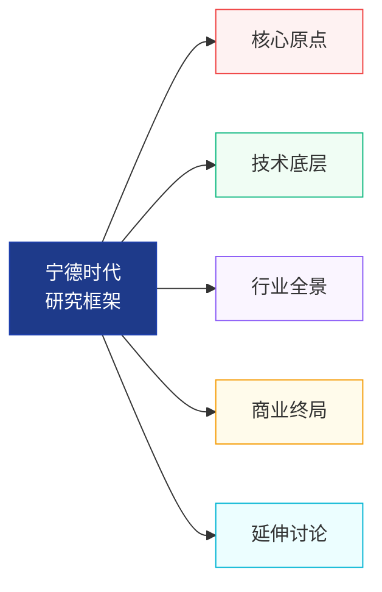
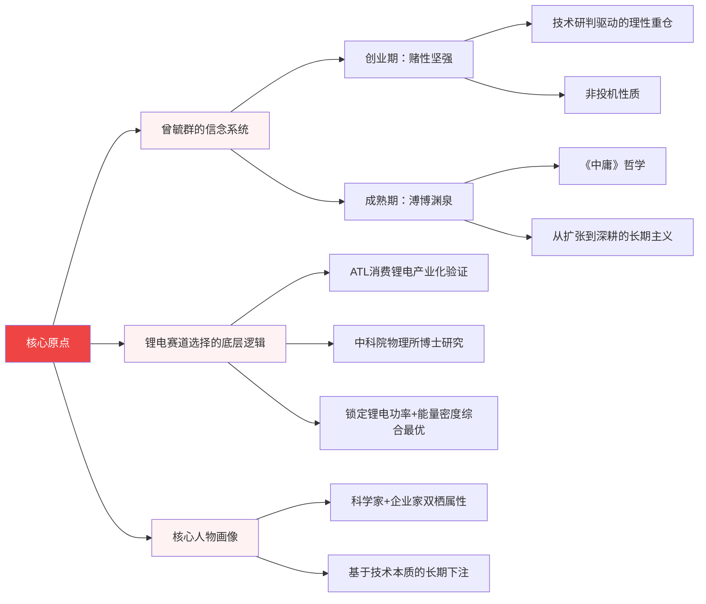
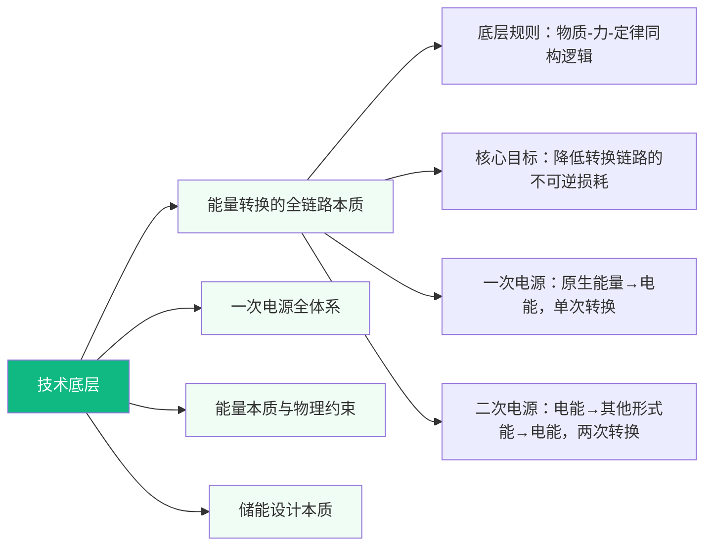
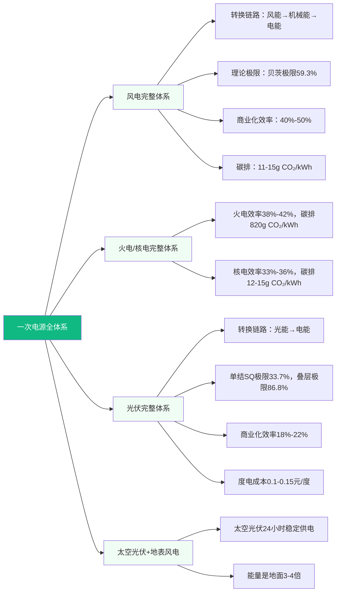
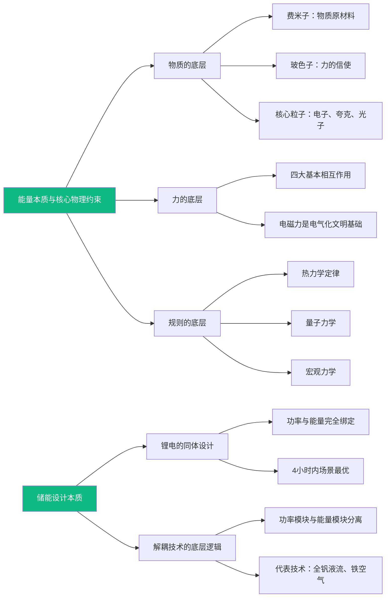
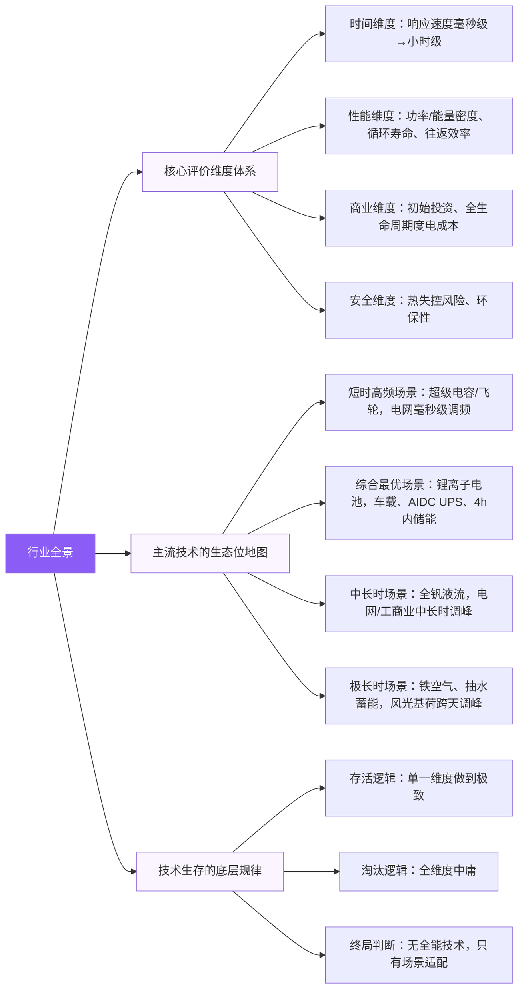
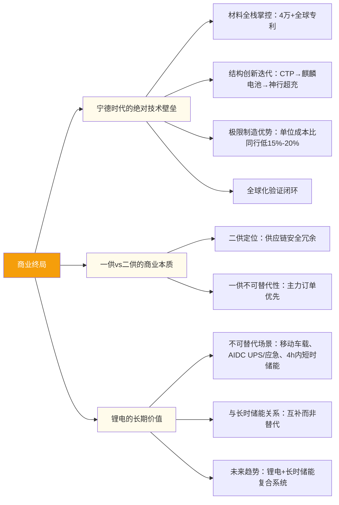
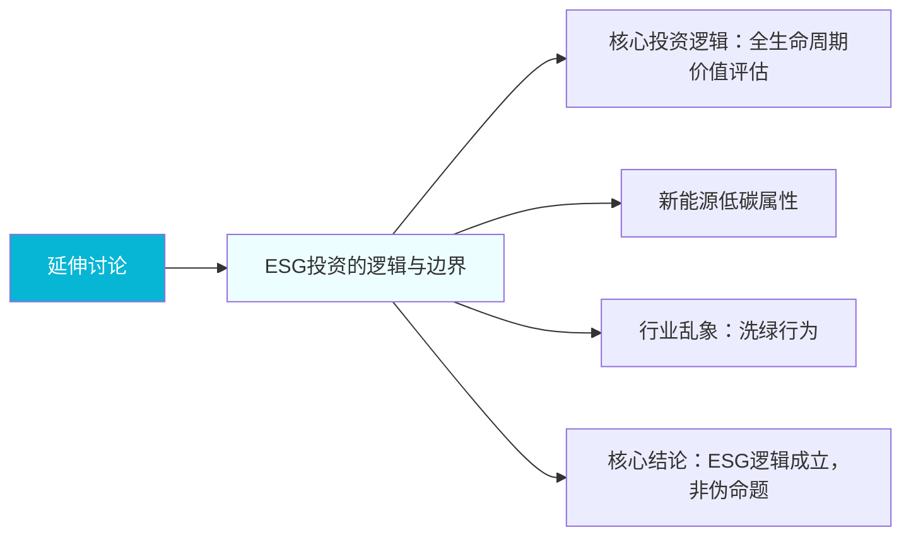

# 宁德时代研究 - Mermaid 横向思维导图

> 本文件使用 Mermaid Flowchart 语法，横向展开，避免层级过深

## 整体架构图

---

## 1. 核心原点：曾毓群的信念与决策逻辑

---

## 2. 技术底层：能量转换的全链路本质

### 2.1 能量转换本质与电源分类

### 2.2 一次电源全体系对比

### 2.3 能量本质与储能设计

---

## 3. 行业全景：储能全赛道的多维度生态位竞争框架

---

## 4. 商业终局：宁德时代的竞争壁垒与行业格局

---

## 5. 延伸讨论：ESG投资的逻辑与边界

---

## 使用说明

### 在 VS Code 中查看
1. 安装 **Markdown Preview Mermaid Support** 插件
2. 打开本文件，按 `Ctrl+Shift+V` 预览

### 在 GitHub 中查看
- 直接上传本文件到 GitHub 仓库，GitHub 会自动渲染 Mermaid 图表

### 在 Notion 中查看
1. 创建 Code 块
2. 选择语言为 `Mermaid`
3. 粘贴上述代码块内容

### 在 Typora 中查看
- Typora 原生支持 Mermaid，直接打开即可渲染

### 在线编辑器
- 访问 https://mermaid.live/ 粘贴代码进行编辑和导出
