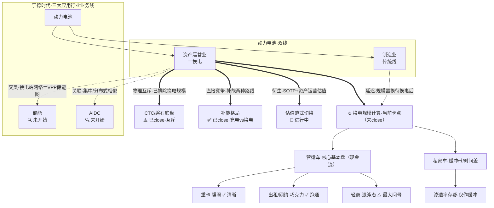

# 宁德时代 · 探索状态地图（换电主轴作战图）

> **最后更新**：2026-08-08（依用户纠偏重构：从"平行四主题"改为"换电主轴 + 衍生/交叉"结构，并新增第三节"换电计算作战图"）
> **性质**：状态索引（作战图），**不可作为任何测算/结论的信源**。
> **本图回答什么**：研究到哪了、谁是主轴、哪些口子开着、下一个该收哪个、哪些结论互相打架——**核心目的是帮"换电"这个还没 close 的战场把账算完**。
> **本图不重复什么**：[`_方法论索引/00_文件组织总览.md`](_方法论索引/00_文件组织总览.md) 管目录规则与三条红线；[`_方法论索引/02_主报告源材料映射表.md`](_方法论索引/02_主报告源材料映射表.md) 管"报告章节←源文件"血缘；[`业务/换电/readme.md`](业务/换电/readme.md) 管换电四层架构。本图只承载这三者都没有的：**状态 / 口子 / 张力 / 计算卡点**。
> **回顶层**：[`能源/研究探索地图.md`](../研究探索地图.md)（全域鸟瞰 + 留口子区 + 能源级轻索引）

---

## 〇、先校正视角：不是平行四主题，是"换电主轴 + 衍生网"

之前的地图把换电 / CTC / 制造 / 竞争格局画成一行平行的 ✅，这是**误导**。真实结构是这样的——

宁德时代的业务线**按应用行业分三大块**：动力电池、储能、AIDC。其中**动力电池**又分两条线：传统**制造业**，和正在尝试转型的**资产运营业**。而**资产运营业的业务载体，就是换电**。

所以你花大力气研究的 CTC、动力电池制造、补能竞争格局，**全都是因为做换电而延展出来的**，它们与换电之间是**横向的、有不同语义的关联**，而非并列关系：

| 延展主题 | 与换电的关系语义 | 状态 |
|---|---|---|
| CTC / 磐石底盘 | **物理互斥**（底盘把电池焊死，换电要求可拆卸）→ 算换电规模时要把 CTC 排除出去 | ⚠️ 已 close（昨天） |
| 补能格局（充电 vs 换电） | **直接竞争**（换电是补能的一种，另一类是充电） | ✅ 已 close |
| 动力电池制造受影响 | **延迟**：换电规模的"置换"要等换电算清，才能知道制造业被抽走/剩下多少 | 🔍 待算（换电之后） |
| 储能 | **交叉**：每个换电站＝小型储能站，全网＝VPP 储能网络 | 🔍 未开始 |
| AIDC | **关联**：集中/分布式特性相似（换电服务交通，AIDC 服务算力） | 🔍 未开始 |
| 估值范式切换（SOTP） | **由换电衍生**：制造业 PE → 资产运营 EV/EBITDA + 分部估值 | 🔄 进行中 |

**结论：换电是当前唯一未 close 的主轴；其它都是它的衍生/相关项，按各自状态推进，不抢戏。**

---

## 一、主题关联图（换电主轴放射）



图例：粗实线 `==>`＝已确认强关系 / 已 close 或主轴；虚线 `-.->`＝待定交叉 / 关联 / 延迟；文字状态图标见下。

---

## 二、各节点状态清单表（按衍生关系分组，非平行）

### A. 主轴（未 close）
| 主题 | 状态 | 一句话 | 代表文件 | 下一步 |
|---|---|---|---|---|
| **换电（资产运营业载体）** | 🔄 未 close | 基本盘＝营运车(现金流)+私家车(时间差)；规模账尚未算完，是当前战场 | [研究历史记录 §四](业务/换电/工作记录/研究历史记录.md) ＋ [超换一体_总纲](业务/换电/定性分析/超换一体_总纲.md) | **见第三节计算作战图** |
| **《换电框架》文档集群** | 🔄 未 close | `换电框架.md`(总纲)待回写，因 `换电框架-能量维度.md` 未做完；memo/纪要/思考框架为中间过程文档（见第九节血缘） | [换电框架.md](业务/换电/分析结论/换电框架.md) ＋ [能量维度](业务/换电/分析结论/换电框架-能量维度.md) | 先 finish `build_vpp_model` → 更新能量维度计算 → 回写总纲 |

### B. 互斥 / 竞争（已 close）
| 主题 | 状态 | 一句话 | 代表文件 |
|---|---|---|---|
| CTC / 磐石底盘 | ⚠️ 已 close（排除出换电规模） | 与换电物理互斥；已下沉为降本工具，算换电规模时把 CTC 路线排除 | [CTC研究](业务/技术/结构/CTC电池底盘一体化_研究.md) |
| 补能格局 | ✅ 已 close | 补能两路线：充电 vs 换电；现状＝比亚迪闪充网 + 华为开源超充网 vs 宁德换电 | [补能竞争格局_完整推演](业务/换电/定性分析/补能竞争格局_完整推演.md) |

### C. 交叉 / 关联（未开始）
| 主题 | 状态 | 一句话 | 代表文件 |
|---|---|---|---|
| 储能 | 🔍 未开始 | 与换电有**真实交叉**：换电站网络＝VPP 储能网络（非"虚假协同"，见第五节张力） | 全域独立分析空白 |
| AIDC | 🔍 未开始 | 与换电**有关联**：集中/分布式特性相似 | 仅战略研判期权提及 |

### D. 延迟 / 衍生
| 主题 | 状态 | 一句话 | 代表文件 |
|---|---|---|---|
| 动力电池制造受影响 | 🔍 待算（换电之后） | 换电电池资产取自制造；投向运营则制造业无即时财务产出。**规模置换要等换电算清** | [2030动力电池预估](业务/换电/定性分析/2030年动力电池业务线预估.md)（现版为未定稿假设） |
| 估值范式切换（SOTP） | 🔄 进行中 | 体系已成（PE→EV/EBITDA、REITs、财务模型）；触发前提＝换电利润量级够格 | [财务模型修正版](业务/换电/定性分析/宁德时代_超换一体站_财务模型_修正版.md) ＋ [估值影响](业务/换电/定性分析/换电业务相变与估值影响.md) |

> 状态图标：✅ 已 close ｜ 🔄 进行中 ｜ 🔍 待查/未开始/待算 ｜ ⚠️ 已 close 但有降级待查 ｜ 🔥 当前战场

---

## 三、🔥 换电计算作战图（当前卡点 · 最该看的一节）

> 目的：把"账还没算完"这件事拆清楚——**要算什么、现有资产在哪、卡在哪、算完怎么呈现**。

### 3.1 规模输入端（待算 · 卡点所在）
换电估值模型的所有参数，**最终都悬在"规模"上**。规模 = 两类服务对象：

```
换电规模（待算）
├── 营运车（核心基本盘·现金流）
│   ├── 重卡（骐骥）        ✓ 逻辑最顺，已纳入 2026·4000站规划 900 座
│   ├── 出租/网约（巧克力）  ✓ 高频~1.5次/日，重庆单城已盈利
│   └── 轻商（轻卡+微卡+微客）⚠️ 最大模糊变量·重要性或高于私家车（存量>重卡、带电量不低、电动化快，但无"巧克力/骐骥"式标准网络，渗透待定）
└── 私家车（缓冲带/时间差）  ⚠️ 渗透存疑，仅作缓冲（保有3.3亿，转化率待验）
```

**规模定不下来的两个根因（须先后算清）：**
1. **换电能带来的规模置换**：营运车三类渗透率 + 私家车渗透——即上图的分解树。
2. **车本身还有多少用宁德电池**：受 CTC / 自研电池车企（比亚迪、特斯拉）挤压的"缺口"有多大。

→ 这两块定下来，才能给下面模型中枢的"站数 / 车辆数"参数。

### 3.2 现有计算资产盘点（已就位，可复用）
| 资产 | 类型 | 覆盖到哪 | 路径 |
|---|---|---|---|
| `build_vpp_model.py` v7 | Python（参数化） | **模型中枢**：CAPEX→EAC→隐含EBITDA→EV→CATL权益；收益侧五线（套利/服务费/租金/需求响应/调频）交叉校验 | [分析结论/build_vpp_model.py](业务/换电/分析结论/build_vpp_model.py) |
| `model*.html` 系列 | HTML（单站经济） | 单站利用率 / 日均换电 / 租金 / 服务费 / CAPEX 敏感性 | [财务模型/model.html](业务/换电/财务模型/model.html) 等 |
| `换电毛估估-简/繁v1.html` | HTML | 毛估估量级 | [分析结论/换电毛估估-简v1.html](业务/换电/分析结论/换电毛估估-简v1.html) |
| `超换一体_总纲.md` | MD（四层骨架） | 战略→推演→财务→估值 导航 | [定性分析/超换一体_总纲.md](业务/换电/定性分析/超换一体_总纲.md) |
| `_archive/` 8 个 py | Python（早期） | city / network / station 探索，归档参考 | [分析结论/_archive/](业务/换电/分析结论/_archive/) |

### 3.3 计算链路（一张图）
```
规模输入端(待算 3.1) ──定参──▶ 模型中枢(已有 3.2: build_vpp_model v7)
                                        │ CAPEX→EAC→隐含EBITDA→EV→权益
                                        ├─ 交叉校验：收益侧五线(服务费/租金/套利/需求响应/调频)
                                        ▼
                              估值结论(SOTP 是否触发·量级是否够格)
                                        │
                                        ▼
                              呈现目标：HTML/MD 组合文档 + Python 实时计算后端
```
> `build_vpp_model.py` 已是**集中参数、改一处联动全模型**的结构，天然适合做"实时计算后端"；算完后应将其包装为可调用的计算工具，配一份清晰的 HTML/MD 组合说明。

### 3.4 还差什么 / 下一步（呼应研究历史记录 §七 三选一）
1. **算细账**：纯营运车视角的换电经济模型（单站利用率、日均换电、租金、服务费、CAPEX），验证 2026 年 4000 站财务可行性 → 回答"换电利润量级是否够格触发 SOTP"。
2. **摸轻商**：扫轻商（轻卡+微客/Van）换电现存玩家与标准（江淮、深圳地铁试点），判断复用巧克力站还是另起炉灶——**当前模型最大模糊变量**。
3. **补 §六三待查**（顺带摸到的产业底层，影响"宁德能否不被边缘化"）：① CTC 合作能否锁订单保毛利；② 磐石/CIIC vs 滑板底盘卡位；③ CTC+滑板+换电是否穷尽车企生存状态。

---

## 四、未决张力（不可抹平，待决）

### ⚠️ 张力一：换电↔储能/AIDC 的"关联性质"待决（依 2026-08-08 纠偏重述）
- **客观层（真实交叉/关联，成立）**：你明确——换电↔储能有真实物理交叉（每个换电站＝小型储能站，全网＝VPP 储能网络）；换电↔AIDC 有集中/分布式相似性关联。这**不是"虚假协同"**，是客观存在的业务交叉。
- **战略层（仍踩坑三风险）**：[`2030年业务线战略研判.md` Q4/Q5](业务/换电/定性分析/2030年业务线战略研判.md) 据此主张"应着力发展换电+储能""资源向换电网络与储能集中"，把交叉串成"协同大故事"。而[`研究历史记录.md` 坑三](业务/换电/工作记录/研究历史记录.md)将"串联 AIDC、储能、换电凑大故事"判为**虚假协同**（源于贪业务协同故事）。
- **裁决**：客观关联成立 ≠ 战略上应据此串大故事、加大投入。**先 close 换电本身**，再分别评估各真实交叉的投资含义，不预先下协同定论。标为待决、不抹平。
- 补充：换电结论文件[`最优共振姿态·过程版` §终极叙事](业务/换电/分析结论/CATL换电业务_最优共振姿态_过程版_20260622.md) 以"地球零碳智能能量网"串换电/储能/AIDC/回收——属愿景叙述、非投资定论，与张力并存，一并待决。

### ⚠️ 张力二：储能"梯次利用"协同 vs 换电站套利被证伪（需区分层次）
- 战略研判 Q4 主张退役电池（~80% SOH）梯次做储能，拉长资产寿命——属**资产全生命周期处置**层面。
- 复盘§二已证伪**换电站作为分布式储能做峰谷套利**（保供＞套利、单程套利、容量电价冲突）——属**站端实时调度**层面。
- 二者层次不同，**不矛盾但需区分**，以免与张力一的"VPP 真实交叉"混为一谈。（注意：VPP 资产交叉 ≠ 站端实时套利，前者成立、后者已证伪。）

### ⚠️ 张力三：§六 产业终局三待查整体"待研究"
- [`研究历史记录 §六`](业务/换电/工作记录/研究历史记录.md) 三条待查（CTC 锁单保毛利 / 磐石卡位 / 是否穷尽车企状态）整节标"待研究"，且**直接关系宁德能否不被边缘化**。
- 其中"覆盖裂缝"（垂直一体化+自研电池的比亚迪/特斯拉插不进；"先用后自研"博世式反噬）是换电/底盘研究的底层未决项，待补。

---

## 五、留口子区（坑二发散分支 · 已关闭但留回接）

> 这些分支被主动关闭，但**留了回接触发条件与回接锚点**——下次真去"开疆拓土"研究芯片/AI/信息变现时，顺着这里回接，发散不白费。

| 分支 | 当时为何被吸引（坑二） | 关闭原因 | 回接触发条件 | 回接锚点 |
|---|---|---|---|---|
| 贝壳 ACN 类比 | 换电站＝电池流通网络，联想贝壳资产流通网络 | 宁德是球员兼裁判、数据缺公信力；信息无法对外货币化（复盘§二） | 若宁德做独立第三方能源数据平台/中立角色 | [研究历史记录 §二](业务/换电/工作记录/研究历史记录.md) |
| 电池↔半导体↔AI 同构 | 电池与芯片同是电子有序流动，误以为研究能力可跨领域泛化 | 电池重点是能量非信息；过早泛化未 close 当下 | 真去研究芯片/AI 投资时 | [研究历史记录 §七·坑二](业务/换电/工作记录/研究历史记录.md) |
| 电池全生命周期数据信息变现 | 做电池界"楼盘字典"收佣金 | 保费自己交、体系外数据拿不到、二手车商无需求 | 出现中立电池数据市场/保险外部化 | [研究历史记录 §二 表](业务/换电/工作记录/研究历史记录.md) |
| 换电站储能套利（V2G/峰谷） | "免费用电池"幻觉 | **站端实时套利已证伪**（复盘§二/§三）；但注意：这≠"换电↔储能 VPP 交叉"被否（见张力二/张力一） | 站端余电调度技术突破/电价机制变 | [研究历史记录 §二/§三](业务/换电/工作记录/研究历史记录.md) |

---

## 六、待查锚点汇总（开放边）

**A. 复盘 §六 三条待查（产业终局路线，整节标"待研究"）**
1. 🔍 **待查一**：不自研电池的车企做 CTC，能否反向锁死宁德订单与毛利（联合研发是否≈锁定车型+保毛利）？
2. 🔍 **待查二**：滑板底盘赛道宁德（磐石/CIIC）能争到什么位置？vs 悠跑 / Rivian / Canoo（已破产）。
3. 🔍 **待查三（关键）**：CTC合作 + 滑板底盘 + 换电，是否穷尽车企生存状态？①覆盖不全（垂直一体化+自研电池的比亚迪/特斯拉插不进）；②覆盖会衰减（"先用后自研"博世式反噬）。

**B. CTC 研究 §7 降级待查（已闭环 9 项，余 3–4 项）**
- 电芯级（单模组）现场维修能否实现【待查·降级】
- CTC 车型销量渗透率（乘联会上险数据）【待查】
- 精算级保费费率表【待查】
- 比亚迪 PPM 官宣【待查·降级】

**C. 其它开放边**
- 换电结论的"轻商（轻卡+微客/Van）"渗透率为最大模糊变量，模型暂以低渗透假设+标记待跟踪（见第三节 3.1/3.4）。
- 动力电池制造的"规模置换"影响，须等换电规模（3.1）算清后才能定论，当前预估文件属未定稿假设。

---

## 七、研究重心提示（校正）

- 全库 137 个 md，**换电独占约 85 个（62%）**——研究重心**长期压在换电**，而非"迁往 CTC"。CTC 是顺带延展的**互斥排除项**（已 close），不是新战场。
- **真正的未 close 主轴＝换电本身**；最该推进的不是"补储能独立研究"（那是未开始、非短板），而是**把换电规模账算完**（第三节）。
- 储能 / AIDC 是**未开始**（非"最薄弱空域"），按你的规划排在其后，不必现在抢跑——这正是对坑三"贪协同"的正面约束。

---

## 八、更新纪律（30 秒）

- **触发即更新**：每次完成一个课题 close、新开一个待查、或发现一处未决张力时，改对应节点状态 + 日期。
- **本文件不长大**：只写状态不写论证；所有结论回链原文件，地图内不出现无出处的新数字（推断项标"（推断）"）。
- **防过期**：`当前思考.md` / `README.md` 已停更于 2026-04-13，本图以"轻量 + 更新纪律"避免沦为第三个过期文件。
- **换电是主轴**：任何换电相关进展，优先更新第三节"计算作战图"与第一节"主轴"状态。

---

## 九、文档血缘与整理计划（依 2026-08-08 用户补充）

> 本节专门承载"文档间写作先后/分叉关系"与"怎么整理这堆过程文档"——这是状态图之外、本次新补的维度。

### 9.1 换电框架文档集群（未 close 根因）
- `换电框架.md`(总纲)＝目标成品，**未 close**：原计划两维度做完后回写，但 `换电框架-能量维度.md` 未做完 → 总纲未回写。
- 中间过程文档（都"有用但命名看不出阶段"，待重命名/归并）：`换电框架memo.md`(整体框架思考的坑/待决)、`换电框架-信息维度讨论会议纪要.md`(信息维度讨论)、`画面框架思考框架.md`(元层"怎么想这件事"，卡壳时回看)。处置见 9.4。

### 9.2 早期"最优共振姿态"阶段（正算时代产物）
- `CATL换电业务_最优共振姿态_过程版_20260622.md`＝草稿；`重构版`＝其最终结论。
- 背景：进入两维度测算前，先想下"业务是否处于最优共振姿态"的定性报告，定量来自正算 model。当时未想做倒算（以为正算可出结论），但数字总不理想→才转倒算。
- 该阶段整体属**正算时代**；仅以下 3 个文件是后来倒算阶段产出，须**单独拎回倒算桶**：
  1. `2030年的动力电池业务线预估.md`
  2. `2030年的业务线战略研判.md`
  3. `换电能否再造一个宁德苏格拉底拆解.md`

### 9.3 定性分析目录再分类
- **倒算阶段产物（3 个，见 9.2）**：上述三文件。
- **正算时代产物（其余绝大多数）**：原"完整分析报告"基础材料。原设想分工：MD定性 + model定量 → 统一生成总 HTML（宁德时代根目录`报告/`）;MD 推导数值也从 model 回填;假设参数用 MD/JSON 界定、逻辑写 MD 并触发测算;最后回填 MD → 呈现在报告 HTML。该"MD+model→HTML报告"流水线未完成，属正算时代遗留。

### 9.4 命名规范提案（解决"过程文档看名不知阶段"）
文件名语法：`【主题】·【角色】·【日期/版本】.md`
- **角色词表**：框架(目标成品)／维度-能量／维度-信息／memo(坑与待决)／纪要(与AI讨论)／思考框架(元层)／过程版／定稿-重构版／实验-苏格拉底
- **配套机制**：所有过程文档入 `过程/` 子目录；必须在 `研究历史记录.md` 登记（文件名→用途→阶段→状态→已吸收进哪个成品）。这正是该文件已在做的事，续用为总索引。
- **成品 vs 过程分离**：使"留一份成品 + 一份迭代记录"自然成立。
- **苏格拉底实验**：作 `过程/实验-苏格拉底拆解·结论：暂不可行.md`，索引标"失败但留方法论教训，供未来训懂你的 Agent 用"。

### 9.5 修改意见 → 溶解为两方法文档（原文件可消失）
`修改意见.md` 是倒算过程产物，其中 Python 报错细节已不重要，须保留的是两个方法论决策：
- **方法一（估值倍数）**：3×3 敏感性矩阵（情景×倍数，中枢取稳健×18×；可选"对角线叙事一致情景"）。→ 并入 `换电框架` 估值章节或独立 `估值倍数·3x3矩阵法.md`
- **方法二（CAPEX 摊销）**：EAC 等效年金法（把第4/8年脉冲式电池更换折现后并入初始投资再×CRF；批判旧"调整比例=1+(折旧−更新)/(CAPEX×CRF)"四不像）。→ 并入 `换电框架-能量维度.md` 方法论或独立 `倒算方法论·CRF批判与EAC等效法.md`

### 9.6 README / 讨论思路 处置
- `readme.md`：**保留**，待全部整理完写新 README 覆盖；旧内容留作写"研究历史记录"参考。
- `讨论思路.md`：战略阶段产物，与最新两维度框架不一致 → 标**过期**（不入倒算主线）。
