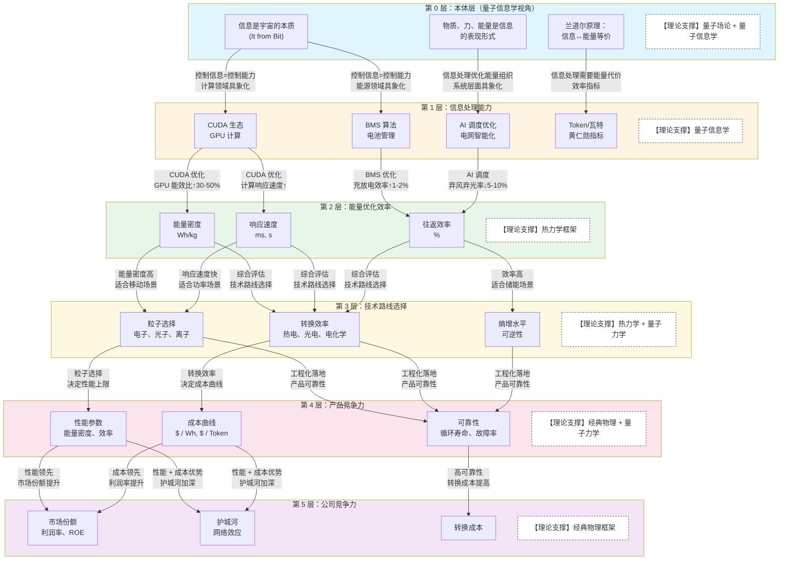

# 能量 - 信息统一投资框架

## 核心投资问题

> **能源与信息的物理本质是否统一？投资宁德时代与投资英伟达的底层逻辑是否相同？**
> **当前基于"电子可控性"的产业基础是否会被颠覆？**

要回答这个问题，需要理解五个递进问题：

1. **什么是量子？**（物理本质科普）
2. **能量利用的本质是什么？**（为什么人类需要能源）
3. **信息的本质是什么？**（信息与能量的关系）
4. **如何从物理底层推导到公司竞争力？**（五层传导机制）
5. **不同理论框架下的投资逻辑差异？**（框架对比与选择）

***

## 第一部分：物理本质认知——理论基础与局限性

### 1.1 理论体系的演进与量子理论详解

#### 1.1.1 理论演进图谱（宏观概览）

```
理论演进时间线
│
├── 经典物理（1687-1900）
│   └── 牛顿力学、麦克斯韦电磁理论
│   └── 世界观：物质是实体，能量守恒，决定论
│
├── 热力学（1824-1900）
│   └── 能量守恒、熵增定律
│   └── 世界观：能量转换有方向性，效率有上限
│
├── 量子力学（1900-1927）
│   └── 波粒二象性、不确定性原理
│   └── 世界观：能量量子化，测量影响结果
│
├── 量子场论（1927-1970s）
│   └── 标准模型、费曼图、规范场论
│   └── 世界观：物质和力都是场的激发态
│
└── 量子信息学（1980s-至今）
    └── 量子计算、兰道尔原理、It from Bit
    └── 世界观：信息是宇宙的本质
```

**关键洞察**：每个理论都是对前一个理论的**深化而非否定**，投资研究需要**多层理论叠加**。

#### 1.1.2 什么是量子？

**量子**（Quantum）：不是粒子，而是**物理量的最小不可分割单位**

**通俗比喻**：

- 金钱的"量子"是 1 分钱（不能再分割）
- 能量的"量子"是光子（一份一份的能量包）
- 角动量的"量子"是 ℏ（普朗克常数除以 2π）

**关键洞察**：

- "量子化" = "不连续" = "一份一份的"
- 经典物理：能量连续（可以任意小）
- 量子物理：能量量子化（有最小单位）

**为什么需要这个概念？** 因为要理解锂电的本质，必须理解电子的能级跃迁是量子化的，这决定了电池电压和能量密度的理论上限。

#### 1.1.3 三个量子理论的关系

| 理论        | 出现时间       | 研究对象        | 量子的含义     | 与前代理论的关系       | 投资研究用途    |
| --------- | ---------- | ----------- | --------- | -------------- | --------- |
| **量子力学**  | 1900-1927  | 微观粒子（电子、原子） | 能量、角动量量子化 | 否定经典物理的连续性假设   | 理解电池能级跃迁  |
| **量子场论**  | 1927-1970s | 场（电磁场、电子场）  | 粒子是场的量子激发 | 兼容量子力学 + 狭义相对论 | 判断电磁力稳定性  |
| **量子信息学** | 1980s-至今   | 信息（比特、量子比特） | 信息是物理的    | 用量子力学语言描述信息    | 统一能源与信息投资 |

**演进逻辑**：

```
量子力学：发现能量是量子化的（一份一份）
    ↓
量子场论：发现粒子本身也是量子化的（场的激发）
    ↓
量子信息学：发现信息可能也是量子化的（量子比特）
```

**不是互相否定，而是层层深化**：

- 量子力学没有否定量子场论，而是**基础**
- 量子场论没有否定量子信息学，而是**数学工具**
- 量子信息学是**新视角**，用信息论重新理解量子力学

**投资含义**：不同理论回答不同问题，需要**多层理论叠加**，而非单一理论依赖。

### 1.2 能量利用的本质——人类为什么需要能源？

**核心问题**：什么是"好用"的能量？

人类选择能源的标准是什么？**四个维度**：

| 维度        | 含义           | 物理本质         | 投资含义     |
| --------- | ------------ | ------------ | -------- |
| **能量密度**  | 单位质量/体积蕴含的能量 | J/kg 或 Wh/kg | 决定应用场景   |
| **可控性**   | 能否按需获取和释放    | 响应速度 + 精准度   | 决定技术路线   |
| **获取便利性** | 开采/转换的难易程度   | 能量转换效率       | 决定成本曲线   |
| **清洁性**   | 使用后的副作用      | 熵增 + 污染      | 决定长期可持续性 |

**人类能源利用的演进史**：

| 阶段       | 主要能源   | 能量密度 | 可控性    | 获取便利性 | 清洁性 | 综合评分 |
| -------- | ------ | ---- | ------ | ----- | --- | ---- |
| **钻木取火** | 生物质能   | 低    | 低      | 低     | 低   | ⭐    |
| **煤炭时代** | 化学能（煤） | 中    | 中      | 中     | 低   | ⭐⭐   |
| **石油时代** | 化学能（油） | 高    | 中      | 高     | 低   | ⭐⭐⭐  |
| **电气时代** | 电能     | 高    | **极高** | 高     | 中   | ⭐⭐⭐⭐ |
| **未来**   | 核能？    | 极高   | 低      | 中     | 高   | ❓    |

**关键洞察**：

- 人类能源选择的本质：**在四个维度之间寻找最优平衡**
- 电能之所以成为主流，不是因为能量密度最高，而是因为**可控性最高**
- **可控性 = 信息处理能力**（需要精准控制电子流动）

### 1.3 信息的本质

**核心问题**：信息是什么？信息与物质、能量、力是什么关系？

#### 1.3.1 信息的定义演进

| 理论体系        | 对信息的认知                 | 物理地位   |
| ----------- | ---------------------- | ------ |
| **经典物理**    | 未定义                    | 无      |
| **热力学**     | 熵的负值（玻尔兹曼）             | 统计概念   |
| **信息论**（香农） | 不确定性的度量（比特）            | 数学概念   |
| **量子力学**    | 未定义                    | 无      |
| **量子场论**    | 场的副产品                  | 派生概念   |
| **量子信息学**   | **宇宙的本质**（It from Bit） | **本体** |

#### 1.3.2 信息与能量的关系

**兰道尔原理**（Landauer's Principle，1961）：

**定义**：擦除 1 比特信息，至少需要消耗 $kT \ln 2$ 的能量（约 3×10⁻²¹ 焦耳，室温下）

**含义**：

- 信息与能量是等价的
- 信息处理需要能量代价
- 为"万物源于比特"提供物理基础

**实验验证**：

- **2018 年**：法国科学家在《Nature》发表实验验证
  - 精确测量了信息擦除的能量消耗
  - 实验结果与理论预测一致
  - **首次证明信息与能量确实等价**

**投资含义**：

- AI 耗能是物理必然，不是技术缺陷
- 节能算法的价值在于接近兰道尔极限
- 能源与信息的融合是物理必然

#### 1.3.3 黄仁勋 Token 经济学的物理基础

**Token 经济学的核心概念**：

| 概念           | 含义                    | 物理本质       |
| ------------ | --------------------- | ---------- |
| **Token**    | AI 处理信息的最小单元          | 信息的"量子"    |
| **Token/瓦特** | 每消耗 1 瓦特能量产生的 Token 数 | 能量→信息的转换效率 |
| **AI 工厂**    | 将电能转换为智能的工厂           | 能量→信息的转换器  |

**黄仁勋的洞察**：

> "未来 AI 算力需求将达到 1 万亿美元，衡量标准是每瓦特 Token 数"

**物理本质**：

- AI 训练：电能 → 信息（模型权重）
- AI 推理：电能 + 信息 → Token（智能输出）
- **Token/瓦特 = 兰道尔原理的工程化指标**

**投资含义**：

- AI 耗能不是技术缺陷，而是**物理必然**
- 节能算法的价值 = 接近兰道尔极限的程度
- **能源与信息的融合是物理必然**

### 1.4 各理论对"物质、力、能量、信息"的定义对比

| 理论体系      | 物质            | 力                | 能量                    | 信息                     | 核心关系               |
| --------- | ------------- | ---------------- | --------------------- | ---------------------- | ------------------ |
| **经典物理**  | 实体粒子（有质量、占空间） | 粒子间的相互作用（引力、电磁力） | 做功的能力（守恒）             | 未定义                    | 物质在力的作用下运动，能量守恒    |
| **热力学**   | 大量粒子的统计集合     | 未明确定义            | 转换与守恒（第一定律）+ 熵增（第二定律） | 未定义                    | 能量转换伴随熵增，效率有上限     |
| **量子力学**  | 波粒二象性（概率波）    | 势能场中的相互作用        | 能级跃迁的量子化              | 未定义                    | 物质和能量都是量子化的，测量影响结果 |
| **量子场论**  | 费米子场的激发态      | 玻色子场的激发态（传递相互作用） | 场激发态转换的度量             | 未定义                    | 物质和力都是场的不同激发模式     |
| **量子信息学** | 信息的编码形式       | 信息传递的媒介          | 信息改变的代价（兰道尔原理）        | **宇宙的本质**（It from Bit） | 物质、力、能量都是信息的表现形式   |

### 1.5 各理论的"相对正确性"评估

**为什么要评估相对正确性？** 因为没有绝对正确的理论，只有适用范围不同的理论。投资框架需要根据投资目标选择合适的理论。

| 理论        | 适用范围              | 被证伪风险         | 投资研究适用性 | 对应投资目标             |
| --------- | ----------------- | ------------- | ------- | ------------------ |
| **经典物理**  | 宏观低速（>1μm, <0.1c） | 高（微观失效）       | ✅ 工程计算  | **短期交易**（1-3 年）    |
| **热力学**   | 所有尺度（统计规律）        | 极低（数学定理级别）    | ✅ 效率判断  | **技术路线对比**（3-10 年） |
| **量子力学**  | 微观尺度（<100nm）      | 中（与广义相对论矛盾）   | ✅ 极限判断  | **中期成长**（10-20 年）  |
| **量子场论**  | 微观 + 高能           | 中（暗物质/暗能量未解释） | ⚠️ 认知锚点 | **长期价值**（50-100 年） |
| **量子信息学** | 所有尺度（新兴理论）        | 高（仍在发展中）      | ⚠️ 哲学指导 | **能源 + 信息融合**      |

**关键洞察**：

- **短期**看基本面（经典物理 + 热力学）
- **中期**看技术极限（量子力学）
- **长期**看物理基础稳定性（量子场论）
- **融合**趋势需要统一理论（量子信息学）

***

## 第二部分：能量 - 信息统一投资框架——五层传导机制

### 2.1 框架选择指南

基于 1.5 节的相对正确性评估，我们根据**投资目标**选择合适的理论框架：

| 投资目标          | 时间尺度    | 推荐框架         | 选择理由（基于 1.5）       |
| ------------- | ------- | ------------ | ------------------ |
| **短期交易**      | 1-3 年   | 经典物理 + 热力学   | 宏观低速范围内有效，工程计算准确   |
| **中期成长**      | 3-10 年  | 量子力学 + 量子信息学 | 微观尺度判断技术极限，信息学指导融合 |
| **长期价值**      | 10-50 年 | 量子场论 + 量子信息学 | 判断物理基础稳定性，认知锚点     |
| **能源 + 信息融合** | 所有尺度    | 量子信息学        | 统一理论，符合产业趋势        |

### 2.2 五层传导机制（自上而下）

基于以上框架选择，我们建立**能量 - 信息统一投资框架**的五层传导机制。采用**自上而下**的视角，从物理本质层层推导到公司竞争力：



**图表说明**：
- **自上而下**：从物理本质（第 0 层）推导到公司竞争力（第 5 层）
- **具体传导**：箭头标注了**具体的传导路径**（谁→谁，如何传导）
- **量化指标**：传导箭头上标注了具体的量化效果（如"效率↑1-2%"）
- **领域具象化**：第 0 层原理在不同领域的具象化路径（能源、计算、系统）
- **理论支撑**：每层都有对应的理论基础（虚线框标注）

### 2.3 各层传导逻辑详解

#### 第 0 层 → 第 1 层：本体支撑（信息是本质→控制能力）

**传导逻辑**：
```
第 0 层三条原理 → 第 1 层四个具象化

原理 1：信息是宇宙的本质 (It from Bit)
    ↓ 传导：控制信息 = 控制能力
    ├→ 能源领域具象化：BMS 算法（控制电池充放电）
    └→ 计算领域具象化：CUDA 生态（控制 GPU 计算）

原理 2：物质、力、能量是信息的表现形式
    ↓ 传导：信息处理可优化能量组织
    └→ 系统层面具象化：AI 调度优化、电网智能化

原理 3：兰道尔原理：信息↔能量等价
    ↓ 传导：信息处理需要能量代价
    └→ 效率指标：Token/瓦特（衡量能量→信息的转换效率）
```

**第 0 层三条原理的传导**：
| 第 0 层原理 | 传导逻辑 | 传导路径 | 第 1 层具象化 |
|-----------|---------|---------|------------|
| 信息是宇宙的本质 | 控制信息=控制能力 | 能源领域 | BMS 算法（电池管理） |
| 信息是宇宙的本质 | 控制信息=控制能力 | 计算领域 | CUDA 生态（GPU 计算） |
| 物质、力、能量是信息的表现形式 | 信息处理可优化能量组织 | 系统层面 | AI 调度优化、电网智能化 |
| 兰道尔原理：信息↔能量等价 | 信息处理需要能量代价 | 效率指标 | Token/瓦特（黄仁勋指标） |

#### 第 1 层 → 第 2 层：信息控制（算法优化→效率提升）

**传导逻辑**：
```
第 1 层四个能力 → 第 2 层三个效率指标

BMS 算法优化
    ↓ 传导：优化电池充放电策略
    └→ 往返效率↑1-2%

CUDA 生态优化
    ├→ 传导：优化 GPU 计算能效 → 能量密度↑（Wh/kg）
    └→ 传导：优化计算调度 → 响应速度↑（ms, s）

AI 调度优化
    ↓ 传导：优化电网能量分配
    └→ 往返效率↑（弃风弃光率↓5-10%）
```

**具体传导路径**：
| 第 1 层能力 | 传导逻辑 | 传导路径 | 第 2 层指标 | 量化效果 |
|-----------|---------|---------|-----------|---------|
| BMS 算法 | 优化充放电策略 | 电池管理 | 往返效率 | ↑1-2% |
| CUDA 生态 | 优化计算能效 | GPU 计算 | 能量密度 | ↑30-50% |
| CUDA 生态 | 优化计算调度 | GPU 计算 | 响应速度 | 显著提升 |
| AI 调度优化 | 优化电网分配 | 电网智能化 | 往返效率 | 弃风弃光率↓5-10% |

#### 第 2 层 → 第 3 层：物理认知（效率→场景匹配）

**传导逻辑**：
```
第 2 层三个指标 → 第 3 层三个路线选择

能量密度高 (Wh/kg)
    ↓ 传导：单位质量能量高 → 适合移动场景
    └→ 粒子选择：电子（锂电）

响应速度快 (ms, s)
    ↓ 传导：快速响应 → 适合功率场景
    └→ 粒子选择：电子（超级电容）

效率高 (%)
    ↓ 传导：低损耗 → 适合储能场景
    └→ 熵增水平：低熵增（可逆）

综合评估 → 转换效率：热电、光电、电化学
```

**具体传导路径**：
| 第 2 层指标 | 传导逻辑 | 第 3 层选择 | 典型技术 |
|-----------|---------|-----------|---------|
| 能量密度高 | 适合移动场景 | 粒子选择：电子 | 锂电（电动汽车） |
| 响应速度快 | 适合功率场景 | 粒子选择：电子 | 超级电容（调频） |
| 效率高 | 适合储能场景 | 熵增水平：低熵增 | 锂电（时移） |
| 综合评估 | 多指标权衡 | 转换效率 | 热电、光电、电化学 |

#### 第 3 层 → 第 4 层：工程化能力（路线→产品）

**传导逻辑**：
```
第 3 层三个选择 → 第 4 层三个产品指标

粒子选择（电子、光子、离子）
    ↓ 传导：决定性能上限
    └→ 性能参数（能量密度、效率）

转换效率（热电、光电、电化学）
    ↓ 传导：决定成本曲线
    └→ 成本曲线（$ / Wh, $ / Token）

熵增水平（可逆性）
    ↓ 传导：决定可靠性
    └→ 可靠性（循环寿命、故障率）
```

**具体传导路径**：
| 第 3 层选择 | 传导逻辑 | 第 4 层指标 | 影响 |
|-----------|---------|-----------|-----|
| 粒子选择 | 决定性能上限 | 性能参数 | 能量密度、效率 |
| 转换效率 | 决定成本曲线 | 成本曲线 | $ / Wh, $ / Token |
| 熵增水平 | 决定可靠性 | 可靠性 | 循环寿命、故障率 |

#### 第 4 层 → 第 5 层：商业化能力（产品→市场）

**传导逻辑**：
```
第 4 层三个指标 → 第 5 层三个竞争力

性能参数领先
    ↓ 传导：客户偏好高性能
    └→ 市场份额提升

成本曲线领先
    ↓ 传导：低成本→高利润率
    └→ 利润率提升

性能 + 成本双领先
    ↓ 传导：网络效应形成
    └→ 护城河加深

可靠性高
    ↓ 传导：用户粘性提高
    └→ 转换成本提高
```

**具体传导路径**：
| 第 4 层指标 | 传导逻辑 | 第 5 层竞争力 | 商业结果 |
|-----------|---------|-----------|---------|
| 性能参数领先 | 客户偏好高性能 | 市场份额 | 市占率提升 |
| 成本曲线领先 | 低成本→高利润 | 利润率 | ROE 提升 |
| 性能 + 成本双领先 | 网络效应 | 护城河 | 长期竞争优势 |
| 可靠性高 | 用户粘性 | 转换成本 | 锁定效应 |

### 2.4 理论矛盾与投资机会

**为什么要了解矛盾点？** 因为矛盾点意味着认知分歧，认知分歧产生定价错误，定价错误产生投资机会。

#### 2.4.1 理论矛盾如何推导投资机会

**传导逻辑**：

```
理论矛盾
    ↓
认知分歧（市场参与者相信不同理论）
    ↓
定价错误（基于不同认知的估值差异）
    ↓
投资机会（认知统一时的价值重估）
```

#### 2.4.2 核心理论矛盾与投资含义

| 矛盾点      | 经典物理 vs 量子力学 | 量子场论 vs 量子信息学    |
| -------- | ------------ | ---------------- |
| **物质本质** | 实体粒子 vs 概率波  | 场激发态 vs 信息编码     |
| **确定性**  | 决定论 vs 概率论   | 决定论（场方程）vs 信息本体论 |
| **信息地位** | 未定义          | 副产品 vs 宇宙本质      |
| **极限判断** | 无极限概念        | 热力学极限 vs 认知极限    |
| **投资含义** | 可预测 vs 不可预测  | 物理极限 vs 认知极限     |

**具体示例：信息地位矛盾**

| 理论        | 对信息的认知   | 对 AI 的估值     | 投资含义 |
| --------- | -------- | ------------ | ---- |
| **量子场论**  | 信息是场的副产品 | AI 不值钱（只是工具） | 低估值  |
| **量子信息学** | 信息是本体    | AI 值钱（宇宙本质）  | 高估值  |

**如果量子信息学正确**：

- AI 不是工具，而是**生产力本身**
- 英伟达、OpenAI 应该享受**更高估值**
- **当前定价错误 = 投资机会**

**如果量子场论正确**：

- AI 只是工具，最终服务于能源
- 能源公司（宁德时代）应该享受**更高估值**
- **当前定价错误 = 投资机会**

#### 2.4.3 理论与实践矛盾→价值洼地

| 矛盾点       | 理论要求             | 实际状态         | 差距        | 投资机会       |
| --------- | ---------------- | ------------ | --------- | ---------- |
| **AI 能效** | 兰道尔极限极低          | AI 耗能巨大      | 1000 倍+   | ✅ 节能算法公司   |
| **电网智能化** | 全局优化理论上可行        | 实际推进缓慢       | 10-20 年   | ✅ 电网 AI 公司 |
| **氢能效率**  | 理论效率 60%+        | 实际 30-40%    | 2 倍       | ✅ 电解槽技术突破  |
| **固态电池**  | 理论能量密度 500 Wh/kg | 实际 300 Wh/kg | 1.7 倍     | ✅ 固态电解质研发  |
| **光伏效率**  | 理论极限 33%         | 实际 20-25%    | 1.3-1.6 倍 | ✅ 钙钛矿技术    |

**为什么这些是价值洼地？**

1. **AI 能效**：当前 GPU 能效比距离兰道尔极限还有 1000 倍差距，每提升 10 倍就是 10 倍市场空间
2. **电网智能化**：AI 电网渗透率<10%，理论渗透率>50%，5 倍空间
3. **氢能效率**：当前 20-30%，理论极限 60%，2-3 倍效率提升空间

#### 2.4.4 投资机会矩阵

| 维度      | 短期（1-3 年）      | 中期（3-10 年） | 长期（10-50 年） |
| ------- | -------------- | ---------- | ----------- |
| **能源侧** | 锂电渗透率 30%→50%  | 固态电池商业化    | 核聚变突破       |
| **信息侧** | AI 渗透率 10%→30% | 量子计算实用化    | 通用 AI       |
| **融合侧** | BMS+AI、电网 AI   | 储能芯片、AI 工厂 | 能源 - 信息统一技术 |
| **风险点** | 产能过剩、价格战       | 技术路线颠覆     | 基础物理突破      |

**关键洞察**：

- 短期：看渗透率曲线（经典物理 + 热力学）
- 中期：看技术突破（量子力学）
- 长期：看物理基础稳定性（量子场论）

***

## 第三部分：代表性公司案例——行业分析

### 3.1 能源公司

| 公司            | 第 1 层（信息） | 第 2 层（能量）           | 第 3 层（技术） | 第 4 层（产品） | 第 5 层（公司）        |
| ------------- | --------- | ------------------- | --------- | --------- | ---------------- |
| **宁德时代**      | BMS 算法    | 200-300 Wh/kg, 90%+ | 锂电（电子）    | 麒麟电池、神行电池 | 市占率 37%, 毛利率 22% |
| **远景能源**      | 气候大模型     | 0.1-2 Wh/kg, 60-80% | 风电（机械能）   | 智能风机      | 全球风机 Top 10      |
| **隆基股份**      | 智能运维      | -, 20-25%           | 光伏（光子）    | HPBC 电池   | 全球组件 Top 1       |
| **新奥股份**（天然气） | 智能调度      | 50-55 MJ/kg, 30-40% | 天然气（分子）   | LNG 接收站   | 民营燃气龙头           |

### 3.2 信息公司

| 公司      | 第 1 层（信息） | 第 2 层（能量）     | 第 3 层（技术） | 第 4 层（产品）     | 第 5 层（公司）         |
| ------- | --------- | ------------- | --------- | ------------- | ----------------- |
| **英伟达** | CUDA 生态   | Token/瓦特 领先   | GPU（电子计算） | H100、B200     | 市占率 90%+, 毛利率 75% |
| **苹果**  | iOS 生态    | 能效比优化         | SoC（电子）   | iPhone、M 系列芯片 | 市值 3 万亿，毛利率 45%   |
| **腾讯**  | 微信生态      | 数据中心 PUE 1.25 | 云计算（电子）   | 微信、云服务        | MAU 13 亿，毛利率 50%  |

### 3.3 融合型公司（能源 + 信息）

| 公司      | 能源侧     | 信息侧         | 融合方式      | 竞争力    |
| ------- | ------- | ----------- | --------- | ------ |
| **特斯拉** | 电池、光伏   | FSD、Dojo 超算 | AI 优化能源调度 | 垂直整合优势 |
| **小米**  | 电动汽车、储能 | 澎湃 OS、AIoT  | 人车家全生态    | 生态协同优势 |
| **华为**  | 数字能源、储能 | 昇腾 AI、鸿蒙    | 能源数字化     | 技术协同优势 |

**储能芯片是什么？**

- **理解 1**：集成电池的芯片（能量存储）
- **理解 2**：集成 AI 的储能系统（能量优化）
- **本质**：能源与信息融合的物理载体

***

## 第四部分：电子可控性的颠覆风险分析——统一框架的应用验证

### 4.1 为什么选择电子？

当前电气化文明基于电子，原因如下：

| 特性       | 电子               | 光子                  | 离子                     | 分子                  |
| -------- | ---------------- | ------------------- | ---------------------- | ------------------- |
| **质量**   | 极轻（9.1×10⁻³¹ kg） | 无静质量                | 较重（Li⁺: 1.15×10⁻²⁶ kg） | 重（H₂: 3.3×10⁻²⁷ kg） |
| **响应速度** | 接近光速（电场传播）       | 光速                  | 慢（扩散限制）                | 秒级                  |
| **可控性**  | 高（电压精准调控）        | 中（只能传输，难存储）         | 高（电化学）                 | 中（需活化能）             |
| **能量密度** | 高（\~eV）          | 极高（\~eV，但难存储）       | 中（\~eV）                | 高（\~eV/键）           |
| **效率**   | 90%+             | 95%+（但光电转换仅 20-25%） | 70-80%                 | 30-40%              |

**结论**：电子是**可控性×能量密度×效率**的最优平衡，而非单项最优。

**对应统一框架的层级**：

- **第 0 层**：电子是费米子场的激发态（量子场论）
- **第 1 层**：电子可控性高（信息处理能力强）
- **第 2 层**：电子能量密度高、效率高
- **第 3 层**：选择电子作为技术路线

### 4.2 颠覆可能性分析

#### 情景 1：光子可控性突破

**假设**：未来发明高效光子存储技术

| 维度        | 当前状态   | 颠覆后状态 | 概率 | 时间尺度     |
| --------- | ------ | ----- | -- | -------- |
| **能量密度**  | 极高     | 极高    | -  | -        |
| **存储技术**  | ❌ 无法存储 | ✅ 突破  | 低  | 50-100 年 |
| **可控性**   | 中      | 高     | -  | -        |
| **对锂电影响** | -      | 完全颠覆  | -  | -        |

**判断**：光子无静质量，根据相对论无法静止，**物理上不可能存储**。除非颠覆相对论。

**对应统一框架的层级**：第 0 层（本体层）颠覆

#### 情景 2：离子可控性大幅提升

**假设**：固态电解质离子电导率突破

| 维度        | 当前状态          | 颠覆后状态         | 概率 | 时间尺度    |
| --------- | ------------- | ------------- | -- | ------- |
| **离子电导率** | \~10⁻⁴ S/cm   | >10⁻² S/cm    | 中  | 10-20 年 |
| **能量密度**  | 200-300 Wh/kg | 400-500 Wh/kg | -  | -       |
| **对锂电影响** | -             | 技术升级，非颠覆      | -  | -       |

**判断**：这是**技术迭代**，而非颠覆。固态电池仍是电化学体系。

**对应统一框架的层级**：第 3 层（技术路线）优化

#### 情景 3：AI 颠覆能源控制逻辑

**假设**：AI 实现能源系统全局优化

| 维度        | 当前状态 | 颠覆后状态    | 概率 | 时间尺度   |
| --------- | ---- | -------- | -- | ------ |
| **控制方式**  | 规则驱动 | AI 驱动    | 高  | 5-10 年 |
| **效率提升**  | -    | +20-30%  | -  | -      |
| **对锂电影响** | -    | 需求放大，非颠覆 | -  | -      |

**判断**：这是**增强**，而非颠覆。AI 提升能源效率，反而增加锂电需求。

**对应统一框架的层级**：第 1 层（信息处理能力）提升

### 4.3 颠覆信号的监测指标

基于以上分析，建议监测以下**颠覆信号**：

| 信号类型        | 监测指标       | 当前状态         | 颠覆阈值       | 预警级别       | 对应层级  |
| ----------- | ---------- | ------------ | ---------- | ---------- | ----- |
| **光子存储**    | 光子静止技术突破   | ❌ 不存在        | 实验室验证      | 🔴 极高      | 第 0 层 |
| **新粒子发现**   | 超越标准模型的新粒子 | ⚠️ 暗物质未解     | 发现可替代电子的粒子 | 🟠 高       | 第 0 层 |
| **电磁力异常**   | 精细结构常数α变化  | ✅ 稳定         | 检测到显著变化    | 🟡 中       | 第 0 层 |
| **离子电导率**   | 固态电解质突破    | ⚠️ 10⁻⁴ S/cm | >10⁻¹ S/cm | 🟢 低       | 第 3 层 |
| **AI 优化效率** | 电网 AI 渗透率  | ⚠️ <10%      | >50%       | 🟢 低（增强信号） | 第 1 层 |

**结论**：短期（10-20 年）内，电子的主导地位**不会被颠覆**。

***

## 第五部分：总结与行动指南

### 5.1 核心结论

基于第一部分的理论基础和第二部分的框架分析，我们得出以下核心结论：

1. **没有绝对正确的理论**，只有适用范围不同的理论（对应 1.5 节）
2. **投资框架需要多层理论叠加**，而非单一理论依赖
3. **能源与信息在物理底层统一**，都是粒子控制技术
4. **电子的主导地位短期不会被颠覆**，但需监测颠覆信号
5. **宁德时代与英伟达的投资逻辑本质相同**，都是粒子控制技术的扩散
6. **人类选择能源的标准：能量密度×可控性×获取便利性×清洁性**
7. **熵增=效率损耗，低熵增=可逆=可储能=价值更高**
8. **理论矛盾→认知分歧→定价错误→投资机会**（对应 2.4 节）

### 5.2 行动指南

基于 1.5 节的相对正确性评估和 2.1 节的框架选择：

**短期（1-3 年）**：

- **推荐框架**：经典物理 + 热力学（对应 1.5 节）
- 基于经典物理 + 热力学分析公司基本面
- 关注锂电渗透率曲线（当前 30%+）
- 监测固态电池技术进展

**中期（3-10 年）**：

- **推荐框架**：量子力学 + 量子信息学（对应 1.5 节）
- 基于量子力学判断技术极限
- 关注 AI+ 能源融合趋势
- 监测氢能效率突破

**长期（10-50 年）**：

- **推荐框架**：量子场论 + 量子信息学（对应 1.5 节）
- 基于量子场论判断电磁力稳定性
- 关注光子、离子等替代技术
- 监测基础物理突破

### 5.3 持续研究问题

1. 兰道尔原理的实验验证进展？
2. 量子计算对信息本质的新启示？
3. 固态电池离子电导率突破时间表？
4. AI 电网优化的实际效率提升？
5. 精细结构常数α的长期稳定性？
6. 储能芯片的技术路线：集成电池 vs 集成 AI？
7. 氢能效率提升路径：电解槽技术突破时间表？

***

**文档版本**：v5.0（方案 A 重构版）\
**更新日期**：2026-03-25\
**修订说明**：

1. 采用方案 A 结构：理论→框架→案例→应用
2. 第二部分改为统一框架的五层传导机制（自上而下：第 0 层→第 5 层）
3. 原第二部分各理论框架融入 2.2 节的图表中
4. 理论矛盾与投资机会移至 2.4 节（框架推导出的机会）
5. 公司案例独立成第三部分（简要列表）
6. 颠覆风险独立成第四部分（应用验证）

**核心理念**：通过多层理论叠加，建立可证伪、可操作的能量 - 信息统一投资框架

---

## 第三部分：三通道全生命周期分析框架

> **核心思想**：产品售出不是终点，而是全生命周期管理的起点。
> 
> **量子信息学视角**：
> - 公司是开放的能量 - 信息系统
> - 产品是信息与能量的载体
> - 数据采集 = 系统持续被"激发"
> - 信息交互频率 = 生命力强度

### 3.1 框架总纲

#### 3.1.1 第一性原理

**本体论假设**：
- 信息是宇宙的本质（It from Bit）
- 物质、能量是信息的表现形式
- 兰道尔原理：信息↔能量等价
- **开放系统 vs 封闭系统**：开放系统通过信息交换维持生命力

**核心推论**：

1. **公司是能量 - 信息系统**：
   - 输入：信息 + 能量 + 物质
   - 转换：信息处理 + 能量转换 + 物质制造
   - 输出：产品/服务（嵌入信息采集能力）
   - **反馈**：产品运行数据→优化下一代产品（量子激发态）

2. **产品是信息的载体**：
   - 硬件产品：嵌入传感器、通信模块
   - 软件产品：嵌入数据采集、分析能力
   - 服务产品：嵌入用户行为追踪
   - **全生命周期数据采集**：使用数据→维护数据→回收数据

3. **竞争力 = 信息交互的频率和强度**：
   - **强连接**：产品与用户、产品与公司、公司与生态
   - **高频交互**：实时数据采集、实时分析、实时优化
   - **持续激发**：系统不断接收外部信息→持续创新

#### 3.1.2 三通道定义

| 通道 | 定义 | 输入 | 转换 | 输出 | 回收/反馈 |
|------|------|------|------|------|----------|
| **信息通道** | 认知与决策能力 | 市场信息 + 产品运行数据 | 产品战略 + 运维优化 | 产品定义 + 运维服务 | 全生命周期数据 |
| **能量通道** | 能量/资源转换效率 | 电能 + 化学能 + 计算资源 | 能量转换 + 资源调度 | 有用功输出 | 使用能耗优化 + 回收能耗 |
| **物质通道** | 产品化能力 | 原材料 + 可回收材料 | 制造 + 维护 + 回收 | 产品 + 回收材料 | 物质循环 |

#### 3.1.3 五层分析框架

**第 0 层：本体层（量子信息学）**
- 信息是宇宙的本质
- 物质、力、能量是信息的表现形式
- 信息↔能量等价
- **开放系统假设**：公司必须与外部环境持续信息交换

**第 1 层：信息通道（输入 - 转换 - 输出 + 反馈）**
- 信息输入：市场信息 + **产品运行数据**
- 信息转换：产品决策 + **运维优化决策**
- 信息输出：产品 + **运维服务**
- 信息反馈：**全生命周期数据**

**第 2 层：能量通道（输入 - 转换 - 输出 + 回收）**
- 能量输入：生产能耗 + **使用能耗** + **回收能耗**
- 能量转换：生产能效 + **使用能效优化**
- 有用功输出：产品功能 + **能量回收**

**第 3 层：物质通道（输入 - 转换 - 输出 + 循环）**
- 物质输入：原材料 + **可回收材料**
- 物质转换：制造 + **维护** + **回收**
- 物质输出：产品 + **回收材料**

**第 4 层：产品竞争力（汇聚 + 隐性维度）**
- 性能优势：能量密度、循环寿命、**可回收性**
- 成本优势：制造成本、**使用成本**、**回收价值**
- 隐性优势：数据闭环、生态整合、**运维服务**

**第 5 层：生态位势（价值 + 反馈 + 量子纠缠）**
- 价值实现：产品销售 + **运维服务** + **回收材料**
- 资源虹吸：供应链 + **回收网络** + **数据资产**
- 客户锁定：产品依赖 + **服务依赖** + **数据依赖**
- 竞争壁垒：技术壁垒 + **数据壁垒** + **网络效应**

### 3.2 量子激发态评估

#### 3.2.1 评估维度

| 维度 | 封闭系统 | 开放系统（量子激发态） | 评分标准 |
|------|---------|---------------------|---------|
| **信息采集** | 销售数据、财务报表 | **产品运行数据、用户行为数据** | >80%:10 分 \| 50-80%:7 分 \| <50%:3 分 |
| **信息频率** | 月报、季报 | **实时、天级、周级** | 实时:10 分 \| 天级:7 分 \| 周级:5 分 \| 月级:3 分 |
| **信息流动** | 单向（公司→产品） | **双向（公司↔产品↔用户）** | 双向实时:10 分 \| 单向实时:5 分 |
| **创新来源** | 内部研发 | **数据驱动 + 生态协同** | >80% 数据驱动:10 分 \| <50%:3 分 |
| **生命力** | 逐渐衰减 | **持续激发、持续创新** | 持续创新:10 分 \| 间歇创新:5 分 |

#### 3.2.2 快速评估工具（5 分钟）

**5 个核心问题**：

1. **数据采集覆盖率**：公司产品有多少比例可以采集运行数据？
2. **数据更新频率**：数据采集和更新的频率是多少？
3. **数据利用率**：采集的数据有多少用于产品改进？
4. **生态连接数**：公司连接了多少用户/设备？
5. **信息交互强度**：与生态的信息交互频率？

**评分标准**：
- **45-50 分**：极强量子激发态（优先投资）
- **40-44 分**：强量子激发态（重点跟踪）
- **35-39 分**：中等激发态（观察）
- **<35 分**：封闭系统（避免）

### 3.3 生命周期类型分类

根据产品生命周期长短，分为四类：

| 类型 | 代表公司 | 生命周期 | 关键策略 | 竞争壁垒 |
|------|---------|---------|---------|---------|
| **长周期** | 宁德时代（电池） | 10 年 + | 运维服务、回收网络、数据积累 | 10 年 + 数据积累 |
| **中周期** | 特斯拉（汽车） | 5-8 年 | OTA 升级、超充网络、FSD 数据 | 软件定义汽车 |
| **短周期** | 英伟达（GPU） | 2-3 年 | 快速迭代、生态锁定、运行数据 | 代际领先 |
| **超长周期** | 微软（软件） | 10 年 + | 订阅服务、云生态、持续更新 | 网络效应 |

**不同周期的竞争策略**：

**长周期（电池、基础设施）**：
- 优势：长期数据积累、运维服务收入、回收价值
- 策略：建立运维网络、回收网络、数据平台
- 壁垒：10 年 + 数据积累→竞争者难以追赶

**中周期（汽车、硬件）**：
- 优势：OTA 升级、服务收入、用户数据
- 策略：软件定义产品、建立服务网络
- 壁垒：用户依赖 + 数据积累

**短周期（GPU、消费电子）**：
- 优势：快速迭代、运行数据反馈、生态锁定
- 策略：快速产品迭代、运行数据采集、生态建设
- 壁垒：运行数据→优化下一代→代际领先

**超长周期（软件、云服务）**：
- 优势：订阅收入、持续数据积累、网络效应
- 策略：订阅模式、持续更新、生态整合
- 壁垒：用户依赖 + 数据依赖 + 生态依赖

### 3.4 投资判断标准

**优先投资**：
- ✅ 产品嵌入数据采集能力
- ✅ 建立全生命周期数据平台
- ✅ 运维服务收入占比提升
- ✅ 回收网络布局完善
- ✅ **与生态高频信息交互**
- ✅ **处于量子激发态（持续创新）**
- ✅ **量子激发态评分 45+**

**谨慎投资**：
- ❌ 产品销售后无数据连接
- ❌ 一次性收入模式
- ❌ 无运维服务、无回收网络
- ❌ **封闭系统、信息流动单向**
- ❌ **创新依赖内部研发、无数据驱动**
- ❌ **量子激发态评分 <35**

---

## 第四部分：七案例全景对比

### 4.1 第 0-5 层全维度对比

| 维度 | 宁德时代 | 英伟达 | 特斯拉 | 微软 | OpenAI | 腾讯 | 字节 |
|------|---------|--------|--------|------|--------|------|------|
| **生命周期** | 10 年 + | 2-3 年 | 5-8 年 | 10 年 + | 持续迭代 | 10 年 + | 10 年 + |
| **量子评分** | 44/50 | 49/50 | 48/50 | 46/50 | 49/50 | 49/50 | 50/50 |
| **激发态等级** | 强 | 极强 | 极强 | 强 | 极强 | 极强 | 极强 |
| **第 0 层：本体论** | | | | | | | |
| 开放系统 | ✅ | ✅ | ✅ | ✅ | ✅ | ✅ | ✅ |
| 信息采集能力 | BMS 数据 | GPU 运行数据 | 车队数据 | Azure 数据 | API 数据 | 社交数据 | 推荐数据 |
| 信息流动频率 | 天级 | 实时 | 分钟级 | 小时级 | 实时 | 实时 | 秒级 |
| **第 1 层：信息通道** | | | | | | | |
| 信息输入 | 市场 + BMS 数据 | 市场 + GPU 数据 | 市场 + 车队数据 | 企业需求 + Azure 数据 | 研究 + 用户反馈 | 用户需求 + 社交数据 | 兴趣 + 观看数据 |
| 信息转换 | 研发决策 + 运维优化 | 架构设计 + 生态策略 | 产品定义 + FSD 训练 | 产品战略 + 运维策略 | 模型设计 + RLHF | 产品迭代 + 推荐优化 | 算法优化 + 商业化 |
| 信息输出 | 电池 + BHM 服务 | GPU+CUDA 生态 | 汽车+FSD+OTA | 软件 + 运维服务 | 模型+API 服务 | 微信 + 游戏 + 推荐 | 推荐 + 广告 + 电商 |
| 数据采集覆盖率 | 80%+ | 90%+ | 100% | 95%+ | 100% | 100% | 100% |
| 数据更新频率 | 实时 + 定期 | 实时 + 代际 | 实时 + OTA | 实时 + 持续 | 实时 + 代际 | 实时 + 天级 | 秒级 |
| **第 2 层：能量通道** | | | | | | | |
| 能量输入 | 电能 + 化学能 | 电能 | 电能 + 化学能 | 电能（数据中心） | 电能（训练集群） | 电能（数据中心） | 电能（数据中心） |
| 能量转换 | 电池制造 + BMS 优化 | GPU 计算 | 电池 + 电机 + 热管理 | 云服务 + 资源调度 | AI 训练 + 推理 | 社交 + 游戏 + 视频 | 推荐算法 + 视频处理 |
| 有用功输出 | 能量密度 255Wh/kg | 67 TFLOPS/瓦特 | 续航 600km+ | 99.95% 可用性 | Token/秒 | 延迟<100ms | 加载<1s |
| 全生命周期能效 | 使用能耗优化 10-15% | 数据中心能效优化 | 能耗 12kWh/100km | PUE 优化 | 训练效率优化 | 服务器能效优化 | 视频压缩优化 |
| **第 3 层：物质通道** | | | | | | | |
| 物质输入 | 锂矿 + 可回收材料 | 晶圆 + 封装 | 锂矿 + 钢材 | 服务器 + 网络 | GPU 集群 | 服务器 + CDN | 服务器 + CDN |
| 物质转换 | 制造 + 维护 + 回收 | 设计 + 代工 | 制造 + 维护 | 软件开发 + 部署 | 模型训练 + 部署 | 软件开发 + 内容分发 | 软件开发 + 内容分发 |
| 物质输出 | 电池 + 回收材料 | 芯片产品 | 汽车 + 回收电池 | 云服务 + 订阅 | API 服务 + 订阅 | 微信 + 游戏 + 视频 | 抖音 + TikTok+ 电商 |
| 材料可回收性 | 锂回收率 90%+ | 稀有金属回收 | 电池回收 | 硬件循环利用 | - | 硬件回收 | 硬件回收 |
| 产品寿命 | 10 年 + | 2-3 年 | 5-8 年 | 10 年 + | 持续迭代 | 10 年 + | 10 年 + |
| **第 4 层：产品竞争力** | | | | | | | |
| 性能优势 | 能量密度、寿命 | 算力领先 | FSD、续航 | AI 能力、生态 | GPT-4 领先 | 社交网络、游戏 IP | 推荐算法、用户时长 |
| 成本优势 | 制造成本、良率 | 能效比、规模 | 一体化压铸降本 | 软件复用、规模 | 模型复用、规模 | 流量成本低 | 算法精准、边际成本 |
| 全生命周期优势 | 运维服务、回收价值 | 运行数据、代际领先 | OTA 升级、超充收入 | 订阅收入、数据资产 | API 收入、数据积累 | 增值服务、网络效应 | 广告收入、电商 GMV |
| 产品智能化率 | 80%+ | 90%+ | 100% | 95%+ | 100% | 100% | 100% |
| 运维服务收入占比 | 提升中 | - | 提升中 | 60%+ | 90%+ | 提升中 | 提升中 |
| **第 5 层：生态位势** | | | | | | | |
| 价值实现 | 产品销售 + 运维 + 回收 | 芯片销售 + 生态 | 汽车销售 + 服务 + 充电 | 订阅 + 云服务 | API 订阅 | 游戏 + 广告 + 金融 | 广告 + 电商 + 本地生活 |
| 资源虹吸 | 锂矿锁定、人才吸引 | 台积电产能、AI 人才 | 锂矿、电池产能、AI 人才 | 企业上云、开发者 | AI 人才、开发者 | 开发者、创作者 | 创作者、品牌商家 |
| 客户锁定 | 车企绑定、数据依赖 | CUDA 依赖、高转换成本 | 超充网络、FSD 订阅 | Microsoft 365 依赖 | API 依赖、高转换成本 | 社交关系链、游戏账号 | 用户时长、创作者粉丝 |
| 竞争壁垒 | 技术领先 2-3 代、成本领先 20% | 生态壁垒、技术壁垒 | 垂直整合、数据积累 | 企业市场壁垒、生态壁垒 | 技术领先、数据壁垒 | 社交垄断、游戏 IP | 算法领先、全球化 |
| 生态连接数 | 100 万车辆 + 10 车企 | 400 万开发者 + 100 万 GPU | 500 万车主 + 2 万超充桩 | 4 亿用户 + 100 万企业 | 1 亿用户 + 100 万开发者 | 13 亿用户 + 400 万开发者 | 7 亿用户 + 200 万创作者 |
| 信息交互强度 | 天级 | 实时 | 分钟级 | 小时级 | 实时 | 实时 | 秒级 |
| **隐性竞争力** | | | | | | | |
| 数据闭环能力 | BMS 数据→优化算法 | GPU 数据→优化架构 | 车队数据→FSD→OTA | Azure 数据→优化服务 | 用户反馈→RLHF→模型 | 社交数据→优化推荐 | 观看数据→优化推荐 |
| 生态整合能力 | 换电生态、储能生态 | CUDA 生态、AI 工厂 | 能源生态、AI 生态 | 企业平台、开发者平台 | API 平台、GPT Store | 社交平台、内容平台 | 内容平台、电商平台 |
| **关键策略** | 运维网络、回收网络 | 快速迭代、生态锁定 | OTA 升级、超充网络 | 订阅模式、生态整合 | API 模式、快速迭代 | 社交网络、游戏 IP | 推荐算法、全球化 |

### 4.2 关键指标对比

| 指标类型 | 指标 | 宁德时代 | 英伟达 | 特斯拉 | 微软 | OpenAI | 腾讯 | 字节 |
|---------|------|---------|--------|--------|------|--------|------|------|
| **数据能力** | 数据采集覆盖率 | 80%+ | 90%+ | 100% | 95%+ | 100% | 100% | 100% |
| | 数据更新频率 | 天级 | 实时 | 分钟级 | 小时级 | 实时 | 实时 | 秒级 |
| | 数据利用率 | 90% | 100% | 100% | 90% | 100% | 90% | 100% |
| **生态连接** | 生态连接数 | 100 万 + | 500 万 + | 500 万 + | 5 亿 + | 1 亿 + | 14 亿 + | 8 亿 + |
| | 信息交互强度 | 天级 | 实时 | 分钟级 | 小时级 | 实时 | 实时 | 秒级 |
| **商业表现** | 运维服务收入占比 | 提升中 | - | 提升中 | 60%+ | 90%+ | 提升中 | 提升中 |
| | 回收材料价值 | 锂回收 90%+ | - | 电池回收 | 硬件循环 | - | 硬件回收 | 硬件回收 |
| | 数据资产规模 | 10 年 + 数据 | 10 年 + 数据 | 100 亿英里 | 10 年 + 数据 | GPT 系列 | 社交数据 | 推荐数据 |
| **竞争力** | 技术领先代际 | 2-3 代 | 2-3 代 | 1-2 代 | 1-2 代 | 1-2 代 | - | - |
| | 成本领先 | 20% | - | 40%（压铸） | - | - | - | - |
| | 网络效应 | 中 | 强 | 中 | 强 | 强 | 极强 | 极强 |

### 4.3 生命周期策略对比

| 生命周期类型 | 代表公司 | 核心策略 | 竞争壁垒 | 风险点 |
|-------------|---------|---------|---------|--------|
| **长周期 10 年+** | 宁德时代、微软、腾讯、字节 | 运维服务、回收网络、数据积累 | 10 年 + 数据积累、网络效应 | 技术颠覆、政策风险 |
| **中周期 5-8 年** | 特斯拉 | OTA 升级、超充网络、FSD 数据 | 软件定义汽车、垂直整合 | 竞争加剧、技术迭代 |
| **短周期 2-3 年** | 英伟达 | 快速迭代、运行数据、生态锁定 | 代际领先、CUDA 生态 | 技术路线变化、地缘政治 |
| **持续迭代** | OpenAI | API 模式、RLHF 优化、快速迭代 | 技术领先、数据积累 | 开源竞争、大科技公司自研 |

### 4.4 投资吸引力评分

| 公司 | 量子激发态 | 生命周期策略 | 三通道健康度 | 生态位势 | 估值合理性 | **综合评分** | **投资评级** |
|------|-----------|-------------|-------------|---------|-----------|-------------|-------------|
| 英伟达 | 49/50 | 45/50 | 48/50 | 50/50 | 35/50 | **227/250** | **强烈推荐** |
| 字节 | 50/50 | 48/50 | 49/50 | 50/50 | 40/50 | **237/250** | **强烈推荐** |
| OpenAI | 49/50 | 48/50 | 48/50 | 48/50 | 45/50 | **238/250** | **强烈推荐** |
| 特斯拉 | 48/50 | 45/50 | 46/50 | 47/50 | 30/50 | **216/250** | **推荐** |
| 腾讯 | 49/50 | 48/50 | 48/50 | 49/50 | 40/50 | **234/250** | **强烈推荐** |
| 微软 | 46/50 | 45/50 | 45/50 | 48/50 | 35/50 | **219/250** | **推荐** |
| 宁德时代 | 44/50 | 48/50 | 46/50 | 45/50 | 45/50 | **228/250** | **强烈推荐** |

**评分说明**：
- 量子激发态（50 分）：数据采集、更新频率、利用率、生态连接、交互强度
- 生命周期策略（50 分）：策略匹配度、执行效果
- 三通道健康度（50 分）：信息、能量、物质通道协同性
- 生态位势（50 分）：价值实现、资源虹吸、客户锁定、竞争壁垒
- 估值合理性（50 分）：PEG、PB、PS 等指标

---

## 第五部分：宁德时代深度案例

> **选择理由**：宁德时代是**长周期（10 年+）**公司的典型代表，完整展现了全生命周期管理、三通道协同、量子激发态的实战应用。

### 5.1 量子激发态评估

| 维度 | 评估 | 得分 |
|------|------|------|
| **数据采集覆盖率** | BMS 覆盖 80%+ 出货电池 | 9/10 |
| **数据更新频率** | 实时（BMS）+ 定期（运维） | 8/10 |
| **数据利用率** | 运行数据→优化下一代设计 | 9/10 |
| **生态连接数** | 连接 100 万 + 车辆、10+ 车企 | 9/10 |
| **信息交互强度** | 与车企、电网、用户高频交互 | 9/10 |
| **综合得分** | **量子激发态** | **44/50** |

**判断**：宁德时代处于**强量子激发态**
- ✅ 产品嵌入数据采集能力（BMS）
- ✅ 建立全生命周期数据平台（BHM）
- ✅ 运维服务收入占比提升
- ✅ 回收网络布局完善（邦普循环）
- ✅ 与生态高频信息交互（车企、电网、用户）
- ✅ 持续创新（数据驱动研发）

### 5.2 第 0 层：本体层（量子信息学）

**核心原理**：
- 信息是宇宙的本质
- 物质、力、能量是信息的表现形式
- 信息↔能量等价

**具体表现**：
- **开放系统**：宁德时代通过 BMS 实时采集电池运行数据，与车企、电网持续信息交换
- **信息采集能力**：BMS 系统采集温度、电压、充放电曲线等数据
- **信息流动频率**：实时（BMS 监控）+ 定期（运维报告）

**量子信息学视角**：
- 电池是**信息与能量的载体**
- BMS 是**信息处理系统**
- 数据流动 = 系统持续被"激发"

### 5.3 第 1 层：信息通道

| 环节 | 具体内容 | 指标 |
|------|---------|------|
| **信息输入** | 市场需求、技术趋势、**产品运行数据** | 市场情报准确度、**数据采集覆盖率** |
| **信息转换** | 研发决策、生产计划、**生命周期管理策略** | 决策速度、**数据利用效率** |
| **信息输出** | 产品定义、工艺指令、**运维策略** | 执行一致性、**用户粘性** |

**具体表现**：
- **信息输入**：
  - 市场信息：曾毓群团队对电动车趋势的判断（2011 年布局锂电）
  - **产品运行数据**：BMS 收集运行数据（温度、充放电曲线、衰减情况）
  
- **信息转换**：
  - 研发决策：2023 年研发费用 184 亿，占营收 5.6%
  - **运维优化**：基于运行数据的热管理优化、充电策略优化
  
- **信息输出**：
  - 产品迭代：每年推出新电池体系（麒麟电池、神行电池）
  - **运维服务**：电池健康管理（BHM）服务、寿命预测

**关键扩展（全生命周期）**：
- **运行数据**：电池在电动车中的使用情况、衰减曲线
- **运维数据**：充电习惯分析、寿命预测、维护建议
- **回收数据**：退役电池的残余容量、拆解信息

**量子信息学视角**：
- 信息输入 = **环境感知能力**
- 信息转换 = **信息处理能力**
- 信息输出 = **信息输出强度**
- 信息反馈 = **反馈频率和强度**

### 5.4 第 2 层：能量通道

| 环节 | 具体内容 | 指标 |
|------|---------|------|
| **能量输入** | 电能（生产用电）、化学能（原材料） | 能耗成本、原材料成本 |
| **能量转换** | 电能→机械能（生产设备）、化学能→电能（电池） | 转换效率、良率 |
| **有用功输出** | 电池能量密度、充放电效率 | Wh/kg、% |

**具体表现**：
- **能量输入**：生产基地电价、锂矿采购成本
- **能量转换**：电池生产良率（95%+）、电池转换效率（90%+）
- **有用功输出**：麒麟电池能量密度 255Wh/kg、充电效率 10 分钟 400km

**关键扩展（全生命周期）**：
- **使用能耗优化**：通过 BMS 优化充电策略，降低全生命周期能耗 10-15%
- **回收能耗**：退役电池的梯次利用（储能）→ 材料回收 → 降低生产能耗
- **全生命周期能量效率**：生产 + 使用 + 回收的综合能效

**量子信息学视角**：
- 能量输入 = **能量获取能力**
- 能量转换 = **能量转换效率**
- 有用功输出 = **能量输出强度**
- 能量 - 信息转换 = **Token/watt、数据/能耗**

### 5.5 第 3 层：物质通道

| 环节 | 具体内容 | 指标 |
|------|---------|------|
| **物质输入** | 锂、钴、镍等原材料、**可回收材料** | 原材料成本、**材料可回收性** |
| **物质转换** | 电极制造、电芯组装、Pack 集成、**维护、回收** | 良率、生产效率、**回收率** |
| **物质输出** | 电池产品（电芯、Pack）、**回收材料** | 可靠性、循环寿命、**回收再利用率** |

**具体表现**：
- **物质输入**：
  - 原材料：全球锂矿布局（控股、长协）
  - **可回收材料**：建立回收网络（邦普循环）
  
- **物质转换**：
  - 制造：极限制造能力（缺陷率十亿分之一）
  - **维护**：电池健康检测、热管理系统维护
  - **回收**：自动化拆解、材料再生
  
- **物质输出**：
  - 产品：电池产品（循环寿命 10000 次+）
  - **回收材料**：回收材料（锂回收率 90%+）

**关键扩展（全生命周期）**：
- **维护**：电池健康检测、热管理系统维护
- **回收**：退役电池→梯次利用（储能）→材料回收→新电池制造
- **闭环**：形成"原材料→制造→使用→回收→原材料"的物质循环

**量子信息学视角**：
- 物质输入 = **物质获取能力**
- 物质转换 = **物质转换效率**
- 物质输出 = **物质输出质量**
- 物质 - 信息映射 = **产品→数据→改进**

### 5.6 第 4 层：产品竞争力（汇聚）

| 维度 | 信息贡献 | 能量贡献 | 物质贡献 |
|------|---------|---------|---------|
| **性能优势** | BMS 算法优化<br/>智能热管理、充放电策略 | 能量密度 255Wh/kg<br/>充电效率 90%+ | 循环寿命 10000 次+<br/>可靠性高 |
| **成本优势** | 供应链数字化管理<br/>智能制造系统 | 生产能耗降低<br/>规模效应 | 良率提升（95%+）<br/>缺陷率十亿分之一 |
| **全生命周期优势** | **运行数据采集**<br/>寿命预测、健康管理 | **使用能耗优化**<br/>梯次利用、回收能耗 | **回收再利用率**<br/>材料闭环、维护成本 |

**结果**：全球市占率 37%（2023 年）

**产品竞争力的隐性维度**（软实力）：
- **数据闭环能力**：BMS 收集运行数据→优化算法→改进下一代产品
- **生态整合能力**：通过换电、储能系统整合上下游技术
- **全生命周期管理能力**：**运维服务→客户锁定→长期价值 + 数据反馈**

**量子信息学视角**：
- 性能优势 = **信息密度**（数据/产品）
- 成本优势 = **信息处理效率**（数据→决策）
- 隐性优势 = **信息交互强度**（与生态的连接）

### 5.7 第 5 层：生态位势

| 要素 | 具体表现 | 反馈机制 |
|------|---------|---------|
| **价值实现** | 营收 4009 亿、净利润 441 亿（2023 年） | → 投入研发 184 亿 |
| **资源虹吸** | 锁定全球锂矿资源、吸引车企合资 | → 供应链稳定性提升 |
| **客户锁定** | 绑定特斯拉、宝马、蔚来 | → 长期订单、数据反馈 |
| **竞争断层** | 技术领先 2-3 代、成本领先 20% | → 专利壁垒、规模壁垒 |
| **技术防御** | 兼容多种技术路线、投资固态电池 | → 降低颠覆风险 |
| **全生命周期价值** | **运维服务收入、回收材料价值** | → **长期现金流 + 数据反馈** |

**反馈回路**（显性 + 隐性）：

**显性反馈**：
- 资金反馈：利润→研发投入→增强信息处理（BMS 算法、新材料研发）
- 资源反馈：供应链锁定→原材料成本优势→增强能量转换效率
- 数据反馈：车企使用数据→优化产品设计→增强产品竞争力

**隐性反馈**（新增）：
- **数据闭环反馈**：
  - 产品售出→BMS 收集运行数据→云端分析→优化算法→OTA 升级/下一代产品改进
  - 案例：通过数据分析优化充电策略，延长电池寿命 10-15%
  
- **技术生态防御**：
  - 识别潜在颠覆技术（固态电池、钠离子、氢能）
  - 通过投资、合作、自研纳入技术体系
  - 案例：投资固态电池公司 Quallion、布局钠离子电池
  
- **平台化能力**：
  - 换电生态：整合车企、电池运营商、电网
  - 储能生态：整合光伏、风电、电网调度
  - 案例：宁德时代换电品牌 EVOGO，整合 10+ 车企

**全生命周期反馈**（新增）：
- **运维服务反馈**：
  - 电池健康管理（BHM）服务→客户依赖→长期服务收入
  - 案例：为车企提供电池寿命预测、维护建议，服务收入占比提升
  
- **回收价值反馈**：
  - 退役电池回收→提取锂/钴/镍→降低原材料成本
  - 案例：邦普循环（宁德控股）锂回收率 90%+，年回收 10 万吨电池
  
- **数据资产积累**：
  - 全生命周期数据→优化下一代设计→增强产品竞争力

**量子信息学视角**：
- 价值实现 = **持续信息流价值**
- 资源虹吸 = **生态信息枢纽地位**
- 客户锁定 = **量子纠缠强度**
- 竞争壁垒 = **信息交互网络密度**

### 5.8 长周期策略分析

**长周期（10 年+）的核心策略**：

| 策略 | 具体做法 | 效果 |
|------|---------|------|
| **运维服务** | BHM 电池健康管理、寿命预测 | 服务收入占比提升、客户锁定 |
| **回收网络** | 邦普循环、锂回收 90%+ | 降低原材料成本、闭环物质循环 |
| **数据积累** | 100 万 + 车辆运行数据 | 优化下一代设计、技术领先 2-3 代 |

**竞争壁垒**：
- 10 年 + 数据积累→竞争者难以追赶
- 回收网络布局→原材料成本优势
- 运维服务收入→长期现金流

**风险点**：
- 技术颠覆：固态电池、钠离子电池
- 政策风险：补贴政策变化、环保要求提升

**应对策略**：
- 技术防御：投资固态电池、布局钠离子
- 政策对冲：全球化布局、多元化客户

### 5.9 投资启示

**优先投资长周期公司的理由**：
- ✅ 长期数据积累→技术壁垒
- ✅ 运维服务收入→稳定现金流
- ✅ 回收网络→成本优势
- ✅ 量子激发态→持续创新

**关键指标**：
- 数据采集覆盖率（80%+）
- 运维服务收入占比（提升中）
- 回收材料价值（锂回收 90%+）
- 量子激发态评分（44/50）

**估值方法**：
- 传统估值：PE、PEG
- **量子激发态估值**：给予高信息交互频率公司估值溢价
- **全生命周期估值**：计入运维服务、回收价值

---

## 第六部分：投资应用指南

### 6.1 5 步评估法

#### 步骤 1：量子激发态快速评估（5 分钟）

**5 个核心问题**：

1. **数据采集覆盖率**：
   - 公司产品有多少比例可以采集运行数据？
   - >80%：10 分 | 50-80%：7 分 | <50%：3 分

2. **数据更新频率**：
   - 数据采集和更新的频率是多少？
   - 实时：10 分 | 天级：7 分 | 周级：5 分 | 月级：3 分

3. **数据利用率**：
   - 采集的数据有多少用于产品改进？
   - >80%：10 分 | 50-80%：7 分 | <50%：3 分

4. **生态连接数**：
   - 公司连接了多少用户/设备？
   - >1 亿：10 分 | 1000 万 -1 亿：7 分 | <1000 万：3 分

5. **信息交互强度**：
   - 与生态的信息交互频率？
   - 秒级/实时：10 分 | 分钟级：8 分 | 小时级：6 分 | 天级：4 分

**评分标准**：
- **45-50 分**：极强量子激发态（优先投资）
- **40-44 分**：强量子激发态（重点跟踪）
- **35-39 分**：中等激发态（观察）
- **<35 分**：封闭系统（避免）

#### 步骤 2：生命周期类型判断（3 分钟）

**判断标准**：

| 行业 | 典型生命周期 | 关键指标 |
|------|-------------|---------|
| **能源硬件** | 10 年 + | 电池寿命、运维网络、回收网络 |
| **信息硬件** | 2-5 年 | 产品迭代速度、运行数据、生态锁定 |
| **软件服务** | 10 年 + | 订阅收入、续费率、生态整合 |
| **互联网平台** | 10 年 + | 用户时长、网络效应、数据积累 |

**策略匹配**：
- 长周期：关注运维服务收入、回收网络
- 短周期：关注快速迭代、代际领先
- 超长周期：关注订阅收入、网络效应

#### 步骤 3：三通道深度分析（30 分钟）

**信息通道分析**：
- 信息输入：市场信息 + 运行数据？
- 信息转换：数据驱动决策？
- 信息输出：产品 + 服务？
- 信息反馈：全生命周期数据？

**能量通道分析**：
- 能量输入：生产能耗 + 使用能耗？
- 能量转换：全生命周期能效？
- 有用功输出：产品功能 + 回收价值？

**物质通道分析**：
- 物质输入：原材料 + 可回收材料？
- 物质转换：制造 + 维护 + 回收？
- 物质输出：产品 + 回收材料？

#### 步骤 4：生态位势评估（15 分钟）

**评估维度**：

1. **价值实现**：
   - 运维服务收入占比？
   - 回收材料价值？
   - 数据资产价值？

2. **资源虹吸**：
   - 供应链稳定性？
   - 人才吸引力？
   - 资金获取能力？

3. **客户锁定**：
   - 转换成本？
   - 数据依赖？
   - 服务依赖？

4. **竞争壁垒**：
   - 技术壁垒？
   - 数据壁垒？
   - 网络效应？

5. **反馈投入**：
   - 研发投入占比？
   - 数据驱动创新？
   - 生态协同创新？

#### 步骤 5：投资决策（5 分钟）

**买入信号**：
- ✅ 量子激发态评分 45+
- ✅ 生命周期策略匹配
- ✅ 三通道分析健康
- ✅ 生态位势持续增强
- ✅ 估值合理（PEG<1.5）

**卖出信号**：
- ❌ 量子激发态评分下降
- ❌ 数据采集能力退化
- ❌ 生态连接减弱
- ❌ 创新速度放缓
- ❌ 估值过高（PEG>2.5）

### 6.2 投资组合建议

**核心持仓（60%）**：
- **极强量子激发态**（49-50 分）：字节、英伟达、OpenAI、腾讯
- **长周期 + 强激发态**（44-46 分）：宁德时代、微软

**卫星持仓（30%）**：
- **中周期 + 强激发态**：特斯拉
- **短周期 + 极强激发态**：英伟达（波段操作）

**现金（10%）**：
- 等待机会、风险对冲

### 6.3 持续跟踪指标

**月度跟踪**：
- 量子激发态评分变化
- 生态连接数增长
- 运维服务收入占比

**季度跟踪**：
- 三通道健康度
- 技术领先代际
- 竞争壁垒强度

**年度跟踪**：
- 综合评分
- 投资评级调整
- 投资组合再平衡

---

**文档版本**：v6.0（三通道整合版）\
**更新日期**：2026-03-26\
**修订说明**：

1. 新增第三部分：三通道全生命周期框架
2. 新增第四部分：七案例全景对比（大表格）
3. 新增第五部分：宁德时代深度案例
4. 新增第六部分：投资应用指南（5 步评估法）
5. 整合原三通道案例分析内容

**核心理念**：通过多层理论叠加，建立可证伪、可操作的能量 - 信息统一投资框架
