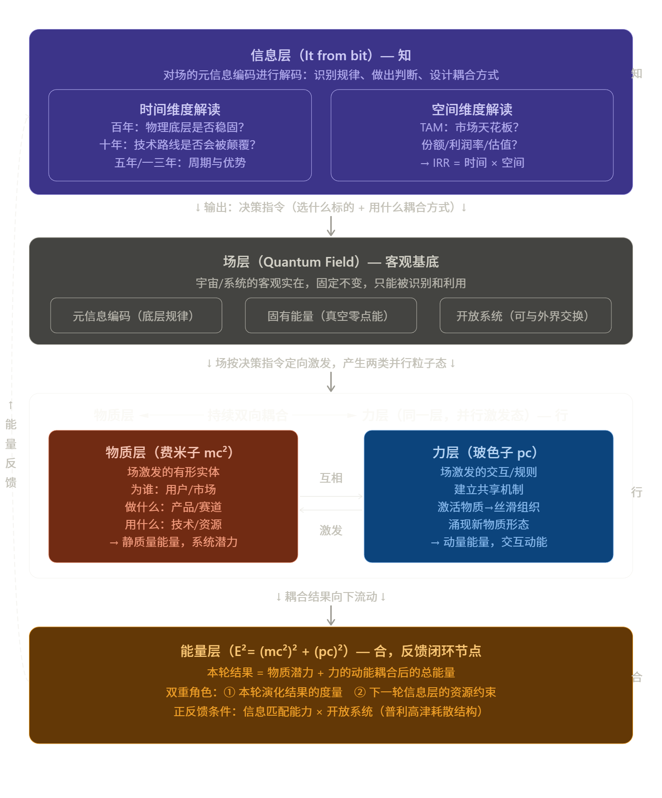
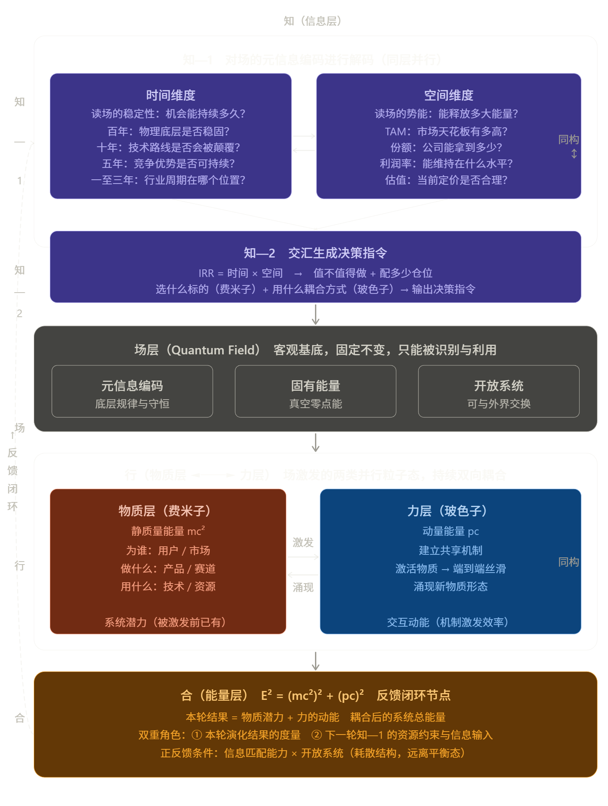
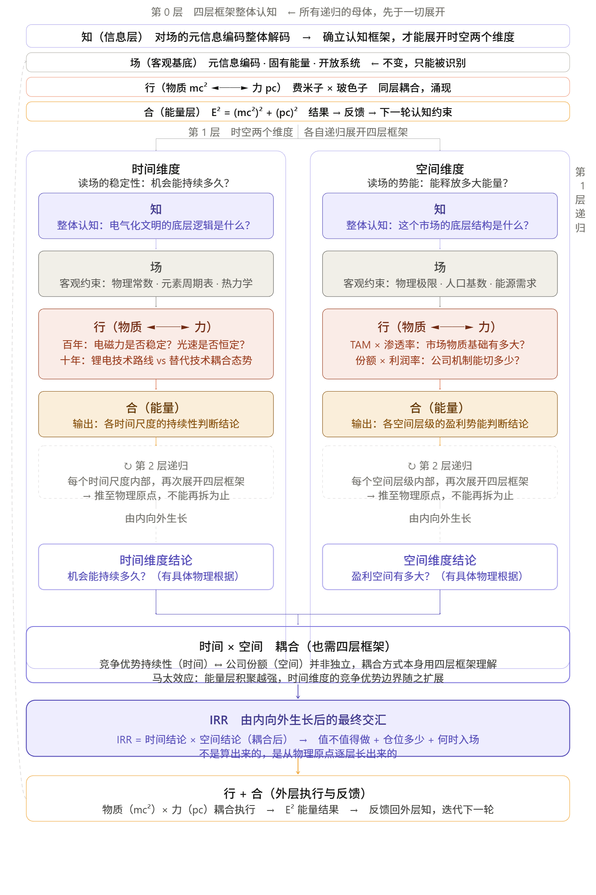
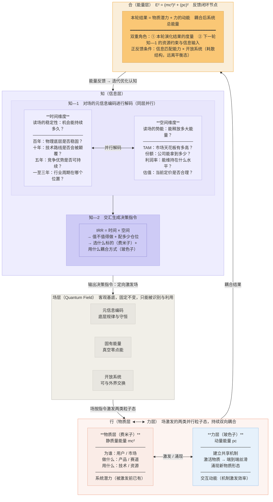

图片版本
v1：
v2：
v3：

现在开始画图。这个递归分形结构的视觉挑战在于：无限递归不能真的画无限层，需要找到一个视觉隐喻让人一眼看懂"这个结构在每一层内部都重复自身"。我的方案是：

主图画两层递归（第0层骨架 + 第1层展开），在第1层的格子里用一个缩小的同构图标暗示"此处可继续递归"，而不是真的画第2层——因为第2层画出来只会制造噪音，用语言描述反而更清晰。

开始。现在用语言把逻辑说清楚。

***

## 语言表述

这个体系的核心性质是**分形递归**——同一套四层框架（知/场/行/合），在不同尺度上重复自身，且每一层的展开都必须以对整体框架的认知为前提。

**第0层：整体认知是所有递归的母体**

在做任何时空拆解之前，必须先对四层框架有整体理解——宇宙/系统是怎么运作的，信息如何激发场，场如何产生物质与力的耦合，耦合如何生成能量并反馈。没有这个整体认知，时空两个维度的问题根本不知道该怎么问、问到哪里为止。整体认知是前提，时空拆解是后果，顺序不能反。

**第1层：时间维度与空间维度，各自内部递归四层框架**

时间维度不是一个清单，它是对"场的稳定性"的解码过程，必须从知（理解底层逻辑）→ 场（物理常数与客观约束）→ 行（当前技术路线与替代技术的物质/力耦合态势）→ 合（输出各时间尺度的持续性结论）这条路走完。空间维度同理，是对"场的势能"的解码，从知（市场底层结构）→ 场（物理极限与人口基数等客观约束）→ 行（TAM与份额、利润率的物质/力耦合）→ 合（输出各空间层级的盈利势能结论）。

**第2层：每个内部小层，继续递归到物理原点**

比如时间维度里"十年：锂电技术路线是否会被颠覆"，这本身又是一个完整的四层框架递归——知（理解电化学的底层逻辑）→ 场（元素周期表对锂的约束，这是不可再拆的物理原点）→ 行（固态电池作为物质 × 界面阻抗问题作为力，两者的耦合现状）→ 合（输出"十年内不可撼动"的结论）。推到元素周期表就停了，因为再往下是量子力学，已经超出投资决策所需的分辨率。**"不能再拆"不是任意停止，是触底了客观的物理约束。**

**时空耦合本身也用四层框架**

时间维度和空间维度的结论不是独立相乘的。"公司份额能拿多少"（空间）和"竞争优势能持续多久"（时间）之间存在耦合——能量层积聚越强（马太效应），竞争优势的时间边界就随之扩展，反过来又撑大了可以拿到的份额。这个耦合关系本身，也需要用四层框架来理解，而不是简单地拍一个"五年"的数字。

**IRR是从底层长出来的，不是算出来的**

整个递归的方向是：先向内推至物理原点（确认底是实的），再由内向外逐层生长出结论，最后时间结论与空间结论在耦合之后交汇，才形成IRR这个总体判断。IRR的质量，完全取决于递归推到了多深、底是否真实。一个没有触底的IRR，只是数字游戏。

# 统一投资思维体系

## 框架总览

***

## 核心结构说明

**自相似性**：知的内部结构（时间/空间同层解码 → 交汇生成指令）与行的内部结构（物质/力同层耦合 → 生成能量）完全同构。

**知行合一的物理基础**：

- 知 = 信息层对场的元信息解码 + 生成决策指令
- 行 = 物质（mc²）与力（pc）同层耦合执行
- 合 = 能量层 E² = (mc²)² + (pc)²，反馈闭环

**统一公式**：

> 好投资 = IRR（时间 × 空间）× 做对（mc² + pc）× 正反馈闭环

**仓位大小**：

> f（时间长度 × 空间大小 × 当前行业周期位置）

