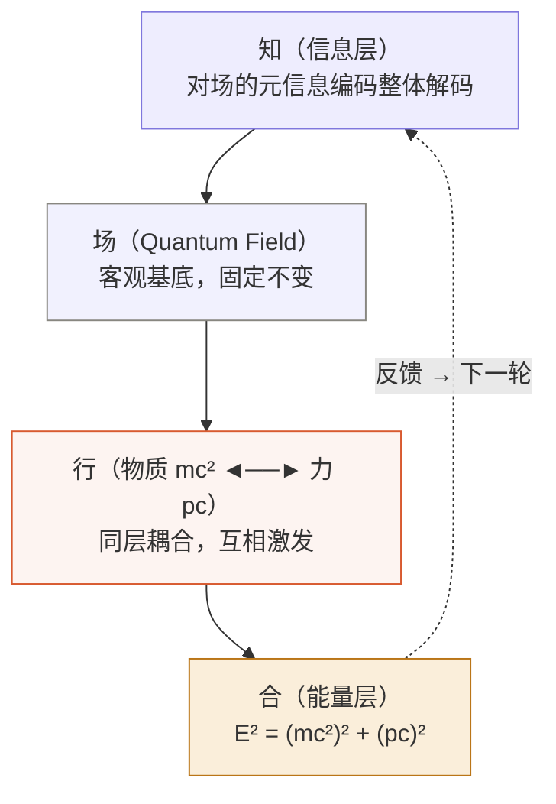
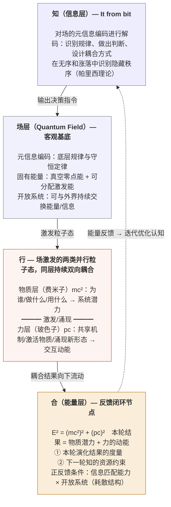
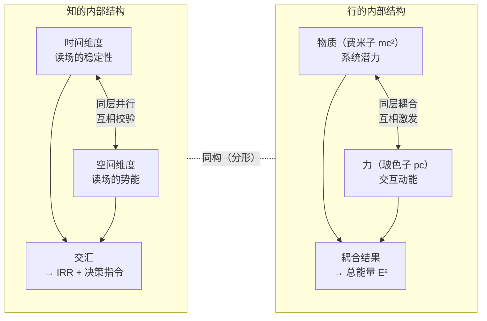
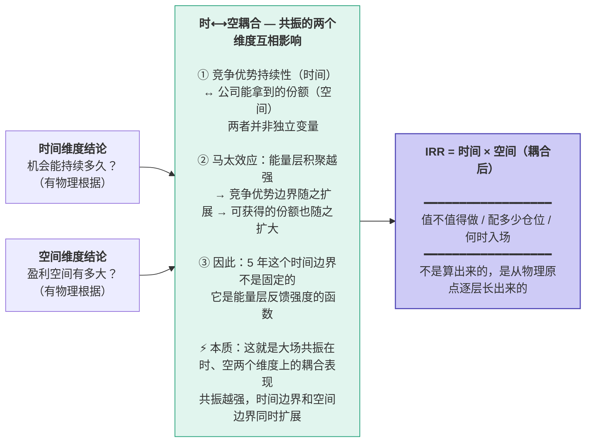
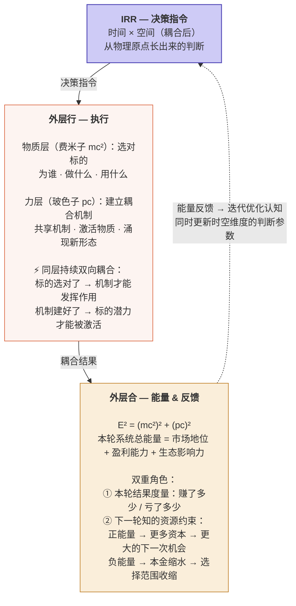
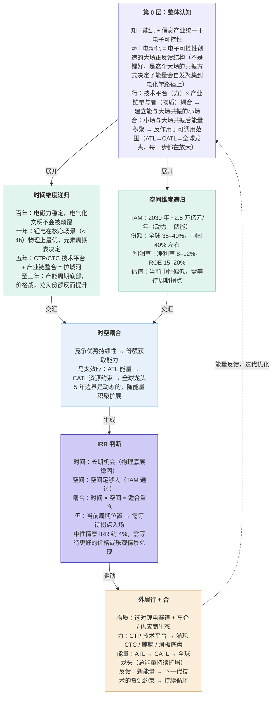
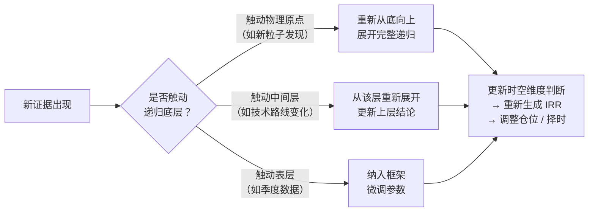

# 投资思维体系：分形递归框架

**文档版本**：6.0

***

## 核心问题

**所有商业决策——无论你是创业者、供应商、客户、员工还是投资人——本质上都在回答同一个问题：**

> **我要投入自己的资源（时间 / 金钱 / 精力），在一个什么样的时空坐标上，换取多少回报？**

| 你是谁 | 你的"本金"是什么 | 你在算什么 |
| :-- | :-- | :-- |
| **曾毓群 2011 年** | 创业精力 + 初始资本 | 技术路线能走多远？× 市场能做多大？ |
| **上游供应商** | 产能 + 原材料 | 绑定宁德能锁定多长订单期？× 多少稳定营收？ |
| **下游车企** | 供应链切换成本 + 研发投入 | 用它的电池能支撑多久产品线？× 多少技术迭代红利？ |
| **员工** | 职业时间 + 技能积累 | 在这里能成长多久？× 股权/薪资回报有多少？ |
| **投资人** | 本金 + 机会成本 | 这个机会能持续多久？× IRR 能到多少？ |

**五个人，五笔不同的"投资"，同一套底层逻辑：先认识场 → 再判断自己能不能共振 → 然后选择方式加入。**

这套逻辑不是拍脑袋出来的，而是从底层的物理约束**逐层生长**出来的——同一套认知框架在不同尺度上重复使用，每一层结论都能追溯到不可再拆的客观约束。

这套方法，就是**四层框架**。

**核心性质**：分形递归——同一套四层框架（知 / 场 / 行 / 合），在不同尺度上重复自身

***

## 一、四层框架是什么？——从量子物理到投资决策的认知工具

### 这套框架从哪来？

四层框架不是凭空发明的一套投资方法论，而是**量子场论描述宇宙基本组织方式的一种跨域映射**。我们用它作为通用的思维积木，在不同领域里做不同的排列组合：

| 量子物理原词                  | 投资领域的翻译     | 中国哲学锚点 |
| :---------------------- | :---------- | :----- |
| 信息（Information）         | 对规律的解码与判断   | **知**  |
| 量子场（Quantum Field）      | 不可改变的客观基底   | **一**  |
| 物质 × 力（Fermion × Boson） | 标的选择 × 机制设计 | **行**  |
| 能量 E²=(mc²)²+(pc)²      | 结果度量 + 反馈闭环 | **合**  |

> 用王阳明的话说，这就是**"知行合一"的物理版本——而"一"就是场**：
>
> **量子物理原意：**
> - **场（Quantum Field）** = 宇宙的不可改变的客观基底——量子场论告诉我们，宇宙不是"粒子在空间中运动"，而是"场的激发态"。场是第一性的，粒子是从场中涌现出来的
>
> **映射到投资领域后，"场"分化为两层：**
> - **大场（客观）** = 不以你意志转移的正反馈结构（如电动化=电子可控性创造的能量自发聚集方向）。你无法改变它，只能认识它、选择是否进入它
> - **小场（主观）** = 你做了选择之后建立的系统（选了标的 × 建了机制）。这是你的行创造出来的局部场
> - **"一"（共振界面）** = 大场与小场之间的耦合——你的小场能不能和大场同频共振？共振越强，能量聚集效率越高；频率对不上，再努力也是空转
>
> 所以完整的四层链路是：
> - **知** = 先解码大场：这个客观存在的正反馈结构是什么？能量会自发聚集到哪？
> - **一（场）** = 判断共振：我自己的能量/资源能不能接入这个大场的共振频率？耦合界面在哪里？
> - **行** = 建立小场：选择什么标的 × 用什么机制，让自己能和大场共振的小系统动态演化起来
> - **合** = 共振结果：小场能量聚集 → 反过来作用于可调用的时空范围（正能量放大 / 负能量缩小）
>
> ⚡ **时和空只是共振的两个具体可测量维度**，不是场的全部。共振还涉及其他维度：信息质量、资源密度、网络位置等——只是在投资决策中，久期和 IRR 是最便于量化的两个入口。
>
> "合一"的本质含义是：**你的认知（知）必须通过场（一）的共振验证，才能转化为有效的行动（行）。** 认识错了大场，或者自己的小场和大场频率对不上，行就是无效的——这就是为什么很多人"很努力"但结果不好。
>
> 量子物理只是给了这套直觉一个精确的数学结构（E² 公式、费米子/玻色子分类），让模糊的哲学概念变得可操作。
>
> 类比：就像化学元素周期表——元素本身是通用积木，不同领域是不同的排列组合。四层框架是"元素周期表"，投资应用只是其中一种"化合物"。

### 四层框架的结构

> **先于一切展开的母体认知。没有这一层，时空两个维度的问题根本不知道该怎么问、问到哪里为止。**

#### 骨架：四个字 + 一张图

先看最精简的版本——这就是翻译表里那四行的图形化：



#### 血肉：每一层的完整展开

骨架看懂了，下面是每个节点的具体内容：



### 关键洞察

- **知**是信息层对场的解码，不是主观判断，而是对客观元信息的认知
- **场**是客观基底，不可改变，只能被识别和利用
- **物质与力是同层并行的**，不是上下关系——信息层在设计决策指令时，必须同时设计选什么费米子标的和用什么玻色子机制，两者天然是一对
- **能量层是闭环节点**，既是本轮结果，也是下一轮认知的约束条件

***

## 二、如何在投资中应用？——从"场"中生长出时空决策

> **懂了四层框架是什么之后，问题变成：投资决策到底在面对什么？**
>
> 答案是：**投资 = 在一个"场"中选择自己的时空坐标（多久？× 多少回报？），然后让能量在这个坐标上聚集。**

> **先看骨架，再看血肉**——下面这个文本结构就是第二章的核心逻辑链，后面的完整展开图和详细章节都是它的填充：

```
投资的本质（久期 × IRR）
        ↓ 面对的是什么？
场 — 大场×小场的共振界面（不是背景板！）
        ↓ 在场中展开（分形递归）
行 — 时⟷空 并行耦合（共振的两个具体维度，不是全部！）
        ↓ 耦合聚集
合 — 能量 & 反作用于可调用范围（正能量放大/负能量缩小）
        ↓ 能量反馈
回到投资本质 → 下一轮决策
```


下面这张图展示的是完整逻辑——注意看"场"的位置，它不是背景板，而是整个决策的**结构性基础**：


```mermaid
flowchart TB
    ESSENCE["<b>投资的本质</b><br/><br/>决策 = 选择时空坐标<br/>（多久？× 多少回报？）<br/>久期 × IRR = 量化这个决策"]

    FIELD["<b>场 — 大场×小场的共振界面</b><br/><br/>不是静态背景板，而是动态的共振结构：<br/><br/>【大场（客观）】不以你意志转移的正反馈结构<br/>• 电动化 = 电子可控性创造的能量自发聚集方向<br/>• 你无法改变它，只能认识它、选择是否进入<br/><br/>【小场（主观）】你选择标的 × 建立机制后创造的局部系统<br/>• 这是你的"行"主动构建的<br/><br/>【"一"（共振界面）】大场与小场的耦合<br/>• 共振越强 → 能量聚集效率越高<br/>• 频率对不上 → 再努力也是空转<br/><br/>⚡ 时和空只是共振的两个可测量维度，共振还涉及信息质量、资源密度、网络位置等"]

    ACTION["<b>行 — 时⟷空 并行耦合</b><br/><br/>不是先算时间再算空间，而是同时展开：<br/><br/>【时间维度】机会能持续多久？读场的稳定性<br/>　百年 → 十年 → 五年 → 1-3年<br/><br/>【空间维度】能释放多大势能？读场的能量密度<br/>　TAM → 份额 → 利润率 → 估值<br/><br/>⚡ 时⟷空 互相影响（马太效应）：<br/>　竞争优势越持久 → 可获取份额越大<br/>　份额越大 → 竞争优势越难被撼动"]

    ENERGY["<b>合 — 能量聚集 & 反作用于时空</b><br/><br/>时×空耦合 → IRR 判断<br/>值不值得做 / 配多少仓 / 何时入场<br/><br/>⚡ 能量反过来塑造时空范围：<br/>• 正能量 → 放大（更多资本 → 更大的下一次机会）<br/>• 负能量 → 缩小（本金缩水 → 选择范围收缩）<br/><br/>→ 反馈到下一轮决策"]

    ESSENCE -->|"面对的是什么？"| FIELD
    FIELD -->|"在场中展开<br/>（分形递归）"| ACTION
    ACTION -->|"耦合聚集"| ENERGY
    ENERGY -. "能量反馈 → 迭代认知" .-> ESSENCE

    style ESSENCE fill:#EEEDFE,stroke:#7F77DD,stroke-width:1.5px
    style FIELD fill:#F1F1FE,stroke:#888780,stroke-width:1.5px
    style ACTION fill:#FDF4F1,stroke:#D85A30,stroke-width:1.5px
    style ENERGY fill:#FAEEDA,stroke:#BA7517,stroke-width:1.5px
```

### 关键认知修正

**1. 场不是背景板，是大场×小场的共振界面**

- 旧理解：场 = 物理常数、元素周期表（静态基底）——或者场 = "时空耦合"（窄化了！）
- 新理解：**场分两层——大场是客观存在的正反馈结构（不以你意志转移），小场是你选择后建立的局部系统，"一"是两层之间的共振界面**
  - 大场例子：电动化 = 电子可控性创造的能量自发聚集方向（这是宇宙给的，你改不了）
  - 小场例子：选了宁德时代 × 建了持仓机制 → 你自己的投资系统
  - 共振问题：你的小场能不能和大场同频？共振越强，能量聚集效率越高
- ⚡ **时和空只是共振的两个可测量维度**，不是场的全部定义。之前把场直接等同于"时空耦合"，是一个根本性的窄化错误

**2. 时⟷空像物质×力一样，是同层并行耦合**

- 不是先分析完时间再分析空间，然后"耦合"一下
- **它们从一开始就是互相影响的**：你判断能做多久，取决于你能做多大；你能做多大，又取决于你能做多久
- 这和物质×力的关系完全同构：选什么标的（物质）和用什么机制（力）天然是一对

**3. 能量反作用于时空范围**

- 曾毓群做 CATL 做对了 → 能量聚集 → 他能做的事越来越大（麒麟电池、滑板底盘、换电……）
- 我们投对了 → 本金增长 → 下一次能投的机会更大
- 投错了 → 本金缩水 → 被约束在更小的选择范围内
- **这就是"合"层的双重角色：既是本轮结果度量，也是下一轮的资源约束**

**4. "做"和"投"用的是同一套底层逻辑——而且所有人都一样**

回到核心问题里说的：**不只是曾毓群和我们，整个商业生态里的每个角色都在用同一套逻辑做自己的"投资决策"。**

| | 创业者（曾毓群） | 供应商 | 车企（客户） | 员工 | 投资人 |
| :-- | :-- | :-- | :-- | :-- | :-- |
| **本金** | 精力 + 初始资本 | 产能 + 原材料 | 切换成本 + 研发投入 | 职业时间 + 技能 | 本金 + 机会成本 |
| **面对的场** | 电动化 = 时空正反馈结构 | 宁德的产能锁定能力 | 宁德的技术迭代速度 | CATL 的成长天花板 | CATL 在场中的能量位置 |
| **时⟷空决策** | 路线能走多久？× 市场能多大？ | 订单能锁多久？× 营收多稳定？ | 电池能用多久？× 技术红利多少？ | 能成长多久？× 回报有多少？ | 优势持续多久？× IRR 多少？ |
| **合（能量结果）** | CATL → 全球龙头 | 稳定大客户 + 产能爬坡 | 供应链安全 + 产品竞争力 | 职业增值 + 股权收益 | 投资收益（或亏损） |
| **反馈效应** | 能做更多事 | 可接更大订单 | 可用更多技术方案 | 下一份工作更有筹码 | 有更多/更少资本投下一个 |

⚡ **关键洞察：一个健康的商业体，就是让所有利益相关方的"投资"同时获得正反馈。** 宁德时代之所以强，不是因为它对股东好，而是因为它让供应商、客户、员工、股东五方的"久期 × 回报"计算结果都是正的——这就是场的力量。

### 自相似性：知的内部结构与行的内部结构完全同构

这是框架分形性质的体现——同一个模式在不同尺度上重复出现：



***

## 三、时间维度——这个机会能持续多久？

> **核心问题：读大场在时间维度上的稳定性——这个正反馈结构在时间轴上能撑多久？**

```mermaid
flowchart TB
    T_ZHI["<b>知 — 整体认知</b><br/><br/>电气化文明的底层逻辑是什么？<br/>理解信息 → 场 → 时⟷空 → 能量的完整机制<br/>才知道该在哪个时间尺度上问哪些问题"]

    T_FIELD["<b>场 — 大场在时间维度上的表现</b><br/><br/>大场（电动化正反馈结构）在时间轴上的稳定性特征：<br/><br/>• 电磁力 + 电子可控性 → 创造了一个<strong>时间上自增强</strong>的共振模式<br/>　（技术积累越多 → 能量效率越高 → 更多应用场景 → 更多积累）<br/>• 元素周期表 → 锂是这个共振中<strong>时间上最稳</strong>的能量载体<br/>　（没有更轻+更稳定的替代品存在）<br/>• 热力学定律 → 熵增决定了<strong>能量转换的方向不可逆</strong><br/>　（一旦进入电化学路径，不会退回化石燃料）<br/><br/>⚡ 这些不是独立的"物理常数列表"，而是大场的共振特性在时间维度上的具体投射"]

    T_XING["<b>行 — 时⟷空 并行展开</b><br/><br/>物质（标的/赛道）◄──► 力（机制/竞争态势）<br/><br/>【物质层】百年：电磁力稳定？ / 十年：锂电 vs 固态 / 五年：宁德竞争格局 / 一至三年：产能周期<br/>【力层】百年：量子场守恒 / 十年：替代技术耦合进度 / 五年：护城河机制 / 一至三年：价格战强度<br/><br/>⚡ 两层并行耦合：技术路线选择（物质）决定护城河形态（力），反过来也成立"]

    T_HE["<b>合 — 各时间尺度的持续性判断</b><br/><br/>百年结论：电气化文明物理基础稳固（电磁力不变）<br/>十年结论：锂电核心场景十年内不可撼动（元素周期表锁定）<br/>五年结论：宁德竞争优势可持续（CTP 平台 + 产业链整合）<br/>一至三年结论：行业周期底部，短期承压但龙头份额提升"]

    T_L2["<b>↻ 第 2 层递归（以十年为例）</b><br/><br/>锂电 vs 固态电池这个判断内部再次展开四层：<br/>知：理解电化学底层逻辑<br/>场：元素周期表对锂的约束 ← 物理原点不能再拆<br/>行：固态电池（物质）× 界面阻抗（力）当前耦合态势<br/>合：十年内不可撼动的结论从底层长出来"]

    T_ZHI -->|"解码"| T_FIELD
    T_FIELD -->|"激发粒子态"| T_XING
    T_XING -->|"耦合结果"| T_HE
    T_L2 -. "递归验证" .-> T_XING

    style T_ZHI fill:#EEEDFE,stroke:#7F77DD,stroke-width:0.5px
    style T_FIELD fill:#F1F1FE,stroke:#888780,stroke-width:0.5px
    style T_XING fill:#FDF4F1,stroke:#D85A30,stroke-width:0.5px
    style T_HE fill:#FAEEDA,stroke:#BA7517,stroke-width:0.5px
    style T_L2 fill:#F1F1FE,stroke:#B4B2A9,stroke-width:0.5px,stroke-dasharray:4 3
```

***

## 四、空间维度——能释放多大的势能？

> **核心问题：读大场在空间维度上的能量密度——这个正反馈结构在空间上能展开多大？**

```mermaid
flowchart TB
    S_ZHI["<b>知 — 整体认知</b><br/><br/>这个市场的底层结构是什么？<br/>理解市场/产业的底层运作机制<br/>才知道该从哪个空间层级开始测量、如何分层推导"]

    S_FIELD["<b>场 — 大场在空间维度上的表现</b><br/><br/>大场（电动化正反馈结构）在空间轴上的能量密度特征：<br/><br/>• 全球人口与能源需求 → 设定了<strong>空间上能量可释放的总边界</strong><br/>　（但这个边界本身是动态的——渗透率提升会创造新需求）<br/>• 电动化渗透的物理极限 → 决定了<strong>能量聚集的饱和点</strong><br/>　（不是天花板，而是相变临界点——过了之后形态会变）<br/>• 技术成本曲线 → <strong>空间扩展的加速度</strong><br/>　（成本每降 10% → 可触达的市场空间扩大 X%）<br/><br/>⚡ 这些不是独立的"市场容量数字"，而是大场的共振特性在空间维度上的具体投射<br/>它们互相耦合形成场的<strong>势能地形</strong>"]

    S_XING["<b>行 — 时⟷空 并行展开</b><br/><br/>物质（标的/TAM）◄──► 力（份额机制/利润率）<br/><br/>【物质层】TAM：全球电池需求 ~2.5 万亿元/年（2030）<br/>　动力电池 ~2 万亿 / 储能电池 ~5000 亿<br/>【力层】宁德份额机制：35–40% / 技术平台（CTP/CTC）<br/>　产业链整合（矿→回收）/ 净利率 8–12%<br/><br/>⚡ 两层并行耦合：TAM 越大 → 份额机制的杠杆效应越强<br/>　反过来，份额机制越强 → 可触达的有效 TAM 越大"]

    S_HE["<b>合 — 各空间层级的盈利势能结论</b><br/><br/>行业天花板：足够大，TAM 通过<br/>公司份额：领先，35–40% 可持续<br/>利润率：承压但可维持<br/>估值：当前中性偏低<br/>→ 盈利空间存在，但需等待周期拐点"]

    S_L2["<b>↻ 第 2 层递归（以份额为例）</b><br/><br/>宁德能拿多少份额这个判断内部再次展开四层：<br/>知：理解电池产业链竞争的底层逻辑<br/>场：规模效应 + 产业链整合的客观约束（大场共振的微观表现）<br/>行：技术平台（力）× 车企绑定（物质）的耦合强度<br/>合：35–40% 份额结论从产业链结构长出来"]

    S_ZHI -->|"解码"| S_FIELD
    S_FIELD -->|"激发粒子态"| S_XING
    S_XING -->|"耦合结果"| S_HE
    S_L2 -. "递归验证" .-> S_XING

    style S_ZHI fill:#EEEDFE,stroke:#7F77DD,stroke-width:0.5px
    style S_FIELD fill:#F1F1FE,stroke:#888780,stroke-width:0.5px
    style S_XING fill:#FDF4F1,stroke:#D85A30,stroke-width:0.5px
    style S_HE fill:#FAEEDA,stroke:#BA7517,stroke-width:0.5px
    style S_L2 fill:#F1F1FE,stroke:#B4B2A9,stroke-width:0.5px,stroke-dasharray:4 3
```

***

## 五、时空耦合——IRR 是怎么长出来的？

> **时间维度和空间维度之间存在耦合，耦合方式本身也需要用四层框架来理解。**



***

## 六、完整闭环——IRR 驱动执行，结果反馈回认知



***

## 七、案例验证——宁德时代



***

## 八、核心公式与关键洞察

### 核心公式

$$E^2 = (mc^2)^2 + (pc)^2$$

| 物理概念          | 投资映射              | 层级  |
| ------------- | ----------------- | --- |
| $mc^2$（静质量能量） | 选对物质（标的）带来的系统潜力   | 物质层 |
| $pc$（动量能量）    | 建立共享机制（耦合）带来的交互动能 | 力层  |
| $E$（总能量）      | 两者耦合后的系统总结果       | 能量层 |

$$\text{IRR} = f(\text{时间维度结论} \times \text{空间维度结论，耦合后})$$

$$\text{仓位} = g(\text{时间长度} \times \text{空间大小} \times \text{当前行业周期位置})$$

### 六个关键洞察

**1. 整体认知先于一切**\
时空两个维度的问题，必须先有对四层框架整体机制的认知才能展开。没有整体认知，不知道该问什么问题，也不知道在哪里停下来。

**2. 物质与力是同层并行的**\
不是先选标的再设计机制，而是两者必须同时设计——费米子和玻色子是场同时激发出来的两类存在，信息层输出的决策指令必须同时包含两者。

**3. 框架是分形递归的**\
同一套四层框架在不同尺度上重复自身：整体→时空维度→每个维度内部的每个尺度→物理原点。递归不是任意的，而是以触底客观物理约束为终止条件。

**4. 时空耦合不是简单相乘**\
竞争优势持续时间（时间维度）和市场份额（空间维度）之间存在马太效应——能量层积聚越强，两者边界都随之扩展。时间边界是动态的，不是固定的五年。

**5. IRR 是从物理原点长出来的**\
一个有根据的 IRR，必须能追溯到不可再拆的物理约束（元素周期表、热力学定律、物理常数）。追溯不到底的 IRR，只是数字游戏。

**6. 知行合一的物理基础**

- **知** = 信息层对场的元信息解码 + 生成决策指令
- **行** = 物质（$mc^2$）与力（$pc$）同层耦合执行
- **合** = 能量层 $E^2 = (mc^2)^2 + (pc)^2$，反馈闭环
- **一** = 能量作为节点，连接本轮"合"与下一轮"知"

***

## 九、持续追踪清单——框架更新机制



| 追踪层级     | 具体问题             | 频率 | 对应框架层级      |
| -------- | ---------------- | -- | ----------- |
| **物理底层** | 电磁力稳定性、新粒子发现     | 年度 | 场层（物理原点）    |
| **技术路线** | 固态电池进展、钠电渗透率     | 季度 | 行（物质/力耦合态势） |
| **竞争格局** | 市场份额变化、价格战强度     | 月度 | 行（机制激发效率）   |
| **财务表现** | 利润率、ROE、现金流      | 季度 | 合（能量层结果）    |
| **估值水平** | PE、PEG、EV/EBITDA | 实时 | IRR（时空耦合输出） |

***

*文档版本：6.0*\
*更新时间：2026-04-13*\
*核心逻辑：先问"多久+多少回报"，再用四层框架从物理原点逐层生长出答案*
