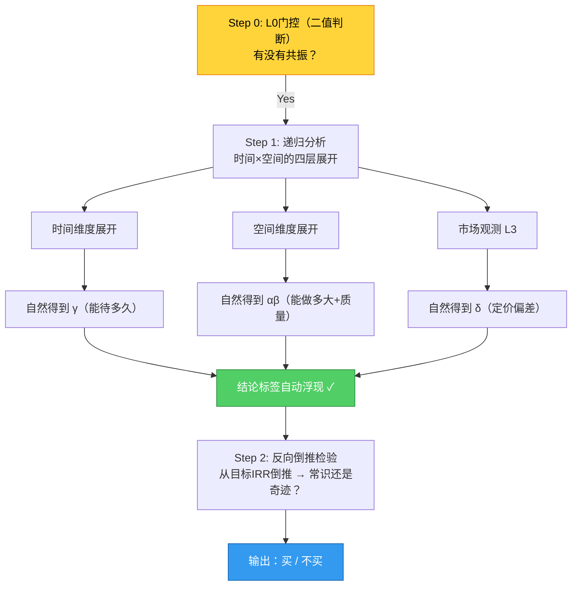

# 共振投资框架 V8.0 终极版

> **"框架不是被'讨论'出来的，而是像宝剑一样，必须拿去砍真实的骨头（实战标的），在卷刃的地方进行淬火，才能最终成型。"** —— R07三方共识

---

## 一、框架哲学内核（一句话）

**投资 = 寻找主观小场与客观大场的同频共振**

| 层级 | 概念 | 投资含义 |
|:---|:---|:---|
| **知** | 识大场 | 解码宏观/产业的真实运行逻辑 |
| **行** | 建小场 | 创业者选路线建团队；投资人选要素下注 |
| **一** | 共振场域 | PMF终极形态，顺势而为，生态位锁定 |
| **合** | 观测时空 | "N年X倍"？仅在共振确认后有意义 |

---

## 二、双场本体论（跃迁4核心）

公司不是铁板一块，而是**两个耦合振荡系统**：

```
┌─────────────────────────────────────────────────────┐
│                    共振投资系统                      │
│                                                      │
│  ┌───────────────┐         ┌───────────────┐       │
│  │   实体场       │  ←耦合→  │   资本场       │       │
│  │               │         │               │       │
│  │ 创始人·供应商   │         │   投资人       │       │
│  │ ·客户·员工     │         │               │       │
│  │               │         │               │       │
│  │ 问题：业绩翻    │         │ 问题：估值变    │       │
│  │ 多少倍？       │         │ 多少倍？       │       │
│  └───────────────┘         └───────────────┘       │
│                                                      │
│  Alpha = 双场错位时刻                                │
│  （实体场强共振 + 资本场严重失谐）                     │
└─────────────────────────────────────────────────────┘
```

**E²公式隐喻**（保留作为行层数学支撑）：
- **mc²（静能）** = 实体场内在价值（ROIC/护城河/五方协同）
- **pc（动能）** = 资本场认知偏差（δ驱动的估值波动）
- **E²（总能量）** = 双场整合后的投资回报

---

## 三、四层分形递归结构（跃迁5核心）

在五方坐标系中从不同"距离"观察同一个共振系统：

```
L0 时代共振 → 确认"长坡"（好时代？）
           【主要考察：创始人愿景与大场趋势匹配度】

L1 产业共振 → 确认"厚雪"（好赛道？）
           【主要考察：供应商+客户的产业链地位】

L2 公司共振 → 确认"最优滚雪球者"（好公司？）
           【主要考察：创始人+员工的组织能力】

L3 交易失谐 → 确认"好价格"（好价格？）
           【主要考察：投资人的市场定价偏差】

All-in条件: L0✅ + L1✅ + L2✅ + L3失谐✅
```

### L3三种情景

| 情景 | 市场状态 | δ水平 | 动作 |
|:---|:---|:---|:---|
| A | 市场也认可 | δ>1.2 | 不买 |
| B | 短期利空压价 | δ≈0.8-1.0 | **买入** |
| C | 市场完全误判 | δ<0.6 | **重仓** |

---

## 四、三步漏斗SOP（V8.0重构版）

> **V8.0核心变化**：消除了"做两遍工作"的瓶颈——αβγδ不再是独立计算变量，而是递归分析的自然输出标签。



### Step 0 — L0门控（真正的Gate）

**问题**：是否正在发生不可逆的结构性相变？

**三步检测**：

| 步骤 | 检测项 | 通过标准 | 失败处理 |
|:---|:---|:---|:---|
| 1 | 需求刚性 | 价格翻倍需求降幅<30% | 直接放弃 |
| 2 | 生命周期 | 渗透率<60% 且 近3年增速递增 | 放弃或降级为价值投资 |
| 3 | 机会类型 | 至少一种可量化驱动力明确 | 放弃 |

**输出**：有 / 没有 → 没有则终止全部后续分析

---

### Step 1 — 递归分析（时间×空间的四层展开）

> **这是框架的核心——90%的精力应该花在这里（真实调研），而不是在公式推导上。**

#### 时间维度展开 → 自然得到 γ（能待多久）

**调研对象**：员工 + 创始人

**关键问题**：
- 研发迭代跟得上吗？（产品周期、专利布局、技术路线图）
- 战略定力够吗？（创始人是否专注、是否有清晰第二曲线）
- 团队稳定性如何？（核心人才留存率、人均产出趋势）

**γ输出标签**：
| 标签 | 含义 | 特征 |
|:---|:---|:---|
| **γ高（引领者）** | 能持续自我颠覆，延长持有期 | 研发投入>行业平均，专利增长快，有清晰第二曲线 |
| **γ中（跟随者）** | 能跟上行业节奏 | 研发投入=行业平均，迭代速度正常 |
| **γ低（掉队者）** | 退相干风险高 | 研发投入<行业平均，技术落后，无第二曲线 |

---

#### 空间维度展开 → 自然得到 αβ（能做多大+质量）

**调研对象**：客户 + 供应商

**α（能量虹吸率）——开源能力**：

| 维度 | 关键问题 | 强信号 |
|:---|:---|:---|
| 市占率趋势 | 过去3年份额是否持续提升？| α>1.2（增速超行业）|
| 客户粘性 | 是"用着还行"还是"离不了"？| 高复购率/高NPS/高转换成本 |
| 供应链壁垒 | 供应商是否愿意陪降本？| 应付账款周转天数>行业平均 |

**β（盈利质量）——节流能力**：

| 维度 | 关键问题 | 强信号 |
|:---|:---|:---|
| ROIC水平 | 是否持续创造超额回报？| ROIC≥12%（远超WACC）|
| 盈利稳定性 | 利润稳不稳定？| ROIC变异系数CV<0.15 |
| 资本配置 | 管理层花钱理性吗？| 不盲目多元化，ROIC项目追踪良好 |

**αβ输出标签**：
| 组合 | 含义 | 特征 |
|:---|:---|:---|
| **α高β高** | 开源节流双优 | 份额提升+盈利质量稳定 |
| **α高β低** | 规模不经济 | 份额提升但利润被侵蚀 |
| **α低β高** | 稳健但无增长 | 利润稳定但份额停滞 |
| **α低β低** | 全面恶化 | 退相干风险极高 |

---

#### 市场观测（L3）→ 自然得到 δ（定价偏差）

**调研对象**：投资人（市场情绪）

**δ计算公式**：`δ = 公司估值指标 / 行业平均`

| 公司所处阶段 | 推荐指标 | δ解读 |
|:---|:---|:---|
| 萌芽期/亏损 | PS | <0.8折价 / 0.8-1.2正常 / >1.2溢价 |
| 高成长（利润增速>30%）| PEG | 同上 |
| 成熟成长/稳定盈利 | PE(TTM) | 同上 |
| 重资产/资本密集 | EV/EBITDA | 同上 |

**δ输出标签**：
| 标签 | 含义 | 利用方式 |
|:---|:---|:---|
| **δ低（<0.8）** | 市场严重低估 | 可利用资源：融资/人才/产业合作/政策/品牌 |
| **δ中（0.8-1.2）** | 定价合理 | 正常持有，不追高 |
| **δ高（>1.2）** | 市场过度乐观 | 谨慎或减仓 |

---

### Step 2 — 反向倒推检验（终极sanity check）

**输入**：Step 1自然浮现的αβγδ标签

**动作**：从目标IRR倒推所需假设

**判断**：是常识还是奇迹？

| 倒推假设 | 常识（✓ 扣动扳机）| 奇迹（✗ 扔进垃圾桶）|
|:---|:---|:---|
| 净利润CAGR | 与历史增速接近或略低 | 需要历史增速的2-3倍 |
| PE目标值 | 回归历史均值附近 | 需要达到历史最高点且维持 |
| 市占率上限 | <50%（即使龙头也有天花板）| >70%（几乎不可能）|
| 持有期 | 3-5年（与γ判断一致）| 需要10年+（不确定性爆炸）|

**输出**：买 / 不买

---

## 五、γ×δ 四象限决策矩阵（最重要的实操工具）

| 组合 | 含义 | 行动 |
|:---|:---|:---|
| **γ高 + δ低** | 🌟 最佳击球区：长τ + 低成本 | **重仓持有** |
| **γ高 + δ高** | 能力强但已被定价 | 可持有不宜追高 |
| **γ低 + δ低** | 价值陷阱风险 | 需强催化剂才介入 |
| **γ低 + δ高** | 最差组合 | **回避** |

---

## 六、五方共振网络（调研层的核心）

> **90%的精力应该花在五方网络的深度调研上，而不是在αβγδ的公式推导上。**

```
        ┌─────────┐
        │  创始人  │ ← 战略定力+技术判断力
        └────┬────┘
             │
    ┌────────┼────────┐
    │        │        │
┌───┴───┐ ┌─┴───┐ ┌─┴───┐
│ 供应商  │ │ 客户 │ │ 员工 │
│成本配合│ │粘性  │ │效率  │
└────┬───┘ └─┬───┘ └─┬───┘
     │        │        │
     └────────┼────────┘
              │
        ┌─────┴─────┐
        │   投资人   │ ← 市场定价偏差(δ)
        └───────────┘
```

**每方的核心调研问题**：

| 方 | 核心问题 | 强共振信号 | 退相干预警信号 |
|:---|:---|:---|:---|
| **创始人** | 愿景与大场匹配吗？| 专注深耕、战略清晰、第二曲线可见 | 频繁跨界、讲故事为主、无技术背景 |
| **供应商** | 愿意陪你降本吗？| 应付账款周转天数长、联合研发深度绑定 | 断供风险、账期缩短、替代品出现 |
| **客户** | 离得开你吗？| 高复购率、高NPS、预收款增加 | 客户流失、投诉增加、转换成本低 |
| **员工** | 效率在提升吗？| 人均产出上升、核心人才留存率高、研发占比高 | 核心流失、人效下降、 morale 低落 |
| **投资人** | 定价合理吗？| δ低（低估）、有明确催化剂 | δ高（泡沫化）、无催化剂可见 |

---

## 七、风险理论：失谐与退相干（跃迁3核心）

**旧模型**：风险 = 参数估算错误 → 更新假设、重算DCF

**新模型**：风险 = 共振破裂

| 风险类型 | 物理隐喻 | 商业表现 | 动作 |
|:---|:---|:---|:---|
| **宏观退相干** | 大场跃迁新波段 | 替代技术渗透率突破5%临界点 | **清仓** |
| **微观失谐** | 小场无法锁相位 | γ变慢/五方剥离 | **减仓** |
| **伪共振** | 短期资金/情绪噪音 | α高但β极差 | **观望** |

**核心差异**：事后修正 → **事前预警**（领先于财务报表的结构性信号）

---

## 八、物理隐喻使用规范（V8.0奥卡姆剃刀）

> **一个框架只用一套隐喻，用来建立直觉，然后退场。**

| 层级 | 允许使用的隐喻 | 数量限制 | 用途 |
|:---|:---|:---|:---|
| **顶层（哲学层）** | 共振、相位锁定、退相干 | **≤3个** | 框架介绍和思维启发 |
| **中层（方法层）** | 虹吸率、调谐力、集体欲望 | **≤5个** | 方法论描述和步骤命名 |
| **底层（操作层）** | 纯财务/业务指标 | **无限制** | 实际打分和数据采集 |

**必须配实操翻译**：

| 抽象隐喻 | 操作层翻译 |
|:---|:---|
| 相位锁定 | 公司市场份额持续提升且ROE稳定 |
| 阻抗匹配 | 产品PMF得分>8/10且NPS>50 |
| 退相干 | 核心客户流失/技术骨干离职/ROE连续下滑 |
| 超辐射 | 五方同频时的指数级增长 |
| 亚辐射 | 任何一方失谐导致的系统性衰退 |

---

## 九、动作规则（决策输出）

| 条件 | 仓位建议 | 触发条件 |
|:---|:---|:---|
| **重仓 >30%** | L0-L2全共振 + L3严重失谐 + γ高δ低 | 最佳击球区 |
| **买入 10-30%** | L0-L2共振 + L3适度失谐 + 单乐观情景 | 正常买入区间 |
| **观望 <10%** | L0-L2共振但L3无失谐 | 好公司但价格不够好 |
| **放弃** | 任何L0-L2失败 | 不符合共振条件 |

**"双场错位"买点识别**：
> 当前悲观估值(×0.5) + 实体中性(×1.8) = **典型价值投资买点**

---

## 十、监控体系（持仓后）

### 五方实时监控

| 监控维度 | 频率 | 预警信号 |
|:---|:---|:---|
| 创始人行为 | 季度 | 战略偏移、频繁跨界、减持 |
| 供应链健康 | 月度 | 应付账款变化、断供新闻、替代品 |
| 客户粘性 | 季度 | 复购率变化、大客户流失、投诉趋势 |
| 员工效率 | 季度 | 人均产出、核心人才离职、 morale |
| 市场定价 | 周/月 | δ偏离度、催化剂进展、舆情变化 |

### 退相干早期预警信号清单

| 信号级别 | 信号类型 | 示例 | 动作 |
|:---|:---|:---|:---|
| 🔴 紧急 | 结构性断裂 | 核心客户流失>20%/技术骨干集体离职 | 立即减仓 |
| 🟡 警告 | 趋势性恶化 | 连续2季度α<1/ROIC下滑/δ快速回升 | 密切观察 |
| 🟢 信息 | 噪音波动 | 单季度miss/短期舆论/股价波动 | 保持关注 |

---

## 十一、7大认知跃迁速查（完整思考链）

| # | 跃迁主题 | 核心认知转变 | 成熟度 |
|:---|:---|:---|:---|
| 1 | 场的定义 | 从"时空耦合"到"共振场域" | ✅ 95% |
| 2 | 知行合一 | 从"算账"到"相位锁定" | ✅ 90% |
| 3 | 风险理论 | 从"参数错误"到"失谐/退相干" | ✅ 85% |
| 4 | 双场+五方 | 公司即网络，Alpha=双场错位 | ✅ 90% |
| 5 | 实操体系 | 四层递归+三步漏斗+操作工具箱 | ✅ 92% |
| 6 | 方法论自觉 | 从"迭代完善"到"生产方式自省" | ⚠️ 85% |
| 7 | 终极纠偏 | 从"公式驱动"到"调研驱动" | ⚠️ 待实战验证 |

---

## 十二、下一步行动（R07终极建议）

> **完全停止对框架逻辑的辩论和补充。** 这个框架在哲学和底层逻辑上已经处于绝对"营养过剩"的状态。

**现在的唯一任务是"瘦身与跑测试"**：

1. ✅ 拿掉所有的公式，把αβγδ退回为"思考备忘录（Checklist）"
2. ⏳ 选一个真实的标的（最好是你最近亏过大钱的）
3. ⏳ 用大白话把这个标的放到L0门控里过滤；再放到时空维度的"知场行合"里，用五方网络扫一遍；最后用市值反向推导
4. ⏳ 看看哪个环节你"卡壳"了
5. ⏳ **哪里卡壳，这套框架就只在哪个地方打补丁**

**框架不是被"讨论"出来的，而是像宝剑一样，必须拿去砍真实的骨头（实战标的），在卷刃的地方进行淬火，才能最终成型。**

---

## 附录A：αβγδ计算公式速查（保留供量化校验用）

> ⚠️ 这些公式是**量化校验工具**，不是独立分析系统。只有在Step 1递归分析完成后，才需要用这些公式来数值化验证你的直觉判断。

### α（能量虹吸率）

$$\alpha = \frac{\text{公司收入增速}}{\text{行业收入增速}}$$

**通过标准**：α > 1.5（强虹吸）/ 1.0-1.5（正常）/ <1.0（丢失份额）

---

### β（盈利质量）

$$\beta = (1 - CV_{ROIC}) \times f(\mu_{ROIC})$$

其中：
- $CV_{ROIC} = \sigma(ROIC) / \mu(ROIC)$（变异系数）
- $f(\mu_{ROIC})$ 为分段函数：

| ROIC均值 | f值 |
|:---|:---|
| ≥ 20% | 1.0 |
| 12-20% | 0.9 |
| 8-12% | 0.75 |
| 4-8% | 0.5 |
| < 4% | 0.25 |

**通过标准**：β ≥ 0.75

---

### γ（调谐演化力）

$$\gamma = \lambda \times \gamma_{研发} + (1-\lambda) \times \gamma_{商品}$$

其中：
- $\lambda$ 权重：成长期0.7 / 扩张期0.5 / 成熟期0.3
- $\gamma_{研发}$ = (历史执行 + 当前投入 + 前瞻布局) 的综合评分
- $\gamma_{商品}$ = 迭代成果的市场认可度

**判定标准**：γ > 1.2 引领者 / 0.9-1.2 跟随者 / < 0.9 掉队者

---

### δ（集体欲望系数）

$$\delta = \frac{\text{公司估值指标}}{\text{行业平均（或同行中位数）}}$$

**指标选择取决于Regime**：

| Regime类型 | 推荐指标 |
|:---|:---|
| 萌芽期/亏损 | PS |
| 高成长（利润增速>30%）| PEG |
| 成熟成长/稳定盈利 | PE(TTM) |
| 重资产/资本密集 | EV/EBITDA |
| 周期股/金融 | PB |

**判定标准**：δ ≈ 0.8-1.2 正常 / >1.2 溢价 / <0.8 折价（买点）

---

## 附录B：实体场数据源清单

| 数据类别 | 具体指标 | 数据来源 | 更新频率 |
|:---|:---|:---|:---|
| **历史财务** | ROIC/NOPAT/CAGR/FCF | 公司财报 | 季度 |
| **增长质量** | 量价拆分/利润驱动因素 | 财报+研报 | 季度 |
| **行业地位** | 市占率/竞争格局 | 行业报告/年报 | 年度 |
| **护城河验证** | 品牌/网络效应/转换成本/成本优势 | 多源交叉验证 | 半年度 |
| **技术路线图** | 研发投入/专利布局/迭代周期 | 专利局/公司公告 | 季度 |

---

## 附录C：资本场数据源清单

| 数据类别 | 具体指标 | 数据来源 | 更新频率 |
|:---|:---|:---|:---|
| **自身历史锚** | 过去5-10年PE/PB/PS Band | 行情软件 | 日/周 |
| **横向同行锚** | 可比公司当前估值 | 行情软件+研报 | 周/月 |
| **流动性锚** | 十年期国债收益率 | 央行/财经网站 | 日 |

---

## 附录D：Regime识别速查表

| Regime类型 | 识别信号 | 主导指标 | 典型倍数范围 |
|:---|:---|:---|:---|
| **成长Regime** | 营收高增速+利润为负/很低 | PS | 3-20x |
| **盈利成长Regime** | 利润增速20-50% | PEG | 0.5-2.0x |
| **价值/成熟Regime** | 增速放缓但稳定+高分红 | PE | 8-25x |
| **周期Regime** | 盈利大幅波动+宏观相关 | PB | 0.5-3.0x |
| **困境反转Regime** | 近期亏损/大幅下滑+催化剂 | EV/EBITDA | 高度不确定 |

---

## 文档信息

| 项目 | 内容 |
|:---|:---|
| **版本** | V8.0 终极版 |
| **基于** | 03_总结报告_SOP成型.md（融入R07三大批判后重构）|
| **日期** | 2026-04-16 |
| **状态** | ⚠️ 待实战验证后标记为"固化" |
| **核心变化（vs V7.0）** | ①物理隐喻从15+→1个 ②αβγδ从独立公式→自然输出标签 ③三步漏斗重构消除计算瓶颈 ④复杂度重心从公式→五方调研 |
