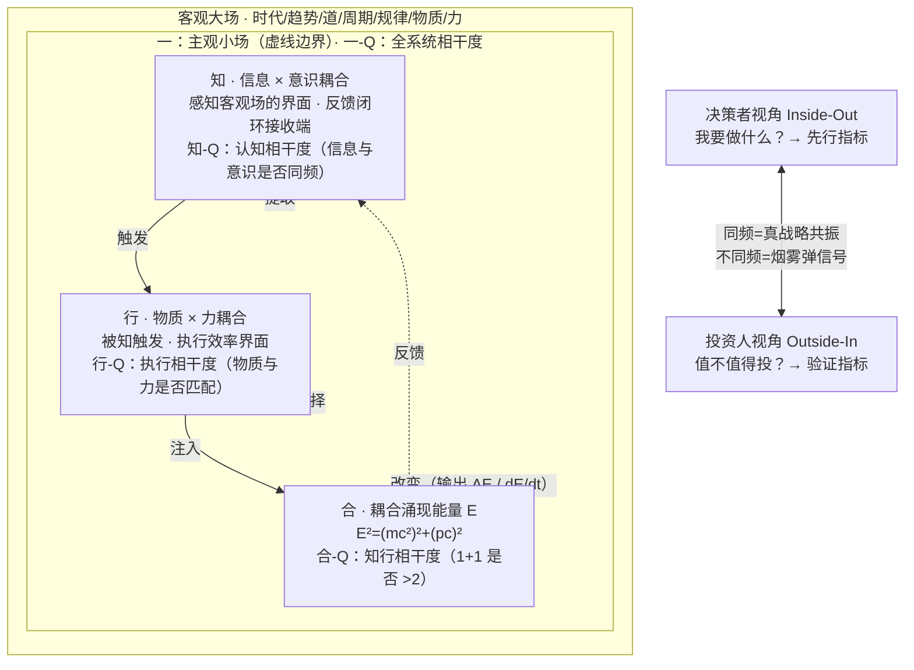

# 图一：知行合一建立反馈闭环（Mermaid）

```mermaid
flowchart TB
    subgraph OBJ["客观大场 · 时代/趋势/道/周期/规律/物质/力"]
        direction TB
        subgraph SUBJ["一：主观小场（虚线边界）· 一-Q：全系统相干度"]
            direction TB
            ZHI["知 · 信息 × 意识耦合<br/>感知客观场的界面 · 反馈闭环接收端<br/>知-Q：认知相干度（信息与意识是否同频）"]
            XING["行 · 物质 × 力耦合<br/>被知触发 · 执行效率界面<br/>行-Q：执行相干度（物质与力是否匹配）"]
            HE["合 · 耦合涌现能量 E<br/>E²=(mc²)²+(pc)²<br/>合-Q：知行相干度（1+1 是否 >2）"]
        end
    end

    %% 内环：信息流（青色）
    ZHI -->|触发| XING
    XING -->|注入| HE
    HE -. 反馈 .-> ZHI

    %% 外环：能量流（橙色）
    OBJ -. 提取 .-> ZHI
    OBJ -. 选择 .-> XING
    HE -. 改变（输出 ΔE / dE/dt）.-> OBJ

    %% 双视角
    DV["决策者视角 Inside-Out<br/>我要做什么？→ 先行指标"]
    IV["投资人视角 Outside-In<br/>值不值得投？→ 验证指标"]
    DV <-->|同频=真战略共振<br/>不同频=烟雾弹信号| IV
```

> 说明：内环（青色实线）为信息流——知触发行、行注入合、合反馈知，构成反馈闭环；外环（橙色虚线）为能量流——客观场向知/行提取与选择资源、合向客观场输出能量。一即该反馈闭环本身，循环在转一就在，循环停了一就灭。
