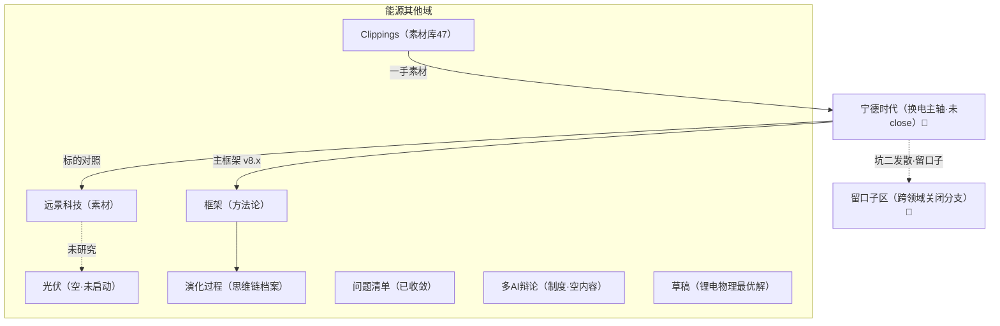

# 能源 · 研究探索地图（顶层总图）

> **最后更新**：2026-08-07 ｜ **性质**：状态索引（作战图），**不可作为任何测算/结论的信源**。
> **本图回答什么**：能源全域研究到哪了、跨领域发散分支关在哪、下次从哪回接。
> **本图不做什么**：不是"文件在哪"的索引（那由 `_方法论索引/00`、`02`、`换电/readme.md` 覆盖），也**不做大而全的静态全景挂图**——详见下方"有效性说明"。

---

## 〇、有效性说明（为什么是这张形态，而不是一张全景大图）

复盘（[`宁德时代/业务/换电/工作记录/研究历史记录.md`](宁德时代/业务/换电/工作记录/研究历史记录.md) §七）指出"坑二（贪跨领域泛化）、坑三（贪业务协同故事）"同源于**贪**，解药＝「留口子 + 研究地图 + 先 close 当下」。

- **方向对症**：地图第一功能不是"炫我懂多少"，而是**存放暂时关闭、但留了口子的发散分支**，让坑二坑三的发散不白费。
- **但"读所有文件、铺一张覆盖全能源的全景挂图"本身会重蹈坑三（贪大求全）**，且 `当前思考.md` / `README.md` 已停更于 **2026-04-13**，证明重型静态图会迅速过期。
- **故采用"分层 + 状态 + 口子"轻量形态**：宁德当下课题为细图（[`宁德时代/探索状态地图.md`](宁德时代/探索状态地图.md)），本顶层图只做一屏鸟瞰 + 跨领域留口子区 + 能源级轻索引。**每次复盘即更新，防过期。**
- **2026-08-08 纠偏更新**：原细图曾误将换电/CTC/制造/竞争格局画成平行 ✅，经用户校正——这些并非平行，而是"换电（资产运营业载体）＝主轴"放射出的横向关联（互斥/竞争/交叉/关联/衍生/延迟）。细图已重构为「换电主轴 + 衍生网 + 第三节·换电计算作战图」；本顶层图同步校正上方宁德摘要与鸟瞰节点。

---

## 一、全域鸟瞰图

---

## 二、各域状态摘要（一屏）

| 域 | 状态 | 一句话 | 入口 |
|---|---|---|---|
| **宁德时代** | 🔥/✅/🔍/🔄 混合 | **换电（资产运营）＝未close主轴**；CTC/补能已close；储能/AIDC未开始；制造待换电后算；估值切换进行中（详见细图第三节·计算作战图） | [探索状态地图（细图）](宁德时代/探索状态地图.md) |
| 框架 | ⚠️ 待固化 | 共振投资框架 V8.0 标"待实战验证后固化"；演化区已到 V8.4 | [共振框架 V8.0](框架/2026-04-16_共振投资框架_V8.0.md) |
| 远景科技 | 🔍 纯素材 | 11 md 无结论，张雷认知/EnOS/sonnen 等仅素材 | [远景摘要](远景科技/远景摘要.md) |
| 演化过程 | 🔄 进行中 | 阶段5 四层实操进行中，版本快照已到 V8.4(2026-04-24) | [演化过程 README](演化过程/README.md) |
| 光伏 | ⚠️ 空域 | 0 个 md，仅 1 个无扩展名文件，尚未启动 | [光伏/](光伏/) |
| 问题清单 | ✅ 已收敛 | v2(2026-03-24) 为定稿，五层框架投资映射 | [问题清单 v2](问题清单/2026-03-24_问题清单_v2.md) |
| 多AI辩论 | ⚠️ 仅制度 | README 定义工作流，但无实际辩论内容；存在失效链接待修 | [多AI辩论 README](多AI辩论/README.md) |
| 草稿 | 🔄 未定稿 | 锂电物理最优解 / 量子场论关系，逻辑链成型未定稿 | [draft_锂电物理最优解](草稿/draft_锂电物理最优解.md) |
| Clippings | 🔍 素材库 | 47 篇，换电经济性/格局/EU电池护照最密 | [Clippings/](Clippings/) |

> 状态图标：✅ 已close ｜ 🔄 进行中 ｜ 🔍 待查/素材 ｜ ⚠️ 未决/空域/待修

---

## 三、留口子区（跨领域关闭分支 · 坑二的实体载体）

> 这些分支被主动关闭，但**留了回接触发条件与回接锚点**——下次真去"开疆拓土"研究芯片/AI/信息变现时，顺着这里回接，发散不白费。

| 分支 | 当时为何被吸引（坑二/三） | 关闭原因 | 回接触发条件 | 回接锚点 |
|---|---|---|---|---|
| 贝壳 ACN 类比 | 换电站＝电池流通网络，联想贝壳资产流通网络（坑二·路径依赖） | 宁德是球员兼裁判、数据缺公信力；信息无法对外货币化（复盘§二） | 若宁德做独立第三方能源数据平台/中立角色 | [研究历史记录 §二](宁德时代/业务/换电/工作记录/研究历史记录.md) |
| 电池↔半导体↔AI 同构 | 电池与芯片同是电子有序流动，误以为研究能力可跨领域泛化（坑二） | 电池重点是能量非信息；过早泛化未 close 当下 | 真去研究芯片/AI 投资时 | [研究历史记录 §七·坑二](宁德时代/业务/换电/工作记录/研究历史记录.md) |
| 电池全生命周期数据信息变现 | 做电池界"楼盘字典"收佣金（坑二） | 保费自己交、体系外数据拿不到、二手车商无需求 | 出现中立电池数据市场/保险外部化 | [研究历史记录 §二 表](宁德时代/业务/换电/工作记录/研究历史记录.md) |
| 换电站储能套利（V2G/峰谷） | "免费用电池"幻觉（坑二/三） | 保供＞套利、单程套利、容量电价冲突（复盘§二/§三） | 站端余电调度技术突破/电价机制变 | [研究历史记录 §二/§三](宁德时代/业务/换电/工作记录/研究历史记录.md) |
| 储能/AIDC/换电 协同大故事 | 串协同凑大故事（坑三） | 各业务属性不同、小协同增益极小；先各个击破 | 换电 close 后复盘整体协同时 | [战略研判 Q4/Q5](宁德时代/业务/换电/定性分析/2030年业务线战略研判.md) ＋ [复盘坑三](宁德时代/业务/换电/工作记录/研究历史记录.md) |

---

## 四、能源级轻索引（逐域入口）

- **宁德时代**：[`宁德时代/探索状态地图.md`](宁德时代/探索状态地图.md)（细图·作战图）｜[`业务/换电/readme.md`](宁德时代/业务/换电/readme.md)（换电四层架构）｜[`_方法论索引/00_文件组织总览.md`](宁德时代/_方法论索引/00_文件组织总览.md)（目录规则/三条红线）｜[`_方法论索引/02_主报告源材料映射表.md`](宁德时代/_方法论索引/02_主报告源材料映射表.md)（报告血缘）｜[`报告/宁德时代研究_mermaid.md`](宁德时代/报告/宁德时代研究_mermaid.md)（既有思维导图）
- **框架**：[`框架/`](框架/)（PBL / 能信框架 v2 / 共振框架 V8.0 / 框架演化路线图）
- **远景科技**：[`远景科技/`](远景科技/)（张雷认知路径 / EnOS / sonnen 户储 / AESC）
- **演化过程**：[`演化过程/`](演化过程/)（阶段0–5 思维链档案 / R01–R11 辩论 / V8.0→V8.4 快照）
- **问题清单**：[`问题清单/`](问题清单/)（v2 五层框架投资映射）
- **多AI辩论**：[`多AI辩论/`](多AI辩论/)（制度/工作流，内容待补）
- **草稿**：[`草稿/`](草稿/)（锂电物理最优解 / 量子场论关系）
- **Clippings**：[`Clippings/`](Clippings/)（47 篇一手素材）
- **光伏**：[`光伏/`](光伏/)（空域，未启动）

---

## 五、更新纪律（30 秒）

- **触发即更新**：每次复盘、close 一个课题、新开待查、或发现未决张力时，改对应节点状态 + 日期。
- **本图不作信源**：只做状态标注与指针，结论一律回链原文件；地图内不出现无出处新数字。
- **双向链接**：细图↔本图互相链接；本图与既有四份索引分工清晰（见各文件头部"本图不重复什么"）。
- **防过期**：以"轻量 + 纪律"对抗 `当前思考.md` / `README.md` 停更于 2026-04-13 的前车之鉴。
